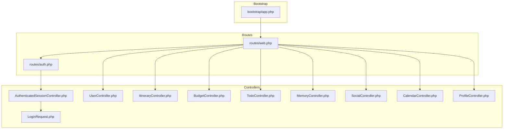
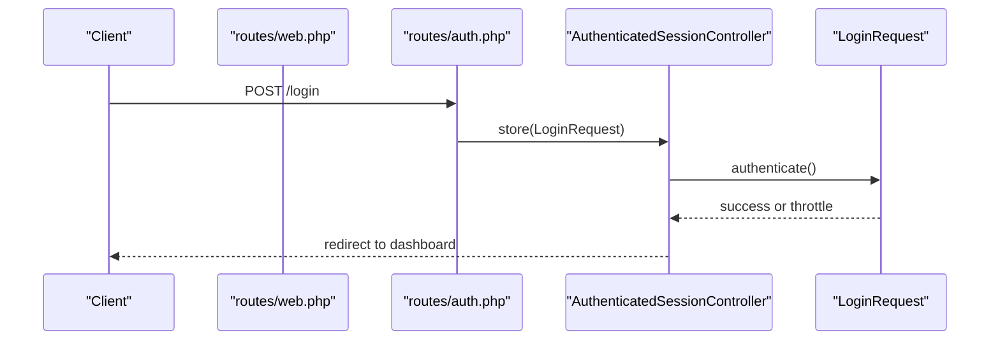
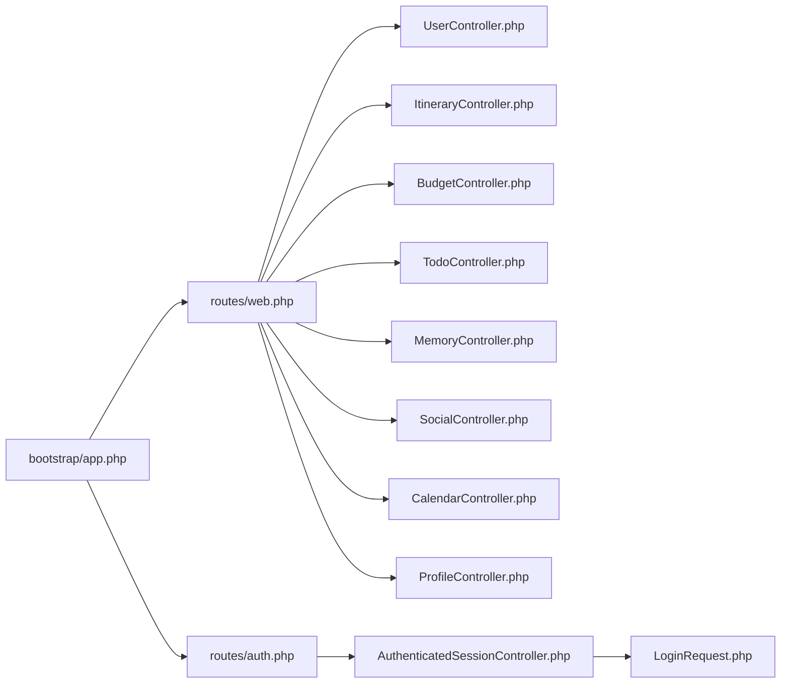

# API Reference

<cite>
**Referenced Files in This Document**
- [routes/web.php](file://routes/web.php)
- [routes/auth.php](file://routes/auth.php)
- [bootstrap/app.php](file://bootstrap/app.php)
- [config/auth.php](file://config/auth.php)
- [app/Http/Controllers/Auth/AuthenticatedSessionController.php](file://app/Http/Controllers/Auth/AuthenticatedSessionController.php)
- [app/Http/Requests/Auth/LoginRequest.php](file://app/Http/Requests/Auth/LoginRequest.php)
- [app/Http/Controllers/UserController.php](file://app/Http/Controllers/UserController.php)
- [app/Http/Controllers/ItineraryController.php](file://app/Http/Controllers/ItineraryController.php)
- [app/Http/Controllers/BudgetController.php](file://app/Http/Controllers/BudgetController.php)
- [app/Http/Controllers/TodoController.php](file://app/Http/Controllers/TodoController.php)
- [app/Http/Controllers/MemoryController.php](file://app/Http/Controllers/MemoryController.php)
- [app/Http/Controllers/SocialController.php](file://app/Http/Controllers/SocialController.php)
- [app/Http/Controllers/CalendarController.php](file://app/Http/Controllers/CalendarController.php)
- [app/Http/Controllers/ProfileController.php](file://app/Http/Controllers/ProfileController.php)
</cite>

## Table of Contents
1. [Introduction](#introduction)
2. [Project Structure](#project-structure)
3. [Core Components](#core-components)
4. [Architecture Overview](#architecture-overview)
5. [Detailed Component Analysis](#detailed-component-analysis)
6. [Dependency Analysis](#dependency-analysis)
7. [Performance Considerations](#performance-considerations)
8. [Troubleshooting Guide](#troubleshooting-guide)
9. [Conclusion](#conclusion)
10. [Appendices](#appendices)

## Introduction
This API Reference documents the public REST-like interfaces and web routes of the Travel Project. The application exposes:
- Authentication endpoints for registration, login, logout, password reset, and email verification.
- Resource management endpoints for itineraries, budgets, todos, memories, and social posts/stories/reels.
- Utility endpoints for user discovery, following, calendar aggregation, and file uploads.

All endpoints under the authenticated route groups require an active session (cookie-based) established via the authentication endpoints. There are no dedicated API token endpoints exposed in the current codebase; authentication is handled via session cookies.

## Project Structure
The routing is organized into:
- Web routes grouped under routes/web.php, including authenticated and unauthenticated segments.
- Authentication routes grouped under routes/auth.php.
- Bootstrap wiring in bootstrap/app.php that registers web routes.

**Diagram sources**
- [bootstrap/app.php:1-19](file://bootstrap/app.php#L1-L19)
- [routes/web.php:1-89](file://routes/web.php#L1-L89)
- [routes/auth.php:1-60](file://routes/auth.php#L1-L60)
- [app/Http/Controllers/Auth/AuthenticatedSessionController.php:1-48](file://app/Http/Controllers/Auth/AuthenticatedSessionController.php#L1-L48)
- [app/Http/Requests/Auth/LoginRequest.php:1-87](file://app/Http/Requests/Auth/LoginRequest.php#L1-L87)
- [app/Http/Controllers/UserController.php:1-120](file://app/Http/Controllers/UserController.php#L1-L120)
- [app/Http/Controllers/ItineraryController.php:1-88](file://app/Http/Controllers/ItineraryController.php#L1-L88)
- [app/Http/Controllers/BudgetController.php:1-215](file://app/Http/Controllers/BudgetController.php#L1-L215)
- [app/Http/Controllers/TodoController.php:1-132](file://app/Http/Controllers/TodoController.php#L1-L132)
- [app/Http/Controllers/MemoryController.php:1-99](file://app/Http/Controllers/MemoryController.php#L1-L99)
- [app/Http/Controllers/SocialController.php:1-179](file://app/Http/Controllers/SocialController.php#L1-L179)
- [app/Http/Controllers/CalendarController.php:1-19](file://app/Http/Controllers/CalendarController.php#L1-L19)
- [app/Http/Controllers/ProfileController.php:1-111](file://app/Http/Controllers/ProfileController.php#L1-L111)

**Section sources**
- [bootstrap/app.php:1-19](file://bootstrap/app.php#L1-L19)
- [routes/web.php:1-89](file://routes/web.php#L1-L89)
- [routes/auth.php:1-60](file://routes/auth.php#L1-L60)

## Core Components
- Authentication endpoints: registration, login/logout, password reset, email verification, password confirmation.
- Resource endpoints: CRUD for itineraries, budgets, todos, memories; budget expenses add/delete.
- Social endpoints: community wall, posts, likes, comments, stories, reels.
- User endpoints: search, suggestions, profile follow/unfollow, followers/following lists.
- Utility endpoints: calendar aggregation, file upload, avatar/password/preferences updates.

Authentication method:
- Session-based authentication via cookie. No API token endpoints are present in the current codebase.

**Section sources**
- [routes/auth.php:14-59](file://routes/auth.php#L14-L59)
- [routes/web.php:14-86](file://routes/web.php#L14-L86)
- [config/auth.php:40-45](file://config/auth.php#L40-L45)

## Architecture Overview
The application uses Laravel’s routing and controller pattern. Routes are grouped by middleware:
- guest: registration, login, forgot/reset password.
- auth: authenticated actions (profile, resources, social, uploads).

**Diagram sources**
- [routes/auth.php:20-35](file://routes/auth.php#L20-L35)
- [app/Http/Controllers/Auth/AuthenticatedSessionController.php:25-32](file://app/Http/Controllers/Auth/AuthenticatedSessionController.php#L25-L32)
- [app/Http/Requests/Auth/LoginRequest.php:41-54](file://app/Http/Requests/Auth/LoginRequest.php#L41-L54)

## Detailed Component Analysis

### Authentication Endpoints
- Register
  - Method: GET/POST
  - URL: /register
  - Purpose: Registration form and submission.
  - Authentication: guest middleware.
  - Request body: depends on form fields; validated server-side.
  - Responses: redirects to dashboard on success; otherwise returns form with errors.
  - Notes: No JSON response for this endpoint.

- Login
  - Method: GET/POST
  - URL: /login
  - Purpose: Login form and submission.
  - Authentication: guest middleware.
  - Request body:
    - email: string, required
    - password: string, required
    - remember: boolean (optional)
  - Responses: success redirect to dashboard; failure returns form with errors.
  - Throttling: enforced via LoginRequest with per-IP/email limiter.

- Logout
  - Method: POST
  - URL: /logout
  - Purpose: Invalidate session and redirect home.
  - Authentication: auth middleware.

- Forgot Password
  - Method: GET/POST
  - URL: /forgot-password
  - Purpose: Request password reset link.
  - Authentication: guest middleware.
  - Request body: email.
  - Responses: success message; throttled resend allowed.

- Reset Password (with token)
  - Method: GET/POST
  - URL: /reset-password/{token}
  - Purpose: Set new password using token.
  - Authentication: guest middleware.
  - Request body: password, password_confirmation.

- Email Verification
  - Notice: GET /verify-email
  - Resend: POST /email/verification-notification (throttled)
  - Verify: GET /verify-email/{id}/{hash} (signed, throttled)

- Confirm Password
  - Method: GET/POST
  - URL: /confirm-password
  - Purpose: Re-authenticate for sensitive actions.
  - Authentication: auth middleware.

- Change Password
  - Method: PUT
  - URL: /password
  - Purpose: Update current password.
  - Authentication: auth middleware.

Success and error responses:
- On success: redirect with flash messages.
- On validation/throttle failures: returns form with error messages.

Security considerations:
- Rate limiting for login attempts.
- Signed, throttled links for email verification.
- CSRF protection via forms; session-based auth.

**Section sources**
- [routes/auth.php:14-59](file://routes/auth.php#L14-L59)
- [app/Http/Controllers/Auth/AuthenticatedSessionController.php:17-46](file://app/Http/Controllers/Auth/AuthenticatedSessionController.php#L17-L46)
- [app/Http/Requests/Auth/LoginRequest.php:28-85](file://app/Http/Requests/Auth/LoginRequest.php#L28-L85)
- [config/auth.php:95-102](file://config/auth.php#L95-L102)

### Resource Management Endpoints

#### Itineraries
- Index: GET /itineraries
  - Pagination: paginated list for current user.
- Create: GET /itineraries/create
- Store: POST /itineraries
  - Body fields: title, destination, start_date, end_date, budget_total, status, description.
- Show: GET /itineraries/{itinerary}
- Edit: GET /itineraries/{itinerary}/edit
- Update: PUT/PATCH /itineraries/{itinerary}
- Destroy: DELETE /itineraries/{itinerary}

Validation and policies:
- Authorization enforced per model policy.
- Validation ensures date relationships and status enums.

**Section sources**
- [routes/web.php:33](file://routes/web.php#L33)
- [app/Http/Controllers/ItineraryController.php:10-87](file://app/Http/Controllers/ItineraryController.php#L10-L87)

#### Budgets
- Index: GET /budgets
  - Query params: itinerary_id, type.
  - Returns budgets with stats and itineraries.
- Create: GET /budgets/create
- Store: POST /budgets
  - Body fields: name, description, total_budget, currency, type (solo/group), itinerary_id.
  - Group split creation supported.
- Show: GET /budgets/{budget}
  - Loads expenses, splits, and itinerary; computes stats and category totals.
- Edit: GET /budgets/{budget}/edit
- Update: PUT/PATCH /budgets/{budget}
- Destroy: DELETE /budgets/{budget}
- Add Expense: POST /budgets/{budget}/expenses
  - Body fields: title, amount, category, description, expense_date, receipt (file).
- Delete Expense: DELETE /budgets/{budget}/expenses/{expenseId}

Authorization and transactions:
- Authorization enforced.
- Database transaction wraps group split and expense creation.

**Section sources**
- [routes/web.php:36](file://routes/web.php#L36)
- [routes/web.php:37-38](file://routes/web.php#L37-L38)
- [app/Http/Controllers/BudgetController.php:14-214](file://app/Http/Controllers/BudgetController.php#L14-L214)

#### Todos
- Index: GET /todos
  - Query params: status, priority, category, sort, direction.
  - Returns paginated list and stats.
- Create: GET /todos/create
- Store: POST /todos
  - Body fields: title, description, due_date, priority, status, category, itinerary_id.
- Show: GET /todos/{todo}
- Edit: GET /todos/{todo}/edit
- Update: PUT/PATCH /todos/{todo}
- Destroy: DELETE /todos/{todo}
- Toggle Status: PATCH /todos/{todo}/toggle

**Section sources**
- [routes/web.php:41-42](file://routes/web.php#L41-L42)
- [app/Http/Controllers/TodoController.php:11-131](file://app/Http/Controllers/TodoController.php#L11-L131)

#### Memories
- Index: GET /memories
- Create: GET /memories/create
- Store: POST /memories
  - Body fields: title, description, location, date, media_urls (JSON string or array), itinerary_id, mood.
- Show: GET /memories/{memory}
- Edit: GET /memories/{memory}/edit
- Update: PUT/PATCH /memories/{memory}
- Destroy: DELETE /memories/{memory}

**Section sources**
- [routes/web.php:55](file://routes/web.php#L55)
- [app/Http/Controllers/MemoryController.php:11-98](file://app/Http/Controllers/MemoryController.php#L11-L98)

#### Social
- Community Wall: GET /social/wall
- Publish Post: POST /social/posts
  - Body fields: content, media_urls, location, tags, privacy.
- Like Post: POST /social/posts/{post}/like
- Comment on Post: POST /social/posts/{post}/comment
  - Body fields: content, parent_id.
- Delete Post: DELETE /social/posts/{post}
- Stories: GET /social/stories
- Publish Story: POST /social/stories
  - Body fields: media_url, media_type (image/video), caption.
- Reels: GET /social/reels

JSON responses:
- Like and comment endpoints return JSON when requested.

**Section sources**
- [routes/web.php:48-80](file://routes/web.php#L48-L80)
- [app/Http/Controllers/SocialController.php:16-178](file://app/Http/Controllers/SocialController.php#L16-L178)

#### Users
- Search: GET /users/search?q={query}
- Suggestions: GET /users/suggestions
- Show: GET /users/{user}
- Follow: POST /users/{user}/follow
  - Returns JSON with success, isFollowing, followersCount when requested.
- Followers: GET /users/{user}/followers
- Following: GET /users/{user}/following

JSON responses:
- Follow and suggestions endpoints return JSON when requested.

**Section sources**
- [routes/web.php:23-30](file://routes/web.php#L23-L30)
- [app/Http/Controllers/UserController.php:13-118](file://app/Http/Controllers/UserController.php#L13-L118)

#### Calendar
- Index: GET /calendar
  - Returns itineraries, todos, and budgets for the authenticated user.

**Section sources**
- [routes/web.php:45](file://routes/web.php#L45)
- [app/Http/Controllers/CalendarController.php:9-17](file://app/Http/Controllers/CalendarController.php#L9-L17)

#### Profile
- Edit: GET /profile
- Update: PATCH /profile
- Delete Account: DELETE /profile
- Update Avatar: PATCH /profile/avatar
- Update Password: PUT /profile/password
- Update Preferences: PATCH /profile/preferences

**Section sources**
- [routes/web.php:14-21](file://routes/web.php#L14-L21)
- [app/Http/Controllers/ProfileController.php:18-109](file://app/Http/Controllers/ProfileController.php#L18-L109)

#### Uploads
- Store: POST /upload
  - Multipart/form-data; file(s) uploaded to storage.
- Destroy: DELETE /upload/{file}
- Upload Photo (AJAX for memories): POST /upload/photo
- Delete Photo (AJAX): DELETE /upload/photo

**Section sources**
- [routes/web.php:63-68](file://routes/web.php#L63-L68)
- [app/Http/Controllers/ProfileController.php:65-77](file://app/Http/Controllers/ProfileController.php#L65-L77)

### Endpoint Categories and Examples

#### Authentication Endpoints
- Typical usage:
  - GET /login → submit POST /login with email, password, remember.
  - On success: session cookie set; redirect to dashboard.
  - On failure: retry with corrected credentials or use forgot-password.

- Error handling:
  - Login throttling returns user-friendly messages.
  - Validation errors returned on registration/password reset.

**Section sources**
- [routes/auth.php:14-59](file://routes/auth.php#L14-L59)
- [app/Http/Requests/Auth/LoginRequest.php:61-77](file://app/Http/Requests/Auth/LoginRequest.php#L61-L77)

#### Resource Management Endpoints
- Itineraries:
  - Create with dates and status; update to mark as completed.
- Budgets:
  - Create group budget; add expenses with receipts; delete expenses.
- Todos:
  - Filter by priority/status/category; toggle completion.
- Memories:
  - Save with media URLs; update with structured arrays.

**Section sources**
- [app/Http/Controllers/ItineraryController.php:21-40](file://app/Http/Controllers/ItineraryController.php#L21-L40)
- [app/Http/Controllers/BudgetController.php:49-92](file://app/Http/Controllers/BudgetController.php#L49-L92)
- [app/Http/Controllers/TodoController.php:56-74](file://app/Http/Controllers/TodoController.php#L56-L74)
- [app/Http/Controllers/MemoryController.php:23-48](file://app/Http/Controllers/MemoryController.php#L23-L48)

#### Social Endpoints
- Publishing a post:
  - POST /social/posts with content/media/tags/privacy.
- Liking and commenting:
  - POST /social/posts/{post}/like and POST /social/posts/{post}/comment.
- Stories:
  - POST /social/stories with media_url, media_type, caption.

**Section sources**
- [app/Http/Controllers/SocialController.php:34-55](file://app/Http/Controllers/SocialController.php#L34-L55)
- [app/Http/Controllers/SocialController.php:60-89](file://app/Http/Controllers/SocialController.php#L60-L89)
- [app/Http/Controllers/SocialController.php:94-118](file://app/Http/Controllers/SocialController.php#L94-L118)
- [app/Http/Controllers/SocialController.php:149-164](file://app/Http/Controllers/SocialController.php#L149-L164)

#### User Discovery and Follow
- Search users by query; follow/unfollow toggles with JSON feedback.
- View followers/following lists.

**Section sources**
- [app/Http/Controllers/UserController.php:13-28](file://app/Http/Controllers/UserController.php#L13-L28)
- [app/Http/Controllers/UserController.php:48-73](file://app/Http/Controllers/UserController.php#L48-L73)
- [app/Http/Controllers/UserController.php:78-93](file://app/Http/Controllers/UserController.php#L78-L93)
- [app/Http/Controllers/UserController.php:98-118](file://app/Http/Controllers/UserController.php#L98-L118)

#### Calendar and Utilities
- GET /calendar aggregates itineraries, todos, and budgets.
- File uploads support multipart/form-data and AJAX photo endpoints.

**Section sources**
- [app/Http/Controllers/CalendarController.php:9-17](file://app/Http/Controllers/CalendarController.php#L9-L17)
- [routes/web.php:63-68](file://routes/web.php#L63-L68)

## Dependency Analysis
- Routing depends on controllers; controllers depend on models and policies for authorization.
- Authentication relies on config/auth.php for guard/provider settings and LoginRequest for throttling.
- Controllers coordinate with database transactions for complex operations (budgets, expenses).

**Diagram sources**
- [routes/web.php:1-89](file://routes/web.php#L1-L89)
- [routes/auth.php:1-60](file://routes/auth.php#L1-L60)
- [bootstrap/app.php:7-12](file://bootstrap/app.php#L7-L12)
- [app/Http/Controllers/Auth/AuthenticatedSessionController.php:1-48](file://app/Http/Controllers/Auth/AuthenticatedSessionController.php#L1-L48)
- [app/Http/Requests/Auth/LoginRequest.php:1-87](file://app/Http/Requests/Auth/LoginRequest.php#L1-L87)

**Section sources**
- [config/auth.php:40-45](file://config/auth.php#L40-L45)
- [app/Http/Controllers/BudgetController.php:64-91](file://app/Http/Controllers/BudgetController.php#L64-L91)

## Performance Considerations
- Pagination is used across resource listings to limit payload sizes.
- Eager loading is applied in several controllers to reduce N+1 queries (e.g., social posts, user profiles).
- File uploads are stored to public disk; consider CDN for media delivery.

[No sources needed since this section provides general guidance]

## Troubleshooting Guide
Common issues and resolutions:
- Login throttling: Wait for the throttle window; ensure correct credentials.
- Validation errors: Review required fields and constraints for each endpoint.
- Authorization failures: Ensure the authenticated user owns or is permitted to access the resource.
- Upload failures: Verify file types, sizes, and multipart encoding.

**Section sources**
- [app/Http/Requests/Auth/LoginRequest.php:61-77](file://app/Http/Requests/Auth/LoginRequest.php#L61-L77)
- [app/Http/Controllers/BudgetController.php:153-191](file://app/Http/Controllers/BudgetController.php#L153-L191)
- [app/Http/Controllers/SocialController.php:94-118](file://app/Http/Controllers/SocialController.php#L94-L118)

## Conclusion
The Travel Project exposes a cohesive set of web and REST-like endpoints centered around session-based authentication. Authentication endpoints handle registration, login, logout, password resets, and email verification. Resource endpoints manage itineraries, budgets, todos, memories, and social features. Utility endpoints support user discovery, calendar aggregation, and file uploads. The current implementation does not expose dedicated API token endpoints; consumption should leverage browser sessions and CSRF-protected forms.

[No sources needed since this section summarizes without analyzing specific files]

## Appendices

### Authentication Methods
- Session-based authentication:
  - Login sets a session cookie; subsequent requests under the auth middleware are authenticated.
  - No API token endpoints are present in the current codebase.

**Section sources**
- [config/auth.php:40-45](file://config/auth.php#L40-L45)
- [routes/auth.php:14-59](file://routes/auth.php#L14-L59)

### Rate Limiting and Security
- Login throttling via LoginRequest.
- Email verification links are signed and throttled.
- Password reset tokens have configured expiry and throttle.

**Section sources**
- [app/Http/Requests/Auth/LoginRequest.php:61-77](file://app/Http/Requests/Auth/LoginRequest.php#L61-L77)
- [routes/auth.php:42-48](file://routes/auth.php#L42-L48)
- [config/auth.php:95-102](file://config/auth.php#L95-L102)

### CORS Configuration
- No explicit CORS configuration is present in the provided files. Cross-origin requests should be handled by adding appropriate middleware if consumed from a separate frontend domain.

[No sources needed since this section provides general guidance]

### Client Implementation Guidelines
- Use browser forms for authentication and resource operations to benefit from CSRF protection.
- For JSON interactions (e.g., likes/comments), ensure Accept/Content-Type headers align with endpoints that return JSON.
- Respect pagination parameters and filters for efficient data retrieval.

[No sources needed since this section provides general guidance]