# Architecture Overview

<cite>
**Referenced Files in This Document**
- [bootstrap/app.php](file://bootstrap/app.php)
- [bootstrap/providers.php](file://bootstrap/providers.php)
- [routes/web.php](file://routes/web.php)
- [routes/auth.php](file://routes/auth.php)
- [app/Http/Controllers/Controller.php](file://app/Http/Controllers/Controller.php)
- [app/Http/Controllers/ProfileController.php](file://app/Http/Controllers/ProfileController.php)
- [app/Http/Controllers/Auth/AuthenticatedSessionController.php](file://app/Http/Controllers/Auth/AuthenticatedSessionController.php)
- [app/Http/Requests/ProfileUpdateRequest.php](file://app/Http/Requests/ProfileUpdateRequest.php)
- [app/Models/User.php](file://app/Models/User.php)
- [app/Policies/BudgetPolicy.php](file://app/Policies/BudgetPolicy.php)
- [app/Providers/AppServiceProvider.php](file://app/Providers/AppServiceProvider.php)
- [app/View/Components/AppLayout.php](file://app/View/Components/AppLayout.php)
- [resources/views/layouts/app.blade.php](file://resources/views/layouts/app.blade.php)
- [resources/views/layouts/guest.blade.php](file://resources/views/layouts/guest.blade.php)
- [resources/js/app.js](file://resources/js/app.js)
- [config/app.php](file://config/app.php)
- [composer.json](file://composer.json)
- [database/factories/UserFactory.php](file://database/factories/UserFactory.php)
</cite>

## Table of Contents
1. [Introduction](#introduction)
2. [Project Structure](#project-structure)
3. [Core Components](#core-components)
4. [Architecture Overview](#architecture-overview)
5. [Detailed Component Analysis](#detailed-component-analysis)
6. [Dependency Analysis](#dependency-analysis)
7. [Performance Considerations](#performance-considerations)
8. [Troubleshooting Guide](#troubleshooting-guide)
9. [Conclusion](#conclusion)

## Introduction
This document describes the architecture of the Travel Project, a Laravel-based web application. It explains the high-level Model-View-Controller (MVC) design, Laravel conventions, and component interactions. It documents the application bootstrap process, service provider registration, middleware pipeline, routing architecture, controller organization, and the request-response flow. It also covers system boundaries, data flow patterns, integration points, and the separation of concerns between the frontend (Blade templates and Alpine.js) and the backend (PHP/Laravel controllers and models). Design patterns such as resource controllers, policy-based authorization, and factory patterns are highlighted, along with modular structure and component relationship diagrams.

## Project Structure
The project follows Laravel’s conventional structure:
- app/ contains application logic: Http\Controllers, Http\Requests, Models, Policies, Providers, and View\Components.
- bootstrap/ initializes the framework application, registers providers, and wires routing and middleware.
- config/ holds framework and application configuration.
- database/ includes Eloquent factories, migrations, and seeders.
- public/ serves as the web root and entry point via index.php.
- resources/ contains Blade views, CSS/JS assets, and localized strings.
- routes/ defines web and console routes, including an auth route group.
- storage/ stores cached views, sessions, and logs.
- tests/ contains unit and feature tests.
- composer.json defines dependencies, autoload configuration, and scripts.

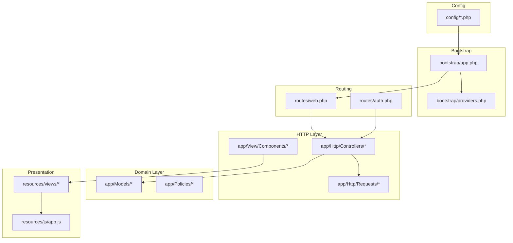

**Diagram sources**
- [bootstrap/app.php:1-19](file://bootstrap/app.php#L1-L19)
- [bootstrap/providers.php:1-8](file://bootstrap/providers.php#L1-L8)
- [routes/web.php:1-89](file://routes/web.php#L1-L89)
- [routes/auth.php:1-60](file://routes/auth.php#L1-L60)
- [app/Http/Controllers/Controller.php:1-9](file://app/Http/Controllers/Controller.php#L1-L9)
- [app/View/Components/AppLayout.php:1-18](file://app/View/Components/AppLayout.php#L1-L18)
- [resources/views/layouts/app.blade.php:1-232](file://resources/views/layouts/app.blade.php#L1-L232)
- [resources/js/app.js:1-8](file://resources/js/app.js#L1-L8)
- [config/app.php:1-127](file://config/app.php#L1-L127)

**Section sources**
- [bootstrap/app.php:1-19](file://bootstrap/app.php#L1-L19)
- [bootstrap/providers.php:1-8](file://bootstrap/providers.php#L1-L8)
- [routes/web.php:1-89](file://routes/web.php#L1-L89)
- [routes/auth.php:1-60](file://routes/auth.php#L1-L60)
- [composer.json:1-88](file://composer.json#L1-L88)

## Core Components
- Application bootstrap: Initializes routing, middleware, and exceptions via the Application configuration builder.
- Service provider registration: Registers the application service provider list.
- Routing: Centralized in web.php with grouped routes under auth and feature namespaces.
- Controllers: Resource and action-based controllers implementing domain actions (e.g., ProfileController).
- Models: Eloquent models with relationships and factory associations.
- Policies: Authorization policies per domain entity.
- View Components: Blade components rendering shared layouts and UI.
- Frontend: Blade templates with Alpine.js for interactivity.

Key implementation references:
- Bootstrap wiring: [bootstrap/app.php:7-18](file://bootstrap/app.php#L7-L18)
- Provider registration: [bootstrap/providers.php:5-7](file://bootstrap/providers.php#L5-L7)
- Web routes: [routes/web.php:10-86](file://routes/web.php#L10-L86)
- Auth routes: [routes/auth.php:14-59](file://routes/auth.php#L14-L59)
- Base controller: [app/Http/Controllers/Controller.php:5-8](file://app/Http/Controllers/Controller.php#L5-L8)
- Profile controller: [app/Http/Controllers/ProfileController.php:13-111](file://app/Http/Controllers/ProfileController.php#L13-L111)
- User model: [app/Models/User.php:11-172](file://app/Models/User.php#L11-L172)
- Budget policy: [app/Policies/BudgetPolicy.php:8-49](file://app/Policies/BudgetPolicy.php#L8-L49)
- App layout component: [app/View/Components/AppLayout.php:8-17](file://app/View/Components/AppLayout.php#L8-L17)
- App layout view: [resources/views/layouts/app.blade.php:134-215](file://resources/views/layouts/app.blade.php#L134-L215)
- Alpine integration: [resources/js/app.js:3-7](file://resources/js/app.js#L3-L7)

**Section sources**
- [bootstrap/app.php:1-19](file://bootstrap/app.php#L1-L19)
- [bootstrap/providers.php:1-8](file://bootstrap/providers.php#L1-L8)
- [routes/web.php:1-89](file://routes/web.php#L1-L89)
- [routes/auth.php:1-60](file://routes/auth.php#L1-L60)
- [app/Http/Controllers/Controller.php:1-9](file://app/Http/Controllers/Controller.php#L1-L9)
- [app/Http/Controllers/ProfileController.php:1-111](file://app/Http/Controllers/ProfileController.php#L1-L111)
- [app/Models/User.php:1-172](file://app/Models/User.php#L1-L172)
- [app/Policies/BudgetPolicy.php:1-50](file://app/Policies/BudgetPolicy.php#L1-L50)
- [app/View/Components/AppLayout.php:1-18](file://app/View/Components/AppLayout.php#L1-L18)
- [resources/views/layouts/app.blade.php:1-232](file://resources/views/layouts/app.blade.php#L1-L232)
- [resources/js/app.js:1-8](file://resources/js/app.js#L1-L8)

## Architecture Overview
The system follows a layered MVC architecture:
- Presentation Layer: Blade templates and Alpine.js for client-side interactivity.
- Application Layer: Laravel HTTP kernel, routing, middleware, and controllers.
- Domain Layer: Eloquent models and policies for authorization.
- Infrastructure: Service providers, configuration, and autoloading.

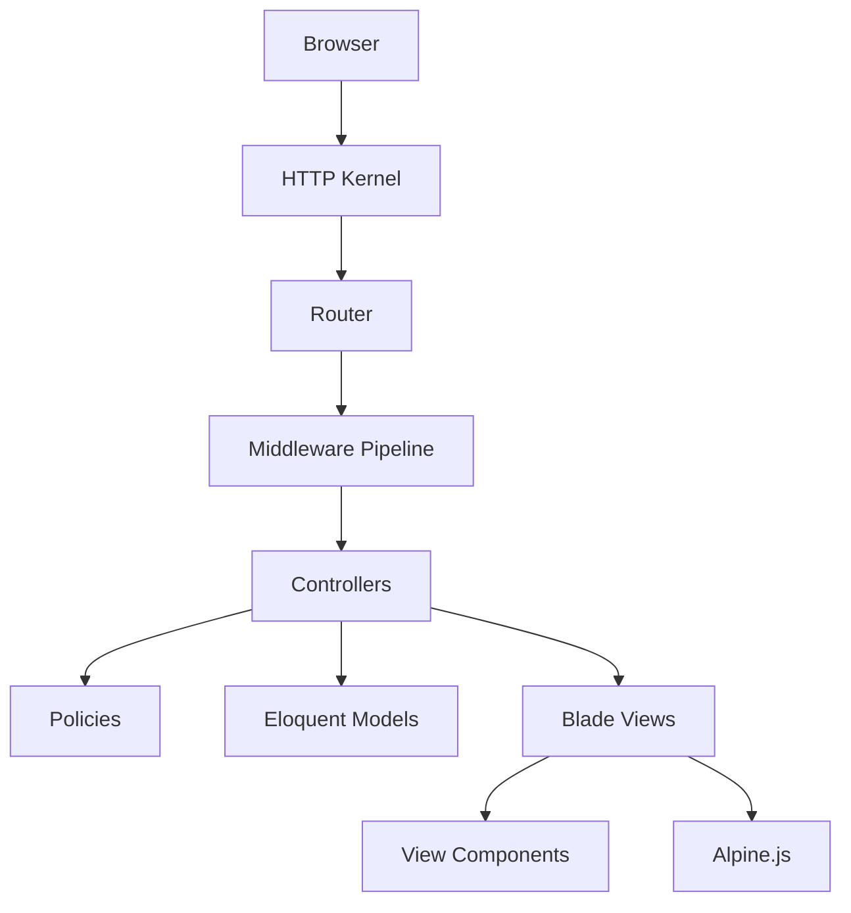

**Diagram sources**
- [bootstrap/app.php:7-18](file://bootstrap/app.php#L7-L18)
- [routes/web.php:10-86](file://routes/web.php#L10-L86)
- [app/Http/Controllers/ProfileController.php:13-111](file://app/Http/Controllers/ProfileController.php#L13-L111)
- [app/Policies/BudgetPolicy.php:8-49](file://app/Policies/BudgetPolicy.php#L8-L49)
- [app/Models/User.php:11-172](file://app/Models/User.php#L11-L172)
- [resources/views/layouts/app.blade.php:134-215](file://resources/views/layouts/app.blade.php#L134-L215)
- [resources/js/app.js:3-7](file://resources/js/app.js#L3-L7)

## Detailed Component Analysis

### MVC and Laravel Conventions
- Controllers inherit from a base controller class and encapsulate request handling for specific resources or actions.
- Blade templates provide server-rendered HTML with shared layouts and components.
- Eloquent models define domain entities and relationships; factories support seeding and testing.
- Policies enforce authorization decisions per model.

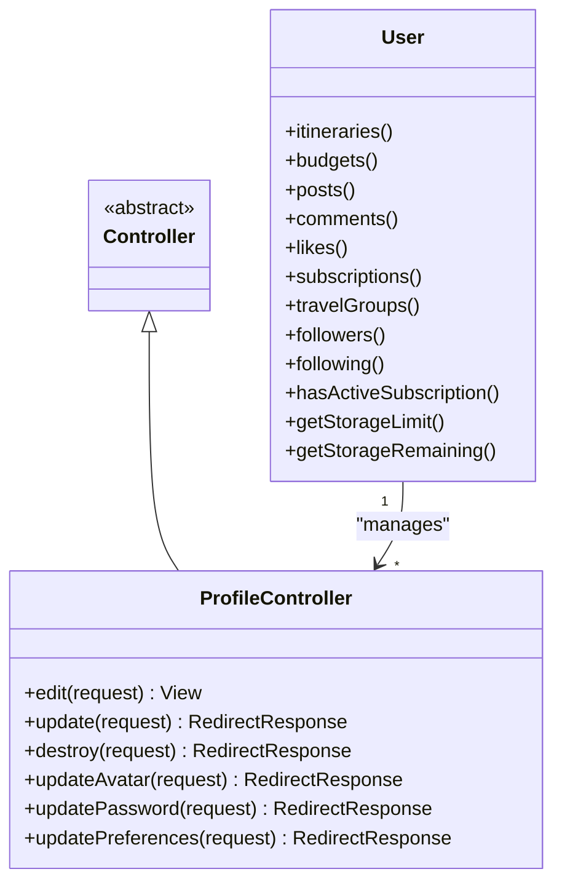

**Diagram sources**
- [app/Http/Controllers/Controller.php:5-8](file://app/Http/Controllers/Controller.php#L5-L8)
- [app/Http/Controllers/ProfileController.php:13-111](file://app/Http/Controllers/ProfileController.php#L13-L111)
- [app/Models/User.php:64-171](file://app/Models/User.php#L64-L171)

**Section sources**
- [app/Http/Controllers/Controller.php:1-9](file://app/Http/Controllers/Controller.php#L1-L9)
- [app/Http/Controllers/ProfileController.php:1-111](file://app/Http/Controllers/ProfileController.php#L1-L111)
- [app/Models/User.php:1-172](file://app/Models/User.php#L1-L172)

### Application Bootstrap and Service Provider Registration
- The bootstrap process configures routing (web and console), middleware, and exception handling.
- Providers are registered from the providers list.

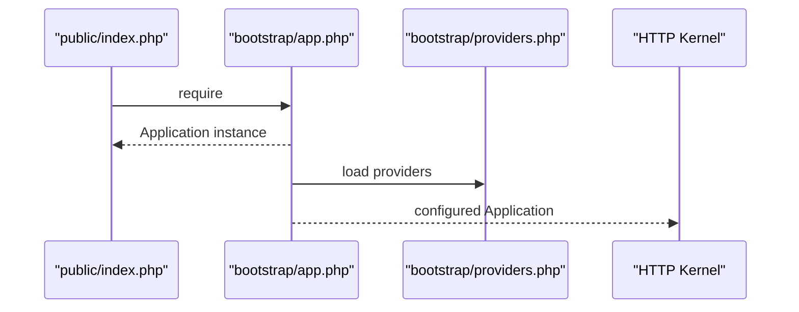

**Diagram sources**
- [bootstrap/app.php:7-18](file://bootstrap/app.php#L7-L18)
- [bootstrap/providers.php:5-7](file://bootstrap/providers.php#L5-L7)

**Section sources**
- [bootstrap/app.php:1-19](file://bootstrap/app.php#L1-L19)
- [bootstrap/providers.php:1-8](file://bootstrap/providers.php#L1-L8)

### Middleware Pipeline
- Routes apply middleware stacks; the auth middleware group protects authenticated routes.
- Additional middleware can be registered in the Application configuration builder.

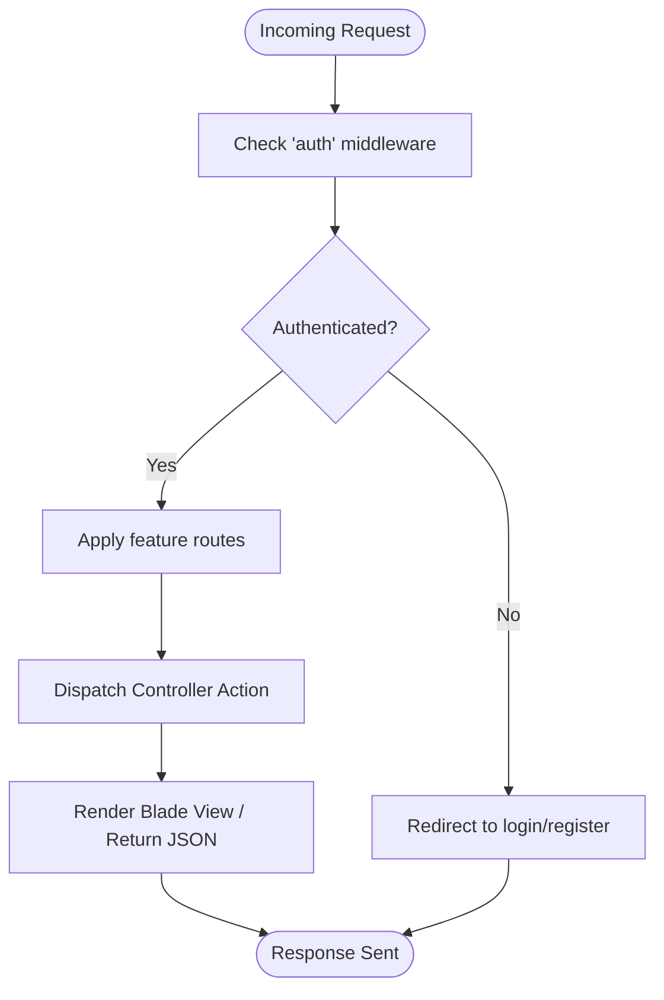

**Diagram sources**
- [routes/web.php:14-86](file://routes/web.php#L14-L86)
- [bootstrap/app.php:13-15](file://bootstrap/app.php#L13-L15)

**Section sources**
- [routes/web.php:10-86](file://routes/web.php#L10-L86)
- [bootstrap/app.php:12-15](file://bootstrap/app.php#L12-L15)

### Routing Architecture and Controller Organization
- Web routes define:
  - Dashboard and profile CRUD under auth middleware.
  - Resource routes for itineraries, budgets, todos, and memories.
  - Nested routes for users (search, follow), social feeds (wall, stories, reels), and upload endpoints.
  - Auth routes for registration, login, password reset, verification, and logout.
- Controllers are organized by feature domains (ProfileController, ItineraryController, BudgetController, etc.).

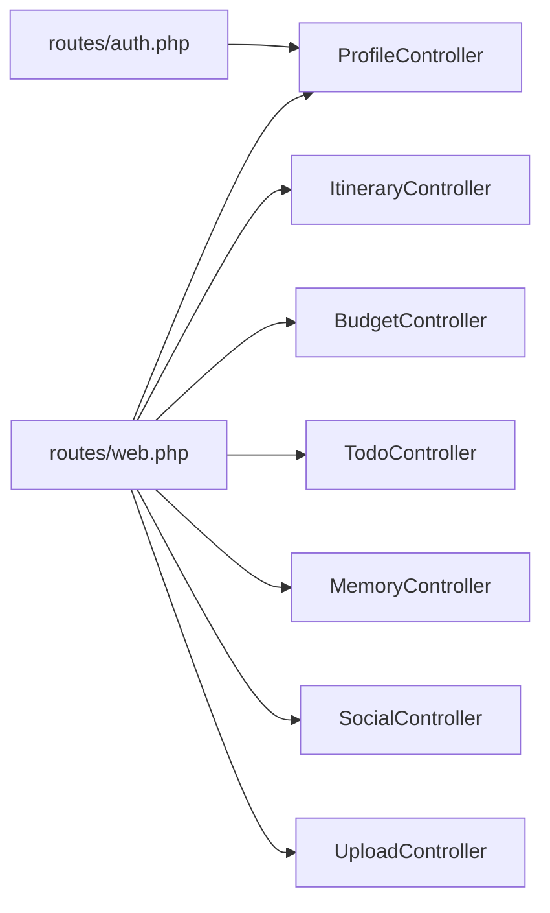

**Diagram sources**
- [routes/web.php:10-86](file://routes/web.php#L10-L86)
- [routes/auth.php:14-59](file://routes/auth.php#L14-L59)
- [app/Http/Controllers/ProfileController.php:13-111](file://app/Http/Controllers/ProfileController.php#L13-L111)

**Section sources**
- [routes/web.php:1-89](file://routes/web.php#L1-L89)
- [routes/auth.php:1-60](file://routes/auth.php#L1-L60)

### Request-Response Flow
- A request enters via public/index.php, is handled by the HTTP kernel, routed to a controller method, optionally validated by a Form Request, authorized by a policy, persisted via a model, and rendered by a Blade view or returned as JSON.

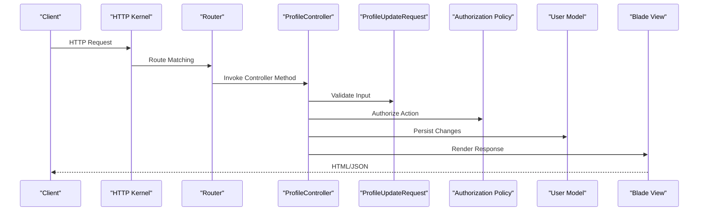

**Diagram sources**
- [app/Http/Controllers/ProfileController.php:28-39](file://app/Http/Controllers/ProfileController.php#L28-L39)
- [app/Http/Requests/ProfileUpdateRequest.php](file://app/Http/Requests/ProfileUpdateRequest.php)
- [app/Policies/BudgetPolicy.php:21-24](file://app/Policies/BudgetPolicy.php#L21-L24)
- [app/Models/User.php:11-172](file://app/Models/User.php#L11-L172)
- [resources/views/layouts/app.blade.php:134-215](file://resources/views/layouts/app.blade.php#L134-L215)

**Section sources**
- [app/Http/Controllers/ProfileController.php:1-111](file://app/Http/Controllers/ProfileController.php#L1-L111)
- [app/Http/Requests/ProfileUpdateRequest.php](file://app/Http/Requests/ProfileUpdateRequest.php)
- [app/Policies/BudgetPolicy.php:1-50](file://app/Policies/BudgetPolicy.php#L1-L50)
- [app/Models/User.php:1-172](file://app/Models/User.php#L1-L172)

### Authorization and Policies
- Policies define authorization rules per model (e.g., BudgetPolicy checks ownership).
- Controllers delegate authorization decisions to policies, ensuring separation of concerns.

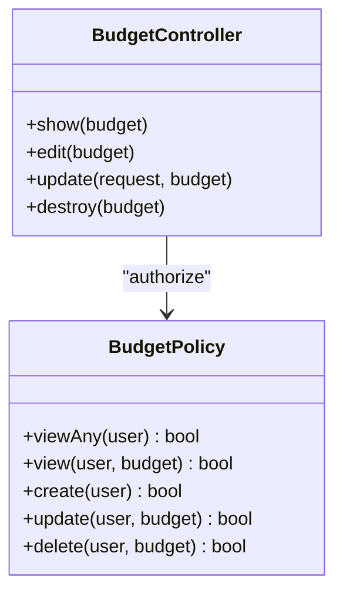

**Diagram sources**
- [app/Policies/BudgetPolicy.php:8-49](file://app/Policies/BudgetPolicy.php#L8-L49)
- [routes/web.php:33-38](file://routes/web.php#L33-L38)

**Section sources**
- [app/Policies/BudgetPolicy.php:1-50](file://app/Policies/BudgetPolicy.php#L1-L50)
- [routes/web.php:33-38](file://routes/web.php#L33-L38)

### Factory Pattern and Data Generation
- Factories generate model instances for testing and seeding.
- The UserFactory defines default attributes and states.

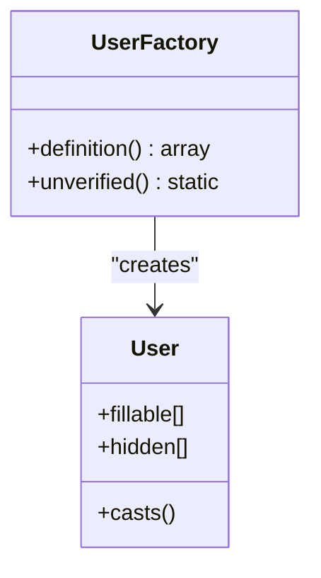

**Diagram sources**
- [database/factories/UserFactory.php:13-45](file://database/factories/UserFactory.php#L13-L45)
- [app/Models/User.php:21-62](file://app/Models/User.php#L21-L62)

**Section sources**
- [database/factories/UserFactory.php:1-46](file://database/factories/UserFactory.php#L1-L46)
- [app/Models/User.php:1-172](file://app/Models/User.php#L1-L172)

### Frontend Separation: Blade and Alpine.js
- Blade provides server-rendered pages with shared layouts and components.
- Alpine.js powers interactive UI behaviors client-side.
- The AppLayout component renders the main application layout.

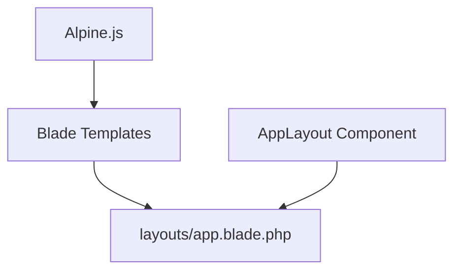

**Diagram sources**
- [resources/views/layouts/app.blade.php:134-215](file://resources/views/layouts/app.blade.php#L134-L215)
- [app/View/Components/AppLayout.php:8-17](file://app/View/Components/AppLayout.php#L8-L17)
- [resources/js/app.js:3-7](file://resources/js/app.js#L3-L7)

**Section sources**
- [resources/views/layouts/app.blade.php:1-232](file://resources/views/layouts/app.blade.php#L1-L232)
- [app/View/Components/AppLayout.php:1-18](file://app/View/Components/AppLayout.php#L1-L18)
- [resources/js/app.js:1-8](file://resources/js/app.js#L1-L8)

## Dependency Analysis
- Composer PSR-4 autoloading maps namespaces to directories.
- Laravel framework and development dependencies are declared.
- The application depends on Laravel core, Tinker, and optional Breeze scaffolding.

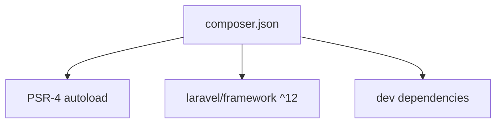

**Diagram sources**
- [composer.json:23-34](file://composer.json#L23-L34)
- [composer.json:8-22](file://composer.json#L8-L22)

**Section sources**
- [composer.json:1-88](file://composer.json#L1-L88)

## Performance Considerations
- Use Eloquent relationships judiciously; consider eager loading to prevent N+1 queries.
- Minimize heavy computations in controllers; move to jobs/services where appropriate.
- Optimize Blade rendering by reusing components and avoiding deep nesting.
- Leverage browser caching and asset compilation for production builds.

## Troubleshooting Guide
- Authentication failures: Verify auth middleware usage and session state in routes.
- Validation errors: Inspect Form Request rules and error bag usage in controllers.
- Authorization denials: Confirm policy methods align with controller actions and model ownership.
- Asset loading issues: Ensure Vite build and Blade @vite directives are present in layouts.

**Section sources**
- [routes/web.php:14-86](file://routes/web.php#L14-L86)
- [app/Http/Controllers/ProfileController.php:28-39](file://app/Http/Controllers/ProfileController.php#L28-L39)
- [app/Policies/BudgetPolicy.php:21-24](file://app/Policies/BudgetPolicy.php#L21-L24)
- [resources/views/layouts/app.blade.php:16-17](file://resources/views/layouts/app.blade.php#L16-L17)

## Conclusion
The Travel Project employs a clean MVC architecture aligned with Laravel conventions. The bootstrap and routing layers establish a robust foundation, while controllers, models, and policies enforce separation of concerns and authorization. Blade templates and Alpine.js deliver a modern frontend experience. The modular structure and standardized patterns facilitate maintainability, scalability, and team collaboration.