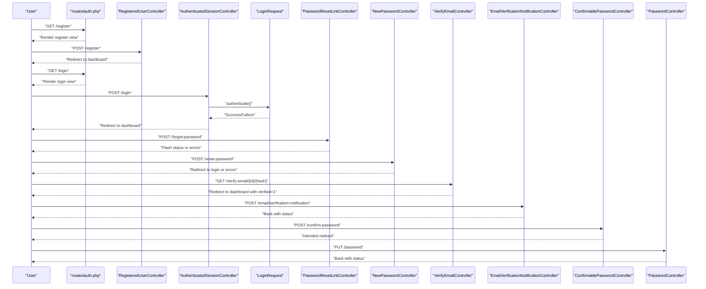
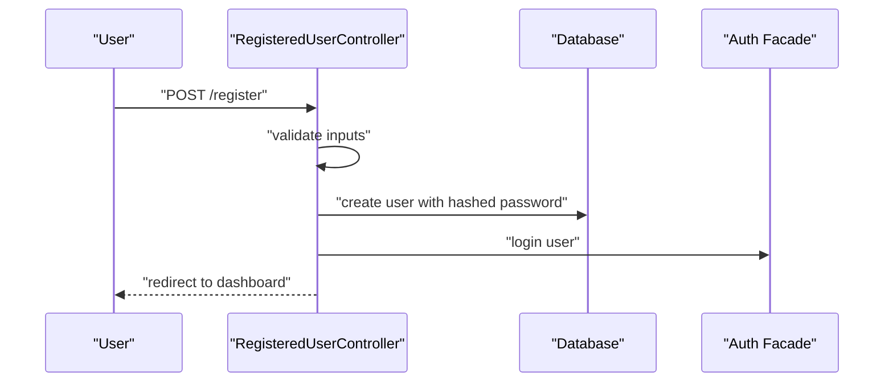
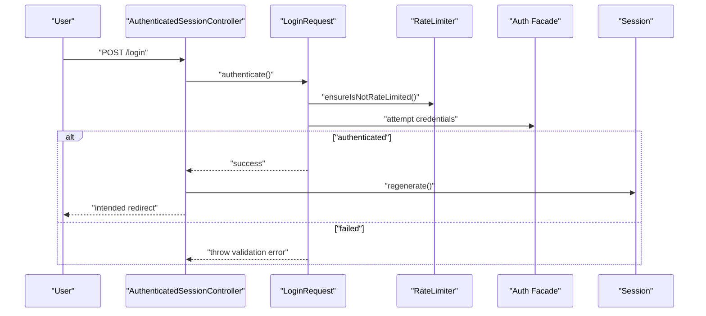
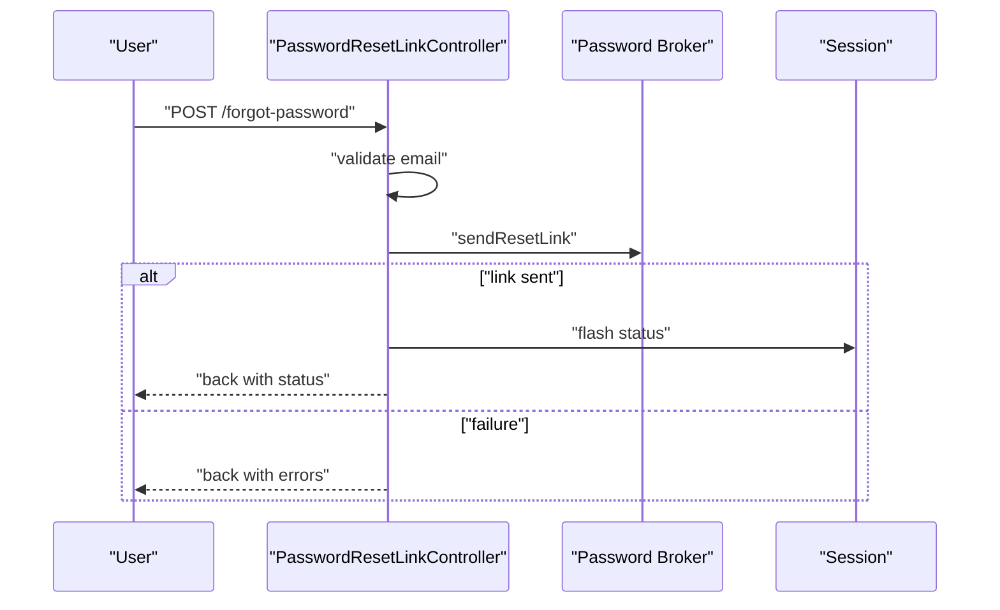
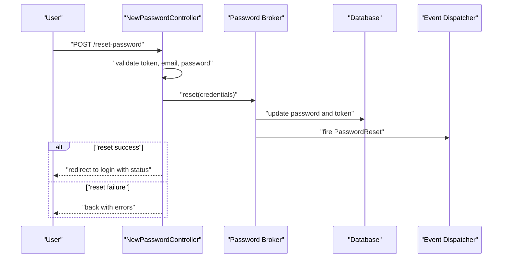
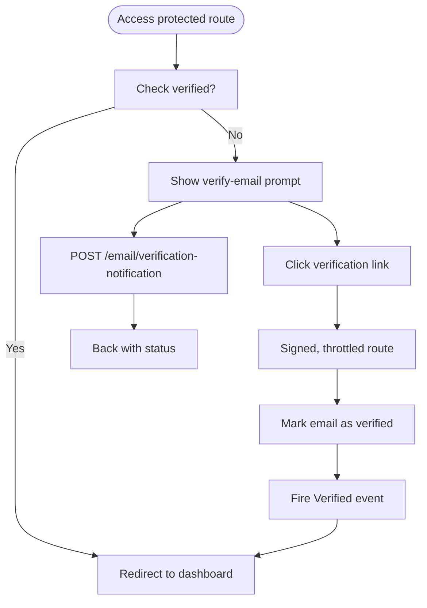
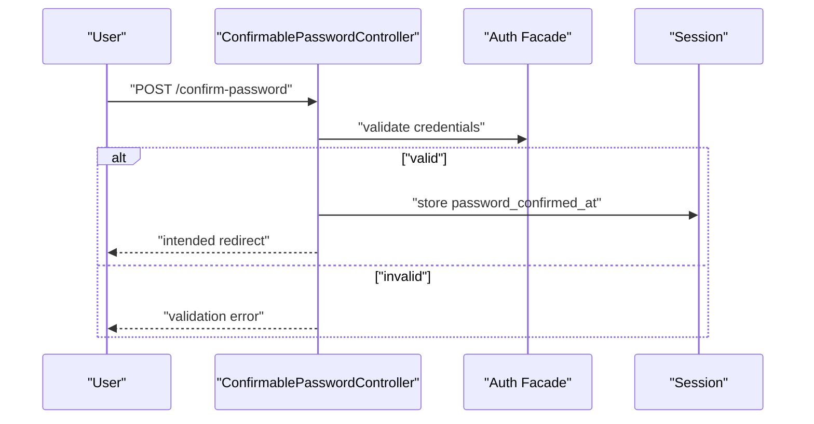
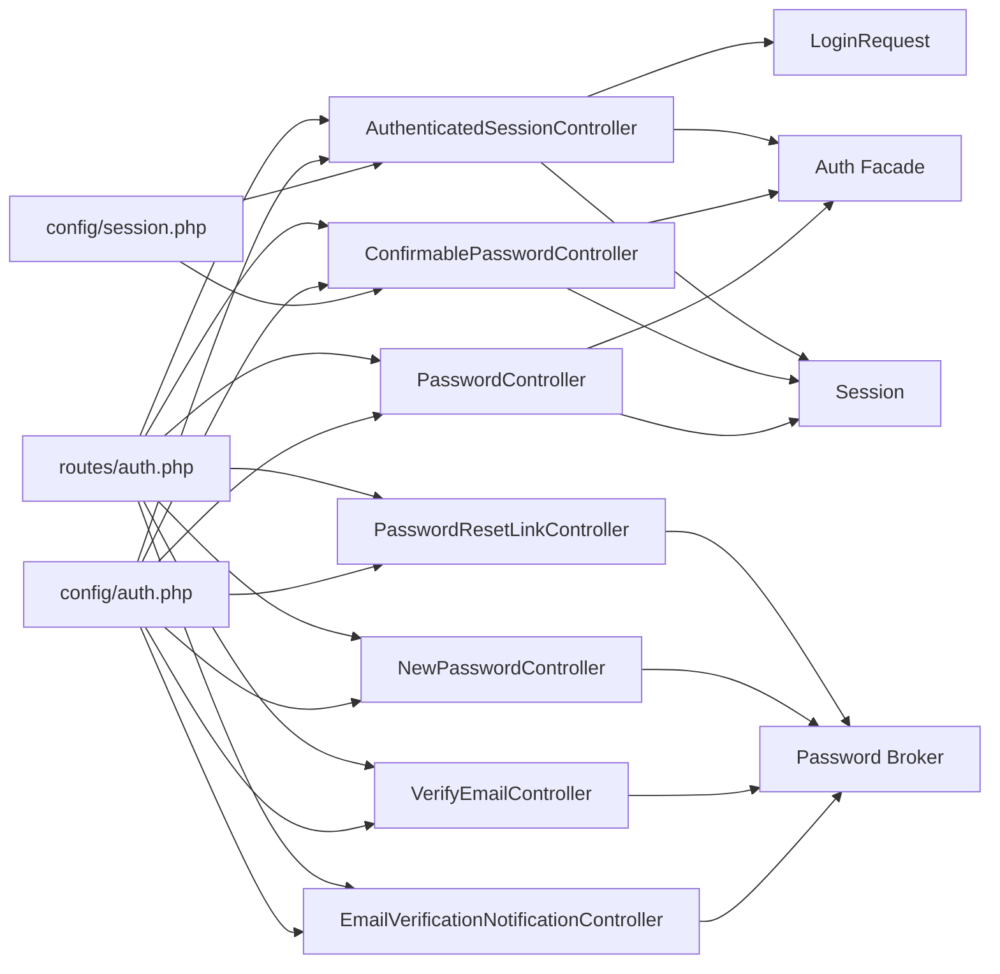

# Authentication System

<cite>
**Referenced Files in This Document**
- [RegisteredUserController.php](file://app/Http/Controllers/Auth/RegisteredUserController.php)
- [AuthenticatedSessionController.php](file://app/Http/Controllers/Auth/AuthenticatedSessionController.php)
- [LoginRequest.php](file://app/Http/Requests/Auth/LoginRequest.php)
- [PasswordResetLinkController.php](file://app/Http/Controllers/Auth/PasswordResetLinkController.php)
- [NewPasswordController.php](file://app/Http/Controllers/Auth/NewPasswordController.php)
- [VerifyEmailController.php](file://app/Http/Controllers/Auth/VerifyEmailController.php)
- [EmailVerificationNotificationController.php](file://app/Http/Controllers/Auth/EmailVerificationNotificationController.php)
- [EmailVerificationPromptController.php](file://app/Http/Controllers/Auth/EmailVerificationPromptController.php)
- [ConfirmablePasswordController.php](file://app/Http/Controllers/Auth/ConfirmablePasswordController.php)
- [PasswordController.php](file://app/Http/Controllers/Auth/PasswordController.php)
- [auth.php](file://config/auth.php)
- [session.php](file://config/session.php)
- [auth.php](file://routes/auth.php)
- [register.blade.php](file://resources/views/auth/register.blade.php)
- [login.blade.php](file://resources/views/auth/login.blade.php)
- [forgot-password.blade.php](file://resources/views/auth/forgot-password.blade.php)
</cite>

## Table of Contents
1. [Introduction](#introduction)
2. [Project Structure](#project-structure)
3. [Core Components](#core-components)
4. [Architecture Overview](#architecture-overview)
5. [Detailed Component Analysis](#detailed-component-analysis)
6. [Dependency Analysis](#dependency-analysis)
7. [Performance Considerations](#performance-considerations)
8. [Troubleshooting Guide](#troubleshooting-guide)
9. [Conclusion](#conclusion)

## Introduction
This document explains the authentication system for the travel platform, focusing on user registration, login, email verification, password reset, and secure session management. It covers the Laravel Breeze scaffolding implementation and platform-specific customizations, middleware protection, password confirmation requirements, and account security features. It also provides code-level insights via referenced controller and configuration files, along with practical troubleshooting guidance.

## Project Structure
The authentication system is organized around dedicated controllers under the Auth namespace, form requests for validated login attempts, Blade templates for user-facing flows, and route groups enforcing guest vs. authenticated middleware. Configuration files define guards, providers, password reset policies, and session behavior.

```mermaid
graph TB
subgraph "Routes"
RAuth["routes/auth.php"]
end
subgraph "Controllers"
Reg["RegisteredUserController.php"]
Login["AuthenticatedSessionController.php"]
LReq["LoginRequest.php"]
PRL["PasswordResetLinkController.php"]
NPW["NewPasswordController.php"]
VEC["VerifyEmailController.php"]
EVN["EmailVerificationNotificationController.php"]
EVP["EmailVerificationPromptController.php"]
CPass["ConfirmablePasswordController.php"]
UpPass["PasswordController.php"]
end
subgraph "Views"
VReg["register.blade.php"]
VLog["login.blade.php"]
VFg["forgot-password.blade.php"]
end
subgraph "Config"
CAuth["config/auth.php"]
CSes["config/session.php"]
end
RAuth --> Reg
RAuth --> Login
RAuth --> PRL
RAuth --> NPW
RAuth --> EVP
RAuth --> VEC
RAuth --> EVN
RAuth --> CPass
RAuth --> UpPass
Reg --> VReg
Login --> VLog
PRL --> VFg
Login --> LReq
Login --> CAuth
Login --> CSes
PRL --> CAuth
NPW --> CAuth
VEC --> CAuth
EVP --> CAuth
EVN --> CAuth
CPass --> CAuth
UpPass --> CAuth
```

**Diagram sources**
- [auth.php](file://routes/auth.php)
- [RegisteredUserController.php](file://app/Http/Controllers/Auth/RegisteredUserController.php)
- [AuthenticatedSessionController.php](file://app/Http/Controllers/Auth/AuthenticatedSessionController.php)
- [LoginRequest.php](file://app/Http/Requests/Auth/LoginRequest.php)
- [PasswordResetLinkController.php](file://app/Http/Controllers/Auth/PasswordResetLinkController.php)
- [NewPasswordController.php](file://app/Http/Controllers/Auth/NewPasswordController.php)
- [VerifyEmailController.php](file://app/Http/Controllers/Auth/VerifyEmailController.php)
- [EmailVerificationNotificationController.php](file://app/Http/Controllers/Auth/EmailVerificationNotificationController.php)
- [EmailVerificationPromptController.php](file://app/Http/Controllers/Auth/EmailVerificationPromptController.php)
- [ConfirmablePasswordController.php](file://app/Http/Controllers/Auth/ConfirmablePasswordController.php)
- [PasswordController.php](file://app/Http/Controllers/Auth/PasswordController.php)
- [register.blade.php](file://resources/views/auth/register.blade.php)
- [login.blade.php](file://resources/views/auth/login.blade.php)
- [forgot-password.blade.php](file://resources/views/auth/forgot-password.blade.php)
- [auth.php](file://config/auth.php)
- [session.php](file://config/session.php)

**Section sources**
- [auth.php](file://routes/auth.php)
- [auth.php](file://config/auth.php)
- [session.php](file://config/session.php)

## Core Components
- Registration: Validates inputs, creates a hashed password, fires a registered event, logs the user in, and redirects to the dashboard.
- Login: Uses a validated request object to authenticate with throttling, regenerates the session, and redirects to the intended destination.
- Password Reset (Request): Validates email and dispatches a reset link via the password broker.
- Password Reset (Update): Validates token, email, and new password; resets the password and emits a reset event.
- Email Verification: Marks the email as verified for signed, throttled links and notifies the user.
- Password Confirmation: Ensures the current password is correct before allowing sensitive actions.
- Password Update: Requires current password confirmation and updates to a new confirmed password.
- Middleware: Routes are grouped by guest/auth, with additional signed/throttle middleware for verification.

**Section sources**
- [RegisteredUserController.php:31-52](file://app/Http/Controllers/Auth/RegisteredUserController.php#L31-L52)
- [AuthenticatedSessionController.php:25-32](file://app/Http/Controllers/Auth/AuthenticatedSessionController.php#L25-L32)
- [LoginRequest.php:41-54](file://app/Http/Requests/Auth/LoginRequest.php#L41-L54)
- [PasswordResetLinkController.php:27-44](file://app/Http/Controllers/Auth/PasswordResetLinkController.php#L27-L44)
- [NewPasswordController.php:32-62](file://app/Http/Controllers/Auth/NewPasswordController.php#L32-L62)
- [VerifyEmailController.php:15-26](file://app/Http/Controllers/Auth/VerifyEmailController.php#L15-L26)
- [ConfirmablePasswordController.php:25-39](file://app/Http/Controllers/Auth/ConfirmablePasswordController.php#L25-L39)
- [PasswordController.php:16-28](file://app/Http/Controllers/Auth/PasswordController.php#L16-L28)
- [auth.php:14-59](file://routes/auth.php#L14-L59)

## Architecture Overview
The authentication architecture follows Laravel’s session-based guard with Eloquent user provider. Routes enforce middleware policies, controllers handle request/response logic, and configuration governs guards, password reset behavior, and session cookies.

**Diagram sources**
- [auth.php:14-59](file://routes/auth.php#L14-L59)
- [RegisteredUserController.php:31-52](file://app/Http/Controllers/Auth/RegisteredUserController.php#L31-L52)
- [AuthenticatedSessionController.php:25-32](file://app/Http/Controllers/Auth/AuthenticatedSessionController.php#L25-L32)
- [LoginRequest.php:41-54](file://app/Http/Requests/Auth/LoginRequest.php#L41-L54)
- [PasswordResetLinkController.php:27-44](file://app/Http/Controllers/Auth/PasswordResetLinkController.php#L27-L44)
- [NewPasswordController.php:32-62](file://app/Http/Controllers/Auth/NewPasswordController.php#L32-L62)
- [VerifyEmailController.php:15-26](file://app/Http/Controllers/Auth/VerifyEmailController.php#L15-L26)
- [EmailVerificationNotificationController.php:14-23](file://app/Http/Controllers/Auth/EmailVerificationNotificationController.php#L14-L23)
- [ConfirmablePasswordController.php:25-39](file://app/Http/Controllers/Auth/ConfirmablePasswordController.php#L25-L39)
- [PasswordController.php:16-28](file://app/Http/Controllers/Auth/PasswordController.php#L16-L28)

## Detailed Component Analysis

### Registration Flow
- Request handling: Validates name, username uniqueness, email uniqueness, and password confirmation with Laravel defaults.
- Persistence: Creates a new user record with a hashed password.
- Events and login: Fires a registered event and logs the user in.
- Redirection: Sends the user to the dashboard.

**Diagram sources**
- [RegisteredUserController.php:31-52](file://app/Http/Controllers/Auth/RegisteredUserController.php#L31-L52)

**Section sources**
- [RegisteredUserController.php:31-52](file://app/Http/Controllers/Auth/RegisteredUserController.php#L31-L52)
- [register.blade.php:1-60](file://resources/views/auth/register.blade.php#L1-L60)

### Login Flow with Throttling
- Request validation: Uses a dedicated form request to authenticate credentials.
- Throttling: Enforces rate limits keyed by email+IP; clears on success, records lockout events.
- Session management: Regenerates session ID after successful login.
- Intended redirect: Sends users to the intended destination after login.

**Diagram sources**
- [AuthenticatedSessionController.php:25-32](file://app/Http/Controllers/Auth/AuthenticatedSessionController.php#L25-L32)
- [LoginRequest.php:41-77](file://app/Http/Requests/Auth/LoginRequest.php#L41-L77)

**Section sources**
- [AuthenticatedSessionController.php:25-32](file://app/Http/Controllers/Auth/AuthenticatedSessionController.php#L25-L32)
- [LoginRequest.php:41-77](file://app/Http/Requests/Auth/LoginRequest.php#L41-L77)
- [login.blade.php:1-48](file://resources/views/auth/login.blade.php#L1-L48)

### Password Reset Link Request
- Validates email presence.
- Delegates to the password broker to send a reset link.
- Returns success status or validation errors.

**Diagram sources**
- [PasswordResetLinkController.php:27-44](file://app/Http/Controllers/Auth/PasswordResetLinkController.php#L27-L44)

**Section sources**
- [PasswordResetLinkController.php:27-44](file://app/Http/Controllers/Auth/PasswordResetLinkController.php#L27-L44)
- [forgot-password.blade.php:1-26](file://resources/views/auth/forgot-password.blade.php#L1-L26)

### Password Reset Token Management
- Validates token, email, and new password.
- Uses the password broker’s reset callback to hash and save the new password, regenerate a remember token, and emit a reset event.
- Redirects on success or returns errors.

**Diagram sources**
- [NewPasswordController.php:32-62](file://app/Http/Controllers/Auth/NewPasswordController.php#L32-L62)

**Section sources**
- [NewPasswordController.php:32-62](file://app/Http/Controllers/Auth/NewPasswordController.php#L32-L62)

### Email Verification Workflow
- Prompt: Renders the verification prompt or redirects if already verified.
- Resend: Sends a new verification notification if the email is unverified.
- Verify: Signed, throttled route marks the email as verified and emits a verified event.

**Diagram sources**
- [EmailVerificationPromptController.php:15-20](file://app/Http/Controllers/Auth/EmailVerificationPromptController.php#L15-L20)
- [EmailVerificationNotificationController.php:14-23](file://app/Http/Controllers/Auth/EmailVerificationNotificationController.php#L14-L23)
- [VerifyEmailController.php:15-26](file://app/Http/Controllers/Auth/VerifyEmailController.php#L15-L26)

**Section sources**
- [EmailVerificationPromptController.php:15-20](file://app/Http/Controllers/Auth/EmailVerificationPromptController.php#L15-L20)
- [EmailVerificationNotificationController.php:14-23](file://app/Http/Controllers/Auth/EmailVerificationNotificationController.php#L14-L23)
- [VerifyEmailController.php:15-26](file://app/Http/Controllers/Auth/VerifyEmailController.php#L15-L26)

### Password Confirmation and Account Security
- Password confirmation: Validates the current password against the logged-in user and stores a confirmation timestamp in the session.
- Password update: Requires current password validation and enforces a new confirmed password update.
- Security considerations: Configurable password confirmation timeout, session lifetime, and secure cookie attributes.

**Diagram sources**
- [ConfirmablePasswordController.php:25-39](file://app/Http/Controllers/Auth/ConfirmablePasswordController.php#L25-L39)

**Section sources**
- [ConfirmablePasswordController.php:25-39](file://app/Http/Controllers/Auth/ConfirmablePasswordController.php#L25-L39)
- [PasswordController.php:16-28](file://app/Http/Controllers/Auth/PasswordController.php#L16-L28)
- [auth.php](file://config/auth.php#L115)
- [session.php](file://config/session.php#L35)

## Dependency Analysis
- Controllers depend on:
  - Laravel’s Auth facade for login/logout and user checks.
  - Form requests for validated authentication attempts.
  - Password broker for password reset operations.
  - Session for regeneration and token invalidation.
- Routes group endpoints by middleware:
  - guest: registration, login, forgot-password, reset-password.
  - auth: verification prompts, resend notifications, password confirmation, password update, logout.
  - signed/throttle: email verification link.
- Configuration ties:
  - Guard “web” with session driver and Eloquent user provider.
  - Password reset broker with token table, expiry, and throttle.
  - Session driver, lifetime, and cookie security settings.

**Diagram sources**
- [AuthenticatedSessionController.php:25-32](file://app/Http/Controllers/Auth/AuthenticatedSessionController.php#L25-L32)
- [LoginRequest.php:41-54](file://app/Http/Requests/Auth/LoginRequest.php#L41-L54)
- [PasswordResetLinkController.php:27-44](file://app/Http/Controllers/Auth/PasswordResetLinkController.php#L27-L44)
- [NewPasswordController.php:32-62](file://app/Http/Controllers/Auth/NewPasswordController.php#L32-L62)
- [VerifyEmailController.php:15-26](file://app/Http/Controllers/Auth/VerifyEmailController.php#L15-L26)
- [EmailVerificationNotificationController.php:14-23](file://app/Http/Controllers/Auth/EmailVerificationNotificationController.php#L14-L23)
- [ConfirmablePasswordController.php:25-39](file://app/Http/Controllers/Auth/ConfirmablePasswordController.php#L25-L39)
- [PasswordController.php:16-28](file://app/Http/Controllers/Auth/PasswordController.php#L16-L28)
- [auth.php:14-59](file://routes/auth.php#L14-L59)
- [auth.php](file://config/auth.php)
- [session.php](file://config/session.php)

**Section sources**
- [auth.php:14-59](file://routes/auth.php#L14-L59)
- [auth.php](file://config/auth.php)
- [session.php](file://config/session.php)

## Performance Considerations
- Session storage: Using the database driver centralizes session state and scales with database capacity; tune session lifetime and cleanup lottery.
- Rate limiting: Login throttling prevents brute force; adjust attempts and decay windows per deployment needs.
- Password hashing: Laravel’s default hashing is secure; avoid customizing unless necessary.
- Email operations: Asynchronous mail queues reduce latency for verification and reset notifications.

[No sources needed since this section provides general guidance]

## Troubleshooting Guide
Common issues and resolutions:
- Login failures:
  - Cause: Incorrect credentials or rate limit hit.
  - Resolution: Clear rate limiter state and retry; verify email normalization and IP throttling key.
- Password reset not received:
  - Cause: Invalid email or reset link expired.
  - Resolution: Resend link; check password reset token table and expiry settings.
- Email verification link invalid:
  - Cause: Unsigned or throttled link misuse.
  - Resolution: Ensure signed route and throttle middleware; resend verification notification.
- Password confirmation timeout:
  - Cause: Exceeded configured timeout.
  - Resolution: Re-confirm password; adjust timeout in configuration.
- Session problems:
  - Cause: Cookie domain/path mismatch or long inactivity.
  - Resolution: Review session cookie settings and lifetime; ensure HTTPS for secure cookies.

**Section sources**
- [LoginRequest.php:61-77](file://app/Http/Requests/Auth/LoginRequest.php#L61-L77)
- [PasswordResetLinkController.php:27-44](file://app/Http/Controllers/Auth/PasswordResetLinkController.php#L27-L44)
- [auth.php:95-102](file://config/auth.php#L95-L102)
- [session.php:130-202](file://config/session.php#L130-L202)

## Conclusion
The authentication system leverages Laravel Breeze scaffolding with clear separation of concerns across controllers, form requests, and Blade views. Middleware ensures appropriate access controls, while configuration governs security and resilience. The documented flows and troubleshooting steps provide a reliable foundation for user registration, login, email verification, password reset, and secure session management tailored for the travel platform.