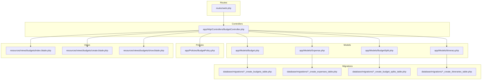
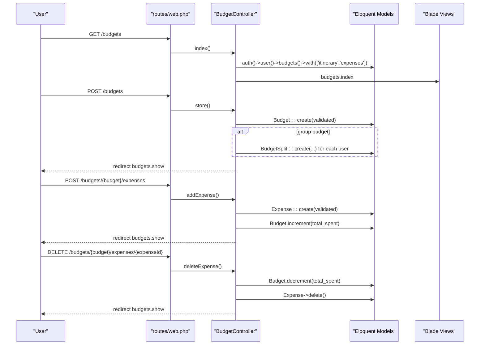
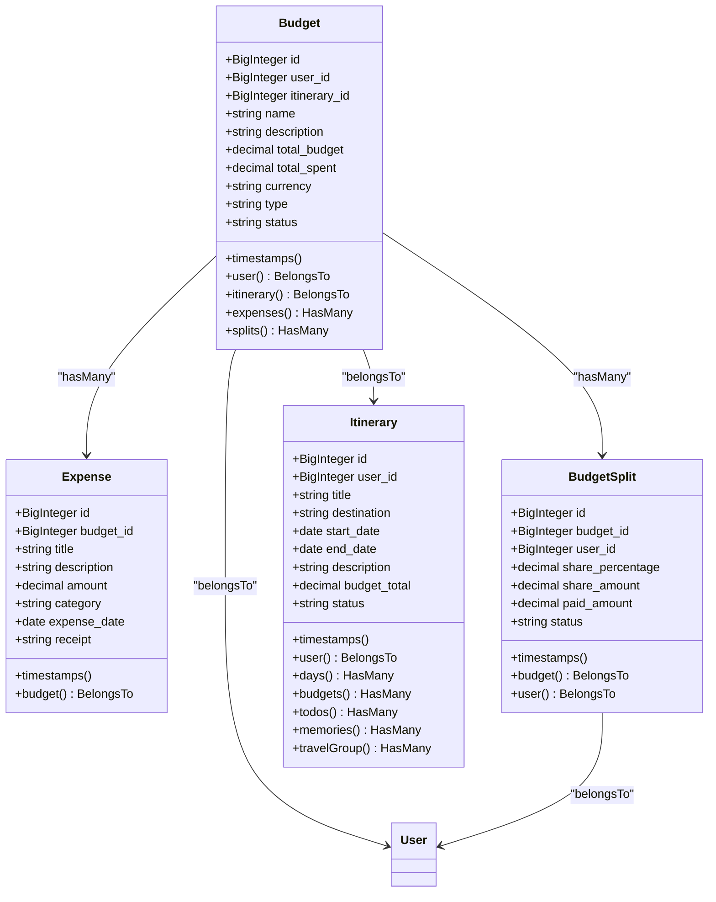
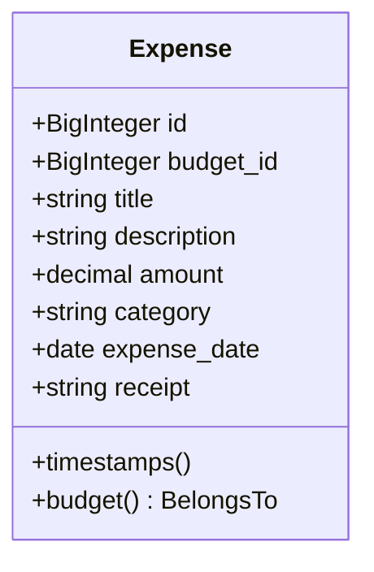
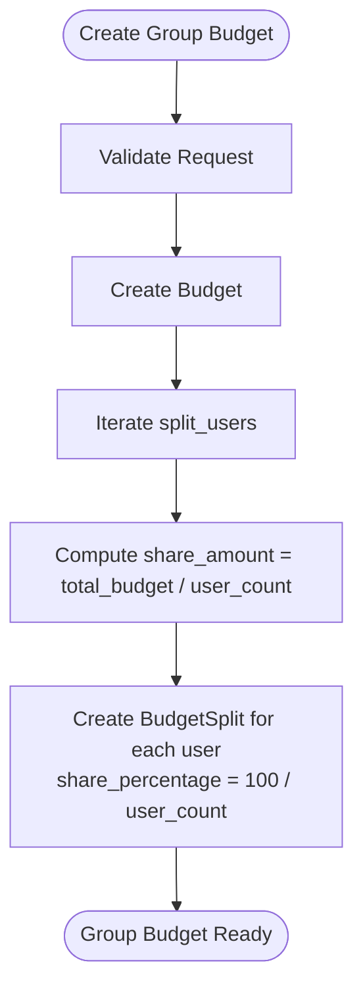
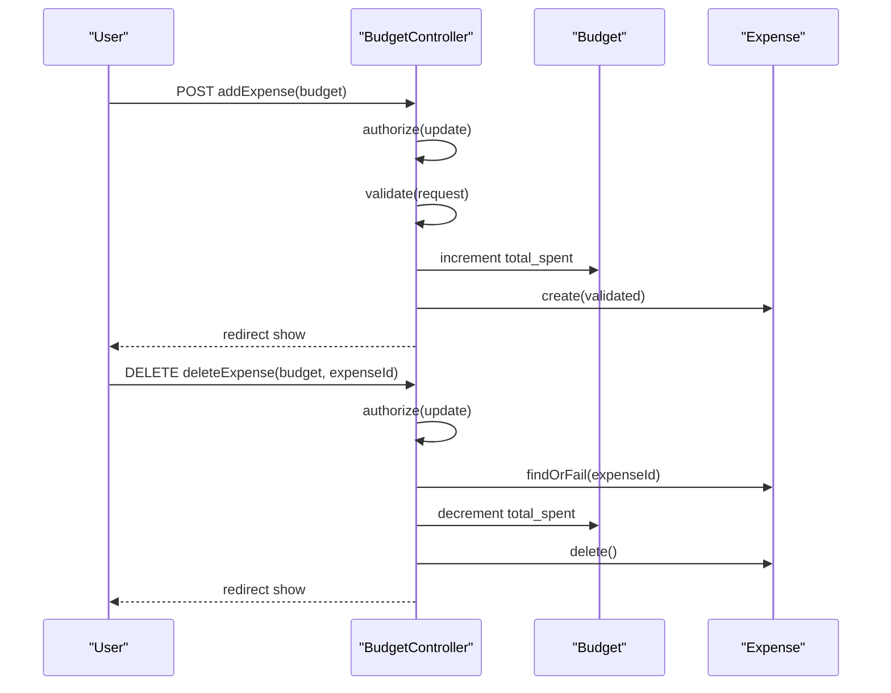
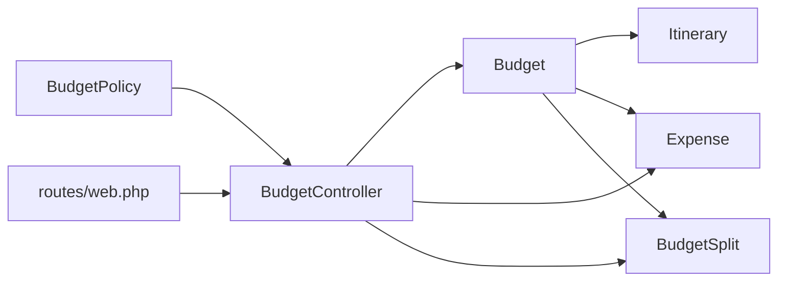

```mermaid
flowchart TD
IndexPage["Budget Index View"] --> Filters["Filter by Itinerary/Type"]
IndexPage --> Cards["Stats Cards"]
ShowPage["Budget Show View"] --> Stats["Stats Overview"]
ShowPage --> Progress["Progress Bar"]
ShowPage --> ExpensesList["Expenses List"]
ShowPage --> CategoryBreakdown["By Category"]
ShowPage --> AddExpenseForm["Add Expense Form"]
ShowPage --> DeleteExpenseAction["Delete Expense Action"]
CreatePage["Budget Create View"] --> TypeSelection["Solo/Group Selection"]
CreatePage --> CurrencySelector["Currency Selector"]
CreatePage --> ItineraryLink["Link to Itinerary"]
CreatePage --> GroupSplits["Optional Group Splits"]
```

# Budget and Expense Tracking

<cite>
**Referenced Files in This Document**
- [BudgetController.php](file://app/Http/Controllers/BudgetController.php)
- [Budget.php](file://app/Models/Budget.php)
- [Expense.php](file://app/Models/Expense.php)
- [BudgetSplit.php](file://app/Models/BudgetSplit.php)
- [Itinerary.php](file://app/Models/Itinerary.php)
- [create.blade.php](file://resources/views/budgets/create.blade.php)
- [show.blade.php](file://resources/views/budgets/show.blade.php)
- [index.blade.php](file://resources/views/budgets/index.blade.php)
- [web.php](file://routes/web.php)
- [BudgetPolicy.php](file://app/Policies/BudgetPolicy.php)
- [2026_04_21_132809_create_budgets_table.php](file://database/migrations/2026_04_21_132809_create_budgets_table.php)
- [2026_04_21_132811_create_expenses_table.php](file://database/migrations/2026_04_21_132811_create_expenses_table.php)
- [2026_04_21_132810_create_budget_splits_table.php](file://database/migrations/2026_04_21_132810_create_budget_splits_table.php)
- [2026_04_21_132801_create_itineraries_table.php](file://database/migrations/2026_04_21_132801_create_itineraries_table.php)
</cite>

## Table of Contents
1. [Introduction](#introduction)
2. [Project Structure](#project-structure)
3. [Core Components](#core-components)
4. [Architecture Overview](#architecture-overview)
5. [Detailed Component Analysis](#detailed-component-analysis)
6. [Dependency Analysis](#dependency-analysis)
7. [Performance Considerations](#performance-considerations)
8. [Troubleshooting Guide](#troubleshooting-guide)
9. [Conclusion](#conclusion)
10. [Appendices](#appendices)

## Introduction
This document explains the budget and expense tracking system designed for travel planning. It covers budget creation and lifecycle management, allocation and tracking of expenses, currency handling, expense categorization, group expense sharing via BudgetSplit, and the relationships among budgets, expenses, and itineraries. It also documents controller operations for budget management and expense recording, and outlines analytics and reporting capabilities surfaced in the UI.

## Project Structure
The system centers around Laravel MVC with dedicated models, controller, policies, and Blade views for budget and expense management. Routes define the RESTful budget endpoints plus custom endpoints for adding and removing expenses.



**Diagram sources**
- [web.php:35-38](file://routes/web.php#L35-L38)
- [BudgetController.php:12-215](file://app/Http/Controllers/BudgetController.php#L12-L215)
- [Budget.php:9-47](file://app/Models/Budget.php#L9-L47)
- [Expense.php:9-32](file://app/Models/Expense.php#L9-L32)
- [BudgetSplit.php:8-34](file://app/Models/BudgetSplit.php#L8-L34)
- [Itinerary.php:9-57](file://app/Models/Itinerary.php#L9-L57)
- [index.blade.php:1-184](file://resources/views/budgets/index.blade.php#L1-L184)
- [create.blade.php:1-171](file://resources/views/budgets/create.blade.php#L1-L171)
- [show.blade.php:1-216](file://resources/views/budgets/show.blade.php#L1-L216)
- [2026_04_21_132809_create_budgets_table.php:14-29](file://database/migrations/2026_04_21_132809_create_budgets_table.php#L14-L29)
- [2026_04_21_132811_create_expenses_table.php:14-27](file://database/migrations/2026_04_21_132811_create_expenses_table.php#L14-L27)
- [2026_04_21_132810_create_budget_splits_table.php:14-26](file://database/migrations/2026_04_21_132810_create_budget_splits_table.php#L14-L26)
- [2026_04_21_132801_create_itineraries_table.php:14-28](file://database/migrations/2026_04_21_132801_create_itineraries_table.php#L14-L28)

**Section sources**
- [web.php:35-38](file://routes/web.php#L35-L38)
- [BudgetController.php:12-215](file://app/Http/Controllers/BudgetController.php#L12-L215)
- [Budget.php:9-47](file://app/Models/Budget.php#L9-L47)
- [Expense.php:9-32](file://app/Models/Expense.php#L9-L32)
- [BudgetSplit.php:8-34](file://app/Models/BudgetSplit.php#L8-L34)
- [Itinerary.php:9-57](file://app/Models/Itinerary.php#L9-L57)
- [index.blade.php:1-184](file://resources/views/budgets/index.blade.php#L1-L184)
- [create.blade.php:1-171](file://resources/views/budgets/create.blade.php#L1-L171)
- [show.blade.php:1-216](file://resources/views/budgets/show.blade.php#L1-L216)

## Core Components
- Budget model: Tracks total budget, total spent, currency, type (solo/group), status, and links to user, itinerary, expenses, and splits.
- Expense model: Records per-transaction details including amount, category, date, and optional receipt.
- BudgetSplit model: Distributes group budget shares among users with share percentage, share amount, paid amount, and status.
- Itinerary model: Connects budgets to planned trips with dates and status.
- BudgetController: Implements CRUD for budgets, manages expense addition/removal, and aggregates analytics for display.
- Views: Present budget lists, creation form, and detailed budget page with expense list and category breakdown.

Key implementation references:
- BudgetController index, create, store, show, edit, update, destroy, addExpense, deleteExpense
- Budget model relations and casts
- Expense model relations and casts
- BudgetSplit model relations and casts
- Itinerary model relations and casts

**Section sources**
- [BudgetController.php:14-215](file://app/Http/Controllers/BudgetController.php#L14-L215)
- [Budget.php:11-47](file://app/Models/Budget.php#L11-L47)
- [Expense.php:13-32](file://app/Models/Expense.php#L13-L32)
- [BudgetSplit.php:10-34](file://app/Models/BudgetSplit.php#L10-L34)
- [Itinerary.php:11-57](file://app/Models/Itinerary.php#L11-L57)

## Architecture Overview
The system follows a layered MVC pattern:
- Routes define endpoints for budgets and custom expense actions.
- BudgetController orchestrates authorization, validation, transactions, and view rendering.
- Models encapsulate persistence, relationships, and casting.
- Views render lists, forms, and analytics dashboards.



**Diagram sources**
- [web.php:35-38](file://routes/web.php#L35-L38)
- [BudgetController.php:14-215](file://app/Http/Controllers/BudgetController.php#L14-L215)
- [Budget.php:38-46](file://app/Models/Budget.php#L38-L46)
- [Expense.php:28-31](file://app/Models/Expense.php#L28-L31)
- [BudgetSplit.php:25-28](file://app/Models/BudgetSplit.php#L25-L28)

## Detailed Component Analysis

### Budget Model
The Budget model defines fillable attributes, monetary casting, and relationships to user, itinerary, expenses, and splits. It supports solo and group budget types and tracks status and currency.



**Diagram sources**
- [Budget.php:11-47](file://app/Models/Budget.php#L11-L47)
- [Expense.php:13-32](file://app/Models/Expense.php#L13-L32)
- [BudgetSplit.php:10-34](file://app/Models/BudgetSplit.php#L10-L34)
- [Itinerary.php:11-57](file://app/Models/Itinerary.php#L11-L57)

**Section sources**
- [Budget.php:11-47](file://app/Models/Budget.php#L11-L47)
- [Expense.php:13-32](file://app/Models/Expense.php#L13-L32)
- [BudgetSplit.php:10-34](file://app/Models/BudgetSplit.php#L10-L34)
- [Itinerary.php:11-57](file://app/Models/Itinerary.php#L11-L57)

### Expense Model
The Expense model captures per-transaction metadata, including amount, category, date, and optional receipt. It belongs to a Budget.



**Diagram sources**
- [Expense.php:13-32](file://app/Models/Expense.php#L13-L32)

**Section sources**
- [Expense.php:13-32](file://app/Models/Expense.php#L13-L32)

### BudgetSplit Functionality (Group Expense Sharing)
Group budgets distribute costs among participants. On creation, the controller creates BudgetSplit records for each participating user with equal share percentage and share amount. The split status tracks pending/paid/settled.



**Diagram sources**
- [BudgetController.php:69-82](file://app/Http/Controllers/BudgetController.php#L69-L82)
- [BudgetSplit.php:10-23](file://app/Models/BudgetSplit.php#L10-L23)

**Section sources**
- [BudgetController.php:69-82](file://app/Http/Controllers/BudgetController.php#L69-L82)
- [BudgetSplit.php:10-23](file://app/Models/BudgetSplit.php#L10-L23)

### BudgetController Operations
The controller implements:
- Listing budgets with filters and pagination
- Creating budgets with solo or group type
- Updating budget metadata and status
- Deleting budgets
- Adding expenses with validation, receipt upload, and total_spent updates
- Removing expenses and adjusting total_spent



**Diagram sources**
- [BudgetController.php:153-213](file://app/Http/Controllers/BudgetController.php#L153-L213)
- [Budget.php:38-41](file://app/Models/Budget.php#L38-L41)
- [Expense.php:28-31](file://app/Models/Expense.php#L28-L31)

**Section sources**
- [BudgetController.php:14-215](file://app/Http/Controllers/BudgetController.php#L14-L215)

### Views and Analytics
- Budget index displays summary cards and filter controls for itinerary and type.
- Budget show presents:
  - Stats overview (total budget, total spent, remaining, percentage used)
  - Spending progress bar
  - Expense list with add/delete actions
  - Category breakdown of expenses
- Budget create allows selecting budget type, currency, linking to an itinerary, and optionally splitting with users.



**Diagram sources**
- [index.blade.php:19-102](file://resources/views/budgets/index.blade.php#L19-L102)
- [show.blade.php:26-213](file://resources/views/budgets/show.blade.php#L26-L213)
- [create.blade.php:66-134](file://resources/views/budgets/create.blade.php#L66-L134)

**Section sources**
- [index.blade.php:19-102](file://resources/views/budgets/index.blade.php#L19-L102)
- [show.blade.php:26-213](file://resources/views/budgets/show.blade.php#L26-L213)
- [create.blade.php:66-134](file://resources/views/budgets/create.blade.php#L66-L134)

## Dependency Analysis
- Authorization: BudgetPolicy restricts view/update/delete to the budget owner.
- Routing: Resource routes plus two custom endpoints for expense operations.
- Data integrity: Foreign keys enforce ownership and parent-child relationships; indexes optimize queries.
- Transactions: Controller wraps budget creation and expense add/remove in database transactions.



**Diagram sources**
- [BudgetPolicy.php:21-47](file://app/Policies/BudgetPolicy.php#L21-L47)
- [web.php:35-38](file://routes/web.php#L35-L38)
- [BudgetController.php:14-215](file://app/Http/Controllers/BudgetController.php#L14-L215)
- [Budget.php:28-46](file://app/Models/Budget.php#L28-L46)
- [Expense.php:28-31](file://app/Models/Expense.php#L28-L31)
- [BudgetSplit.php:25-33](file://app/Models/BudgetSplit.php#L25-L33)
- [Itinerary.php:28-41](file://app/Models/Itinerary.php#L28-L41)

**Section sources**
- [BudgetPolicy.php:21-47](file://app/Policies/BudgetPolicy.php#L21-L47)
- [web.php:35-38](file://routes/web.php#L35-L38)
- [BudgetController.php:14-215](file://app/Http/Controllers/BudgetController.php#L14-L215)
- [Budget.php:28-46](file://app/Models/Budget.php#L28-L46)
- [Expense.php:28-31](file://app/Models/Expense.php#L28-L31)
- [BudgetSplit.php:25-33](file://app/Models/BudgetSplit.php#L25-L33)
- [Itinerary.php:28-41](file://app/Models/Itinerary.php#L28-L41)

## Performance Considerations
- Use database indexes on frequently filtered columns (user_id, status, type, itinerary_id) to speed up queries.
- Paginate budget listings to avoid loading large datasets.
- Aggregate totals (sums) in SQL rather than PHP where possible to reduce memory usage.
- Store receipts efficiently and consider offloading to cloud storage for scalability.
- Batch operations for group splits to minimize round-trips.

## Troubleshooting Guide
Common issues and resolutions:
- Validation errors during budget creation: Ensure required fields (name, total_budget, currency, type) are provided and formatted correctly.
- Group split creation failures: Verify split_users array is present and contains valid user IDs.
- Expense upload failures: Confirm file size and MIME type constraints are met.
- Transaction rollbacks: Wrap critical operations in transactions to maintain data consistency.
- Authorization failures: Confirm the current user owns the budget being accessed.

**Section sources**
- [BudgetController.php:51-58](file://app/Http/Controllers/BudgetController.php#L51-L58)
- [BudgetController.php:157-164](file://app/Http/Controllers/BudgetController.php#L157-L164)
- [BudgetController.php:88-91](file://app/Http/Controllers/BudgetController.php#L88-L91)
- [BudgetController.php:187-190](file://app/Http/Controllers/BudgetController.php#L187-L190)

## Conclusion
The budget and expense tracking system provides a robust foundation for managing travel finances. It supports solo and group budgets, tracks spending with categories and receipts, and integrates with itineraries. The controller enforces authorization, maintains financial totals, and exposes analytics through the UI. Extending the system could include budget alerts, advanced reporting, and reconciliation features.

## Appendices

### Database Schema Overview
```mermaid
erDiagram
BUDGETS {
bigint id PK
bigint user_id FK
bigint itinerary_id FK
string name
text description
decimal total_budget
decimal total_spent
string currency
enum type
enum status
timestamps()
}
EXPENSES {
bigint id PK
bigint budget_id FK
string title
text description
decimal amount
string category
date expense_date
string receipt
timestamps()
}
BUDGET_SPLITS {
bigint id PK
bigint budget_id FK
bigint user_id FK
decimal share_percentage
decimal share_amount
decimal paid_amount
enum status
timestamps()
}
ITINERARIES {
bigint id PK
bigint user_id FK
string title
string destination
date start_date
date end_date
text description
decimal budget_total
enum status
timestamps()
}
BUDGETS ||--o{ EXPENSES : "contains"
BUDGETS ||--o{ BUDGET_SPLITS : "split_for"
ITINERARIES ||--o{ BUDGETS : "hosts"
```

**Diagram sources**
- [2026_04_21_132809_create_budgets_table.php:14-29](file://database/migrations/2026_04_21_132809_create_budgets_table.php#L14-L29)
- [2026_04_21_132811_create_expenses_table.php:14-27](file://database/migrations/2026_04_21_132811_create_expenses_table.php#L14-L27)
- [2026_04_21_132810_create_budget_splits_table.php:14-26](file://database/migrations/2026_04_21_132810_create_budget_splits_table.php#L14-L26)
- [2026_04_21_132801_create_itineraries_table.php:14-28](file://database/migrations/2026_04_21_132801_create_itineraries_table.php#L14-L28)

### Common Budgeting Scenarios and Best Practices
- Solo trip budget: Set a fixed total budget and track expenses by category to stay within limits.
- Group trip budget: Create a group budget and split costs equally; reconcile paid amounts later.
- Linked to itinerary: Associate budgets with itineraries to track trip-specific spending.
- Receipt management: Upload receipts to support expense verification and reporting.
- Currency awareness: Choose appropriate currency for the destination to simplify conversions.
- Regular reviews: Use the category breakdown and progress bar to monitor spending trends and adjust plans.