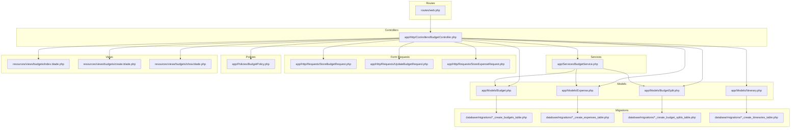
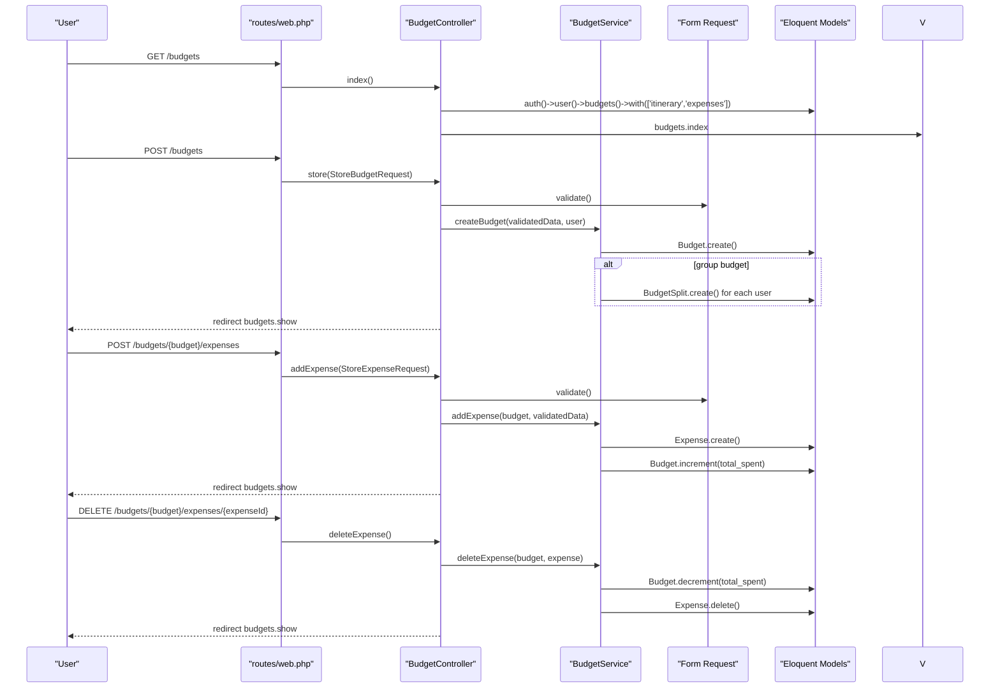
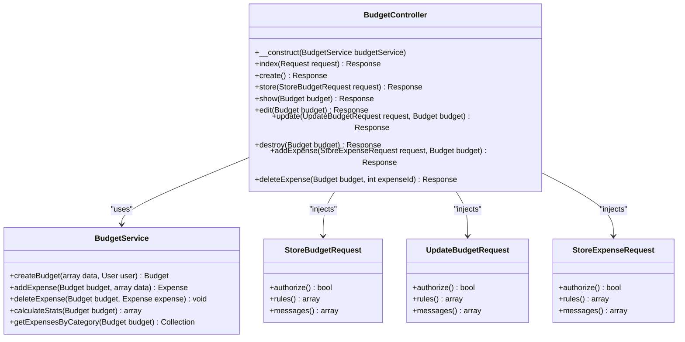
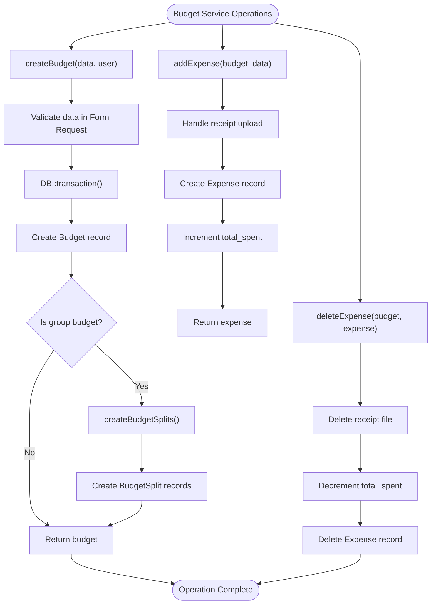
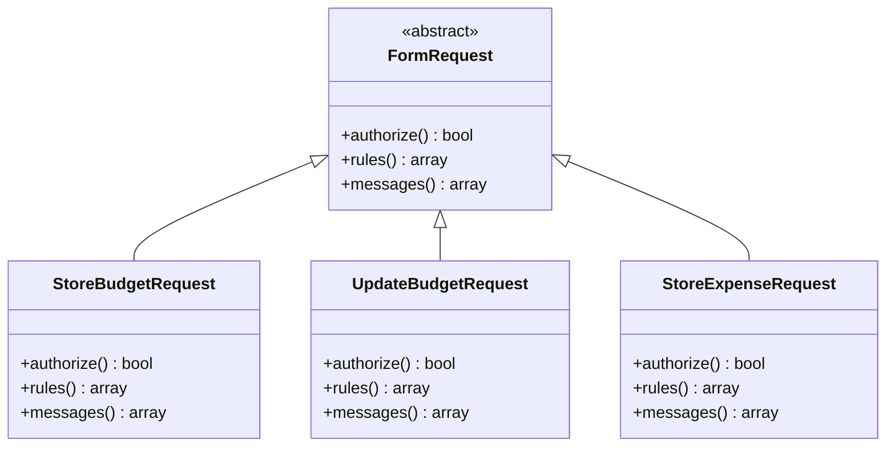
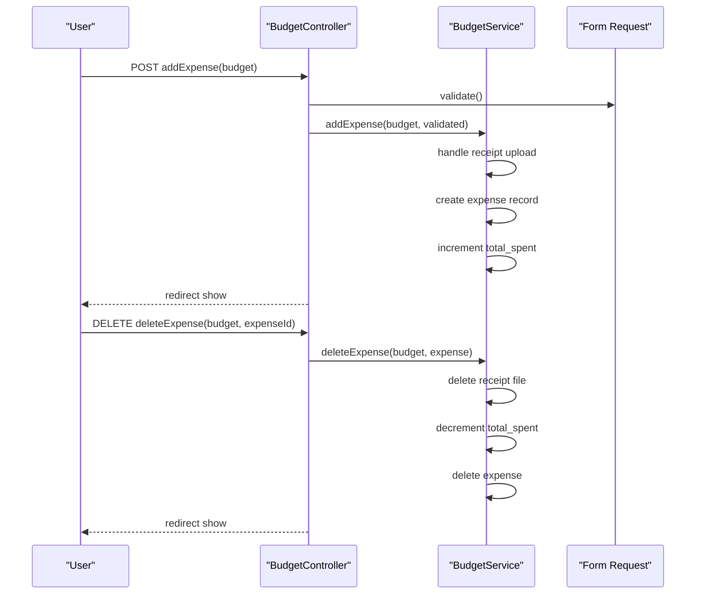
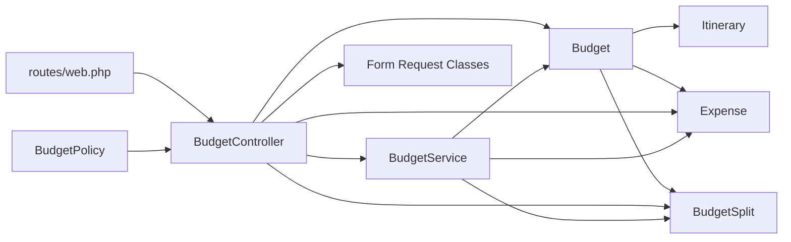

# Budget and Expense Tracking

<cite>
**Referenced Files in This Document**
- [BudgetController.php](file://app/Http/Controllers/BudgetController.php)
- [BudgetService.php](file://app/Services/BudgetService.php)
- [StoreBudgetRequest.php](file://app/Http/Requests/StoreBudgetRequest.php)
- [UpdateBudgetRequest.php](file://app/Http/Requests/UpdateBudgetRequest.php)
- [StoreExpenseRequest.php](file://app/Http/Requests/StoreExpenseRequest.php)
- [Budget.php](file://app/Models/Budget.php)
- [Expense.php](file://app/Models/Expense.php)
- [BudgetSplit.php](file://app/Models/BudgetSplit.php)
- [Itinerary.php](file://app/Models/Itinerary.php)
- [create.blade.php](file://resources/views/budgets/create.blade.php)
- [show.blade.php](file://resources/views/budgets/show.blade.php)
- [index.blade.php](file://resources/views/budgets/index.blade.php)
- [web.php](file://routes/web.php)
- [BudgetPolicy.php](file://app/Policies/BudgetPolicy.php)
- [2026_04_21_132809_create_budgets_table.php](file://database/migrations/2026_04_21_132809_create_budgets_table.php)
- [2026_04_21_132811_create_expenses_table.php](file://database/migrations/2026_04_21_132811_create_expenses_table.php)
- [2026_04_21_132810_create_budget_splits_table.php](file://database/migrations/2026_04_21_132810_create_budget_splits_table.php)
- [2026_04_21_132801_create_itineraries_table.php](file://database/migrations/2026_04_21_132801_create_itineraries_table.php)
</cite>

## Update Summary
**Changes Made**
- Updated BudgetController documentation to reflect new Form Request pattern with dependency injection
- Added BudgetService documentation explaining business logic separation
- Updated validation patterns from inline validation to structured Form Request validation
- Enhanced controller operation documentation with new architectural components
- Updated code examples to show dependency injection and service layer usage

## Table of Contents
1. [Introduction](#introduction)
2. [Project Structure](#project-structure)
3. [Core Components](#core-components)
4. [Architecture Overview](#architecture-overview)
5. [Detailed Component Analysis](#detailed-component-analysis)
6. [Dependency Analysis](#dependency-analysis)
7. [Performance Considerations](#performance-considerations)
8. [Troubleshooting Guide](#troubleshooting-guide)
9. [Conclusion](#conclusion)
10. [Appendices](#appendices)

## Introduction
This document explains the budget and expense tracking system designed for travel planning. The system has undergone a complete architectural transformation from inline validation to a structured Form Request pattern, with controllers now using dependency injection and a dedicated BudgetService for business logic. It covers budget creation and lifecycle management, allocation and tracking of expenses, currency handling, expense categorization, group expense sharing via BudgetSplit, and the relationships among budgets, expenses, and itineraries.

## Project Structure
The system centers around Laravel MVC with dedicated models, controller, service layer, Form Request validation classes, policies, and Blade views for budget and expense management. Routes define the RESTful budget endpoints plus custom endpoints for adding and removing expenses.



**Diagram sources**
- [web.php:35-38](file://routes/web.php#L35-L38)
- [BudgetController.php:15-19](file://app/Http/Controllers/BudgetController.php#L15-L19)
- [BudgetService.php:12-42](file://app/Services/BudgetService.php#L12-L42)
- [StoreBudgetRequest.php:8-47](file://app/Http/Requests/StoreBudgetRequest.php#L8-L47)
- [UpdateBudgetRequest.php:8-44](file://app/Http/Requests/UpdateBudgetRequest.php#L8-L44)
- [StoreExpenseRequest.php](file://app/Http/Requests/StoreExpenseRequest.php)
- [BudgetController.php:55-64](file://app/Http/Controllers/BudgetController.php#L55-L64)
- [BudgetController.php:88-98](file://app/Http/Controllers/BudgetController.php#L88-L98)
- [BudgetController.php:110-118](file://app/Http/Controllers/BudgetController.php#L110-L118)

**Section sources**
- [web.php:35-38](file://routes/web.php#L35-L38)
- [BudgetController.php:15-133](file://app/Http/Controllers/BudgetController.php#L15-L133)
- [BudgetService.php:12-159](file://app/Services/BudgetService.php#L12-L159)
- [StoreBudgetRequest.php:8-47](file://app/Http/Requests/StoreBudgetRequest.php#L8-L47)
- [UpdateBudgetRequest.php:8-44](file://app/Http/Requests/UpdateBudgetRequest.php#L8-L44)

## Core Components
- **BudgetController**: Now uses dependency injection with BudgetService and Form Request classes for structured validation. Implements CRUD for budgets, manages expense addition/removal, and delegates business logic to service layer.
- **BudgetService**: Handles all business logic including budget creation, expense management, group split creation, and statistical calculations. Provides transaction-safe operations and centralized validation handling.
- **Form Request Classes**: Structured validation classes (StoreBudgetRequest, UpdateBudgetRequest, StoreExpenseRequest) replace inline validation patterns, providing reusable validation rules and custom error messages.
- **Budget model**: Tracks total budget, total spent, currency, type (solo/group), status, and links to user, itinerary, expenses, and splits.
- **Expense model**: Records per-transaction details including amount, category, date, and optional receipt.
- **BudgetSplit model**: Distributes group budget shares among users with share percentage, share amount, paid amount, and status.
- **Itinerary model**: Connects budgets to planned trips with dates and status.

**Updated** The controller now uses dependency injection and Form Request validation instead of inline validation patterns.

**Section sources**
- [BudgetController.php:15-133](file://app/Http/Controllers/BudgetController.php#L15-L133)
- [BudgetService.php:12-159](file://app/Services/BudgetService.php#L12-L159)
- [StoreBudgetRequest.php:8-47](file://app/Http/Requests/StoreBudgetRequest.php#L8-L47)
- [UpdateBudgetRequest.php:8-44](file://app/Http/Requests/UpdateBudgetRequest.php#L8-L44)

## Architecture Overview
The system follows a layered MVC pattern with clear separation of concerns:
- **Routes** define endpoints for budgets and custom expense actions.
- **Controllers** now use dependency injection with BudgetService and Form Request validation classes.
- **Services** handle all business logic with transaction safety and centralized operations.
- **Form Requests** provide structured validation with reusable rules and custom error messages.
- **Models** encapsulate persistence, relationships, and casting.
- **Views** render lists, forms, and analytics dashboards.



**Diagram sources**
- [web.php:35-38](file://routes/web.php#L35-L38)
- [BudgetController.php:55-64](file://app/Http/Controllers/BudgetController.php#L55-L64)
- [BudgetController.php:88-98](file://app/Http/Controllers/BudgetController.php#L88-L98)
- [BudgetController.php:110-118](file://app/Http/Controllers/BudgetController.php#L110-L118)
- [BudgetService.php:21-42](file://app/Services/BudgetService.php#L21-L42)
- [BudgetService.php:51-74](file://app/Services/BudgetService.php#L51-L74)
- [BudgetService.php:83-97](file://app/Services/BudgetService.php#L83-L97)

## Detailed Component Analysis

### BudgetController with Form Request Pattern
The controller now uses dependency injection with BudgetService and Form Request validation classes. All validation is handled through structured Form Request classes instead of inline validation patterns.



**Diagram sources**
- [BudgetController.php:15-133](file://app/Http/Controllers/BudgetController.php#L15-L133)
- [BudgetService.php:12-159](file://app/Services/BudgetService.php#L12-L159)
- [StoreBudgetRequest.php:8-47](file://app/Http/Requests/StoreBudgetRequest.php#L8-L47)
- [UpdateBudgetRequest.php:8-44](file://app/Http/Requests/UpdateBudgetRequest.php#L8-L44)

**Updated** The controller now uses dependency injection with BudgetService and Form Request validation classes instead of inline validation patterns.

**Section sources**
- [BudgetController.php:15-133](file://app/Http/Controllers/BudgetController.php#L15-L133)
- [BudgetService.php:12-159](file://app/Services/BudgetService.php#L12-L159)
- [StoreBudgetRequest.php:8-47](file://app/Http/Requests/StoreBudgetRequest.php#L8-L47)
- [UpdateBudgetRequest.php:8-44](file://app/Http/Requests/UpdateBudgetRequest.php#L8-L44)

### BudgetService - Business Logic Layer
The BudgetService handles all business logic with transaction safety and centralized operations. It provides methods for budget creation, expense management, group split creation, and statistical calculations.



**Diagram sources**
- [BudgetService.php:21-42](file://app/Services/BudgetService.php#L21-L42)
- [BudgetService.php:51-74](file://app/Services/BudgetService.php#L51-L74)
- [BudgetService.php:83-97](file://app/Services/BudgetService.php#L83-L97)
- [BudgetService.php:106-121](file://app/Services/BudgetService.php#L106-L121)

**Section sources**
- [BudgetService.php:12-159](file://app/Services/BudgetService.php#L12-L159)

### Form Request Validation Classes
Form Request classes provide structured validation with reusable rules and custom error messages. They replace inline validation patterns and offer better code organization and reusability.



**Diagram sources**
- [StoreBudgetRequest.php:8-47](file://app/Http/Requests/StoreBudgetRequest.php#L8-L47)
- [UpdateBudgetRequest.php:8-44](file://app/Http/Requests/UpdateBudgetRequest.php#L8-L44)

**Section sources**
- [StoreBudgetRequest.php:8-47](file://app/Http/Requests/StoreBudgetRequest.php#L8-L47)
- [UpdateBudgetRequest.php:8-44](file://app/Http/Requests/UpdateBudgetRequest.php#L8-L44)

### BudgetController Operations with New Architecture
The controller now implements operations with dependency injection and Form Request validation:

- **Listing budgets**: Uses authorization and filtering with pagination
- **Creating budgets**: Injects StoreBudgetRequest for validation and delegates to BudgetService
- **Updating budgets**: Injects UpdateBudgetRequest for validation and authorization
- **Deleting budgets**: Maintains authorization and deletion
- **Adding expenses**: Injects StoreExpenseRequest for validation and delegates to BudgetService
- **Removing expenses**: Maintains authorization and delegates to BudgetService



**Diagram sources**
- [BudgetController.php:110-118](file://app/Http/Controllers/BudgetController.php#L110-L118)
- [BudgetController.php:121-131](file://app/Http/Controllers/BudgetController.php#L121-L131)
- [BudgetService.php:51-74](file://app/Services/BudgetService.php#L51-L74)
- [BudgetService.php:83-97](file://app/Services/BudgetService.php#L83-L97)

**Updated** All operations now use Form Request validation and BudgetService delegation instead of inline validation patterns.

**Section sources**
- [BudgetController.php:15-133](file://app/Http/Controllers/BudgetController.php#L15-L133)
- [BudgetService.php:12-159](file://app/Services/BudgetService.php#L12-L159)

### Views and Analytics
- **Budget index**: Displays summary cards and filter controls for itinerary and type
- **Budget show**: Presents stats overview, spending progress bar, expense list with add/delete actions, and category breakdown
- **Budget create**: Allows selecting budget type, currency, linking to an itinerary, and optionally splitting with users

```mermaid
flowchart TD
IndexPage["Budget Index View"] --> Filters["Filter by Itinerary/Type"]
IndexPage --> Cards["Stats Cards"]
ShowPage["Budget Show View"] --> Stats["Stats Overview"]
ShowPage --> Progress["Progress Bar"]
ShowPage --> ExpensesList["Expenses List"]
ShowPage --> CategoryBreakdown["By Category"]
ShowPage --> AddExpenseForm["Add Expense Form"]
ShowPage --> DeleteExpenseAction["Delete Expense Action"]
CreatePage["Budget Create View"] --> TypeSelection["Solo/Group Selection"]
CreatePage --> CurrencySelector["Currency Selector"]
CreatePage --> ItineraryLink["Link to Itinerary"]
CreatePage --> GroupSplits["Optional Group Splits"]
```



**Diagram sources**
- [index.blade.php:19-102](file://resources/views/budgets/index.blade.php#L19-L102)
- [show.blade.php:26-213](file://resources/views/budgets/show.blade.php#L26-L213)
- [create.blade.php:66-134](file://resources/views/budgets/create.blade.php#L66-L134)

**Section sources**
- [index.blade.php:19-102](file://resources/views/budgets/index.blade.php#L19-L102)
- [show.blade.php:26-213](file://resources/views/budgets/show.blade.php#L26-L213)
- [create.blade.php:66-134](file://resources/views/budgets/create.blade.php#L66-L134)

## Dependency Analysis
- **Authorization**: BudgetPolicy restricts view/update/delete to the budget owner
- **Routing**: Resource routes plus two custom endpoints for expense operations
- **Data integrity**: Foreign keys enforce ownership and parent-child relationships; indexes optimize queries
- **Transaction safety**: BudgetService wraps critical operations in database transactions
- **Validation**: Form Request classes provide structured validation with reusable rules



**Diagram sources**
- [BudgetPolicy.php:21-47](file://app/Policies/BudgetPolicy.php#L21-L47)
- [web.php:35-38](file://routes/web.php#L35-L38)
- [BudgetController.php:15-133](file://app/Http/Controllers/BudgetController.php#L15-L133)
- [BudgetService.php:12-159](file://app/Services/BudgetService.php#L12-L159)

**Updated** The dependency graph now includes BudgetService and Form Request classes as central components.

**Section sources**
- [BudgetPolicy.php:21-47](file://app/Policies/BudgetPolicy.php#L21-L47)
- [web.php:35-38](file://routes/web.php#L35-L38)
- [BudgetController.php:15-133](file://app/Http/Controllers/BudgetController.php#L15-L133)
- [BudgetService.php:12-159](file://app/Services/BudgetService.php#L12-L159)

## Performance Considerations
- **Database optimization**: Use database indexes on frequently filtered columns (user_id, status, type, itinerary_id) to speed up queries
- **Pagination**: Paginate budget listings to avoid loading large datasets
- **Aggregation**: Aggregate totals (sums) in SQL rather than PHP where possible to reduce memory usage
- **File storage**: Store receipts efficiently and consider offloading to cloud storage for scalability
- **Batch operations**: Batch operations for group splits to minimize round-trips
- **Transaction efficiency**: BudgetService uses database transactions to ensure data consistency

## Troubleshooting Guide
Common issues and resolutions with the new architecture:
- **Form Request validation failures**: Check Form Request classes for proper validation rules and custom error messages
- **Service layer errors**: Verify BudgetService methods are called with proper parameters and transaction boundaries
- **Dependency injection issues**: Ensure BudgetController constructor properly injects BudgetService
- **Authorization failures**: Confirm the current user owns the budget being accessed
- **Transaction rollbacks**: BudgetService wraps critical operations in transactions to maintain data consistency

**Updated** Added troubleshooting guidance for Form Request validation and service layer integration.

**Section sources**
- [BudgetController.php:55-64](file://app/Http/Controllers/BudgetController.php#L55-L64)
- [BudgetController.php:88-98](file://app/Http/Controllers/BudgetController.php#L88-L98)
- [BudgetController.php:110-118](file://app/Http/Controllers/BudgetController.php#L110-L118)
- [BudgetService.php:21-42](file://app/Services/BudgetService.php#L21-L42)

## Conclusion
The budget and expense tracking system provides a robust foundation for managing travel finances with a modern, architecturally sound design. The transformation to Form Request pattern with dependency injection and service layer separation offers improved maintainability, testability, and code organization. It supports solo and group budgets, tracks spending with categories and receipts, integrates with itineraries, and provides comprehensive analytics through the UI. The new architecture enables easier extension with budget alerts, advanced reporting, and reconciliation features.

## Appendices

### Database Schema Overview
```mermaid
erDiagram
BUDGETS {
bigint id PK
bigint user_id FK
bigint itinerary_id FK
string name
text description
decimal total_budget
decimal total_spent
string currency
enum type
enum status
timestamps()
}
EXPENSES {
bigint id PK
bigint budget_id FK
string title
text description
decimal amount
string category
date expense_date
string receipt
timestamps()
}
BUDGET_SPLITS {
bigint id PK
bigint budget_id FK
bigint user_id FK
decimal share_percentage
decimal share_amount
decimal paid_amount
enum status
timestamps()
}
ITINERARIES {
bigint id PK
bigint user_id FK
string title
string destination
date start_date
date end_date
text description
decimal budget_total
enum status
timestamps()
}
BUDGETS ||--o{ EXPENSES : "contains"
BUDGETS ||--o{ BUDGET_SPLITS : "split_for"
ITINERARIES ||--o{ BUDGETS : "hosts"
```

**Diagram sources**
- [2026_04_21_132809_create_budgets_table.php:14-29](file://database/migrations/2026_04_21_132809_create_budgets_table.php#L14-L29)
- [2026_04_21_132811_create_expenses_table.php:14-27](file://database/migrations/2026_04_21_132811_create_expenses_table.php#L14-L27)
- [2026_04_21_132810_create_budget_splits_table.php:14-26](file://database/migrations/2026_04_21_132810_create_budget_splits_table.php#L14-L26)
- [2026_04_21_132801_create_itineraries_table.php:14-28](file://database/migrations/2026_04_21_132801_create_itineraries_table.php#L14-L28)

### Common Budgeting Scenarios and Best Practices
- **Solo trip budget**: Set a fixed total budget and track expenses by category to stay within limits
- **Group trip budget**: Create a group budget with Form Request validation ensuring proper split distribution; reconcile paid amounts later
- **Linked to itinerary**: Associate budgets with itineraries to track trip-specific spending
- **Receipt management**: Upload receipts to support expense verification and reporting
- **Currency awareness**: Choose appropriate currency for the destination to simplify conversions
- **Regular reviews**: Use the category breakdown and progress bar to monitor spending trends and adjust plans
- **Validation best practices**: Leverage Form Request classes for consistent validation across the application
- **Service layer benefits**: Utilize BudgetService for transaction-safe operations and centralized business logic

**Updated** Added guidance on leveraging Form Request validation and service layer benefits for better budget management practices.