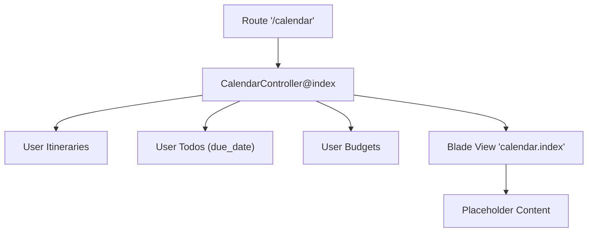
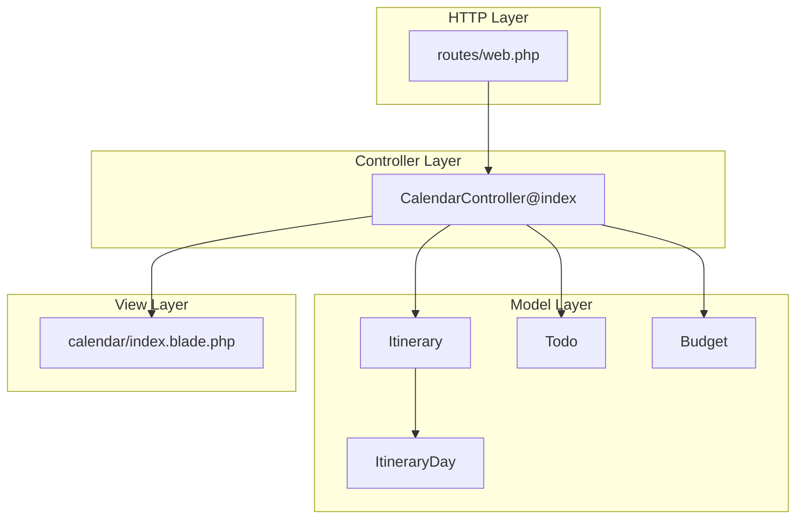
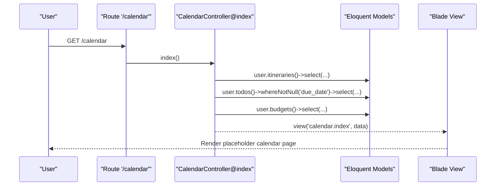
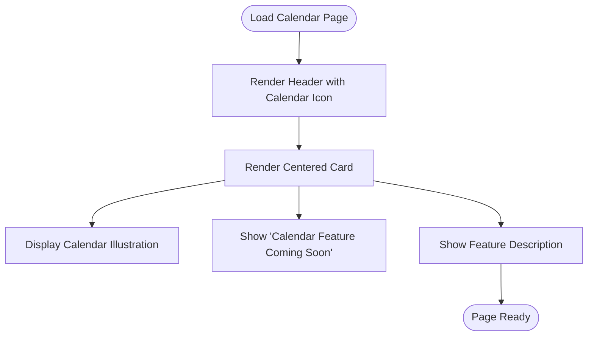
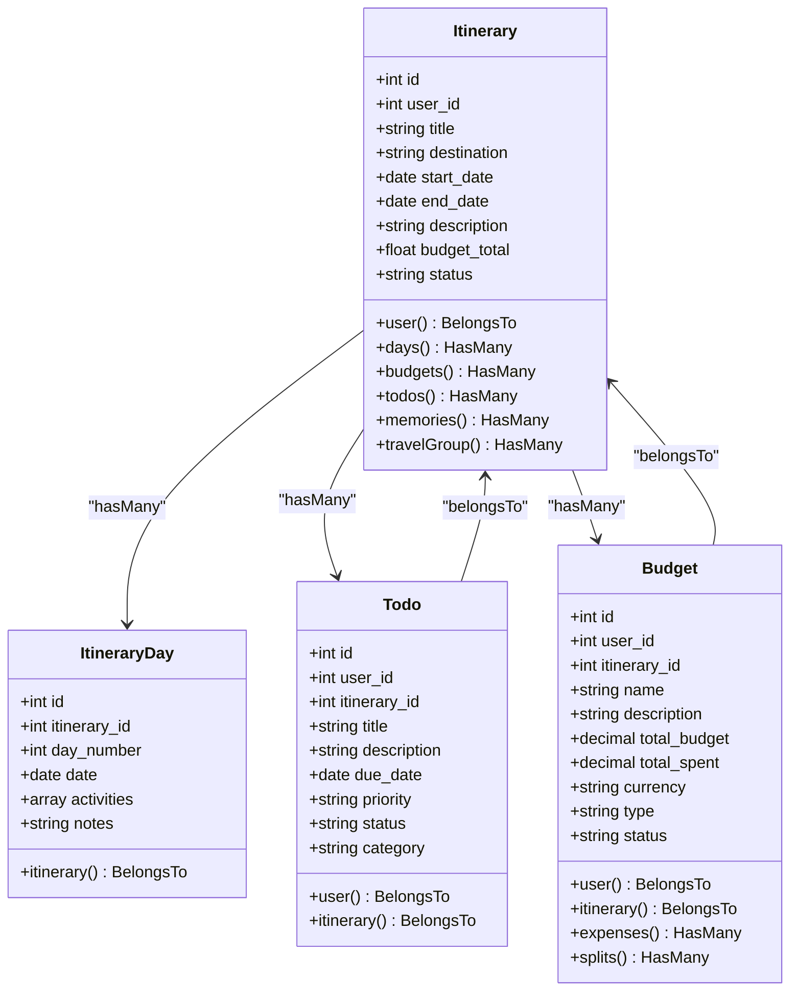
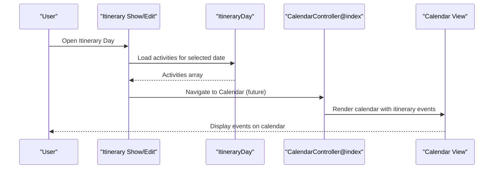
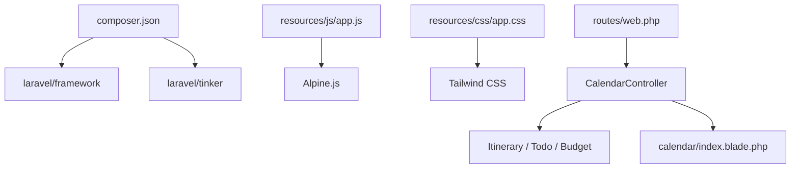

# Calendar Integration

<cite>
**Referenced Files in This Document**
- [CalendarController.php](file://app/Http/Controllers/CalendarController.php)
- [index.blade.php](file://resources/views/calendar/index.blade.php)
- [web.php](file://routes/web.php)
- [Itinerary.php](file://app/Models/Itinerary.php)
- [ItineraryDay.php](file://app/Models/ItineraryDay.php)
- [Todo.php](file://app/Models/Todo.php)
- [Budget.php](file://app/Models/Budget.php)
- [app.js](file://resources/js/app.js)
- [app.css](file://resources/css/app.css)
- [app.blade.php](file://resources/views/layouts/app.blade.php)
- [sidebar.blade.php](file://resources/views/layouts/sidebar.blade.php)
- [dashboard.blade.php](file://resources/views/dashboard.blade.php)
- [composer.json](file://composer.json)
</cite>

## Table of Contents
1. [Introduction](#introduction)
2. [Project Structure](#project-structure)
3. [Core Components](#core-components)
4. [Architecture Overview](#architecture-overview)
5. [Detailed Component Analysis](#detailed-component-analysis)
6. [Dependency Analysis](#dependency-analysis)
7. [Performance Considerations](#performance-considerations)
8. [Troubleshooting Guide](#troubleshooting-guide)
9. [Conclusion](#conclusion)
10. [Appendices](#appendices)

## Introduction
This document describes the calendar integration system for date-based planning and event synchronization. It covers the current calendar view functionality, event creation pathways from itineraries, and date-based activity organization. It also outlines the integration points for external calendar services, export/import capabilities, recurring event handling, and timezone management. The document includes code-level diagrams, sequence diagrams, and flowcharts to illustrate how calendar rendering, event data formatting, and user interactions are structured within the application.

## Project Structure
The calendar feature is currently a placeholder page that surfaces itineraries, todos, and budgets to the view. The backend controller fetches related data for the logged-in user and passes it to the calendar view. Routes define the calendar endpoint, while Blade templates render the UI. Frontend assets are configured via Vite and Tailwind.

**Diagram sources**
- [web.php:44-45](file://routes/web.php#L44-L45)
- [CalendarController.php:9-17](file://app/Http/Controllers/CalendarController.php#L9-L17)
- [index.blade.php:1-17](file://resources/views/calendar/index.blade.php#L1-L17)

**Section sources**
- [web.php:44-45](file://routes/web.php#L44-L45)
- [CalendarController.php:9-17](file://app/Http/Controllers/CalendarController.php#L9-L17)
- [index.blade.php:1-17](file://resources/views/calendar/index.blade.php#L1-L17)

## Core Components
- CalendarController: Returns the calendar view with itinerary, todo, and budget data for the authenticated user.
- Calendar View: Placeholder page indicating “Calendar Feature Coming Soon” while integrating with external calendar services.
- Models: Itinerary, ItineraryDay, Todo, and Budget provide the data backbone for calendar events and activities.
- Routing: Defines the calendar route and integrates with navigation components.

Key responsibilities:
- CalendarController@index: Fetches user’s itineraries, todos with due dates, and budgets and renders the calendar view.
- Calendar View: Displays a friendly message and prepares the UI for future calendar features.
- Models: Encapsulate date casting and relationships to support date-based planning and event synchronization.

**Section sources**
- [CalendarController.php:9-17](file://app/Http/Controllers/CalendarController.php#L9-L17)
- [index.blade.php:1-17](file://resources/views/calendar/index.blade.php#L1-L17)
- [Itinerary.php:22-26](file://app/Models/Itinerary.php#L22-L26)
- [ItineraryDay.php:18-21](file://app/Models/ItineraryDay.php#L18-L21)
- [Todo.php:21-23](file://app/Models/Todo.php#L21-L23)
- [Budget.php:23-26](file://app/Models/Budget.php#L23-L26)

## Architecture Overview
The calendar feature follows a layered MVC pattern:
- Route layer: Declares the calendar endpoint.
- Controller layer: Orchestrates data retrieval and view rendering.
- Model layer: Provides typed date fields and relationships for itineraries, days, todos, and budgets.
- View layer: Renders the calendar UI, currently a placeholder.

**Diagram sources**
- [web.php:44-45](file://routes/web.php#L44-L45)
- [CalendarController.php:9-17](file://app/Http/Controllers/CalendarController.php#L9-L17)
- [Itinerary.php:28-56](file://app/Models/Itinerary.php#L28-L56)
- [ItineraryDay.php:23-26](file://app/Models/ItineraryDay.php#L23-L26)
- [Todo.php:25-33](file://app/Models/Todo.php#L25-L33)
- [Budget.php:28-46](file://app/Models/Budget.php#L28-L46)
- [index.blade.php:1-17](file://resources/views/calendar/index.blade.php#L1-L17)

## Detailed Component Analysis

### CalendarController
Purpose:
- Retrieve the authenticated user’s itineraries, todos with due dates, and budgets.
- Pass the data to the calendar view for rendering.

Processing logic:
- Fetch itineraries with selected fields: id, title, start_date, end_date, destination.
- Fetch todos with due_date not null and selected fields: id, title, due_date, priority.
- Fetch budgets with selected fields: id, name, created_at.
- Render the calendar view with the collected data.

**Diagram sources**
- [web.php:44-45](file://routes/web.php#L44-L45)
- [CalendarController.php:9-17](file://app/Http/Controllers/CalendarController.php#L9-L17)

**Section sources**
- [CalendarController.php:9-17](file://app/Http/Controllers/CalendarController.php#L9-L17)

### Calendar View (Placeholder)
Purpose:
- Present a friendly message indicating calendar features are coming soon.
- Prepare the layout for future calendar rendering and integration.

UI elements:
- Header with calendar icon and title.
- Centered card with calendar illustration and explanatory text.

**Diagram sources**
- [index.blade.php:1-17](file://resources/views/calendar/index.blade.php#L1-L17)

**Section sources**
- [index.blade.php:1-17](file://resources/views/calendar/index.blade.php#L1-L17)

### Data Models and Relationships
The calendar system relies on models that encapsulate date casting and relationships to support date-based planning.

**Diagram sources**
- [Itinerary.php:11-56](file://app/Models/Itinerary.php#L11-L56)
- [ItineraryDay.php:10-26](file://app/Models/ItineraryDay.php#L10-L26)
- [Todo.php:10-33](file://app/Models/Todo.php#L10-L33)
- [Budget.php:11-46](file://app/Models/Budget.php#L11-L46)

**Section sources**
- [Itinerary.php:11-56](file://app/Models/Itinerary.php#L11-L56)
- [ItineraryDay.php:10-26](file://app/Models/ItineraryDay.php#L10-L26)
- [Todo.php:10-33](file://app/Models/Todo.php#L10-L33)
- [Budget.php:11-46](file://app/Models/Budget.php#L11-L46)

### Event Creation from Itineraries
The itinerary model supports daily activities organized per day. These can be leveraged to create calendar events representing planned activities.

**Diagram sources**
- [ItineraryDay.php:18-21](file://app/Models/ItineraryDay.php#L18-L21)
- [CalendarController.php:9-17](file://app/Http/Controllers/CalendarController.php#L9-L17)
- [index.blade.php:1-17](file://resources/views/calendar/index.blade.php#L1-17)

**Section sources**
- [ItineraryDay.php:18-21](file://app/Models/ItineraryDay.php#L18-L21)
- [CalendarController.php:9-17](file://app/Http/Controllers/CalendarController.php#L9-L17)

### Date-Based Activity Organization
The system uses Eloquent casts to treat dates as Carbon instances, enabling consistent formatting and comparisons.

- Itinerary: start_date and end_date are cast to date.
- ItineraryDay: date is cast to date.
- Todo: due_date is cast to date.
- Budget: totals are cast to decimal.

These casts simplify date handling across controllers, views, and potential calendar rendering logic.

**Section sources**
- [Itinerary.php:22-26](file://app/Models/Itinerary.php#L22-L26)
- [ItineraryDay.php:18-21](file://app/Models/ItineraryDay.php#L18-L21)
- [Todo.php:21-23](file://app/Models/Todo.php#L21-L23)
- [Budget.php:23-26](file://app/Models/Budget.php#L23-L26)

### Calendar Rendering and User Interaction
Current state:
- The calendar view is a placeholder page.
- Navigation links to the calendar are present in the sidebar and dashboard.

Future enhancements:
- Integrate a calendar library (e.g., FullCalendar) in the frontend.
- Render events from itineraries, todos, and budgets.
- Support user interactions such as clicking events, editing, and deleting.

Frontend stack:
- Alpine.js is initialized globally.
- Tailwind CSS is configured for styling.

**Section sources**
- [sidebar.blade.php:73](file://resources/views/layouts/sidebar.blade.php#L73)
- [dashboard.blade.php:94](file://resources/views/dashboard.blade.php#L94-L100)
- [app.js:1-8](file://resources/js/app.js#L1-L8)
- [app.css:1-4](file://resources/css/app.css#L1-L4)

## Dependency Analysis
External dependencies and integration points:
- Laravel Framework: Provides routing, controllers, Eloquent models, and Blade views.
- Frontend stack: Alpine.js and Tailwind CSS are configured for interactivity and styling.
- Calendar service integration: Not implemented in the current codebase; future work will require adding calendar SDKs or APIs.

**Diagram sources**
- [composer.json:8-12](file://composer.json#L8-L12)
- [app.js:1-8](file://resources/js/app.js#L1-L8)
- [app.css:1-4](file://resources/css/app.css#L1-L4)
- [web.php:44-45](file://routes/web.php#L44-L45)
- [CalendarController.php:9-17](file://app/Http/Controllers/CalendarController.php#L9-L17)
- [index.blade.php:1-17](file://resources/views/calendar/index.blade.php#L1-L17)

**Section sources**
- [composer.json:8-12](file://composer.json#L8-L12)
- [web.php:44-45](file://routes/web.php#L44-L45)
- [CalendarController.php:9-17](file://app/Http/Controllers/CalendarController.php#L9-L17)

## Performance Considerations
- Eager loading: The controller selects only necessary fields to minimize payload size.
- Date casting: Using Eloquent casts avoids repeated parsing/formatting overhead.
- Frontend initialization: Alpine.js is initialized globally; ensure only necessary components are reactive to avoid unnecessary re-renders.

Recommendations:
- Paginate or limit the number of itineraries, todos, and budgets returned to the calendar view for large datasets.
- Consider caching frequently accessed itinerary days or todos with due dates.

**Section sources**
- [CalendarController.php:12-14](file://app/Http/Controllers/CalendarController.php#L12-L14)

## Troubleshooting Guide
Common issues and resolutions:
- No events displayed: Ensure the calendar view is updated to render events from the passed data.
- Incorrect date formatting: Verify date casts in models and use consistent formatting in views.
- Navigation missing: Confirm the calendar route exists and navigation components link to the correct route.

Debugging tips:
- Inspect the data passed to the view by logging or dumping variables in the controller before rendering.
- Check the calendar view for any Blade directives that might prevent rendering.

**Section sources**
- [CalendarController.php:9-17](file://app/Http/Controllers/CalendarController.php#L9-L17)
- [index.blade.php:1-17](file://resources/views/calendar/index.blade.php#L1-L17)

## Conclusion
The calendar integration system currently provides a foundation for date-based planning by exposing itineraries, todos with due dates, and budgets to a calendar view. While the calendar UI is a placeholder, the underlying models and routing enable future development of calendar rendering, event synchronization, and export/import capabilities. Extending the controller and view to integrate with a calendar library and external services will deliver a robust calendar experience aligned with itinerary activities and user schedules.

## Appendices

### Calendar Export/Import and Recurring Events
Proposed implementation outline:
- Export: Serialize itinerary days, todos, and budgets into iCalendar format or JSON for download.
- Import: Parse uploaded iCalendar or JSON files and create corresponding models.
- Recurring: Use recurrence rules to generate multiple events; store original rule and exceptions.
- Timezone: Normalize all dates to UTC in storage and localize for display based on user preferences.

[No sources needed since this section provides general guidance]

### Scheduling Best Practices
- Conflict detection: Compare due dates and itinerary dates to prevent overlapping events.
- Priority-based rendering: Display high-priority todos and urgent itineraries prominently.
- Timezone awareness: Store dates with timezone metadata and adjust for user’s local timezone during rendering.

[No sources needed since this section provides general guidance]