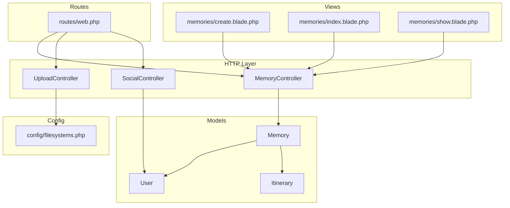
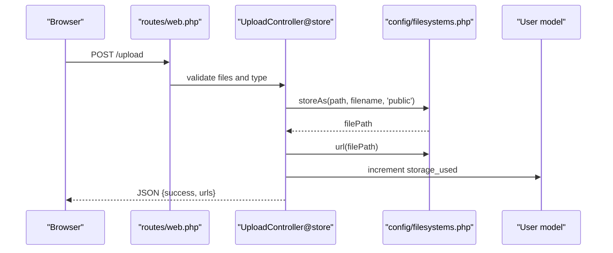
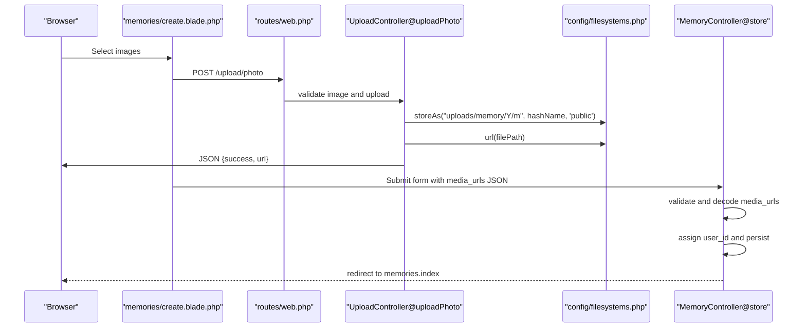
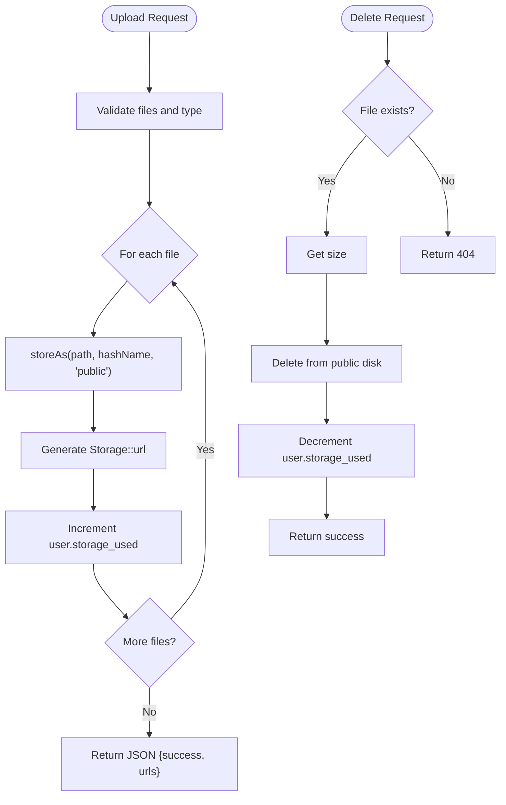
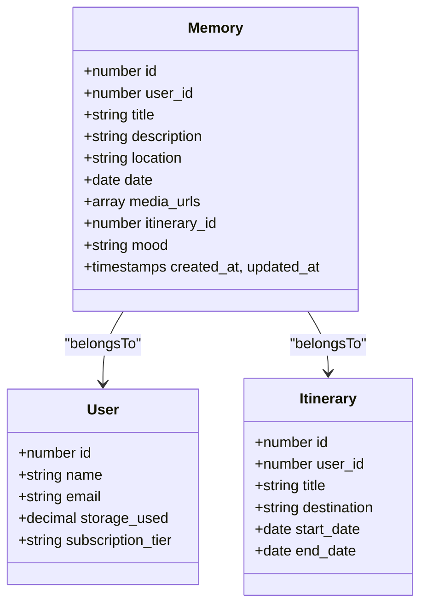
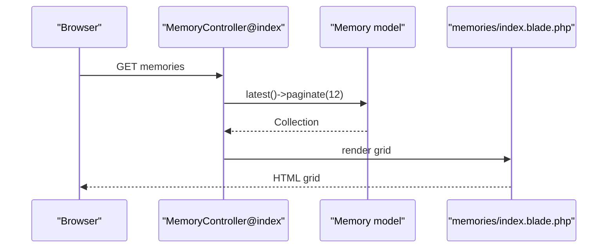
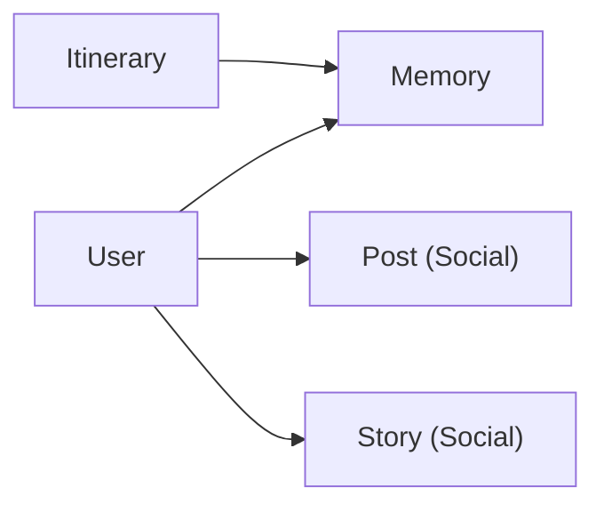
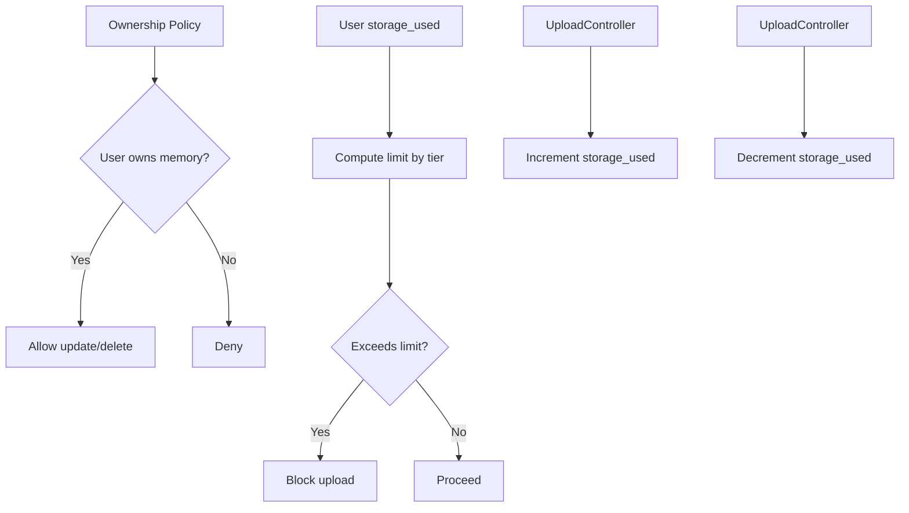
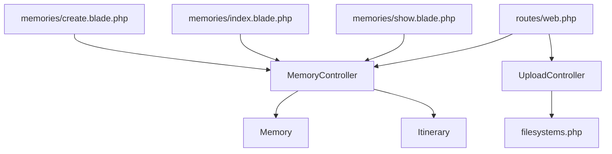

# Content Management

<cite>
**Referenced Files in This Document**
- [MemoryController.php](file://app/Http/Controllers/MemoryController.php)
- [UploadController.php](file://app/Http/Controllers/UploadController.php)
- [Memory.php](file://app/Models/Memory.php)
- [create.blade.php](file://resources/views/memories/create.blade.php)
- [index.blade.php](file://resources/views/memories/index.blade.php)
- [show.blade.php](file://resources/views/memories/show.blade.php)
- [User.php](file://app/Models/User.php)
- [Itinerary.php](file://app/Models/Itinerary.php)
- [MemoryPolicy.php](file://app/Policies/MemoryPolicy.php)
- [filesystems.php](file://config/filesystems.php)
- [web.php](file://routes/web.php)
- [2026_04_21_132811_create_memories_table.php](file://database/migrations/2026_04_21_132811_create_memories_table.php)
- [SocialController.php](file://app/Http/Controllers/SocialController.php)
</cite>

## Table of Contents
1. [Introduction](#introduction)
2. [Project Structure](#project-structure)
3. [Core Components](#core-components)
4. [Architecture Overview](#architecture-overview)
5. [Detailed Component Analysis](#detailed-component-analysis)
6. [Dependency Analysis](#dependency-analysis)
7. [Performance Considerations](#performance-considerations)
8. [Troubleshooting Guide](#troubleshooting-guide)
9. [Conclusion](#conclusion)
10. [Appendices](#appendices)

## Introduction
This document describes the content management system for memories and media sharing within the travel application. It focuses on how memories are created, organized, and displayed; how media is uploaded and stored; and how memories relate to itineraries, users, and social content. It also covers privacy controls, storage management, moderation considerations, and practical optimization strategies.

## Project Structure
The memory gallery feature spans controllers, models, Blade views, policies, routes, and configuration. The controllers orchestrate requests and responses, the models define persistence and relationships, the views render the UI, and the routes bind endpoints to controller actions. Storage is managed via Laravel’s filesystem configuration.

**Diagram sources**
- [MemoryController.php:1-99](file://app/Http/Controllers/MemoryController.php#L1-L99)
- [UploadController.php:1-118](file://app/Http/Controllers/UploadController.php#L1-L118)
- [SocialController.php:1-179](file://app/Http/Controllers/SocialController.php#L1-L179)
- [Memory.php:1-36](file://app/Models/Memory.php#L1-L36)
- [User.php:1-172](file://app/Models/User.php#L1-L172)
- [Itinerary.php:1-58](file://app/Models/Itinerary.php#L1-L58)
- [create.blade.php:1-405](file://resources/views/memories/create.blade.php#L1-L405)
- [index.blade.php:1-93](file://resources/views/memories/index.blade.php#L1-L93)
- [show.blade.php:1-209](file://resources/views/memories/show.blade.php#L1-L209)
- [web.php:1-89](file://routes/web.php#L1-L89)
- [filesystems.php:1-81](file://config/filesystems.php#L1-L81)

**Section sources**
- [web.php:54-68](file://routes/web.php#L54-L68)
- [MemoryController.php:9-99](file://app/Http/Controllers/MemoryController.php#L9-L99)
- [UploadController.php:8-118](file://app/Http/Controllers/UploadController.php#L8-L118)
- [Memory.php:8-36](file://app/Models/Memory.php#L8-L36)
- [filesystems.php:31-81](file://config/filesystems.php#L31-L81)

## Core Components
- MemoryController: Handles listing, creating, editing, updating, and deleting memories; validates inputs; manages relationships with users and itineraries.
- UploadController: Manages multi-file and single-image uploads, stores files to the public disk, updates user storage usage, and supports deletion.
- Memory model: Defines fillable attributes, JSON casting for media URLs, and belongs-to relationships to User and Itinerary.
- Views: Provide the UI for creating memories with immediate AJAX uploads, viewing grids, and detailed memory pages.
- Policies: Enforce ownership-based permissions for memory updates/deletes.
- Routes: Bind endpoints to controllers for memories and uploads.
- Storage configuration: Configures local public disk and optional S3 integration.

**Section sources**
- [MemoryController.php:23-87](file://app/Http/Controllers/MemoryController.php#L23-L87)
- [UploadController.php:13-116](file://app/Http/Controllers/UploadController.php#L13-L116)
- [Memory.php:10-34](file://app/Models/Memory.php#L10-L34)
- [MemoryPolicy.php:13-24](file://app/Policies/MemoryPolicy.php#L13-L24)
- [web.php:54-68](file://routes/web.php#L54-L68)
- [filesystems.php:41-61](file://config/filesystems.php#L41-L61)

## Architecture Overview
The memory gallery follows a layered MVC pattern:
- Controllers receive requests and delegate to models and views.
- Models encapsulate persistence and relationships.
- Views render UI and collect user input.
- Routes define endpoint contracts.
- Storage configuration determines where files are persisted.

**Diagram sources**
- [web.php:62-68](file://routes/web.php#L62-L68)
- [UploadController.php:13-41](file://app/Http/Controllers/UploadController.php#L13-L41)
- [filesystems.php:41-48](file://config/filesystems.php#L41-L48)
- [User.php:167-170](file://app/Models/User.php#L167-L170)

## Detailed Component Analysis

### Memory Creation and Album Organization
- The create view provides an Instagram-style form with fields for title, location, date, mood, description, optional itinerary linkage, and immediate photo uploads.
- Photos are uploaded via AJAX to the upload photo endpoint, returning URLs that populate a hidden media_urls field for batch submission.
- On submit, the store action validates inputs, decodes the JSON media_urls into an array, assigns the current user, and persists the memory.

**Diagram sources**
- [create.blade.php:255-391](file://resources/views/memories/create.blade.php#L255-L391)
- [web.php:66-68](file://routes/web.php#L66-L68)
- [UploadController.php:68-90](file://app/Http/Controllers/UploadController.php#L68-L90)
- [MemoryController.php:23-48](file://app/Http/Controllers/MemoryController.php#L23-L48)

**Section sources**
- [create.blade.php:37-251](file://resources/views/memories/create.blade.php#L37-L251)
- [UploadController.php:68-90](file://app/Http/Controllers/UploadController.php#L68-L90)
- [MemoryController.php:23-48](file://app/Http/Controllers/MemoryController.php#L23-L48)

### Photo and Video Management
- Multi-file upload supports images and videos with size limits and MIME validation.
- Single-image upload endpoint supports immediate preview and removal.
- Uploaded files are stored under year/month subpaths on the public disk, and URLs are generated for rendering.
- Deletion removes files from storage and decrements user storage usage.

**Diagram sources**
- [UploadController.php:15-41](file://app/Http/Controllers/UploadController.php#L15-L41)
- [UploadController.php:46-63](file://app/Http/Controllers/UploadController.php#L46-L63)
- [UploadController.php:70-90](file://app/Http/Controllers/UploadController.php#L70-L90)
- [UploadController.php:95-116](file://app/Http/Controllers/UploadController.php#L95-L116)
- [filesystems.php:41-48](file://config/filesystems.php#L41-L48)

**Section sources**
- [UploadController.php:13-116](file://app/Http/Controllers/UploadController.php#L13-L116)
- [filesystems.php:41-48](file://config/filesystems.php#L41-L48)

### Memory Model and Metadata
- The Memory model defines fillable fields including user_id, title, description, location, date, media_urls (JSON), itinerary_id, and mood.
- The date is cast to a date type, and media_urls is cast to an array for convenient handling.
- Relationships:
  - Belongs to User (owner)
  - Belongs to Itinerary (optional linkage)

**Diagram sources**
- [Memory.php:10-34](file://app/Models/Memory.php#L10-L34)
- [User.php:21-36](file://app/Models/User.php#L21-L36)
- [Itinerary.php:11-26](file://app/Models/Itinerary.php#L11-L26)

**Section sources**
- [Memory.php:10-24](file://app/Models/Memory.php#L10-L24)
- [2026_04_21_132811_create_memories_table.php:14-27](file://database/migrations/2026_04_21_132811_create_memories_table.php#L14-L27)

### Album Organization and Display
- The index view renders a grid of memories with the first media thumbnail, location, and date, plus a mood indicator when present.
- The show view displays all media URLs in a responsive grid, along with user info, story, location, and linked itinerary.
- The create view supports immediate photo uploads with progress and removal, and populates the hidden media_urls array for submission.

**Diagram sources**
- [MemoryController.php:11-15](file://app/Http/Controllers/MemoryController.php#L11-L15)
- [index.blade.php:33-72](file://resources/views/memories/index.blade.php#L33-L72)

**Section sources**
- [index.blade.php:30-72](file://resources/views/memories/index.blade.php#L30-L72)
- [show.blade.php:74-93](file://resources/views/memories/show.blade.php#L74-L93)
- [create.blade.php:235-237](file://resources/views/memories/create.blade.php#L235-L237)

### Relationship Between Memories, Itineraries, Users, and Social Content
- Ownership: Memories belong to a user; only the owner can update/delete per policy.
- Itinerary linkage: Optional foreign key ties memories to trips/days.
- Social context: Posts and stories are separate entities with their own controllers and models; memories can be referenced via shared URLs or embedded content in social posts.

**Diagram sources**
- [MemoryPolicy.php:13-24](file://app/Policies/MemoryPolicy.php#L13-L24)
- [Memory.php:26-34](file://app/Models/Memory.php#L26-L34)
- [SocialController.php:16-29](file://app/Http/Controllers/SocialController.php#L16-L29)

**Section sources**
- [MemoryPolicy.php:13-24](file://app/Policies/MemoryPolicy.php#L13-L24)
- [Memory.php:26-34](file://app/Models/Memory.php#L26-L34)
- [SocialController.php:16-29](file://app/Http/Controllers/SocialController.php#L16-L29)

### Privacy Controls and Storage Management
- Privacy: Ownership-based policy restricts memory edits/deletes to the owner.
- Storage: The User model tracks storage_used and computes limits based on subscription tier; UploadController increments/decrements storage_used upon upload/delete operations; the public disk serves files via /storage URLs.

**Diagram sources**
- [MemoryPolicy.php:13-24](file://app/Policies/MemoryPolicy.php#L13-L24)
- [User.php:158-170](file://app/Models/User.php#L158-L170)
- [UploadController.php:32-40](file://app/Http/Controllers/UploadController.php#L32-L40)
- [UploadController.php:48-63](file://app/Http/Controllers/UploadController.php#L48-L63)

**Section sources**
- [MemoryPolicy.php:13-24](file://app/Policies/MemoryPolicy.php#L13-L24)
- [User.php:158-170](file://app/Models/User.php#L158-L170)
- [UploadController.php:32-63](file://app/Http/Controllers/UploadController.php#L32-L63)

### Content Moderation and Spam Prevention
- Ownership enforcement prevents unauthorized modifications.
- Input validation ensures required fields and safe types for media URLs.
- Consider adding:
  - Rate limiting for uploads
  - Media scanning for malicious content
  - Content moderation queues for flagged posts
  - User reporting and admin dashboards

[No sources needed since this section provides general guidance]

## Dependency Analysis
- Controllers depend on models and the filesystem configuration.
- Views depend on controller-provided data and route helpers.
- Routes bind endpoints to controller actions.
- Policies enforce authorization rules.

**Diagram sources**
- [MemoryController.php:5-7](file://app/Http/Controllers/MemoryController.php#L5-L7)
- [UploadController.php:6](file://app/Http/Controllers/UploadController.php#L6)
- [filesystems.php:41-48](file://config/filesystems.php#L41-L48)
- [web.php:54-68](file://routes/web.php#L54-L68)

**Section sources**
- [MemoryController.php:5-7](file://app/Http/Controllers/MemoryController.php#L5-L7)
- [UploadController.php:6](file://app/Http/Controllers/UploadController.php#L6)
- [web.php:54-68](file://routes/web.php#L54-L68)

## Performance Considerations
- Optimize image sizes and formats before upload to reduce bandwidth and storage costs.
- Use lazy loading and responsive image attributes in views.
- Paginate memory lists and limit grid sizes to reduce DOM and layout costs.
- Offload heavy processing to queued jobs if needed.
- Consider CDN integration for public disk URLs.

[No sources needed since this section provides general guidance]

## Troubleshooting Guide
- Upload fails or returns 404 on delete:
  - Verify the file path normalization and that the public disk is configured correctly.
  - Confirm the URL passed to delete endpoints corresponds to the stored path.
- Storage usage not updating:
  - Ensure increment/decrement logic runs after successful store/delete operations.
- Ownership errors:
  - Confirm the authenticated user matches the memory’s user_id.

**Section sources**
- [UploadController.php:48-63](file://app/Http/Controllers/UploadController.php#L48-L63)
- [UploadController.php:101-116](file://app/Http/Controllers/UploadController.php#L101-L116)
- [MemoryPolicy.php:13-24](file://app/Policies/MemoryPolicy.php#L13-L24)

## Conclusion
The memory gallery integrates immediate photo uploads, album-style organization, and optional itinerary linkage. With ownership-based policies and storage accounting, it provides a solid foundation for personal travel content. Extending with moderation, rate limiting, and CDN-backed delivery will further improve reliability and scalability.

## Appendices

### Common Content Management Scenarios
- Create a memory with multiple photos:
  - Use the create view to select images; AJAX uploads return URLs that are submitted with the form.
  - See [create.blade.php:255-391](file://resources/views/memories/create.blade.php#L255-L391) and [UploadController.php:68-90](file://app/Http/Controllers/UploadController.php#L68-L90).
- Link a memory to a trip:
  - Choose an itinerary from the dropdown during creation; the selected itinerary_id is persisted with the memory.
  - See [create.blade.php:147-162](file://resources/views/memories/create.blade.php#L147-L162) and [MemoryController.php:23-48](file://app/Http/Controllers/MemoryController.php#L23-L48).
- Manage storage limits:
  - Monitor storage_used against subscription tiers; block uploads when exceeding limits.
  - See [User.php:158-170](file://app/Models/User.php#L158-L170) and [UploadController.php:32-40](file://app/Http/Controllers/UploadController.php#L32-L40).

### Media Optimization Best Practices
- Prefer modern formats (WebP, AVIF) when supported by clients.
- Apply client-side compression and appropriate resolutions.
- Serve responsive images and lazy-load thumbnails.
- Use CDN distribution for public assets.

[No sources needed since this section provides general guidance]