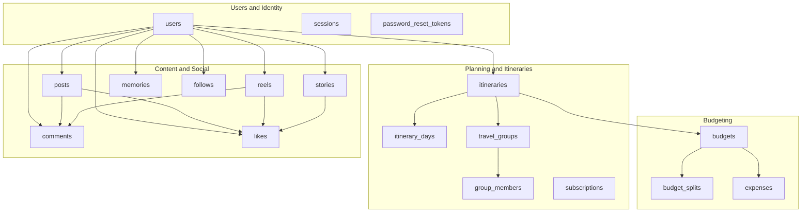
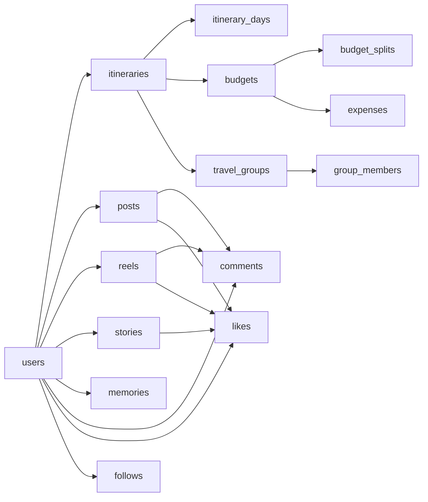

# Database Design

<cite>
**Referenced Files in This Document**
- [0001_01_01_000000_create_users_table.php](file://database/migrations/0001_01_01_000000_create_users_table.php)
- [2026_04_21_132801_create_itineraries_table.php](file://database/migrations/2026_04_21_132801_create_itineraries_table.php)
- [2026_04_21_132809_create_budgets_table.php](file://database/migrations/2026_04_21_132809_create_budgets_table.php)
- [2026_04_21_132809_create_itinerary_days_table.php](file://database/migrations/2026_04_21_132809_create_itinerary_days_table.php)
- [2026_04_21_132810_create_budget_splits_table.php](file://database/migrations/2026_04_21_132810_create_budget_splits_table.php)
- [2026_04_21_132810_create_posts_table.php](file://database/migrations/2026_04_21_132810_create_posts_table.php)
- [2026_04_21_132810_create_todos_table.php](file://database/migrations/2026_04_21_132810_create_todos_table.php)
- [2026_04_21_132811_create_expenses_table.php](file://database/migrations/2026_04_21_132811_create_expenses_table.php)
- [2026_04_21_132811_create_memories_table.php](file://database/migrations/2026_04_21_132811_create_memories_table.php)
- [2026_04_21_132811_create_reels_table.php](file://database/migrations/2026_04_21_132811_create_reels_table.php)
- [2026_04_21_132811_create_stories_table.php](file://database/migrations/2026_04_21_132811_create_stories_table.php)
- [2026_04_21_132812_create_subscriptions_table.php](file://database/migrations/2026_04_21_132812_create_subscriptions_table.php)
- [2026_04_21_132812_create_travel_groups_table.php](file://database/migrations/2026_04_21_132812_create_travel_groups_table.php)
- [2026_04_21_132813_create_group_members_table.php](file://database/migrations/2026_04_21_132813_create_group_members_table.php)
- [2026_04_21_132820_create_comments_table.php](file://database/migrations/2026_04_21_132820_create_comments_table.php)
- [2026_04_21_132821_create_likes_table.php](file://database/migrations/2026_04_21_132821_create_likes_table.php)
- [2026_04_21_140000_create_follows_table.php](file://database/migrations/2026_04_21_140000_create_follows_table.php)
- [2026_04_21_140001_add_preferences_to_users_table.php](file://database/migrations/2026_04_21_140001_add_preferences_to_users_table.php)
</cite>

## Table of Contents
1. [Introduction](#introduction)
2. [Project Structure](#project-structure)
3. [Core Components](#core-components)
4. [Architecture Overview](#architecture-overview)
5. [Detailed Component Analysis](#detailed-component-analysis)
6. [Dependency Analysis](#dependency-analysis)
7. [Performance Considerations](#performance-considerations)
8. [Troubleshooting Guide](#troubleshooting-guide)
9. [Conclusion](#conclusion)

## Introduction
This document describes the database design for the Travel Project. It focuses on the core entities and their relationships, including Users, Itineraries, Budgets, Posts, Stories, Reels, Memories, Comments, Likes, and Follows. For each entity, we define table schemas, fields, data types, primary and foreign keys, indexes, and constraints. We also explain relationships (cardinalities), data validation rules, referential integrity, and provide practical query patterns and performance considerations.

## Project Structure
The database schema is defined via Laravel migrations under database/migrations. Each migration creates a single table and defines indexes and constraints. The majority of entities are represented by dedicated tables with foreign key relationships to enforce referential integrity.



**Diagram sources**
- [0001_01_01_000000_create_users_table.php:14-44](file://database/migrations/0001_01_01_000000_create_users_table.php#L14-L44)
- [2026_04_21_132801_create_itineraries_table.php:14-28](file://database/migrations/2026_04_21_132801_create_itineraries_table.php#L14-L28)
- [2026_04_21_132809_create_itinerary_days_table.php:14-25](file://database/migrations/2026_04_21_132809_create_itinerary_days_table.php#L14-L25)
- [2026_04_21_132812_create_travel_groups_table.php:14-22](file://database/migrations/2026_04_21_132812_create_travel_groups_table.php#L14-L22)
- [2026_04_21_132813_create_group_members_table.php:14-22](file://database/migrations/2026_04_21_132813_create_group_members_table.php#L14-L22)
- [2026_04_21_132812_create_subscriptions_table.php:14-26](file://database/migrations/2026_04_21_132812_create_subscriptions_table.php#L14-L26)
- [2026_04_21_132809_create_budgets_table.php:14-29](file://database/migrations/2026_04_21_132809_create_budgets_table.php#L14-L29)
- [2026_04_21_132810_create_budget_splits_table.php:14-26](file://database/migrations/2026_04_21_132810_create_budget_splits_table.php#L14-L26)
- [2026_04_21_132811_create_expenses_table.php:14-27](file://database/migrations/2026_04_21_132811_create_expenses_table.php#L14-L27)
- [2026_04_21_132810_create_posts_table.php:14-28](file://database/migrations/2026_04_21_132810_create_posts_table.php#L14-L28)
- [2026_04_21_132811_create_reels_table.php:14-28](file://database/migrations/2026_04_21_132811_create_reels_table.php#L14-L28)
- [2026_04_21_132811_create_stories_table.php:14-25](file://database/migrations/2026_04_21_132811_create_stories_table.php#L14-L25)
- [2026_04_21_132811_create_memories_table.php:14-27](file://database/migrations/2026_04_21_132811_create_memories_table.php#L14-L27)
- [2026_04_21_132820_create_comments_table.php:14-26](file://database/migrations/2026_04_21_132820_create_comments_table.php#L14-L26)
- [2026_04_21_132821_create_likes_table.php:14-25](file://database/migrations/2026_04_21_132821_create_likes_table.php#L14-L25)
- [2026_04_21_140000_create_follows_table.php:14-21](file://database/migrations/2026_04_21_140000_create_follows_table.php#L14-L21)

**Section sources**
- [0001_01_01_000000_create_users_table.php:12-56](file://database/migrations/0001_01_01_000000_create_users_table.php#L12-L56)
- [2026_04_21_132801_create_itineraries_table.php:12-38](file://database/migrations/2026_04_21_132801_create_itineraries_table.php#L12-L38)
- [2026_04_21_132809_create_budgets_table.php:12-39](file://database/migrations/2026_04_21_132809_create_budgets_table.php#L12-L39)
- [2026_04_21_132810_create_posts_table.php:12-38](file://database/migrations/2026_04_21_132810_create_posts_table.php#L12-L38)
- [2026_04_21_132811_create_memories_table.php:12-37](file://database/migrations/2026_04_21_132811_create_memories_table.php#L12-L37)
- [2026_04_21_132811_create_reels_table.php:12-38](file://database/migrations/2026_04_21_132811_create_reels_table.php#L12-L38)
- [2026_04_21_132811_create_stories_table.php:12-35](file://database/migrations/2026_04_21_132811_create_stories_table.php#L12-L35)
- [2026_04_21_132820_create_comments_table.php:12-36](file://database/migrations/2026_04_21_132820_create_comments_table.php#L12-L36)
- [2026_04_21_132821_create_likes_table.php:12-35](file://database/migrations/2026_04_21_132821_create_likes_table.php#L12-L35)
- [2026_04_21_140000_create_follows_table.php:12-31](file://database/migrations/2026_04_21_140000_create_follows_table.php#L12-L31)

## Core Components
This section documents the core entities and their schemas, including primary keys, foreign keys, indexes, constraints, and data validation rules.

- Users
  - Purpose: Core identity and preferences.
  - Fields: id, name, username (unique), email (unique), email_verified_at, password, avatar, bio, subscription_tier, subscription_status, subscription_expires, storage_used, remember_token, notification_email, notification_push, profile_privacy, default_post_privacy, timestamps.
  - Constraints: Unique usernames and emails; enums restrict subscription tiers/statuses and privacy defaults.
  - Indexes: None on users except for unique constraints on username and email.
  - Notes: Additional columns added via a later migration for preferences.

- Itineraries
  - Purpose: Trip plans owned by a user.
  - Fields: id, user_id (FK), title, destination, start_date, end_date, description, budget_total, status, timestamps.
  - Constraints: Status enum; cascade delete on user deletion; indexes on (user_id, status) and (start_date, end_date).
  - Cardinality: One-to-many with Users; one-to-one with Budgets via itinerary_id.

- Itinerary Days
  - Purpose: Daily breakdown of an itinerary.
  - Fields: id, itinerary_id (FK), day_number, date, activities (JSON), notes, timestamps.
  - Constraints: Unique composite (itinerary_id, day_number); cascade delete on itinerary deletion.
  - Indexes: Index on itinerary_id; unique constraint on (itinerary_id, day_number).

- Budgets
  - Purpose: Financial planning per user or group.
  - Fields: id, user_id (FK), itinerary_id (FK nullable), name, description, total_budget, total_spent, currency, type, status, timestamps.
  - Constraints: Enums for type and status; currency length 3; indexes on (user_id, status) and (user_id, type); set null on itinerary deletion.
  - Cardinality: One-to-one with Itineraries; one-to-many with BudgetSplits and Expenses.

- Budget Splits
  - Purpose: Share allocations among users for a budget.
  - Fields: id, budget_id (FK), user_id (FK), share_percentage, share_amount, paid_amount, status, timestamps.
  - Constraints: Enum for status; indexes on budget_id and user_id.

- Expenses
  - Purpose: Line items for budgets.
  - Fields: id, budget_id (FK), title, description, amount, category, expense_date, receipt, timestamps.
  - Constraints: Amount precision; indexes on (budget_id, category) and expense_date.

- Posts
  - Purpose: Public/friends/private posts with media and tagging.
  - Fields: id, user_id (FK), content, media_urls (JSON), location, tags (JSON), privacy, likes_count, comments_count, timestamps.
  - Constraints: Privacy enum; indexes on (user_id, created_at) and privacy.

- Reels
  - Purpose: Short-form video content.
  - Fields: id, user_id (FK), video_url, thumbnail_url, caption, tags (JSON), likes_count, comments_count, views_count, duration, timestamps.
  - Constraints: indexes on (user_id, created_at).

- Stories
  - Purpose: Temporary media with expiration.
  - Fields: id, user_id (FK), media_url, media_type, caption, expires_at, views (JSON), timestamps.
  - Constraints: indexes on (user_id, expires_at).

- Memories
  - Purpose: Personal reflections linked to trips.
  - Fields: id, user_id (FK), title, description, location, date, media_urls (JSON), itinerary_id (FK nullable), mood, timestamps.
  - Constraints: indexes on (user_id, date).

- Todos
  - Purpose: Task tracking linked to itineraries.
  - Fields: id, user_id (FK), itinerary_id (FK nullable), title, description, due_date, priority, status, category, timestamps.
  - Constraints: Enums for priority and status; indexes on (user_id, status) and (due_date, priority).

- Comments
  - Purpose: Nested comments on posts and reels.
  - Fields: id, user_id (FK), post_id (FK nullable), reel_id (FK nullable), content, parent_id (FK to comments).
  - Constraints: Unique parent_id per post/reel; cascade deletes; indexes on post_id, reel_id, parent_id.

- Likes
  - Purpose: One user’s like per post/reel/story.
  - Fields: id, user_id (FK), post_id (FK nullable), reel_id (FK nullable), story_id (FK nullable).
  - Constraints: Unique combinations per resource type; cascade deletes.

- Follows
  - Purpose: User-to-user following relationship.
  - Fields: id, follower_id (FK to users), following_id (FK to users), timestamps.
  - Constraints: Unique (follower_id, following_id); cascade deletes; indexes on (follower_id, following_id).

**Section sources**
- [0001_01_01_000000_create_users_table.php:14-44](file://database/migrations/0001_01_01_000000_create_users_table.php#L14-L44)
- [2026_04_21_132801_create_itineraries_table.php:14-28](file://database/migrations/2026_04_21_132801_create_itineraries_table.php#L14-L28)
- [2026_04_21_132809_create_itinerary_days_table.php:14-25](file://database/migrations/2026_04_21_132809_create_itinerary_days_table.php#L14-L25)
- [2026_04_21_132809_create_budgets_table.php:14-29](file://database/migrations/2026_04_21_132809_create_budgets_table.php#L14-L29)
- [2026_04_21_132810_create_budget_splits_table.php:14-26](file://database/migrations/2026_04_21_132810_create_budget_splits_table.php#L14-L26)
- [2026_04_21_132811_create_expenses_table.php:14-27](file://database/migrations/2026_04_21_132811_create_expenses_table.php#L14-L27)
- [2026_04_21_132810_create_posts_table.php:14-28](file://database/migrations/2026_04_21_132810_create_posts_table.php#L14-L28)
- [2026_04_21_132811_create_reels_table.php:14-28](file://database/migrations/2026_04_21_132811_create_reels_table.php#L14-L28)
- [2026_04_21_132811_create_stories_table.php:14-25](file://database/migrations/2026_04_21_132811_create_stories_table.php#L14-L25)
- [2026_04_21_132811_create_memories_table.php:14-27](file://database/migrations/2026_04_21_132811_create_memories_table.php#L14-L27)
- [2026_04_21_132810_create_todos_table.php:14-28](file://database/migrations/2026_04_21_132810_create_todos_table.php#L14-L28)
- [2026_04_21_132820_create_comments_table.php:14-26](file://database/migrations/2026_04_21_132820_create_comments_table.php#L14-L26)
- [2026_04_21_132821_create_likes_table.php:14-25](file://database/migrations/2026_04_21_132821_create_likes_table.php#L14-L25)
- [2026_04_21_140000_create_follows_table.php:14-21](file://database/migrations/2026_04_21_140000_create_follows_table.php#L14-L21)
- [2026_04_21_140001_add_preferences_to_users_table.php:14-19](file://database/migrations/2026_04_21_140001_add_preferences_to_users_table.php#L14-L19)

## Architecture Overview
The schema centers around Users and their Itineraries. Budgets and Expenses support financial planning, while Posts, Reels, Stories, and Memories capture content. Comments and Likes enable social interactions, and Follows manage relationships.

```mermaid
erDiagram
USERS {
bigint id PK
string name
string username UK
string email UK
timestamp email_verified_at
string password
string avatar
text bio
string subscription_tier
string subscription_status
date subscription_expires
decimal storage_used
boolean notification_email
boolean notification_push
string profile_privacy
string default_post_privacy
timestamps
}
ITINERARIES {
bigint id PK
bigint user_id FK
string title
string destination
date start_date
date end_date
text description
decimal budget_total
string status
timestamps
}
ITINERARY_DAYS {
bigint id PK
bigint itinerary_id FK
int day_number
date date
json activities
text notes
timestamps
}
BUDGETS {
bigint id PK
bigint user_id FK
bigint itinerary_id FK
string name
text description
decimal total_budget
decimal total_spent
string currency
string type
string status
timestamps
}
BUDGET_SPLITS {
bigint id PK
bigint budget_id FK
bigint user_id FK
decimal share_percentage
decimal share_amount
decimal paid_amount
string status
timestamps
}
EXPENSES {
bigint id PK
bigint budget_id FK
string title
text description
decimal amount
string category
date expense_date
string receipt
timestamps
}
POSTS {
bigint id PK
bigint user_id FK
text content
json media_urls
string location
json tags
string privacy
int likes_count
int comments_count
timestamps
}
REELS {
bigint id PK
bigint user_id FK
string video_url
string thumbnail_url
text caption
json tags
int likes_count
int comments_count
int views_count
int duration
timestamps
}
STORIES {
bigint id PK
bigint user_id FK
string media_url
string media_type
text caption
timestamp expires_at
json views
timestamps
}
MEMORIES {
bigint id PK
bigint user_id FK
string title
text description
string location
date date
json media_urls
bigint itinerary_id FK
string mood
timestamps
}
TODOS {
bigint id PK
bigint user_id FK
bigint itinerary_id FK
string title
text description
date due_date
string priority
string status
string category
timestamps
}
COMMENTS {
bigint id PK
bigint user_id FK
bigint post_id FK
bigint reel_id FK
text content
bigint parent_id FK
timestamps
}
LIKES {
bigint id PK
bigint user_id FK
bigint post_id FK
bigint reel_id FK
bigint story_id FK
}
FOLLOWS {
bigint id PK
bigint follower_id FK
bigint following_id FK
}
TRAVEL_GROUPS {
bigint id PK
bigint itinerary_id FK
bigint created_by FK
string group_name
timestamps
}
GROUP_MEMBERS {
bigint id PK
bigint group_id FK
bigint user_id FK
string role
timestamps
}
USERS ||--o{ ITINERARIES : "owns"
ITINERARIES ||--o{ ITINERARY_DAYS : "has"
ITINERARIES ||--|| BUDGETS : "plans"
BUDGETS ||--o{ BUDGET_SPLITS : "split among"
BUDGETS ||--o{ EXPENSES : "contains"
USERS ||--o{ POSTS : "writes"
USERS ||--o{ REELS : "uploads"
USERS ||--o{ STORIES : "shares"
USERS ||--o{ MEMORIES : "creates"
USERS ||--o{ COMMENTS : "writes"
USERS ||--o{ LIKES : "gives"
USERS ||--o{ FOLLOWS : "follows"
POSTS ||--o{ COMMENTS : "commented on"
REELS ||--o{ COMMENTS : "commented on"
POSTS ||--o{ LIKES : "liked"
REELS ||--o{ LIKES : "liked"
STORIES ||--o{ LIKES : "liked"
TRAVEL_GROUPS ||--o{ GROUP_MEMBERS : "includes"
ITINERARIES ||--|| TRAVEL_GROUPS : "forms"
```

**Diagram sources**
- [0001_01_01_000000_create_users_table.php:14-44](file://database/migrations/0001_01_01_000000_create_users_table.php#L14-L44)
- [2026_04_21_132801_create_itineraries_table.php:14-28](file://database/migrations/2026_04_21_132801_create_itineraries_table.php#L14-L28)
- [2026_04_21_132809_create_itinerary_days_table.php:14-25](file://database/migrations/2026_04_21_132809_create_itinerary_days_table.php#L14-L25)
- [2026_04_21_132809_create_budgets_table.php:14-29](file://database/migrations/2026_04_21_132809_create_budgets_table.php#L14-L29)
- [2026_04_21_132810_create_budget_splits_table.php:14-26](file://database/migrations/2026_04_21_132810_create_budget_splits_table.php#L14-L26)
- [2026_04_21_132811_create_expenses_table.php:14-27](file://database/migrations/2026_04_21_132811_create_expenses_table.php#L14-L27)
- [2026_04_21_132810_create_posts_table.php:14-28](file://database/migrations/2026_04_21_132810_create_posts_table.php#L14-L28)
- [2026_04_21_132811_create_reels_table.php:14-28](file://database/migrations/2026_04_21_132811_create_reels_table.php#L14-L28)
- [2026_04_21_132811_create_stories_table.php:14-25](file://database/migrations/2026_04_21_132811_create_stories_table.php#L14-L25)
- [2026_04_21_132811_create_memories_table.php:14-27](file://database/migrations/2026_04_21_132811_create_memories_table.php#L14-L27)
- [2026_04_21_132810_create_todos_table.php:14-28](file://database/migrations/2026_04_21_132810_create_todos_table.php#L14-L28)
- [2026_04_21_132820_create_comments_table.php:14-26](file://database/migrations/2026_04_21_132820_create_comments_table.php#L14-L26)
- [2026_04_21_132821_create_likes_table.php:14-25](file://database/migrations/2026_04_21_132821_create_likes_table.php#L14-L25)
- [2026_04_21_140000_create_follows_table.php:14-21](file://database/migrations/2026_04_21_140000_create_follows_table.php#L14-L21)
- [2026_04_21_132812_create_travel_groups_table.php:14-22](file://database/migrations/2026_04_21_132812_create_travel_groups_table.php#L14-L22)
- [2026_04_21_132813_create_group_members_table.php:14-22](file://database/migrations/2026_04_21_132813_create_group_members_table.php#L14-L22)

## Detailed Component Analysis

### Relationship Cardinalities and Referential Integrity
- User–Itinerary: One-to-many; deleting a user cascades itinerary deletion.
- Itinerary–Itinerary Day: One-to-many; days are unique per itinerary by day number.
- Itinerary–Budget: One-to-one via itinerary_id; budget can be unlinked (nullable).
- Budget–Budget Split: One-to-many; multiple users can split a budget.
- Budget–Expense: One-to-many; expenses belong to a budget.
- User–Post: One-to-many; posts are owned by a user; privacy controls visibility.
- User–Reel: One-to-many; reels are owned by a user.
- User–Story: One-to-many; stories are owned by a user; expire after a time window.
- User–Memory: One-to-many; memories optionally link to an itinerary.
- User–Comment: One-to-many; comments are owned by a user; nested via parent_id.
- Post–Comment: One-to-many; comments belong to a post.
- Reel–Comment: One-to-many; comments belong to a reel.
- User–Like: One-to-many; likes owned by a user.
- Post–Like: One-to-many; likes on a post.
- Reel–Like: One-to-many; likes on a reel.
- Story–Like: One-to-many; likes on a story.
- User–Follow: Many-to-many; unique follower-following pairs; cascade deletes.
- Travel Group–Group Member: Many-to-one to groups; unique membership pair.

**Section sources**
- [2026_04_21_132801_create_itineraries_table.php:16-24](file://database/migrations/2026_04_21_132801_create_itineraries_table.php#L16-L24)
- [2026_04_21_132809_create_itinerary_days_table.php:16-24](file://database/migrations/2026_04_21_132809_create_itinerary_days_table.php#L16-L24)
- [2026_04_21_132809_create_budgets_table.php:16-17](file://database/migrations/2026_04_21_132809_create_budgets_table.php#L16-L17)
- [2026_04_21_132810_create_budget_splits_table.php:16-17](file://database/migrations/2026_04_21_132810_create_budget_splits_table.php#L16-L17)
- [2026_04_21_132811_create_expenses_table.php:16](file://database/migrations/2026_04_21_132811_create_expenses_table.php#L16)
- [2026_04_21_132810_create_posts_table.php:16](file://database/migrations/2026_04_21_132810_create_posts_table.php#L16)
- [2026_04_21_132811_create_reels_table.php:16](file://database/migrations/2026_04_21_132811_create_reels_table.php#L16)
- [2026_04_21_132811_create_stories_table.php:16](file://database/migrations/2026_04_21_132811_create_stories_table.php#L16)
- [2026_04_21_132811_create_memories_table.php:16, 22:16-22](file://database/migrations/2026_04_21_132811_create_memories_table.php#L16-L22)
- [2026_04_21_132820_create_comments_table.php:16-20](file://database/migrations/2026_04_21_132820_create_comments_table.php#L16-L20)
- [2026_04_21_132821_create_likes_table.php:16-19](file://database/migrations/2026_04_21_132821_create_likes_table.php#L16-L19)
- [2026_04_21_140000_create_follows_table.php:16-17](file://database/migrations/2026_04_21_140000_create_follows_table.php#L16-L17)
- [2026_04_21_132812_create_travel_groups_table.php:16-17](file://database/migrations/2026_04_21_132812_create_travel_groups_table.php#L16-L17)
- [2026_04_21_132813_create_group_members_table.php:16-17](file://database/migrations/2026_04_21_132813_create_group_members_table.php#L16-L17)

### Data Validation Rules and Business Constraints
- Enumerations: status, type, tier, priority, role, media_type, subscription_status.
- Numeric precision: decimals for monetary values with scale/precision tailored to budgets/expenses.
- Length constraints: currency code length 3; JSON fields for tags/media metadata.
- Uniqueness: usernames and emails; unique follower-following pairs; unique (itinerary_id, day_number); unique budget split entries per user/budget.
- Cascade and set null: cascading deletes for user-related records; set null for itinerary linkage on budget deletion.

**Section sources**
- [2026_04_21_132809_create_budgets_table.php:20-24](file://database/migrations/2026_04_21_132809_create_budgets_table.php#L20-L24)
- [2026_04_21_132810_create_posts_table.php:21](file://database/migrations/2026_04_21_132810_create_posts_table.php#L21)
- [2026_04_21_132811_create_reels_table.php:24](file://database/migrations/2026_04_21_132811_create_reels_table.php#L24)
- [2026_04_21_132811_create_stories_table.php:18](file://database/migrations/2026_04_21_132811_create_stories_table.php#L18)
- [2026_04_21_132810_create_todos_table.php:21-22](file://database/migrations/2026_04_21_132810_create_todos_table.php#L21-L22)
- [2026_04_21_132813_create_group_members_table.php:18](file://database/migrations/2026_04_21_132813_create_group_members_table.php#L18)

### Common Query Patterns and Data Access Scenarios
- Retrieve a user’s itineraries filtered by status and ordered by creation time.
- Fetch itinerary days for a specific itinerary, ensuring uniqueness by day number.
- List a user’s budgets by status/type for reporting.
- Get expenses for a budget grouped by category and filtered by date range.
- Find posts by a user with privacy filtering and pagination.
- Retrieve reels uploaded by a user with recent-first ordering.
- Fetch stories that have not expired for a user.
- Get memories for a user on a specific date or within a date range.
- List todos for a user by status and priority with due dates.
- Obtain comments for a post or reel with optional nesting via parent_id.
- Count likes per post/reel/story and enforce per-user uniqueness.
- Manage follows: check if a user follows another, list followers/following.
- Group members retrieval for travel groups with role filtering.

These patterns leverage existing indexes and foreign keys to optimize performance and maintain referential integrity.

**Section sources**
- [2026_04_21_132801_create_itineraries_table.php:26-27](file://database/migrations/2026_04_21_132801_create_itineraries_table.php#L26-L27)
- [2026_04_21_132809_create_itinerary_days_table.php:23-24](file://database/migrations/2026_04_21_132809_create_itinerary_days_table.php#L23-L24)
- [2026_04_21_132809_create_budgets_table.php:27-28](file://database/migrations/2026_04_21_132809_create_budgets_table.php#L27-L28)
- [2026_04_21_132811_create_expenses_table.php:25-26](file://database/migrations/2026_04_21_132811_create_expenses_table.php#L25-L26)
- [2026_04_21_132810_create_posts_table.php:26-27](file://database/migrations/2026_04_21_132810_create_posts_table.php#L26-L27)
- [2026_04_21_132811_create_reels_table.php:27](file://database/migrations/2026_04_21_132811_create_reels_table.php#L27)
- [2026_04_21_132811_create_stories_table.php:24](file://database/migrations/2026_04_21_132811_create_stories_table.php#L24)
- [2026_04_21_132811_create_memories_table.php:26](file://database/migrations/2026_04_21_132811_create_memories_table.php#L26)
- [2026_04_21_132810_create_todos_table.php:26-27](file://database/migrations/2026_04_21_132810_create_todos_table.php#L26-L27)
- [2026_04_21_132820_create_comments_table.php:23-25](file://database/migrations/2026_04_21_132820_create_comments_table.php#L23-L25)
- [2026_04_21_132821_create_likes_table.php:22-24](file://database/migrations/2026_04_21_132821_create_likes_table.php#L22-L24)
- [2026_04_21_140000_create_follows_table.php:19-20](file://database/migrations/2026_04_21_140000_create_follows_table.php#L19-L20)

## Dependency Analysis
The schema exhibits layered dependencies:
- Identity and sessions depend on users.
- Planning depends on users and itineraries.
- Budgeting depends on users, itineraries, budgets, splits, and expenses.
- Content and social depend on users and each other (comments/likes).
- Groups depend on itineraries and users.



**Diagram sources**
- [0001_01_01_000000_create_users_table.php:14-44](file://database/migrations/0001_01_01_000000_create_users_table.php#L14-L44)
- [2026_04_21_132801_create_itineraries_table.php:14-28](file://database/migrations/2026_04_21_132801_create_itineraries_table.php#L14-L28)
- [2026_04_21_132809_create_itinerary_days_table.php:14-25](file://database/migrations/2026_04_21_132809_create_itinerary_days_table.php#L14-L25)
- [2026_04_21_132809_create_budgets_table.php:14-29](file://database/migrations/2026_04_21_132809_create_budgets_table.php#L14-L29)
- [2026_04_21_132810_create_budget_splits_table.php:14-26](file://database/migrations/2026_04_21_132810_create_budget_splits_table.php#L14-L26)
- [2026_04_21_132811_create_expenses_table.php:14-27](file://database/migrations/2026_04_21_132811_create_expenses_table.php#L14-L27)
- [2026_04_21_132810_create_posts_table.php:14-28](file://database/migrations/2026_04_21_132810_create_posts_table.php#L14-L28)
- [2026_04_21_132811_create_reels_table.php:14-28](file://database/migrations/2026_04_21_132811_create_reels_table.php#L14-L28)
- [2026_04_21_132811_create_stories_table.php:14-25](file://database/migrations/2026_04_21_132811_create_stories_table.php#L14-L25)
- [2026_04_21_132811_create_memories_table.php:14-27](file://database/migrations/2026_04_21_132811_create_memories_table.php#L14-L27)
- [2026_04_21_132820_create_comments_table.php:14-26](file://database/migrations/2026_04_21_132820_create_comments_table.php#L14-L26)
- [2026_04_21_132821_create_likes_table.php:14-25](file://database/migrations/2026_04_21_132821_create_likes_table.php#L14-L25)
- [2026_04_21_140000_create_follows_table.php:14-21](file://database/migrations/2026_04_21_140000_create_follows_table.php#L14-L21)
- [2026_04_21_132812_create_travel_groups_table.php:14-22](file://database/migrations/2026_04_21_132812_create_travel_groups_table.php#L14-L22)
- [2026_04_21_132813_create_group_members_table.php:14-22](file://database/migrations/2026_04_21_132813_create_group_members_table.php#L14-L22)

**Section sources**
- [0001_01_01_000000_create_users_table.php:37-44](file://database/migrations/0001_01_01_000000_create_users_table.php#L37-L44)
- [2026_04_21_132801_create_itineraries_table.php:16](file://database/migrations/2026_04_21_132801_create_itineraries_table.php#L16)
- [2026_04_21_132809_create_budgets_table.php:16-17](file://database/migrations/2026_04_21_132809_create_budgets_table.php#L16-L17)
- [2026_04_21_132812_create_travel_groups_table.php:16](file://database/migrations/2026_04_21_132812_create_travel_groups_table.php#L16)
- [2026_04_21_132813_create_group_members_table.php:16](file://database/migrations/2026_04_21_132813_create_group_members_table.php#L16)

## Performance Considerations
- Indexes
  - Composite indexes on (user_id, status) for itineraries, budgets, todos, subscriptions to accelerate filtered queries.
  - Multi-column indexes on (start_date, end_date) for itineraries and (due_date, priority) for todos to support range scans.
  - Category/date indexes on expenses to speed up aggregation and filtering.
  - Privacy and user-time indexes on posts and reels to support feed queries.
  - Expiry and user indexes on stories to quickly filter expiring content.
  - Parent_id index on comments to support threaded comment retrieval.
- Denormalization
  - Separate counts (likes_count, comments_count) on posts and reels reduce join overhead for engagement metrics.
- Cascading vs Set Null
  - Cascades simplify cleanup but can remove related data; set null allows soft unlinking for budgets.
- JSON fields
  - Tags and media metadata stored as JSON allow flexible schemas but limit index usage; consider separate normalized tables if frequent structured queries emerge.
- Pagination and sorting
  - Prefer indexed timestamp columns for ordering and cursor-based pagination to avoid expensive sorts.

[No sources needed since this section provides general guidance]

## Troubleshooting Guide
- Duplicate follow attempts
  - Symptom: Insert fails due to unique constraint on follower-following pair.
  - Resolution: Check existing relationship before insert; handle gracefully in application logic.
- Deleting a user removes related itineraries and posts
  - Behavior: Cascading deletes propagate to dependent entities.
  - Mitigation: Back up or archive data before user deletion if retention is required.
- Budget unlinking
  - Behavior: Deleting an itinerary sets budget.itinerary_id to null; ensure application logic handles nulls.
- Comments threading
  - Ensure parent_id references exist; cascade deletes will remove nested replies.
- Privacy and visibility
  - Posts and reels rely on privacy filters; verify indexes on privacy column for efficient filtering.

**Section sources**
- [2026_04_21_140000_create_follows_table.php:19](file://database/migrations/2026_04_21_140000_create_follows_table.php#L19)
- [2026_04_21_132801_create_itineraries_table.php:16](file://database/migrations/2026_04_21_132801_create_itineraries_table.php#L16)
- [2026_04_21_132809_create_budgets_table.php:17](file://database/migrations/2026_04_21_132809_create_budgets_table.php#L17)
- [2026_04_21_132820_create_comments_table.php:20](file://database/migrations/2026_04_21_132820_create_comments_table.php#L20)
- [2026_04_21_132810_create_posts_table.php:21](file://database/migrations/2026_04_21_132810_create_posts_table.php#L21)

## Conclusion
The Travel Project database schema is designed around user-centric planning and social features. It leverages strong referential integrity, targeted indexes, and sensible denormalizations to support common query patterns efficiently. The entity relationships align with typical travel and social media workflows, enabling scalable growth with clear constraints and predictable performance characteristics.