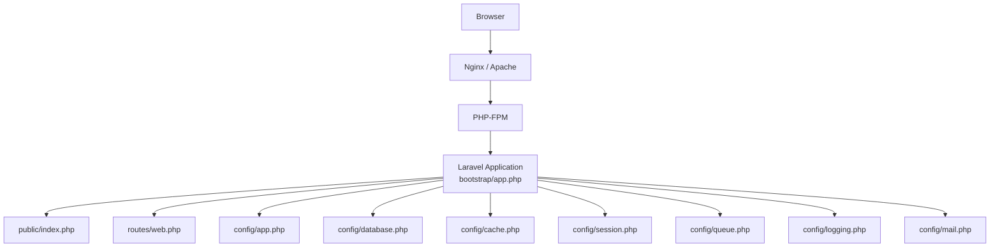
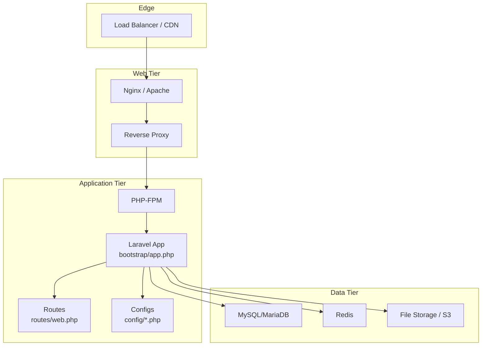
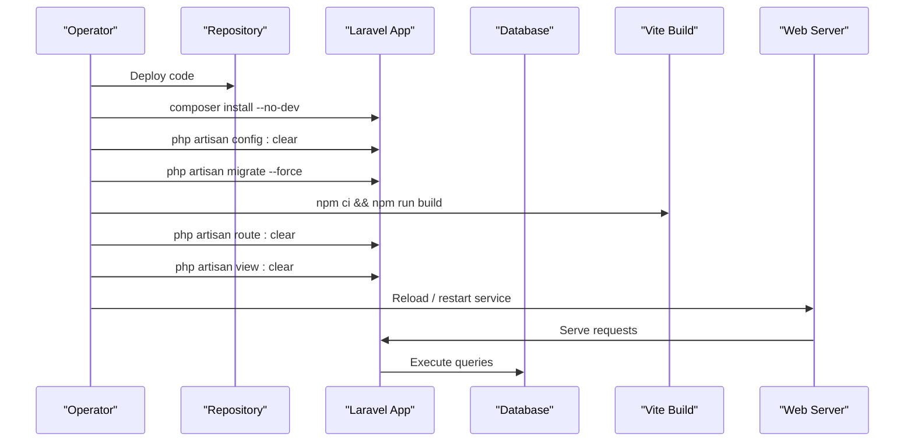
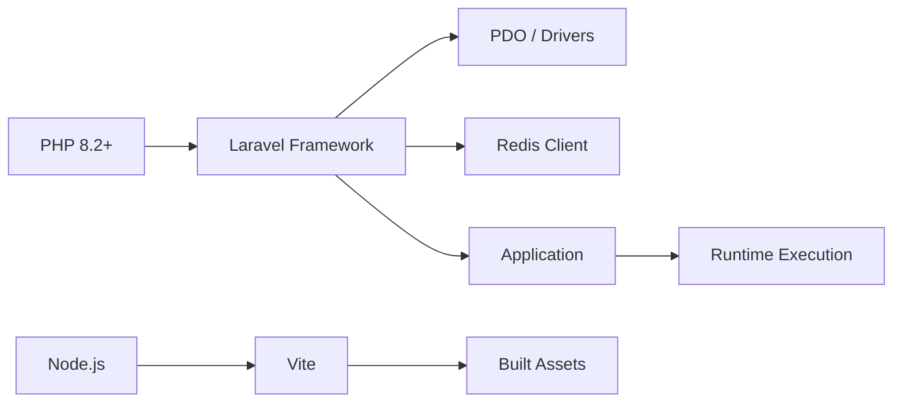

# Deployment Guide

<cite>
**Referenced Files in This Document**
- [composer.json](file://composer.json)
- [package.json](file://package.json)
- [vite.config.js](file://vite.config.js)
- [public/index.php](file://public/index.php)
- [bootstrap/app.php](file://bootstrap/app.php)
- [routes/web.php](file://routes/web.php)
- [config/app.php](file://config/app.php)
- [config/database.php](file://config/database.php)
- [config/cache.php](file://config/cache.php)
- [config/session.php](file://config/session.php)
- [config/queue.php](file://config/queue.php)
- [config/logging.php](file://config/logging.php)
- [config/mail.php](file://config/mail.php)
- [database/migrations/0001_01_01_000000_create_users_table.php](file://database/migrations/0001_01_01_000000_create_users_table.php)
- [database/migrations/2026_04_21_132801_create_itineraries_table.php](file://database/migrations/2026_04_21_132801_create_itineraries_table.php)
- [database/migrations/2026_04_21_132809_create_budgets_table.php](file://database/migrations/2026_04_21_132809_create_budgets_table.php)
- [database/migrations/2026_04_21_132810_create_posts_table.php](file://database/migrations/2026_04_21_132810_create_posts_table.php)
- [database/migrations/2026_04_21_132811_create_memories_table.php](file://database/migrations/2026_04_21_132811_create_memories_table.php)
- [database/migrations/2026_04_21_132812_create_travel_groups_table.php](file://database/migrations/2026_04_21_132812_create_travel_groups_table.php)
</cite>

## Table of Contents
1. [Introduction](#introduction)
2. [Project Structure](#project-structure)
3. [Core Components](#core-components)
4. [Architecture Overview](#architecture-overview)
5. [Detailed Component Analysis](#detailed-component-analysis)
6. [Dependency Analysis](#dependency-analysis)
7. [Performance Considerations](#performance-considerations)
8. [Troubleshooting Guide](#troubleshooting-guide)
9. [Conclusion](#conclusion)
10. [Appendices](#appendices)

## Introduction
This deployment guide provides a production-ready setup for the Laravel-based Travel Project. It covers server requirements, environment configuration, application key generation, database setup, deployment pipeline (code deployment, migrations, asset compilation), web server and PHP-FPM configuration, reverse proxy setup, backups, logging and rotation, monitoring, performance optimization, and troubleshooting.

## Project Structure
The application follows Laravel’s standard structure with a focus on MVC, configuration-driven behavior, and modular routing. Key runtime entry points and configuration locations are:
- Web entry point: public/index.php
- Application bootstrap: bootstrap/app.php
- Routes: routes/web.php
- Configuration: config/*.php
- Assets and build: vite.config.js, package.json
- Dependencies: composer.json

**Diagram sources**
- [public/index.php:1-21](file://public/index.php#L1-L21)
- [bootstrap/app.php:1-19](file://bootstrap/app.php#L1-L19)
- [routes/web.php:1-89](file://routes/web.php#L1-L89)
- [config/app.php:1-127](file://config/app.php#L1-L127)
- [config/database.php:1-185](file://config/database.php#L1-L185)
- [config/cache.php:1-118](file://config/cache.php#L1-L118)
- [config/session.php:1-218](file://config/session.php#L1-L218)
- [config/queue.php:1-130](file://config/queue.php#L1-L130)
- [config/logging.php:1-133](file://config/logging.php#L1-L133)
- [config/mail.php:1-119](file://config/mail.php#L1-L119)

**Section sources**
- [public/index.php:1-21](file://public/index.php#L1-L21)
- [bootstrap/app.php:1-19](file://bootstrap/app.php#L1-L19)
- [routes/web.php:1-89](file://routes/web.php#L1-L89)

## Core Components
- Application bootstrap and routing are configured in bootstrap/app.php and routes/web.php.
- Environment-driven configuration is centralized in config/*.php, including app, database, cache, session, queue, logging, and mail.
- Asset pipeline uses Vite with laravel-vite-plugin and Tailwind CSS integration.
- Composer scripts automate setup, development, and testing tasks.

Key production-relevant configuration highlights:
- Application name, environment, debug, URL, timezone, locale, encryption key, and maintenance driver.
- Database connections for sqlite, mysql, mariadb, pgsql, sqlsrv; Redis client and options; migration table.
- Cache stores including database, file, redis, dynamodb, octane, failover.
- Session driver defaults to database with configurable lifetime, cookie attributes, and secure flags.
- Queue connections including database, redis, sqs, beanstalkd; failed job storage.
- Logging channels including daily rotation, slack, syslog, stderr, papertrail.
- Mail transport configurations for smtp, ses, postmark, resend, sendmail, log.

**Section sources**
- [config/app.php:1-127](file://config/app.php#L1-L127)
- [config/database.php:1-185](file://config/database.php#L1-L185)
- [config/cache.php:1-118](file://config/cache.php#L1-L118)
- [config/session.php:1-218](file://config/session.php#L1-L218)
- [config/queue.php:1-130](file://config/queue.php#L1-L130)
- [config/logging.php:1-133](file://config/logging.php#L1-L133)
- [config/mail.php:1-119](file://config/mail.php#L1-L119)

## Architecture Overview
Production architecture comprises:
- Web server (Nginx/Apache) as reverse proxy and static asset handler
- PHP-FPM serving the Laravel application
- Database (MySQL/MariaDB recommended for production)
- Optional Redis for cache and queues
- Asset pipeline built via Vite during deployment

[No sources needed since this diagram shows conceptual workflow, not actual code structure]

## Detailed Component Analysis

### Environment Variables and Application Key
- Environment variables are read via env() across config files.
- APP_ENV should be set to production.
- APP_DEBUG must be false in production.
- APP_KEY must be generated and set to a 32-character secure string.
- APP_URL should reflect the production hostname.
- Database variables: DB_CONNECTION, DB_HOST, DB_PORT, DB_DATABASE, DB_USERNAME, DB_PASSWORD.
- Redis variables: REDIS_* for client, host, port, db, prefix, and retry/backoff options.
- Session variables: SESSION_DRIVER, SESSION_LIFETIME, SESSION_SECURE_COOKIE, SESSION_SAME_SITE, SESSION_DOMAIN.
- Queue variables: QUEUE_CONNECTION and driver-specific settings.
- Logging variables: LOG_CHANNEL, LOG_LEVEL, LOG_STACK, LOG_DAILY_DAYS, and provider-specific settings.
- Mail variables: MAIL_MAILER and driver-specific settings.

Generation and management:
- Use the Artisan key:generate command to produce APP_KEY.
- Composer scripts include key:generate and migrate --force for initial setup.

Security hardening steps:
- Disable debug mode.
- Enforce HTTPS cookies (SESSION_SECURE_COOKIE).
- Configure SameSite cookies appropriately.
- Set strict session cookie attributes (HttpOnly, Secure).
- Restrict file permissions on storage and bootstrap/cache directories.
- Use strong passwords and rotate keys periodically.

**Section sources**
- [config/app.php:29-106](file://config/app.php#L29-L106)
- [config/session.php:21-217](file://config/session.php#L21-L217)
- [config/queue.php:16-127](file://config/queue.php#L16-L127)
- [config/logging.php:21-132](file://config/logging.php#L21-L132)
- [config/mail.php:17-118](file://config/mail.php#L17-L118)
- [composer.json:35-69](file://composer.json#L35-L69)

### Database Setup
Supported drivers and defaults:
- sqlite is default for local development; production should use MySQL/MariaDB or PostgreSQL.
- MySQL/MariaDB configuration includes charset/collation, SSL CA, and strict mode.
- PostgreSQL configuration includes sslmode and search_path.
- SQL Server configuration includes host/port and charset.

Schema overview (selected tables):
- Users: authentication, profiles, subscriptions, storage usage.
- Sessions: session management.
- Itineraries: travel plans with indexing on user and dates.
- Budgets: budget tracking with indexing on user and type.
- Posts: social content with privacy and counts.
- Memories: photo/video memories linked to itineraries.
- Travel groups: grouping for shared itineraries.

Recommended production database:
- MySQL 8+ or MariaDB 10.11+ with utf8mb4 charset and proper collation.
- Enable binary logging for point-in-time recovery.
- Use dedicated application user with least privilege.
- Configure read replicas for scaling reads.

Indexes and constraints:
- Composite indexes on frequently filtered columns (user_id, status; user_id, type; user_id, created_at/date).
- Foreign keys for referential integrity.

**Section sources**
- [config/database.php:20-117](file://config/database.php#L20-L117)
- [database/migrations/0001_01_01_000000_create_users_table.php:14-44](file://database/migrations/0001_01_01_000000_create_users_table.php#L14-L44)
- [database/migrations/2026_04_21_132801_create_itineraries_table.php:14-28](file://database/migrations/2026_04_21_132801_create_itineraries_table.php#L14-L28)
- [database/migrations/2026_04_21_132809_create_budgets_table.php:14-29](file://database/migrations/2026_04_21_132809_create_budgets_table.php#L14-L29)
- [database/migrations/2026_04_21_132810_create_posts_table.php:14-28](file://database/migrations/2026_04_21_132810_create_posts_table.php#L14-L28)
- [database/migrations/2026_04_21_132811_create_memories_table.php:14-26](file://database/migrations/2026_04_21_132811_create_memories_table.php#L14-L26)
- [database/migrations/2026_04_21_132812_create_travel_groups_table.php:14-21](file://database/migrations/2026_04_21_132812_create_travel_groups_table.php#L14-L21)

### Asset Pipeline and Build
Build and development scripts:
- Vite build via npm run build.
- Development watch via npm run dev.
- Laravel Vite plugin configured to bundle resources/css/app.css and resources/js/app.js.

Production build steps:
- Install dependencies: npm ci (recommended) or npm install.
- Build assets: npm run build.
- Commit built assets to version control or pre-deploy them on the target server.

Asset optimization:
- Enable long-term caching with hashed filenames via Vite.
- Minify CSS/JS and optimize images.
- Use CDN for static assets.

**Section sources**
- [package.json:5-8](file://package.json#L5-L8)
- [vite.config.js:4-11](file://vite.config.js#L4-L11)

### Deployment Process
End-to-end deployment flow:
1. Prepare environment
   - OS: Linux (Ubuntu/CentOS) recommended.
   - PHP: ^8.2 with opcache enabled.
   - Web server: Nginx 1.20+/Apache 2.4+.
   - Database: MySQL 8+/MariaDB 10.11+/PostgreSQL 13+.
   - Redis: optional but recommended for cache and queues.
   - Node.js: for Vite build.
2. Code deployment
   - Clone repository to production directory.
   - Copy .env.example to .env and fill environment variables.
   - Install PHP dependencies: composer install --no-dev --optimize-autoloader.
   - Clear and warm caches: config, route, view, and event caches.
3. Database migration
   - Run migrations: php artisan migrate --force.
   - Seed data if needed: php artisan db:seed (optional).
4. Asset compilation
   - Build assets: npm ci && npm run build.
   - Publish vendor assets if applicable.
5. Web server and PHP-FPM
   - Configure virtual host/document root to public/.
   - Point PHP-FPM to the application socket or TCP.
   - Set proper file permissions for storage and bootstrap/cache.
6. Reverse proxy and TLS
   - Terminate TLS at the edge (Nginx/Apache) or load balancer.
   - Redirect HTTP to HTTPS.
   - Configure HSTS and security headers.
7. Queues and background workers
   - Start queue listener(s): php artisan queue:work --sleep=3 --tries=3.
   - Optionally use supervisor to monitor workers.
8. Monitoring and logging
   - Enable daily log rotation.
   - Integrate with external logging (Papertrail, Slack).
   - Monitor queue backlog and database performance.

**Diagram sources**
- [composer.json:35-58](file://composer.json#L35-L58)
- [routes/web.php:1-89](file://routes/web.php#L1-L89)
- [config/database.php:20-117](file://config/database.php#L20-L117)

**Section sources**
- [composer.json:35-69](file://composer.json#L35-L69)
- [routes/web.php:1-89](file://routes/web.php#L1-L89)

### Web Server and PHP-FPM Configuration
Nginx example outline (conceptual):
- Root: /path/to/project/public
- Pass PHP scripts to PHP-FPM unix socket or TCP
- Serve static assets with long cache headers
- Deny access to .env, storage/framework/* (except cached views/logs)
- Redirect /index.php to /
- Enable gzip/HTTP/2/TLS

Apache example outline (conceptual):
- DocumentRoot /path/to/project/public
- AllowOverride All for .htaccess
- PHP-FPM via mod_proxy_fcgi
- Security headers and compression

PHP-FPM tuning (conceptual):
- pm = dynamic
- pm.max_children, pm.start_servers, pm.min_spare_servers, pm.max_spare_servers
- pm.process_idle_timeout, pm.status_path
- Slow log threshold for profiling

Reverse proxy (conceptual):
- Terminate TLS at edge
- Forward X-Forwarded-* headers
- Rate limiting and WAF integration

[No sources needed since this section provides general guidance]

### Backup Strategies
- Database
  - Full logical backups via mysqldump/pg_dump or physical backups.
  - Binary logs for point-in-time recovery.
  - Automated scheduled backups with retention policies.
- Application
  - Version-controlled assets built via Vite.
  - Non-versioned storage/app/public symlinked to persistent storage.
- Secrets
  - Store .env and APP_KEY outside the web root.
  - Rotate keys regularly and invalidate sessions.

[No sources needed since this section provides general guidance]

### Logging, Rotation, and Monitoring
- Logging
  - Use daily channel with configurable retention.
  - Integrate with Slack/Papertrail/Syslog for alerts.
- Rotation
  - Daily rotation with max age.
  - Logrotate configuration for external log aggregation.
- Monitoring
  - Health endpoint: /up
  - Queue metrics and failure rates.
  - Database query performance and slow query logs.
  - Application metrics via APM or container stats.

**Section sources**
- [config/logging.php:21-132](file://config/logging.php#L21-L132)
- [bootstrap/app.php:11-12](file://bootstrap/app.php#L11-L12)

### Performance Optimization
- Caching
  - Cache store: database or redis.
  - Cache key prefix per environment.
  - Use cache for expensive queries and computed views.
- Database
  - Proper indexing on filtered columns.
  - Connection pooling and query optimization.
  - Read replicas for reporting workloads.
- Sessions
  - Database sessions for distributed deployments.
  - Shorter session lifetime and secure cookies.
- Queues
  - Dedicated queue workers and retry policies.
  - Dead letter queues for failed jobs.
- Assets
  - Vite hashed filenames and CDN delivery.
  - Image optimization and lazy loading.
- PHP
  - opcache enabled and tuned.
  - JIT disabled for stability in production.

**Section sources**
- [config/cache.php:18-115](file://config/cache.php#L18-L115)
- [config/session.php:21-217](file://config/session.php#L21-L217)
- [config/queue.php:16-127](file://config/queue.php#L16-L127)
- [vite.config.js:4-11](file://vite.config.js#L4-L11)

### Troubleshooting Guide
Common issues and resolutions:
- Application key missing
  - Symptom: errors on boot.
  - Fix: generate and set APP_KEY; clear configs.
- Database connection failures
  - Symptom: migration or runtime DB errors.
  - Fix: verify DB_* variables; test connectivity; check firewall.
- Permission errors
  - Symptom: inability to write to storage or bootstrap/cache.
  - Fix: chown -R www-data:www-data storage bootstrap/cache; chmod 755 public.
- Asset build failures
  - Symptom: missing CSS/JS after deploy.
  - Fix: run npm ci && npm run build; ensure Node.js version compatibility.
- Queue workers not processing
  - Symptom: jobs stuck in pending.
  - Fix: start queue:work; check failed_jobs; verify database connectivity.
- Health checks failing
  - Symptom: /up returns error.
  - Fix: verify database connectivity; check cache/queue configuration.

**Section sources**
- [config/app.php:42-106](file://config/app.php#L42-L106)
- [config/database.php:20-117](file://config/database.php#L20-L117)
- [config/queue.php:38-45](file://config/queue.php#L38-L45)
- [public/index.php:8-11](file://public/index.php#L8-L11)

## Dependency Analysis
Runtime dependencies and their roles:
- PHP 8.2+ with PDO and OpenSSL for database and HTTPS.
- Laravel framework and tinker.
- Optional: Redis client for cache and queues.
- Node.js and Vite for asset compilation.

Composer scripts orchestrate:
- setup: install deps, create .env if missing, generate key, migrate, install npm deps, build.
- dev: concurrent server, queue, logs, and vite.
- test: clear config cache and run tests.

**Diagram sources**
- [composer.json:8-11](file://composer.json#L8-L11)
- [package.json:9-20](file://package.json#L9-L20)

**Section sources**
- [composer.json:8-22](file://composer.json#L8-L22)
- [package.json:9-20](file://package.json#L9-L20)

## Performance Considerations
- Use production-grade PHP configuration with opcache and appropriate pm settings.
- Prefer MySQL/MariaDB with utf8mb4 and proper indexes.
- Offload cache and queues to Redis for scalability.
- Enable asset hashing and CDN delivery.
- Monitor queue backlog and database performance; scale horizontally as needed.

[No sources needed since this section provides general guidance]

## Troubleshooting Guide
- Environment variables not applied
  - Ensure .env exists and is readable by the web server user.
  - Clear configuration cache after changes.
- Maintenance mode activation
  - Check maintenance file existence and remove when ready.
- Asset pipeline issues
  - Verify Node.js and npm versions; rebuild assets.
- Database migration errors
  - Check DB credentials and network; ensure migrations table exists.

**Section sources**
- [public/index.php:8-11](file://public/index.php#L8-L11)
- [config/app.php:121-124](file://config/app.php#L121-L124)

## Conclusion
This guide outlines a robust production deployment for the Travel Project. By following environment configuration, database setup, deployment pipeline, web server and PHP-FPM tuning, reverse proxy and TLS, backup and monitoring strategies, and performance optimizations, you can achieve a reliable, scalable, and secure Laravel application.

[No sources needed since this section summarizes without analyzing specific files]

## Appendices

### Production Checklist
- PHP 8.2+, required extensions: pdo, openssl, mbstring, tokenizer, xml, ctype, json, filter
- Web server configured with document root pointing to public/
- Database provisioned and migrated
- Redis configured (optional)
- APP_KEY generated and set
- Queue workers running
- Logs rotated and monitored
- Assets built and served via CDN

[No sources needed since this section provides general guidance]