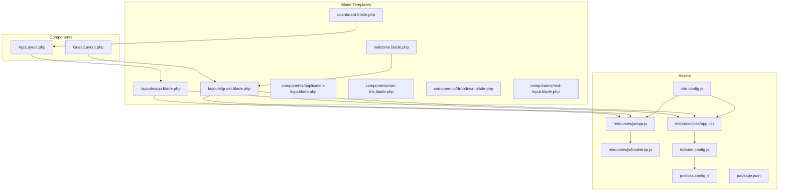
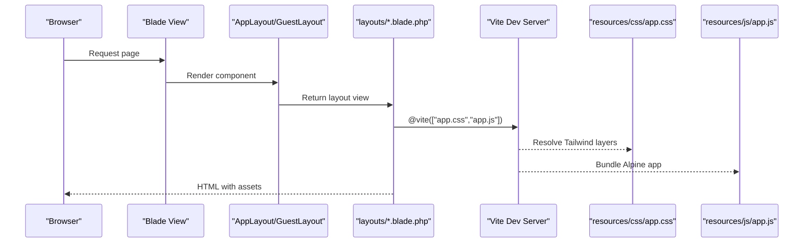
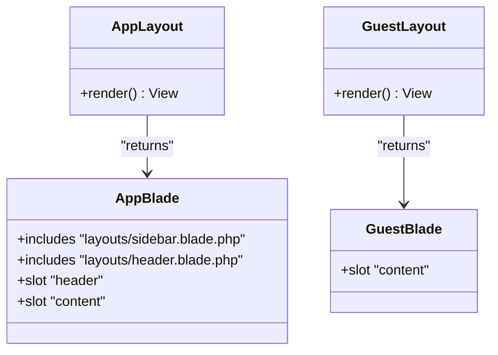
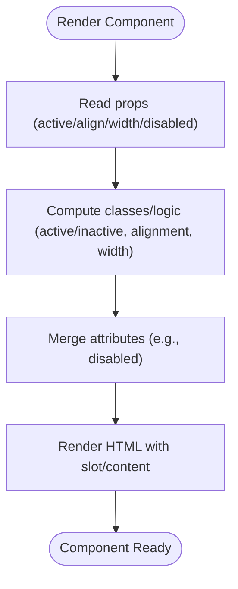
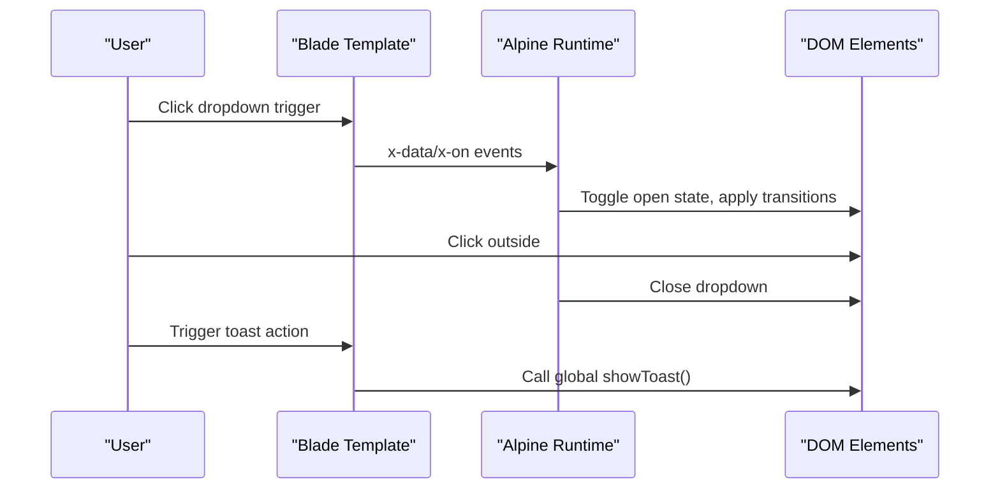
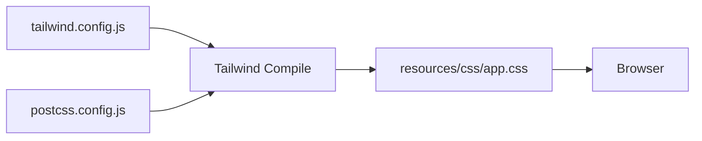
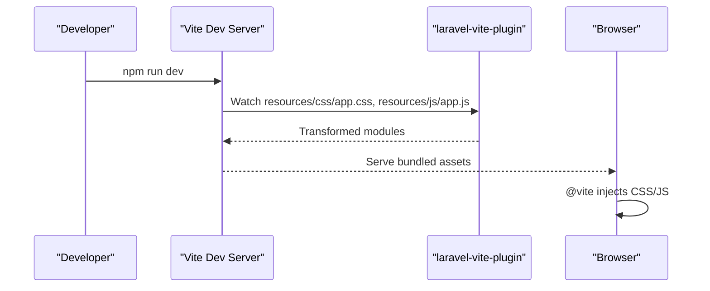
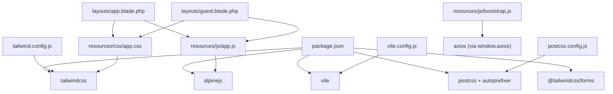

# Frontend Architecture

<cite>
**Referenced Files in This Document**
- [resources/views/layouts/app.blade.php](file://resources/views/layouts/app.blade.php)
- [resources/views/layouts/guest.blade.php](file://resources/views/layouts/guest.blade.php)
- [app/View/Components/AppLayout.php](file://app/View/Components/AppLayout.php)
- [app/View/Components/GuestLayout.php](file://app/View/Components/GuestLayout.php)
- [resources/views/components/application-logo.blade.php](file://resources/views/components/application-logo.blade.php)
- [resources/views/components/nav-link.blade.php](file://resources/views/components/nav-link.blade.php)
- [resources/views/components/dropdown.blade.php](file://resources/views/components/dropdown.blade.php)
- [resources/views/components/text-input.blade.php](file://resources/views/components/text-input.blade.php)
- [resources/views/dashboard.blade.php](file://resources/views/dashboard.blade.php)
- [resources/views/welcome.blade.php](file://resources/views/welcome.blade.php)
- [resources/js/app.js](file://resources/js/app.js)
- [resources/js/bootstrap.js](file://resources/js/bootstrap.js)
- [resources/css/app.css](file://resources/css/app.css)
- [vite.config.js](file://vite.config.js)
- [tailwind.config.js](file://tailwind.config.js)
- [postcss.config.js](file://postcss.config.js)
- [package.json](file://package.json)
</cite>

## Table of Contents
1. [Introduction](#introduction)
2. [Project Structure](#project-structure)
3. [Core Components](#core-components)
4. [Architecture Overview](#architecture-overview)
5. [Detailed Component Analysis](#detailed-component-analysis)
6. [Dependency Analysis](#dependency-analysis)
7. [Performance Considerations](#performance-considerations)
8. [Troubleshooting Guide](#troubleshooting-guide)
9. [Conclusion](#conclusion)
10. [Appendices](#appendices)

## Introduction
This document describes the frontend architecture of the project with a focus on Blade templating, the component system, and asset management. It explains how layouts and components are structured, how data is bound and rendered, and how interactive behavior is implemented with Alpine.js. It also documents the Tailwind CSS configuration and the Vite bundling pipeline, along with practical examples and best practices for extending the UI.

## Project Structure
The frontend is organized around Blade templates and a small set of reusable Blade components. Layouts define page scaffolding and include shared UI elements. Assets are managed via Vite and PostCSS, with Tailwind CSS providing utility-first styling.

**Diagram sources**
- [resources/views/layouts/app.blade.php:1-232](file://resources/views/layouts/app.blade.php#L1-L232)
- [resources/views/layouts/guest.blade.php:1-31](file://resources/views/layouts/guest.blade.php#L1-L31)
- [app/View/Components/AppLayout.php:1-18](file://app/View/Components/AppLayout.php#L1-L18)
- [app/View/Components/GuestLayout.php:1-18](file://app/View/Components/GuestLayout.php#L1-L18)
- [resources/views/dashboard.blade.php:1-162](file://resources/views/dashboard.blade.php#L1-L162)
- [resources/views/welcome.blade.php:1-278](file://resources/views/welcome.blade.php#L1-L278)
- [resources/js/app.js:1-8](file://resources/js/app.js#L1-L8)
- [resources/js/bootstrap.js:1-5](file://resources/js/bootstrap.js#L1-L5)
- [resources/css/app.css:1-4](file://resources/css/app.css#L1-L4)
- [vite.config.js:1-12](file://vite.config.js#L1-L12)
- [tailwind.config.js:1-73](file://tailwind.config.js#L1-L73)
- [postcss.config.js:1-7](file://postcss.config.js#L1-L7)
- [package.json:1-22](file://package.json#L1-L22)

**Section sources**
- [resources/views/layouts/app.blade.php:1-232](file://resources/views/layouts/app.blade.php#L1-L232)
- [resources/views/layouts/guest.blade.php:1-31](file://resources/views/layouts/guest.blade.php#L1-L31)
- [app/View/Components/AppLayout.php:1-18](file://app/View/Components/AppLayout.php#L1-L18)
- [app/View/Components/GuestLayout.php:1-18](file://app/View/Components/GuestLayout.php#L1-L18)
- [resources/views/dashboard.blade.php:1-162](file://resources/views/dashboard.blade.php#L1-L162)
- [resources/views/welcome.blade.php:1-278](file://resources/views/welcome.blade.php#L1-L278)
- [resources/js/app.js:1-8](file://resources/js/app.js#L1-L8)
- [resources/js/bootstrap.js:1-5](file://resources/js/bootstrap.js#L1-L5)
- [resources/css/app.css:1-4](file://resources/css/app.css#L1-L4)
- [vite.config.js:1-12](file://vite.config.js#L1-L12)
- [tailwind.config.js:1-73](file://tailwind.config.js#L1-L73)
- [postcss.config.js:1-7](file://postcss.config.js#L1-L7)
- [package.json:1-22](file://package.json#L1-L22)

## Core Components
- Layouts
  - AppLayout: Wraps authenticated user pages with a responsive layout, sidebar, header, main content area, and mobile bottom navigation. Includes global styles, toast notifications, and a script stack for additional scripts.
  - GuestLayout: Provides a minimal authenticated-guest layout for login/register and similar pages.
- Blade Components
  - Application logo: A reusable SVG component with attributes passthrough.
  - Nav-link: A link component with active-state styling computed from a prop.
  - Dropdown: An Alpine-driven dropdown with alignment and width variants, trigger/content slots, and transitions.
  - Text-input: A form input component with disabled prop and default styling.
- Views
  - Dashboard: Uses AppLayout to render a profile header, quick actions, subscription status, and recent activity feed.
  - Welcome: A landing page with light/dark mode illustrations and links to documentation.

**Section sources**
- [app/View/Components/AppLayout.php:1-18](file://app/View/Components/AppLayout.php#L1-L18)
- [app/View/Components/GuestLayout.php:1-18](file://app/View/Components/GuestLayout.php#L1-L18)
- [resources/views/layouts/app.blade.php:1-232](file://resources/views/layouts/app.blade.php#L1-L232)
- [resources/views/layouts/guest.blade.php:1-31](file://resources/views/layouts/guest.blade.php#L1-L31)
- [resources/views/components/application-logo.blade.php:1-4](file://resources/views/components/application-logo.blade.php#L1-L4)
- [resources/views/components/nav-link.blade.php:1-12](file://resources/views/components/nav-link.blade.php#L1-L12)
- [resources/views/components/dropdown.blade.php:1-36](file://resources/views/components/dropdown.blade.php#L1-L36)
- [resources/views/components/text-input.blade.php:1-4](file://resources/views/components/text-input.blade.php#L1-L4)
- [resources/views/dashboard.blade.php:1-162](file://resources/views/dashboard.blade.php#L1-L162)
- [resources/views/welcome.blade.php:1-278](file://resources/views/welcome.blade.php#L1-L278)

## Architecture Overview
The frontend follows a layered Blade rendering model:
- Controllers return Blade views.
- Blade views extend layouts via component classes (AppLayout/GuestLayout).
- Layouts include shared partials (sidebar/header/navigation) and inject page content via slots.
- Assets are compiled via Vite and PostCSS/Tailwind, injected with @vite in layouts.

**Diagram sources**
- [resources/views/dashboard.blade.php:1-2](file://resources/views/dashboard.blade.php#L1-L2)
- [app/View/Components/AppLayout.php:13-16](file://app/View/Components/AppLayout.php#L13-L16)
- [resources/views/layouts/app.blade.php:16-17](file://resources/views/layouts/app.blade.php#L16-L17)
- [resources/js/app.js:1-8](file://resources/js/app.js#L1-L8)
- [resources/css/app.css:1-4](file://resources/css/app.css#L1-L4)
- [vite.config.js:6-9](file://vite.config.js#L6-L9)

## Detailed Component Analysis

### Layout Inheritance and Composition
- AppLayout renders the authenticated layout with a sidebar, header, main content area, and a mobile bottom navigation bar. It supports a header slot and a $slot for page content.
- GuestLayout provides a simplified guest-only layout with a centered card and logo.
- Both are invoked in Blade views using the <x-app-layout> and <x-guest-layout> patterns.

**Diagram sources**
- [app/View/Components/AppLayout.php:13-16](file://app/View/Components/AppLayout.php#L13-L16)
- [app/View/Components/GuestLayout.php:13-16](file://app/View/Components/GuestLayout.php#L13-L16)
- [resources/views/layouts/app.blade.php:133-158](file://resources/views/layouts/app.blade.php#L133-L158)
- [resources/views/layouts/guest.blade.php:17-28](file://resources/views/layouts/guest.blade.php#L17-L28)

**Section sources**
- [resources/views/layouts/app.blade.php:1-232](file://resources/views/layouts/app.blade.php#L1-L232)
- [resources/views/layouts/guest.blade.php:1-31](file://resources/views/layouts/guest.blade.php#L1-L31)
- [app/View/Components/AppLayout.php:1-18](file://app/View/Components/AppLayout.php#L1-L18)
- [app/View/Components/GuestLayout.php:1-18](file://app/View/Components/GuestLayout.php#L1-L18)

### Blade Components and Data Binding
- Application logo: Passthrough attributes enable customization of the SVG element.
- Nav-link: Computes active/inactive classes based on an active prop, merges additional attributes, and renders the link with slot content.
- Dropdown: Uses Alpine’s x-data/x-show/x-transition to manage visibility and animations, with alignment and width props controlling positioning and sizing.
- Text-input: Applies default border/ring/shadow classes and respects a disabled prop.

**Diagram sources**
- [resources/views/components/nav-link.blade.php:1-12](file://resources/views/components/nav-link.blade.php#L1-L12)
- [resources/views/components/dropdown.blade.php:1-36](file://resources/views/components/dropdown.blade.php#L1-L36)
- [resources/views/components/text-input.blade.php:1-4](file://resources/views/components/text-input.blade.php#L1-L4)
- [resources/views/components/application-logo.blade.php:1-4](file://resources/views/components/application-logo.blade.php#L1-L4)

**Section sources**
- [resources/views/components/application-logo.blade.php:1-4](file://resources/views/components/application-logo.blade.php#L1-L4)
- [resources/views/components/nav-link.blade.php:1-12](file://resources/views/components/nav-link.blade.php#L1-L12)
- [resources/views/components/dropdown.blade.php:1-36](file://resources/views/components/dropdown.blade.php#L1-L36)
- [resources/views/components/text-input.blade.php:1-4](file://resources/views/components/text-input.blade.php#L1-L4)

### Alpine.js Integration and Interactive Behavior
- Alpine is imported and initialized globally in app.js, enabling Alpine directives across Blade templates.
- Dropdown component demonstrates Alpine-driven toggling, click-outside behavior, and transitions.
- The layout defines a global toast container and a helper function exposed via a script tag for runtime notifications.

**Diagram sources**
- [resources/views/components/dropdown.blade.php:16-35](file://resources/views/components/dropdown.blade.php#L16-L35)
- [resources/views/layouts/app.blade.php:219-229](file://resources/views/layouts/app.blade.php#L219-L229)
- [resources/js/app.js:1-8](file://resources/js/app.js#L1-L8)

**Section sources**
- [resources/js/app.js:1-8](file://resources/js/app.js#L1-L8)
- [resources/views/components/dropdown.blade.php:1-36](file://resources/views/components/dropdown.blade.php#L1-L36)
- [resources/views/layouts/app.blade.php:219-229](file://resources/views/layouts/app.blade.php#L219-L229)

### Tailwind CSS Configuration and Styling Patterns
- Tailwind is configured to scan Blade views and vendor/pagination templates for unused styles.
- Theme extensions define brand-centric color palettes (ocean, cloud, grass, tree) and gradient-based color families.
- The base CSS file imports Tailwind layers; PostCSS runs Tailwind and Autoprefixer during build.

**Diagram sources**
- [tailwind.config.js:1-73](file://tailwind.config.js#L1-L73)
- [postcss.config.js:1-7](file://postcss.config.js#L1-L7)
- [resources/css/app.css:1-4](file://resources/css/app.css#L1-L4)

**Section sources**
- [tailwind.config.js:1-73](file://tailwind.config.js#L1-L73)
- [postcss.config.js:1-7](file://postcss.config.js#L1-L7)
- [resources/css/app.css:1-4](file://resources/css/app.css#L1-L4)

### Asset Bundling with Vite
- Vite is configured with the Laravel plugin to bundle CSS and JS, enabling hot module replacement and refresh on change.
- Layouts inject assets via @vite, ensuring Tailwind layers are processed and Alpine app is loaded.

**Diagram sources**
- [vite.config.js:6-9](file://vite.config.js#L6-L9)
- [resources/views/layouts/app.blade.php:16-17](file://resources/views/layouts/app.blade.php#L16-L17)
- [resources/views/layouts/guest.blade.php:14-15](file://resources/views/layouts/guest.blade.php#L14-L15)

**Section sources**
- [vite.config.js:1-12](file://vite.config.js#L1-L12)
- [resources/views/layouts/app.blade.php:1-232](file://resources/views/layouts/app.blade.php#L1-L232)
- [resources/views/layouts/guest.blade.php:1-31](file://resources/views/layouts/guest.blade.php#L1-L31)

### Example Pages and Patterns
- Dashboard: Demonstrates authenticated layout usage, profile header, quick action cards, subscription status, and recent activity feed.
- Welcome: Illustrates guest layout usage, responsive design, and dark/light mode illustrations.

**Section sources**
- [resources/views/dashboard.blade.php:1-162](file://resources/views/dashboard.blade.php#L1-L162)
- [resources/views/welcome.blade.php:1-278](file://resources/views/welcome.blade.php#L1-L278)

## Dependency Analysis
The frontend stack ties together Blade, Alpine, Tailwind, and Vite with clear boundaries:
- Blade components depend on Alpine directives for interactivity.
- Layouts depend on Tailwind utilities and Vite for asset injection.
- Package dependencies include Alpine, Tailwind, Vite, and related PostCSS plugins.

**Diagram sources**
- [package.json:9-20](file://package.json#L9-L20)
- [vite.config.js:1-12](file://vite.config.js#L1-L12)
- [tailwind.config.js:1-73](file://tailwind.config.js#L1-L73)
- [postcss.config.js:1-7](file://postcss.config.js#L1-L7)
- [resources/js/app.js:1-8](file://resources/js/app.js#L1-L8)
- [resources/js/bootstrap.js:1-5](file://resources/js/bootstrap.js#L1-L5)
- [resources/css/app.css:1-4](file://resources/css/app.css#L1-L4)
- [resources/views/layouts/app.blade.php:1-232](file://resources/views/layouts/app.blade.php#L1-L232)
- [resources/views/layouts/guest.blade.php:1-31](file://resources/views/layouts/guest.blade.php#L1-L31)

**Section sources**
- [package.json:1-22](file://package.json#L1-L22)
- [vite.config.js:1-12](file://vite.config.js#L1-L12)
- [tailwind.config.js:1-73](file://tailwind.config.js#L1-L73)
- [postcss.config.js:1-7](file://postcss.config.js#L1-L7)
- [resources/js/app.js:1-8](file://resources/js/app.js#L1-L8)
- [resources/js/bootstrap.js:1-5](file://resources/js/bootstrap.js#L1-L5)
- [resources/css/app.css:1-4](file://resources/css/app.css#L1-L4)
- [resources/views/layouts/app.blade.php:1-232](file://resources/views/layouts/app.blade.php#L1-L232)
- [resources/views/layouts/guest.blade.php:1-31](file://resources/views/layouts/guest.blade.php#L1-L31)

## Performance Considerations
- Keep Alpine logic minimal and scoped to components to avoid unnecessary reactivity overhead.
- Use Tailwind utilities efficiently; extract repeated patterns into Blade components to reduce duplication.
- Leverage Vite’s dev server for fast iteration and production builds for optimized assets.
- Avoid heavy inline styles in Blade; prefer Tailwind utilities for maintainability and performance.

## Troubleshooting Guide
- Alpine not working
  - Ensure Alpine is imported and started in app.js.
  - Verify Alpine directives are present in Blade templates.
- Assets not updating
  - Run the Vite dev script and ensure @vite is present in layouts.
  - Confirm Tailwind layers are included in CSS.
- Layout not rendering
  - Check that views extend the correct layout component and pass the $slot content.

**Section sources**
- [resources/js/app.js:1-8](file://resources/js/app.js#L1-L8)
- [resources/views/layouts/app.blade.php:16-17](file://resources/views/layouts/app.blade.php#L16-L17)
- [resources/css/app.css:1-4](file://resources/css/app.css#L1-L4)

## Conclusion
The frontend architecture combines Blade layouts and components with a modern asset pipeline powered by Vite, Tailwind CSS, and Alpine.js. This setup enables rapid iteration, consistent styling, and interactive UI patterns while maintaining a clean separation of concerns.

## Appendices

### Best Practices for Extending the UI
- Prefer Blade components for reusable UI elements and encapsulate Alpine logic within components.
- Use Tailwind utilities for responsive breakpoints and brand-consistent colors defined in the Tailwind config.
- Keep layout logic in Blade layouts; delegate interactivity to Alpine within components.
- Add new assets via Vite and ensure Tailwind scans new Blade paths.

### Accessibility and Cross-Browser Compatibility
- Use semantic HTML and ARIA roles where appropriate in Blade templates.
- Test Alpine interactions across browsers and ensure polyfills if targeting older environments.
- Validate color contrast and keyboard navigation for interactive components.