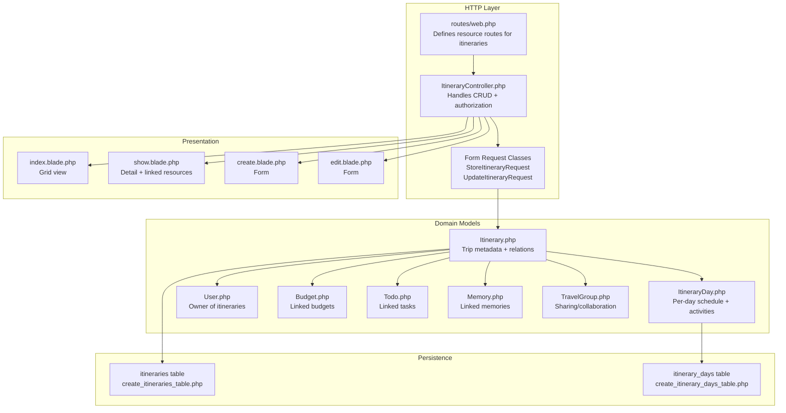
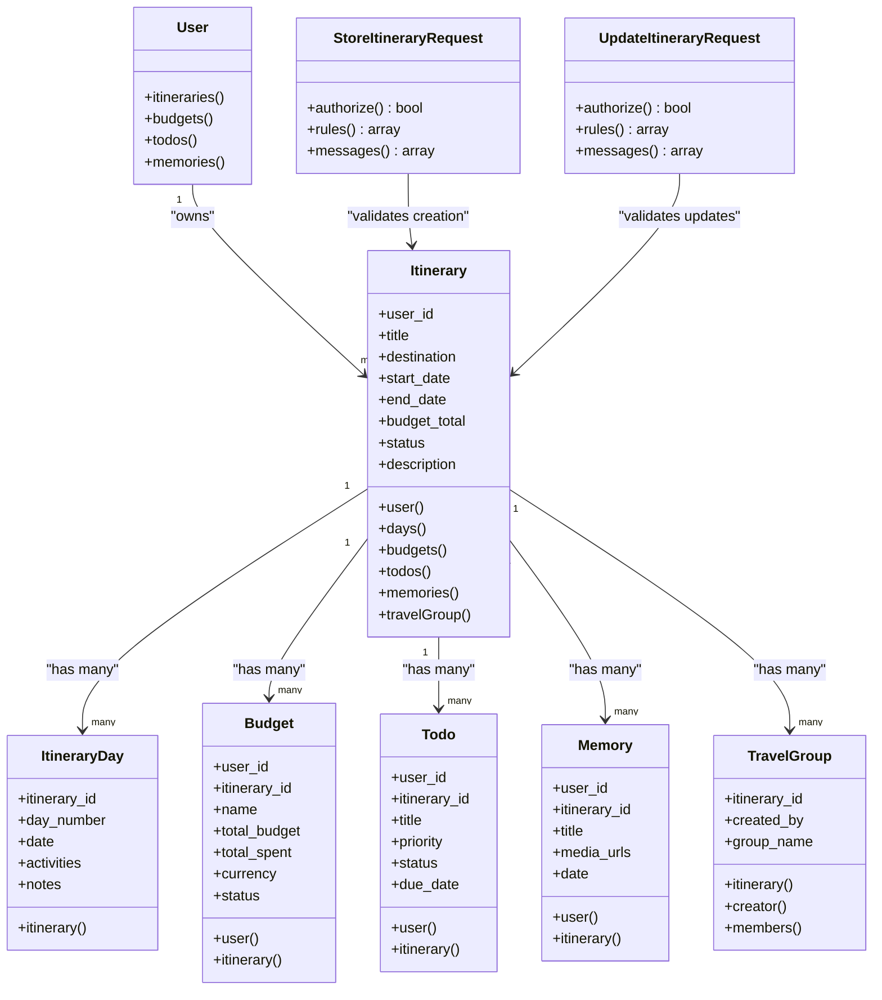
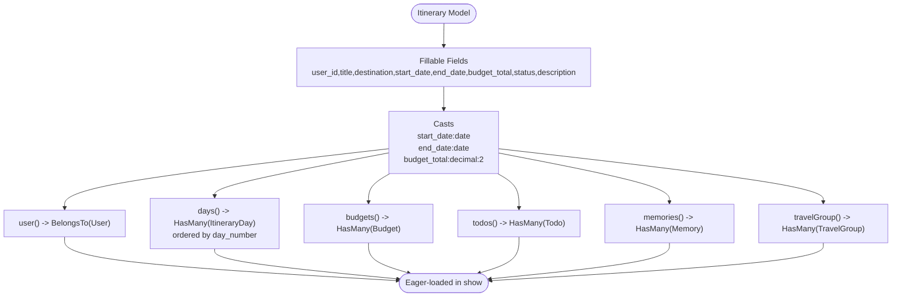
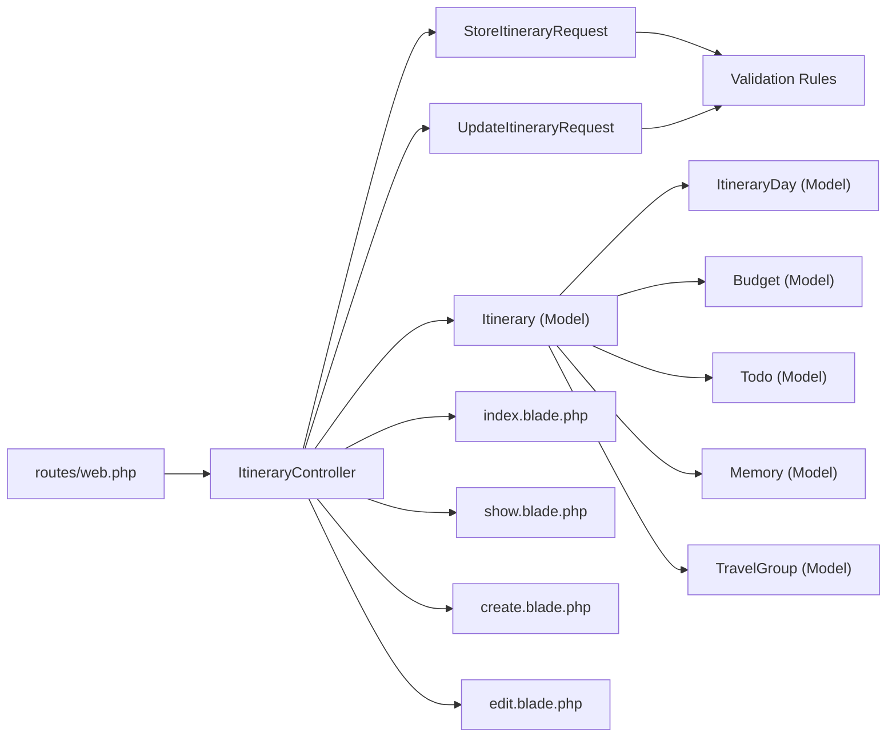

# Itinerary Management

<cite>
**Referenced Files in This Document**
- [ItineraryController.php](file://app/Http/Controllers/ItineraryController.php)
- [StoreItineraryRequest.php](file://app/Http/Requests/StoreItineraryRequest.php)
- [UpdateItineraryRequest.php](file://app/Http/Requests/UpdateItineraryRequest.php)
- [Itinerary.php](file://app/Models/Itinerary.php)
- [ItineraryDay.php](file://app/Models/ItineraryDay.php)
- [ItineraryPolicy.php](file://app/Policies/ItineraryPolicy.php)
- [web.php](file://routes/web.php)
- [2026_04_21_132801_create_itineraries_table.php](file://database/migrations/2026_04_21_132801_create_itineraries_table.php)
- [2026_04_21_132809_create_itinerary_days_table.php](file://database/migrations/2026_04_21_132809_create_itinerary_days_table.php)
- [index.blade.php](file://resources/views/itineraries/index.blade.php)
- [show.blade.php](file://resources/views/itineraries/show.blade.php)
- [create.blade.php](file://resources/views/itineraries/create.blade.php)
- [edit.blade.php](file://resources/views/itineraries/edit.blade.php)
- [User.php](file://app/Models/User.php)
- [Budget.php](file://app/Models/Budget.php)
- [Todo.php](file://app/Models/Todo.php)
- [Memory.php](file://app/Models/Memory.php)
- [TravelGroup.php](file://app/Models/TravelGroup.php)
</cite>

## Update Summary
**Changes Made**
- Updated ItineraryController documentation to reflect modernized Form Request validation patterns
- Added detailed coverage of StoreItineraryRequest and UpdateItineraryRequest classes
- Enhanced validation section with Form Request benefits and implementation details
- Updated architecture diagrams to show Form Request integration
- Added Form Request validation examples and best practices

## Table of Contents
1. [Introduction](#introduction)
2. [Project Structure](#project-structure)
3. [Core Components](#core-components)
4. [Architecture Overview](#architecture-overview)
5. [Detailed Component Analysis](#detailed-component-analysis)
6. [Dependency Analysis](#dependency-analysis)
7. [Performance Considerations](#performance-considerations)
8. [Troubleshooting Guide](#troubleshooting-guide)
9. [Conclusion](#conclusion)
10. [Appendices](#appendices)

## Introduction
This document describes the itinerary management system for trip planning and organization. It covers itinerary creation, editing, and management, including destination selection, date ranges, activity scheduling, and status tracking. It also explains day-by-day planning using the ItineraryDay model, temporal organization, and integrations with budget tracking, todo lists, and memory galleries. Authorization and policies are documented, along with sharing/collaboration via travel groups and privacy controls. Common scenarios and best practices for trip planning are included.

**Updated** The system now uses modern Form Request validation patterns for improved code organization, reusability, and maintainability.

## Project Structure
The itinerary feature spans controllers, models, Form Request validation classes, migrations, Blade views, and routing. The controller handles resource operations with centralized validation through Form Request classes and authorization. Models define relationships and data casting. Form Request classes encapsulate validation logic for create and update operations. Migrations establish database schemas. Views render the UI for listing, creating, editing, and viewing itineraries. Routes bind URLs to controller actions.



**Diagram sources**
- [web.php:32-33](file://routes/web.php#L32-L33)
- [ItineraryController.php:5-6](file://app/Http/Controllers/ItineraryController.php#L5-L6)
- [StoreItineraryRequest.php:8](file://app/Http/Requests/StoreItineraryRequest.php#L8)
- [UpdateItineraryRequest.php:8](file://app/Http/Requests/UpdateItineraryRequest.php#L8)
- [Itinerary.php:28-56](file://app/Models/Itinerary.php#L28-L56)
- [ItineraryDay.php:23-26](file://app/Models/ItineraryDay.php#L23-L26)
- [User.php:65-68](file://app/Models/User.php#L65-L68)
- [Budget.php:33-35](file://app/Models/Budget.php#L33-L35)
- [Todo.php:30-32](file://app/Models/Todo.php#L30-L32)
- [Memory.php:31-33](file://app/Models/Memory.php#L31-L33)
- [TravelGroup.php:17-20](file://app/Models/TravelGroup.php#L17-L20)
- [2026_04_21_132801_create_itineraries_table.php:14-28](file://database/migrations/2026_04_21_132801_create_itineraries_table.php#L14-L28)
- [2026_04_21_132809_create_itinerary_days_table.php:14-25](file://database/migrations/2026_04_21_132809_create_itinerary_days_table.php#L14-L25)
- [index.blade.php:14-30](file://resources/views/itineraries/index.blade.php#L14-L30)
- [show.blade.php:7-34](file://resources/views/itineraries/show.blade.php#L7-L34)
- [create.blade.php:14-149](file://resources/views/itineraries/create.blade.php#L14-L149)
- [edit.blade.php:42-189](file://resources/views/itineraries/edit.blade.php#L42-L189)

**Section sources**
- [web.php:32-33](file://routes/web.php#L32-L33)
- [ItineraryController.php:5-6](file://app/Http/Controllers/ItineraryController.php#L5-L6)
- [StoreItineraryRequest.php:8](file://app/Http/Requests/StoreItineraryRequest.php#L8)
- [UpdateItineraryRequest.php:8](file://app/Http/Requests/UpdateItineraryRequest.php#L8)
- [Itinerary.php:11-26](file://app/Models/Itinerary.php#L11-L26)
- [ItineraryDay.php:10-21](file://app/Models/ItineraryDay.php#L10-L21)
- [2026_04_21_132801_create_itineraries_table.php:14-28](file://database/migrations/2026_04_21_132801_create_itineraries_table.php#L14-L28)
- [2026_04_21_132809_create_itinerary_days_table.php:14-25](file://database/migrations/2026_04_21_132809_create_itinerary_days_table.php#L14-L25)
- [index.blade.php:14-30](file://resources/views/itineraries/index.blade.php#L14-L30)
- [show.blade.php:7-34](file://resources/views/itineraries/show.blade.php#L7-L34)
- [create.blade.php:14-149](file://resources/views/itineraries/create.blade.php#L14-L149)
- [edit.blade.php:42-189](file://resources/views/itineraries/edit.blade.php#L42-L189)

## Core Components
- **ItineraryController**: Implements index, create, store, show, edit, update, and destroy with centralized validation through Form Request classes and authorization per policy.
- **Form Request Classes**: StoreItineraryRequest and UpdateItineraryRequest encapsulate validation logic for create and update operations respectively.
- **Itinerary model**: Defines fillable attributes, date casting, and relationships to User, ItineraryDay, Budget, Todo, Memory, and TravelGroup.
- **ItineraryDay model**: Stores per-day schedule with date, day number, activities array, and notes, belongs to an Itinerary.
- **Policy**: ItineraryPolicy currently denies all actions; authorization needs to be implemented.
- **Routes**: Resource routes for itineraries bound under auth middleware.
- **Views**: Index grid, show detail with linked resources, create and edit forms.

Key behaviors:
- **Centralized Validation**: Form Request classes handle validation logic, improving code organization and reusability.
- **Enhanced Validation**: StoreItineraryRequest and UpdateItineraryRequest provide comprehensive validation with custom error messages.
- **Authorization**: Gates are invoked for view, update, delete operations.
- **Performance**: The show view eager-loads days, budgets, and memories for efficient rendering.

**Updated** The controller now uses Form Request classes for validation, providing better separation of concerns and improved maintainability.

**Section sources**
- [ItineraryController.php:25-36](file://app/Http/Controllers/ItineraryController.php#L25-L36)
- [ItineraryController.php:54-64](file://app/Http/Controllers/ItineraryController.php#L54-L64)
- [StoreItineraryRequest.php:23-34](file://app/Http/Requests/StoreItineraryRequest.php#L23-L34)
- [UpdateItineraryRequest.php:23-34](file://app/Http/Requests/UpdateItineraryRequest.php#L23-L34)
- [Itinerary.php:11-26](file://app/Models/Itinerary.php#L11-L26)
- [ItineraryDay.php:10-21](file://app/Models/ItineraryDay.php#L10-L21)
- [ItineraryPolicy.php:22-48](file://app/Policies/ItineraryPolicy.php#L22-L48)
- [web.php:32-33](file://routes/web.php#L32-L33)
- [show.blade.php:46-48](file://resources/views/itineraries/show.blade.php#L46-L48)

## Architecture Overview
The system follows Laravel's MVC pattern with Eloquent ORM, Blade templates, and modern Form Request validation. The controller orchestrates requests, delegates validation to Form Request classes, enforces authorization, persists data via models, and renders views. Itineraries are owned by users and can be linked to budgets, todos, memories, and travel groups.



**Diagram sources**
- [User.php:65-68](file://app/Models/User.php#L65-L68)
- [Itinerary.php:28-56](file://app/Models/Itinerary.php#L28-L56)
- [StoreItineraryRequest.php:8](file://app/Http/Requests/StoreItineraryRequest.php#L8)
- [UpdateItineraryRequest.php:8](file://app/Http/Requests/UpdateItineraryRequest.php#L8)
- [ItineraryDay.php:23-26](file://app/Models/ItineraryDay.php#L23-L26)
- [Budget.php:28-35](file://app/Models/Budget.php#L28-L35)
- [Todo.php:25-32](file://app/Models/Todo.php#L25-L32)
- [Memory.php:26-33](file://app/Models/Memory.php#L26-L33)
- [TravelGroup.php:17-30](file://app/Models/TravelGroup.php#L17-L30)

## Detailed Component Analysis

### ItineraryController: Modernized Resource Operations with Form Request Validation
- **Index**: Lists paginated itineraries for the authenticated user.
- **Create/Store**: Renders form and delegates validation to StoreItineraryRequest, sets user_id, defaults budget_total, persists itinerary, redirects with success message.
- **Show**: Authorizes access, eager-loads days/budgets/memories, renders detail view.
- **Edit/Update**: Authorizes access, delegates validation to UpdateItineraryRequest, persists changes, redirects with success.
- **Destroy**: Authorizes deletion, deletes itinerary, redirects with success.

**Updated** The controller now uses Form Request classes for validation, providing better separation of concerns and improved maintainability.

**Section sources**
- [ItineraryController.php:14-18](file://app/Http/Controllers/ItineraryController.php#L14-L18)
- [ItineraryController.php:20-23](file://app/Http/Controllers/ItineraryController.php#L20-L23)
- [ItineraryController.php:25-36](file://app/Http/Controllers/ItineraryController.php#L25-L36)
- [ItineraryController.php:38-45](file://app/Http/Controllers/ItineraryController.php#L38-L45)
- [ItineraryController.php:47-52](file://app/Http/Controllers/ItineraryController.php#L47-L52)
- [ItineraryController.php:54-64](file://app/Http/Controllers/ItineraryController.php#L54-L64)
- [ItineraryController.php:66-74](file://app/Http/Controllers/ItineraryController.php#L66-L74)

### Form Request Validation: StoreItineraryRequest and UpdateItineraryRequest
Both Form Request classes provide comprehensive validation logic with centralized error handling:

**StoreItineraryRequest** (for creating new itineraries):
- **Authorization**: Always returns true (can be customized per requirements)
- **Rules**: Validates required fields with appropriate constraints
- **Custom Messages**: Provides user-friendly error messages

**UpdateItineraryRequest** (for updating existing itineraries):
- **Authorization**: Always returns true (can be customized per requirements)
- **Rules**: Same validation rules as store request
- **Custom Messages**: Same error message customization

Validation highlights:
- **Title**: Required string with maximum length of 255 characters
- **Destination**: Required string with maximum length of 255 characters
- **Date Range**: Required dates with end_date after or equal to start_date
- **Budget Total**: Nullable numeric field with minimum value of 0
- **Status**: Required enum with values: draft, active, completed, cancelled
- **Description**: Nullable text field

**Benefits of Form Request Pattern**:
- **Separation of Concerns**: Validation logic separated from controller logic
- **Reusability**: Validation rules can be reused across different contexts
- **Maintainability**: Centralized validation makes it easier to modify rules
- **Testability**: Form Request classes can be easily unit tested
- **Readability**: Controller methods become cleaner and more focused

**Section sources**
- [StoreItineraryRequest.php:13-16](file://app/Http/Requests/StoreItineraryRequest.php#L13-L16)
- [StoreItineraryRequest.php:23-34](file://app/Http/Requests/StoreItineraryRequest.php#L23-L34)
- [StoreItineraryRequest.php:41-47](file://app/Http/Requests/StoreItineraryRequest.php#L41-L47)
- [UpdateItineraryRequest.php:13-16](file://app/Http/Requests/UpdateItineraryRequest.php#L13-L16)
- [UpdateItineraryRequest.php:23-34](file://app/Http/Requests/UpdateItineraryRequest.php#L23-L34)
- [UpdateItineraryRequest.php:39-45](file://app/Http/Requests/UpdateItineraryRequest.php#L39-L45)

### Itinerary Model: Structure, Casting, and Relationships
- Fillable fields include ownership and planning metadata.
- Date casting for start/end dates; budget_total as decimal.
- Relationships:
  - Belongs to User
  - Has many ItineraryDay ordered by day_number
  - Has many Budget
  - Has many Todo
  - Has many Memory
  - Has many TravelGroup



**Diagram sources**
- [Itinerary.php:11-26](file://app/Models/Itinerary.php#L11-L26)
- [Itinerary.php:28-56](file://app/Models/Itinerary.php#L28-L56)

**Section sources**
- [Itinerary.php:11-26](file://app/Models/Itinerary.php#L11-L26)
- [Itinerary.php:28-56](file://app/Models/Itinerary.php#L28-L56)

### ItineraryDay Model: Day-by-Day Planning
- Stores per-day information: day_number, date, activities JSON array, notes.
- Activities are cast to array for flexible scheduling.
- Belongs to Itinerary.

Temporal organization:
- days() relationship orders by day_number to maintain chronological order.

**Section sources**
- [ItineraryDay.php:10-21](file://app/Models/ItineraryDay.php#L10-L21)
- [ItineraryDay.php:23-26](file://app/Models/ItineraryDay.php#L23-L26)
- [Itinerary.php:33-36](file://app/Models/Itinerary.php#L33-L36)

### Database Schemas: Itinerary and ItineraryDay
- Itineraries table defines user foreign key, title, destination, date range, description, budget_total, status, and indexes for performance.
- Itinerary_days table defines day-level records with unique constraint on (itinerary_id, day_number) and indexes.

```mermaid
erDiagram
USERS ||--o{ ITINERARIES : "owns"
ITINERARIES ||--o{ ITINERARY_DAYS : "contains"
ITINERARIES ||--o{ BUDGETS : "tracks"
ITINERARIES ||--o{ TODOS : "organizes"
ITINERARIES ||--o{ MEMORIES : "stores"
ITINERARIES ||--o{ TRAVEL_GROUPS : "shared by"
ITINERARIES {
bigint id PK
bigint user_id FK
string title
string destination
date start_date
date end_date
text description
decimal budget_total
enum status
timestamps created_at, updated_at
}
ITINERARY_DAYS {
bigint id PK
bigint itinerary_id FK
int day_number
date date
json activities
text notes
timestamps created_at, updated_at
}
BUDGETS {
bigint id PK
bigint user_id FK
bigint itinerary_id FK
string name
decimal total_budget
decimal total_spent
string currency
string status
}
TODOS {
bigint id PK
bigint user_id FK
bigint itinerary_id FK
string title
string description
date due_date
string priority
string status
string category
}
MEMORIES {
bigint id PK
bigint user_id FK
bigint itinerary_id FK
string title
text description
date date
string[] media_urls
}
TRAVEL_GROUPS {
bigint id PK
bigint itinerary_id FK
bigint created_by FK
string group_name
}
```

**Diagram sources**
- [2026_04_21_132801_create_itineraries_table.php:14-28](file://database/migrations/2026_04_21_132801_create_itineraries_table.php#L14-L28)
- [2026_04_21_132809_create_itinerary_days_table.php:14-25](file://database/migrations/2026_04_21_132809_create_itinerary_days_table.php#L14-L25)
- [Budget.php:11-21](file://app/Models/Budget.php#L11-L21)
- [Todo.php:10-19](file://app/Models/Todo.php#L10-L19)
- [Memory.php:10-19](file://app/Models/Memory.php#L10-L19)
- [TravelGroup.php:11-15](file://app/Models/TravelGroup.php#L11-L15)

**Section sources**
- [2026_04_21_132801_create_itineraries_table.php:14-28](file://database/migrations/2026_04_21_132801_create_itineraries_table.php#L14-L28)
- [2026_04_21_132809_create_itinerary_days_table.php:14-25](file://database/migrations/2026_04_21_132809_create_itinerary_days_table.php#L14-L25)

### Views: Listing, Detail, and Forms
- **Index**: Grid layout with status badges, stats, pagination, and empty state.
- **Show**: Trip info, date range, status, days list, and linked resources (budgets, todos, memories).
- **Create/Edit**: Forms with validation feedback, character counting for description.

UI integration points:
- Links to create budgets, todos, and memories from the show view.
- Navigation to edit and delete from the show view.

**Section sources**
- [index.blade.php:14-30](file://resources/views/itineraries/index.blade.php#L14-L30)
- [index.blade.php:55-134](file://resources/views/itineraries/index.blade.php#L55-L134)
- [show.blade.php:7-34](file://resources/views/itineraries/show.blade.php#L7-L34)
- [show.blade.php:137-185](file://resources/views/itineraries/show.blade.php#L137-L185)
- [show.blade.php:192-307](file://resources/views/itineraries/show.blade.php#L192-L307)
- [create.blade.php:14-149](file://resources/views/itineraries/create.blade.php#L14-L149)
- [edit.blade.php:42-189](file://resources/views/itineraries/edit.blade.php#L42-L189)

### Authorization and Privacy Controls
- **Authorization**: Controller invokes authorize for view/update/delete; policy currently denies all actions. Implementations should be added to ItineraryPolicy to allow owner access and optionally extend to collaborators via TravelGroup membership.
- **Privacy**: While not directly enforced in the itinerary feature, user privacy settings exist at the User level and can be considered when exposing itinerary details.

Recommendations:
- Implement ItineraryPolicy methods to allow owners to view/update/delete.
- Extend policies to permit collaborators via TravelGroup membership checks.
- Consider visibility/status-based exposure in views.

**Section sources**
- [ItineraryController.php:40-41](file://app/Http/Controllers/ItineraryController.php#L40-L41)
- [ItineraryController.php:49-50](file://app/Http/Controllers/ItineraryController.php#L49-L50)
- [ItineraryController.php:68-69](file://app/Http/Controllers/ItineraryController.php#L68-L69)
- [ItineraryPolicy.php:14-65](file://app/Policies/ItineraryPolicy.php#L14-L65)
- [User.php:34-36](file://app/Models/User.php#L34-L36)

### Integrations: Budget Tracking, Todo Lists, and Memory Galleries
- **Budgets**: Itinerary has many budgets; show view displays linked budgets with progress bars.
- **Todos**: Itinerary has many todos; show view previews recent tasks.
- **Memories**: Itinerary has many memories; show view previews thumbnails and links to gallery.

These relationships enable integrated trip management within the itinerary detail page.

**Section sources**
- [Itinerary.php:38-51](file://app/Models/Itinerary.php#L38-L51)
- [show.blade.php:192-307](file://resources/views/itineraries/show.blade.php#L192-L307)
- [Budget.php:28-46](file://app/Models/Budget.php#L28-L46)
- [Todo.php:25-33](file://app/Models/Todo.php#L25-L33)
- [Memory.php:26-34](file://app/Models/Memory.php#L26-L34)

### Sharing and Collaboration via Travel Groups
- **TravelGroup model**: Belongs to Itinerary and User (creator), and has many GroupMember entries.
- **Itinerary exposes**: travelGroup() relationship for collaboration linkage.
- **Authorization hooks**: In the policy can be extended to allow group members to view/update itineraries.

**Section sources**
- [TravelGroup.php:17-30](file://app/Models/TravelGroup.php#L17-L30)
- [Itinerary.php:53-56](file://app/Models/Itinerary.php#L53-L56)

## Dependency Analysis
- **Controller depends on**: Form Request classes for validation, Itinerary model, and views.
- **Form Request classes depend on**: Laravel's FormRequest base class and validation rules.
- **Itinerary depends on**: User, ItineraryDay, Budget, Todo, Memory, and TravelGroup.
- **Views depend on**: Controller-provided data and route helpers.
- **Routes bind**: Resource actions to controller methods.



**Diagram sources**
- [web.php:32-33](file://routes/web.php#L32-L33)
- [ItineraryController.php:5-6](file://app/Http/Controllers/ItineraryController.php#L5-L6)
- [StoreItineraryRequest.php:8](file://app/Http/Requests/StoreItineraryRequest.php#L8)
- [UpdateItineraryRequest.php:8](file://app/Http/Requests/UpdateItineraryRequest.php#L8)
- [Itinerary.php:28-56](file://app/Models/Itinerary.php#L28-L56)
- [ItineraryDay.php:23-26](file://app/Models/ItineraryDay.php#L23-L26)
- [Budget.php:28-35](file://app/Models/Budget.php#L28-L35)
- [Todo.php:25-32](file://app/Models/Todo.php#L25-L32)
- [Memory.php:26-33](file://app/Models/Memory.php#L26-L33)
- [TravelGroup.php:17-20](file://app/Models/TravelGroup.php#L17-L20)
- [index.blade.php:14-30](file://resources/views/itineraries/index.blade.php#L14-L30)
- [show.blade.php:7-34](file://resources/views/itineraries/show.blade.php#L7-L34)
- [create.blade.php:14-149](file://resources/views/itineraries/create.blade.php#L14-L149)
- [edit.blade.php:42-189](file://resources/views/itineraries/edit.blade.php#L42-L189)

**Section sources**
- [web.php:32-33](file://routes/web.php#L32-L33)
- [ItineraryController.php:5-6](file://app/Http/Controllers/ItineraryController.php#L5-L6)
- [StoreItineraryRequest.php:8](file://app/Http/Requests/StoreItineraryRequest.php#L8)
- [UpdateItineraryRequest.php:8](file://app/Http/Requests/UpdateItineraryRequest.php#L8)
- [Itinerary.php:28-56](file://app/Models/Itinerary.php#L28-L56)

## Performance Considerations
- **Eager loading**: The show action loads days, budgets, and memories to avoid N+1 queries.
- **Index pagination**: Paginates itineraries for efficient listing.
- **Database indexes**: Composite index on (user_id, status) and date range index on itineraries improve filtering and sorting.
- **Relationship ordering**: days() orders by day_number to prevent extra sorting in views.
- **Form Request optimization**: Centralized validation reduces code duplication and improves maintainability.

**Updated** Form Request classes provide better performance through centralized validation logic and reduced code duplication.

Recommendations:
- Consider caching frequently accessed stats (counts) on the index page.
- Add indexes on ItineraryDay (itinerary_id, day_number) and activity search if needed.
- **Consider** implementing Form Request caching for frequently used validation rules.

**Section sources**
- [ItineraryController.php:42](file://app/Http/Controllers/ItineraryController.php#L42)
- [Itinerary.php:35](file://app/Models/Itinerary.php#L35)
- [2026_04_21_132801_create_itineraries_table.php:26-27](file://database/migrations/2026_04_21_132801_create_itineraries_table.php#L26-L27)
- [2026_04_21_132809_create_itinerary_days_table.php:23-24](file://database/migrations/2026_04_21_132809_create_itinerary_days_table.php#L23-L24)

## Troubleshooting Guide
Common issues and resolutions:
- **Authorization failures**: Ensure ItineraryPolicy allows owner access; verify user is authenticated.
- **Form Request validation errors**: Check validation rules in StoreItineraryRequest and UpdateItineraryRequest; ensure required fields meet constraints.
- **Missing linked resources**: Confirm relationships exist and are loaded in the show view.
- **Empty state on index**: Users with no itineraries see an empty state with a call-to-action.
- **Form Request not found errors**: Verify Form Request classes exist in the correct namespace and directory.

**Updated** Issues related to Form Request validation and controller method signatures.

Debugging tips:
- **Inspect Form Request validation**: Use `dd($request->validated())` to debug validation results.
- **Verify Form Request imports**: Ensure proper use statements in ItineraryController.
- **Check validation rule syntax**: Verify Form Request rule syntax matches Laravel conventions.
- **Confirm route bindings**: Verify route bindings and controller method signatures.
- **Test Form Request independently**: Test Form Request classes in isolation for validation logic.

**Section sources**
- [ItineraryController.php:27](file://app/Http/Controllers/ItineraryController.php#L27)
- [ItineraryController.php:58](file://app/Http/Controllers/ItineraryController.php#L58)
- [StoreItineraryRequest.php:23-34](file://app/Http/Requests/StoreItineraryRequest.php#L23-L34)
- [UpdateItineraryRequest.php:23-34](file://app/Http/Requests/UpdateItineraryRequest.php#L23-L34)
- [ItineraryPolicy.php:22-48](file://app/Policies/ItineraryPolicy.php#L22-L48)
- [index.blade.php:135-150](file://resources/views/itineraries/index.blade.php#L135-L150)

## Conclusion
The itinerary management system provides a robust foundation for trip planning with strong separation of concerns, clear relationships, and integrated views. The modernization to Form Request validation patterns significantly improves code organization, maintainability, and testability. Core improvements include implementing authorization in ItineraryPolicy, extending collaboration via TravelGroup memberships, and refining UI interactions for day-by-day scheduling. The modular design supports future enhancements such as shared calendars, collaborative budget splitting, and richer memory galleries.

**Updated** The system now uses modern Form Request validation patterns, providing better separation of concerns and improved maintainability.

## Appendices

### Common Itinerary Scenarios and Best Practices
- **Creating a new trip**: Use the create form to set title, destination, date range, budget, and status. Form Request validation ensures data integrity. Save as draft initially, then activate when ready.
- **Editing an active trip**: Update dates, activities, and budgets; Form Request validation ensures all updates meet business rules; keep status accurate to reflect progress.
- **Managing day-by-day schedules**: Add ItineraryDay entries with day_number and date; populate activities as arrays for flexibility.
- **Budget tracking**: Link budgets to the itinerary and monitor spending; use status to indicate completion.
- **Todo organization**: Create tasks with priorities and due dates; filter by itinerary for context.
- **Memory capture**: Attach photos/videos to memories linked to the itinerary for a cohesive trip album.
- **Sharing and collaboration**: Create a travel group and invite collaborators; adjust authorization to allow group member access.

**Updated** Form Request validation ensures consistent data quality across all operations.

Best practices:
- Keep titles concise and destinations specific.
- Set realistic budgets and update totals regularly.
- Use statuses to communicate progress clearly.
- Encourage team members to contribute activities and expenses.
- Respect privacy by limiting visibility of drafts or personal notes until appropriate.
- **Leverage Form Request benefits**: Use centralized validation for consistent error handling and improved maintainability.

### Form Request Validation Best Practices
- **Centralize validation logic**: Keep all validation rules in Form Request classes for consistency.
- **Provide meaningful error messages**: Use custom messages to guide users toward successful submissions.
- **Keep Form Request classes focused**: Each Form Request should handle a specific operation (create vs update).
- **Test Form Request classes independently**: Validate rules in isolation before integrating with controllers.
- **Consider authorization logic**: Implement custom authorization logic in Form Request classes when needed.
- **Document validation rules**: Add comments explaining complex validation requirements for future maintainers.

**Section sources**
- [StoreItineraryRequest.php:23-34](file://app/Http/Requests/StoreItineraryRequest.php#L23-L34)
- [UpdateItineraryRequest.php:23-34](file://app/Http/Requests/UpdateItineraryRequest.php#L23-L34)
- [StoreItineraryRequest.php:41-47](file://app/Http/Requests/StoreItineraryRequest.php#L41-L47)
- [UpdateItineraryRequest.php:39-45](file://app/Http/Requests/UpdateItineraryRequest.php#L39-L45)