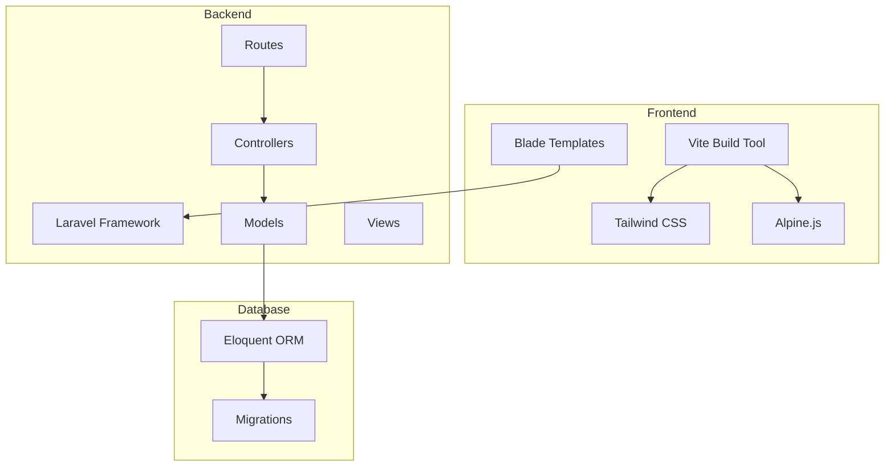
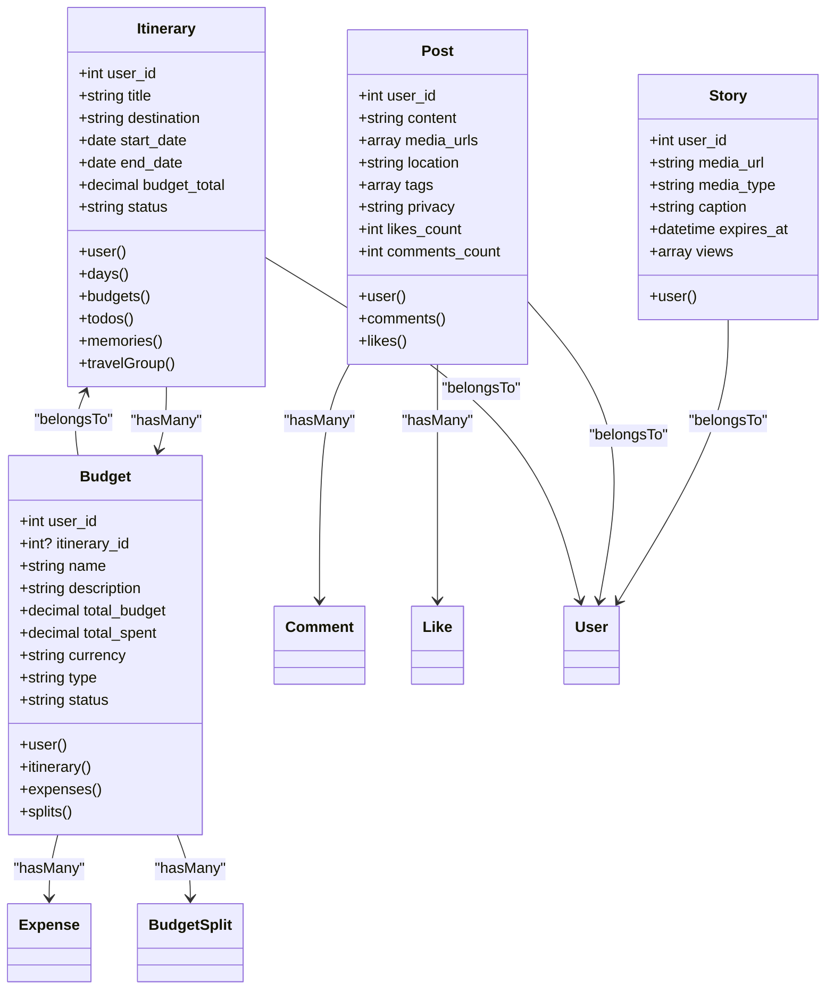
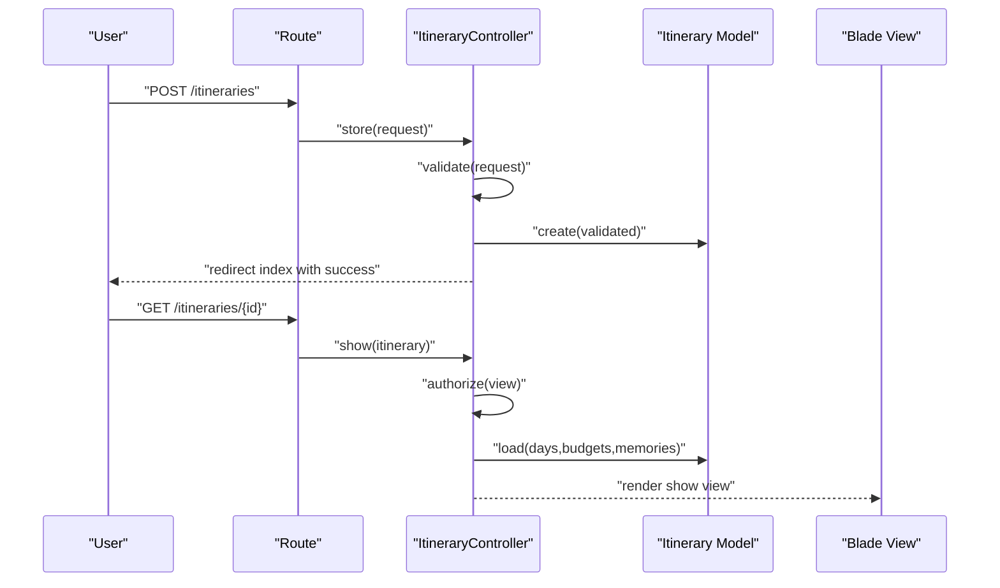
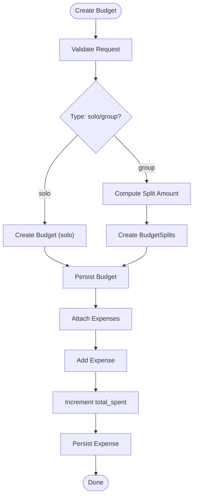
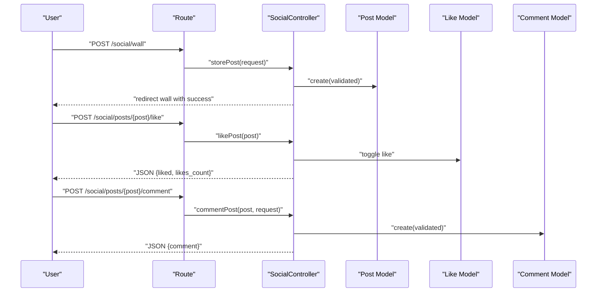
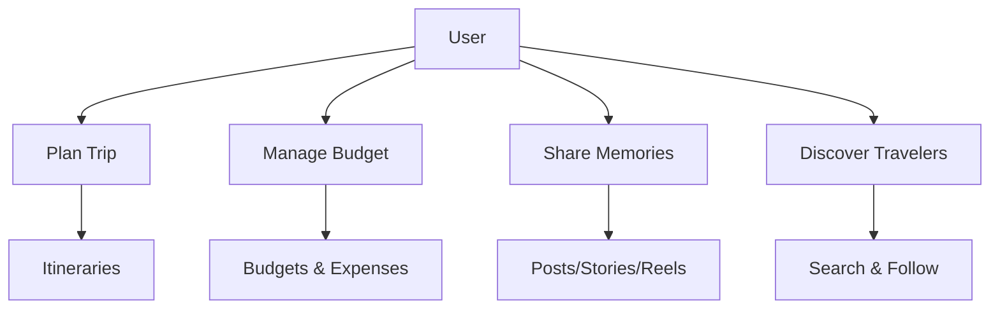
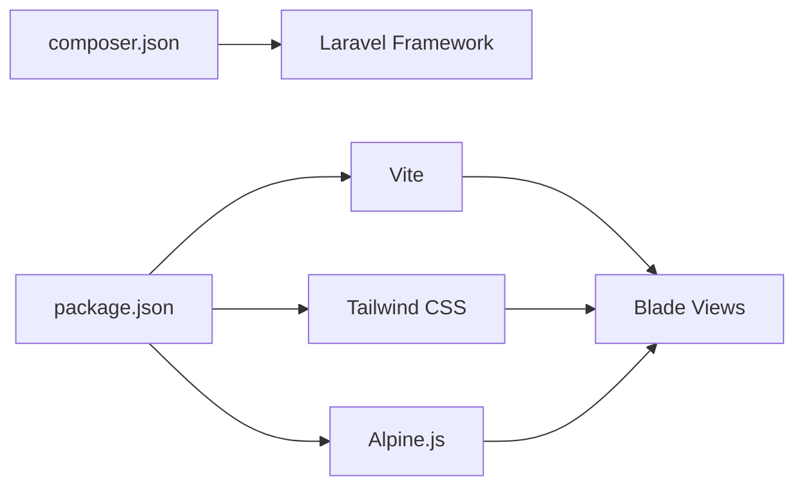

# Project Overview

<cite>
**Referenced Files in This Document**
- [README.md](file://README.md)
- [composer.json](file://composer.json)
- [package.json](file://package.json)
- [routes/web.php](file://routes/web.php)
- [app/Http/Controllers/ItineraryController.php](file://app/Http/Controllers/ItineraryController.php)
- [app/Http/Controllers/BudgetController.php](file://app/Http/Controllers/BudgetController.php)
- [app/Http/Controllers/SocialController.php](file://app/Http/Controllers/SocialController.php)
- [app/Models/Itinerary.php](file://app/Models/Itinerary.php)
- [app/Models/Budget.php](file://app/Models/Budget.php)
- [resources/views/layouts/app.blade.php](file://resources/views/layouts/app.blade.php)
- [resources/views/welcome.blade.php](file://resources/views/welcome.blade.php)
- [tailwind.config.js](file://tailwind.config.js)
- [vite.config.js](file://vite.config.js)
- [resources/js/app.js](file://resources/js/app.js)
</cite>

## Table of Contents
1. [Introduction](#introduction)
2. [Project Structure](#project-structure)
3. [Core Components](#core-components)
4. [Architecture Overview](#architecture-overview)
5. [Detailed Component Analysis](#detailed-component-analysis)
6. [Dependency Analysis](#dependency-analysis)
7. [Performance Considerations](#performance-considerations)
8. [Troubleshooting Guide](#troubleshooting-guide)
9. [Conclusion](#conclusion)

## Introduction
Travellers is a full-stack Laravel application designed as a travel social platform that seamlessly blends trip planning tools with social networking features. Its core value proposition centers on enabling users to:
- Plan trips with detailed itineraries and timelines
- Manage budgets collaboratively and track expenses
- Share memories through posts, stories, and reels
- Connect with fellow travelers via following and social interactions

Built with modern PHP and contemporary frontend technologies, the platform delivers a responsive, Instagram-inspired user experience while maintaining robust backend functionality powered by Laravel’s MVC architecture.

## Project Structure
The application follows Laravel’s conventional MVC structure with clear separation of concerns:
- Controllers handle HTTP requests and orchestrate business logic
- Models represent domain entities and encapsulate data relationships
- Views render the UI using Blade templates
- Routes define the application’s URL surface and middleware policies
- Frontend assets are managed via Vite with Tailwind CSS for styling and Alpine.js for interactivity

**Diagram sources**
- [routes/web.php:1-89](file://routes/web.php#L1-L89)
- [app/Http/Controllers/ItineraryController.php:1-88](file://app/Http/Controllers/ItineraryController.php#L1-L88)
- [app/Http/Controllers/BudgetController.php:1-215](file://app/Http/Controllers/BudgetController.php#L1-L215)
- [app/Http/Controllers/SocialController.php:1-179](file://app/Http/Controllers/SocialController.php#L1-L179)
- [app/Models/Itinerary.php:1-58](file://app/Models/Itinerary.php#L1-L58)
- [app/Models/Budget.php:1-48](file://app/Models/Budget.php#L1-L48)
- [resources/views/layouts/app.blade.php:1-232](file://resources/views/layouts/app.blade.php#L1-L232)
- [tailwind.config.js:1-73](file://tailwind.config.js#L1-L73)
- [vite.config.js:1-12](file://vite.config.js#L1-L12)
- [resources/js/app.js:1-8](file://resources/js/app.js#L1-L8)

**Section sources**
- [routes/web.php:1-89](file://routes/web.php#L1-L89)
- [resources/views/layouts/app.blade.php:1-232](file://resources/views/layouts/app.blade.php#L1-L232)

## Core Components
- Itinerary Management: Users can create, view, update, and delete itineraries with destinations, dates, budgets, and statuses. The system supports paginated lists and detailed views with related days, budgets, and memories.
- Budget Tracking: The platform enables solo and group budget creation with shared splits, expense logging, and real-time spending calculations. It provides filtering by itinerary and type, along with aggregated statistics.
- Social Features: Community wall, stories, and reels allow users to share experiences. Users can like posts, add comments, and manage privacy settings. Stories auto-expire after 24 hours.
- User Discovery: Built-in user search, suggestions, and follow/unfollow mechanisms foster community engagement.
- Frontend Experience: Tailwind CSS provides a cohesive design system with custom ocean/grass color themes. Alpine.js powers interactive UI behaviors, and Vite streamlines asset builds.

Practical examples:
- Planning a trip: Create an itinerary, set a destination and dates, and attach related budgets and memories.
- Managing expenses: Add expenses to a budget, categorize them, and track remaining balances.
- Sharing moments: Publish a post with media, tag locations, and adjust privacy to public or followers-only.
- Discovering travelers: Search users by name, view suggestions, and follow profiles to see curated content.

**Section sources**
- [app/Http/Controllers/ItineraryController.php:1-88](file://app/Http/Controllers/ItineraryController.php#L1-L88)
- [app/Http/Controllers/BudgetController.php:1-215](file://app/Http/Controllers/BudgetController.php#L1-L215)
- [app/Http/Controllers/SocialController.php:1-179](file://app/Http/Controllers/SocialController.php#L1-L179)
- [resources/views/layouts/app.blade.php:1-232](file://resources/views/layouts/app.blade.php#L1-L232)

## Architecture Overview
Travellers adheres to the MVC pattern:
- Model: Eloquent models define entity schemas and relationships (e.g., Itinerary, Budget, Post, Story).
- View: Blade templates render pages and components, integrating Tailwind styles and Alpine-driven interactivity.
- Controller: Route handlers process requests, enforce authorization, coordinate data retrieval, and return responses or redirects.

**Diagram sources**
- [app/Models/Itinerary.php:1-58](file://app/Models/Itinerary.php#L1-L58)
- [app/Models/Budget.php:1-48](file://app/Models/Budget.php#L1-L48)
- [app/Http/Controllers/ItineraryController.php:1-88](file://app/Http/Controllers/ItineraryController.php#L1-L88)
- [app/Http/Controllers/BudgetController.php:1-215](file://app/Http/Controllers/BudgetController.php#L1-L215)
- [app/Http/Controllers/SocialController.php:1-179](file://app/Http/Controllers/SocialController.php#L1-L179)

**Section sources**
- [app/Models/Itinerary.php:1-58](file://app/Models/Itinerary.php#L1-L58)
- [app/Models/Budget.php:1-48](file://app/Models/Budget.php#L1-L48)

## Detailed Component Analysis

### Itinerary Management Workflow
The itinerary lifecycle spans creation, editing, viewing, and deletion, with authorization checks and relationship loading.

**Diagram sources**
- [routes/web.php:32-33](file://routes/web.php#L32-L33)
- [app/Http/Controllers/ItineraryController.php:1-88](file://app/Http/Controllers/ItineraryController.php#L1-L88)
- [app/Models/Itinerary.php:1-58](file://app/Models/Itinerary.php#L1-L58)

**Section sources**
- [app/Http/Controllers/ItineraryController.php:1-88](file://app/Http/Controllers/ItineraryController.php#L1-L88)
- [routes/web.php:32-33](file://routes/web.php#L32-L33)

### Budget Creation and Expense Management
Budget creation supports solo and group modes with automatic split distribution and expense logging.

**Diagram sources**
- [app/Http/Controllers/BudgetController.php:1-215](file://app/Http/Controllers/BudgetController.php#L1-L215)
- [app/Models/Budget.php:1-48](file://app/Models/Budget.php#L1-L48)

**Section sources**
- [app/Http/Controllers/BudgetController.php:1-215](file://app/Http/Controllers/BudgetController.php#L1-L215)
- [app/Models/Budget.php:1-48](file://app/Models/Budget.php#L1-L48)

### Social Wall Interaction
Users can publish posts, toggle likes, add comments, and stories expire automatically.

**Diagram sources**
- [routes/web.php:70-80](file://routes/web.php#L70-L80)
- [app/Http/Controllers/SocialController.php:1-179](file://app/Http/Controllers/SocialController.php#L1-L179)

**Section sources**
- [app/Http/Controllers/SocialController.php:1-179](file://app/Http/Controllers/SocialController.php#L1-L179)
- [routes/web.php:70-80](file://routes/web.php#L70-L80)

### Conceptual Overview
The platform targets travelers who want to plan trips efficiently, manage finances collaboratively, and share experiences with a community. It caters to solo adventurers and group explorers alike, offering flexible privacy controls and engaging social features.

[No sources needed since this diagram shows conceptual workflow, not actual code structure]

## Dependency Analysis
The application’s technology stack integrates Laravel, Blade, Tailwind CSS, Alpine.js, and Vite:

- Laravel Framework 12.x: Core MVC framework and service container
- Blade Templating: Server-side rendering for dynamic views
- Tailwind CSS: Utility-first CSS framework with custom color palettes
- Alpine.js: Lightweight JavaScript framework for reactive UI behaviors
- Vite: Modern asset bundler and dev server

**Diagram sources**
- [composer.json:1-88](file://composer.json#L1-L88)
- [package.json:1-22](file://package.json#L1-L22)
- [tailwind.config.js:1-73](file://tailwind.config.js#L1-L73)
- [vite.config.js:1-12](file://vite.config.js#L1-L12)
- [resources/views/layouts/app.blade.php:1-232](file://resources/views/layouts/app.blade.php#L1-L232)

**Section sources**
- [composer.json:1-88](file://composer.json#L1-L88)
- [package.json:1-22](file://package.json#L1-L22)
- [tailwind.config.js:1-73](file://tailwind.config.js#L1-L73)
- [vite.config.js:1-12](file://vite.config.js#L1-L12)
- [resources/js/app.js:1-8](file://resources/js/app.js#L1-L8)

## Performance Considerations
- Pagination: Controllers use pagination for itineraries, budgets, and social feeds to limit payload sizes.
- Relationship Loading: Controllers eager-load related models (e.g., itinerary days, budget expenses) to reduce N+1 queries.
- Asset Optimization: Vite handles efficient builds and hot module replacement during development; Tailwind purges unused styles for production.
- Database Indexing: Migration files define appropriate indices for foreign keys and frequently queried columns.

[No sources needed since this section provides general guidance]

## Troubleshooting Guide
Common areas to inspect:
- Authentication and Authorization: Middleware and policy enforcement ensure secure access to sensitive actions (e.g., deleting posts, updating budgets).
- Validation Failures: Controllers validate incoming requests and return errors; ensure client-side and server-side validation align.
- Asset Pipeline: If styles or scripts are missing, rebuild assets using Vite and confirm Tailwind content paths match Blade templates.
- Database Migrations: Run migrations to ensure schema alignment with models and relationships.

**Section sources**
- [routes/web.php:14-86](file://routes/web.php#L14-L86)
- [app/Http/Controllers/BudgetController.php:49-92](file://app/Http/Controllers/BudgetController.php#L49-L92)
- [resources/views/layouts/app.blade.php:16-17](file://resources/views/layouts/app.blade.php#L16-L17)

## Conclusion
Travellers delivers a cohesive travel planning and social networking experience built on Laravel’s robust MVC architecture. By combining practical trip planning tools with engaging social features, it empowers users to organize journeys, manage costs, and connect with others—creating a vibrant community for explorers worldwide.