# Social Features

<cite>
**Referenced Files in This Document**
- [SocialController.php](file://app/Http/Controllers/SocialController.php)
- [Post.php](file://app/Models/Post.php)
- [Story.php](file://app/Models/Story.php)
- [Reel.php](file://app/Models/Reel.php)
- [Comment.php](file://app/Models/Comment.php)
- [Like.php](file://app/Models/Like.php)
- [User.php](file://app/Models/User.php)
- [PostPolicy.php](file://app/Policies/PostPolicy.php)
- [CommentPolicy.php](file://app/Policies/CommentPolicy.php)
- [LikePolicy.php](file://app/Policies/LikePolicy.php)
- [2026_04_21_132810_create_posts_table.php](file://database/migrations/2026_04_21_132810_create_posts_table.php)
- [2026_04_21_132811_create_stories_table.php](file://database/migrations/2026_04_21_132811_create_stories_table.php)
- [2026_04_21_132811_create_reels_table.php](file://database/migrations/2026_04_21_132811_create_reels_table.php)
- [2026_04_21_132820_create_comments_table.php](file://database/migrations/2026_04_21_132820_create_comments_table.php)
- [2026_04_21_132821_create_likes_table.php](file://database/migrations/2026_04_21_132821_create_likes_table.php)
- [wall.blade.php](file://resources/views/social/wall.blade.php)
</cite>

## Table of Contents
1. [Introduction](#introduction)
2. [Project Structure](#project-structure)
3. [Core Components](#core-components)
4. [Architecture Overview](#architecture-overview)
5. [Detailed Component Analysis](#detailed-component-analysis)
6. [Dependency Analysis](#dependency-analysis)
7. [Performance Considerations](#performance-considerations)
8. [Troubleshooting Guide](#troubleshooting-guide)
9. [Conclusion](#conclusion)
10. [Appendices](#appendices)

## Introduction
This document describes the social features system designed to drive community engagement and content sharing. It covers the community wall and feed, post creation and management, story sharing with 24-hour expiration, and reel video content. It also explains the comment and like systems with real-time interaction capabilities, the Post, Story, and Reel models including media handling and privacy controls, and how social content relates to user profiles, itineraries, and memories. Content discovery, trending features, and social graph management are addressed along with practical interaction scenarios and community-building strategies.

## Project Structure
The social system spans controllers, models, migrations, policies, and Blade views:
- Controller: SocialController orchestrates community wall, post/story/reel operations, and social interactions.
- Models: Post, Story, Reel, Comment, Like define data structures and relationships.
- Migrations: Define database schema for posts, stories, reels, comments, and likes.
- Policies: Enforce authorization for post/comment/like deletion.
- Views: wall.blade.php renders the community wall UI.

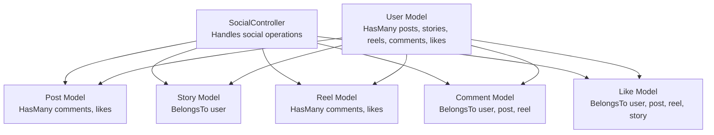

**Diagram sources**
- [SocialController.php:11-179](file://app/Http/Controllers/SocialController.php#L11-L179)
- [Post.php:9-44](file://app/Models/Post.php#L9-L44)
- [Story.php:8-34](file://app/Models/Story.php#L8-L34)
- [Reel.php:9-45](file://app/Models/Reel.php#L9-L45)
- [Comment.php:8-43](file://app/Models/Comment.php#L8-L43)
- [Like.php:8-37](file://app/Models/Like.php#L8-L37)
- [User.php:11-172](file://app/Models/User.php#L11-L172)

**Section sources**
- [SocialController.php:11-179](file://app/Http/Controllers/SocialController.php#L11-L179)
- [Post.php:9-44](file://app/Models/Post.php#L9-L44)
- [Story.php:8-34](file://app/Models/Story.php#L8-L34)
- [Reel.php:9-45](file://app/Models/Reel.php#L9-L45)
- [Comment.php:8-43](file://app/Models/Comment.php#L8-L43)
- [Like.php:8-37](file://app/Models/Like.php#L8-L37)
- [User.php:11-172](file://app/Models/User.php#L11-L172)

## Core Components
- Community Wall and Feed
  - Public posts are fetched with associated user, comments, and likes, paginated for performance.
  - Stories are fetched with active expiration checks and user context.
- Post Creation and Management
  - Validation ensures content, optional media URLs, location, tags, and privacy are set.
  - Defaults to user’s configured privacy if not provided.
  - Supports authorized deletion via policy.
- Story Sharing
  - 24-hour expiration is enforced via expires_at timestamp.
  - Supports image or video media types with captions.
- Reel Video Content
  - Stores video URL, thumbnail, caption, tags, counts, duration, and views.
- Comments and Likes
  - Nested comments supported via parent_id.
  - Like toggling updates counters and returns JSON for AJAX-friendly UX.
- Privacy Controls
  - Post privacy supports public, friends, private; defaults applied from user preferences.
- Content Moderation Hooks
  - Authorization policies govern who can delete posts, comments, and likes.

**Section sources**
- [SocialController.php:16-29](file://app/Http/Controllers/SocialController.php#L16-L29)
- [SocialController.php:34-55](file://app/Http/Controllers/SocialController.php#L34-L55)
- [SocialController.php:60-89](file://app/Http/Controllers/SocialController.php#L60-L89)
- [SocialController.php:94-118](file://app/Http/Controllers/SocialController.php#L94-L118)
- [SocialController.php:123-131](file://app/Http/Controllers/SocialController.php#L123-L131)
- [SocialController.php:136-144](file://app/Http/Controllers/SocialController.php#L136-L144)
- [SocialController.php:149-164](file://app/Http/Controllers/SocialController.php#L149-L164)
- [SocialController.php:169-177](file://app/Http/Controllers/SocialController.php#L169-L177)
- [Post.php:11-27](file://app/Models/Post.php#L11-L27)
- [Story.php:10-22](file://app/Models/Story.php#L10-L22)
- [Reel.php:11-28](file://app/Models/Reel.php#L11-L28)
- [PostPolicy.php:13-24](file://app/Policies/PostPolicy.php#L13-L24)
- [CommentPolicy.php:13-16](file://app/Policies/CommentPolicy.php#L13-L16)
- [LikePolicy.php:13-16](file://app/Policies/LikePolicy.php#L13-L16)

## Architecture Overview
The social system follows a layered MVC pattern:
- Controller actions handle requests, validate input, enforce authorization, and orchestrate model operations.
- Models encapsulate relationships, casting, and helper methods.
- Migrations define schema and indexes for performance.
- Views render UI for community wall, stories, and reels.

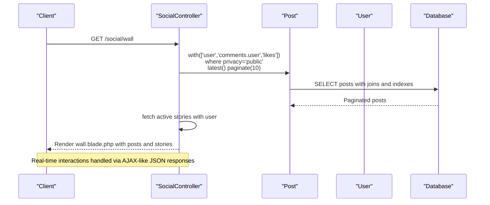

**Diagram sources**
- [SocialController.php:16-29](file://app/Http/Controllers/SocialController.php#L16-L29)
- [wall.blade.php:1-204](file://resources/views/social/wall.blade.php#L1-L204)

**Section sources**
- [SocialController.php:16-29](file://app/Http/Controllers/SocialController.php#L16-L29)
- [wall.blade.php:1-204](file://resources/views/social/wall.blade.php#L1-L204)

## Detailed Component Analysis

### SocialController Operations
Key responsibilities:
- Community wall: fetches public posts and active stories.
- Post lifecycle: create, like toggle, comment, delete with authorization.
- Story lifecycle: create with 24-hour expiry, list stories.
- Reels feed: latest reels for discovery.

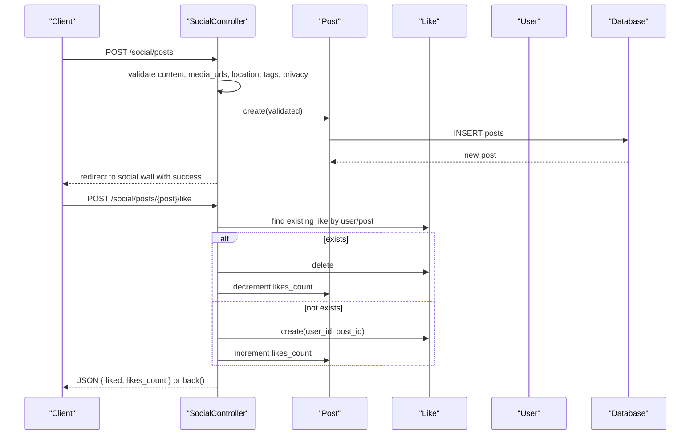

**Diagram sources**
- [SocialController.php:34-55](file://app/Http/Controllers/SocialController.php#L34-L55)
- [SocialController.php:60-89](file://app/Http/Controllers/SocialController.php#L60-L89)

**Section sources**
- [SocialController.php:34-55](file://app/Http/Controllers/SocialController.php#L34-L55)
- [SocialController.php:60-89](file://app/Http/Controllers/SocialController.php#L60-L89)
- [SocialController.php:94-118](file://app/Http/Controllers/SocialController.php#L94-L118)
- [SocialController.php:123-131](file://app/Http/Controllers/SocialController.php#L123-L131)

### Post Model
Responsibilities:
- Fillable fields include user association, content, media URLs, location, tags, privacy, and counters.
- Casts media_urls and tags as arrays; counts as integers.
- Relationships: belongs to User, has many Comments and Likes.

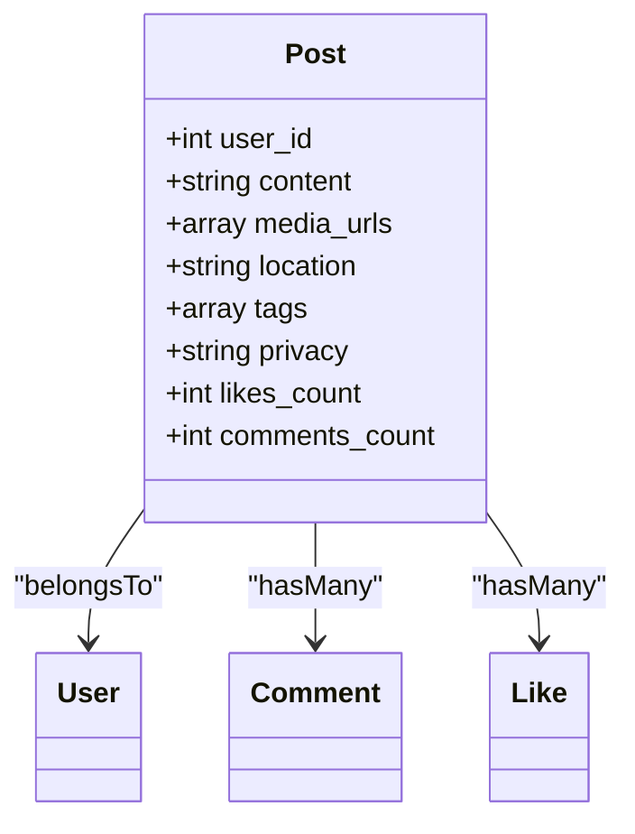

**Diagram sources**
- [Post.php:11-27](file://app/Models/Post.php#L11-L27)
- [Post.php:29-42](file://app/Models/Post.php#L29-L42)

**Section sources**
- [Post.php:11-27](file://app/Models/Post.php#L11-L27)
- [Post.php:29-42](file://app/Models/Post.php#L29-L42)

### Story Model
Responsibilities:
- Fillable fields include user association, media URL/type, caption, expires_at, and views.
- Casts expires_at to datetime and views to array.
- Relationship: belongs to User.
- Helper method to detect expiration.

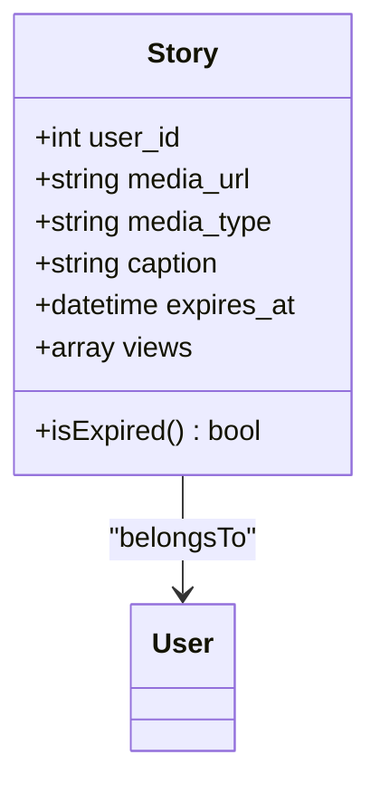

**Diagram sources**
- [Story.php:10-22](file://app/Models/Story.php#L10-L22)
- [Story.php:24-32](file://app/Models/Story.php#L24-L32)

**Section sources**
- [Story.php:10-22](file://app/Models/Story.php#L10-L22)
- [Story.php:24-32](file://app/Models/Story.php#L24-L32)

### Reel Model
Responsibilities:
- Fillable fields include user association, video/thumbnail URLs, caption, tags, counters, duration, and views count.
- Casts tags, counts, and views count to appropriate types.
- Relationships: belongs to User, has many Comments and Likes.

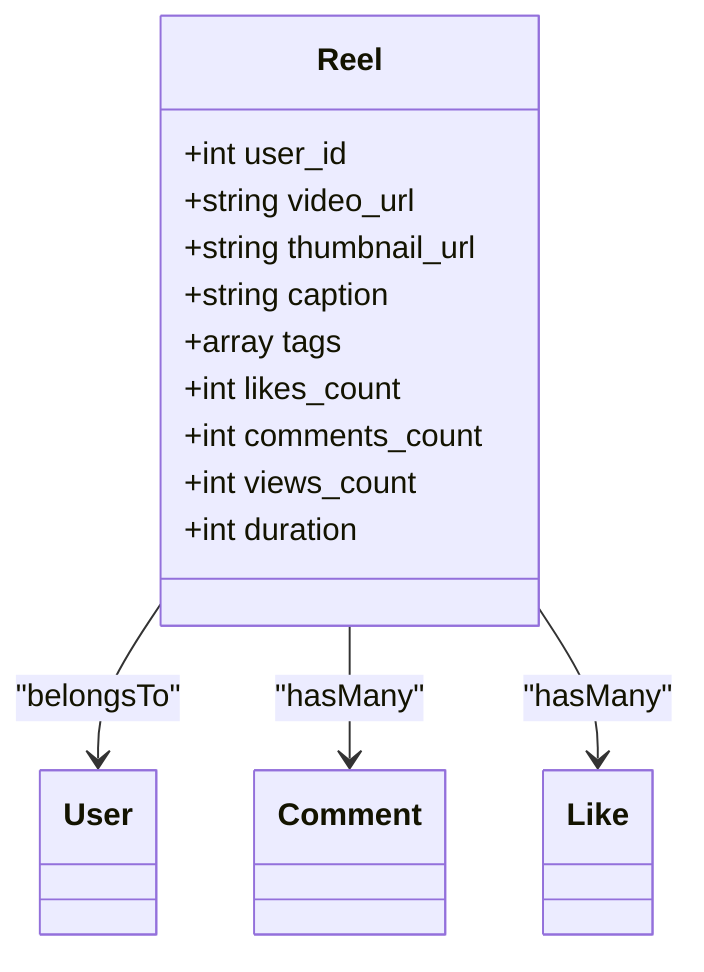

**Diagram sources**
- [Reel.php:11-28](file://app/Models/Reel.php#L11-L28)
- [Reel.php:30-43](file://app/Models/Reel.php#L30-L43)

**Section sources**
- [Reel.php:11-28](file://app/Models/Reel.php#L11-L28)
- [Reel.php:30-43](file://app/Models/Reel.php#L30-L43)

### Comment Model
Responsibilities:
- Fillable fields include user, post, reel, content, and optional parent_id for nested replies.
- Relationships: belongs to User, Post, Reel; self-referencing parent and replies.

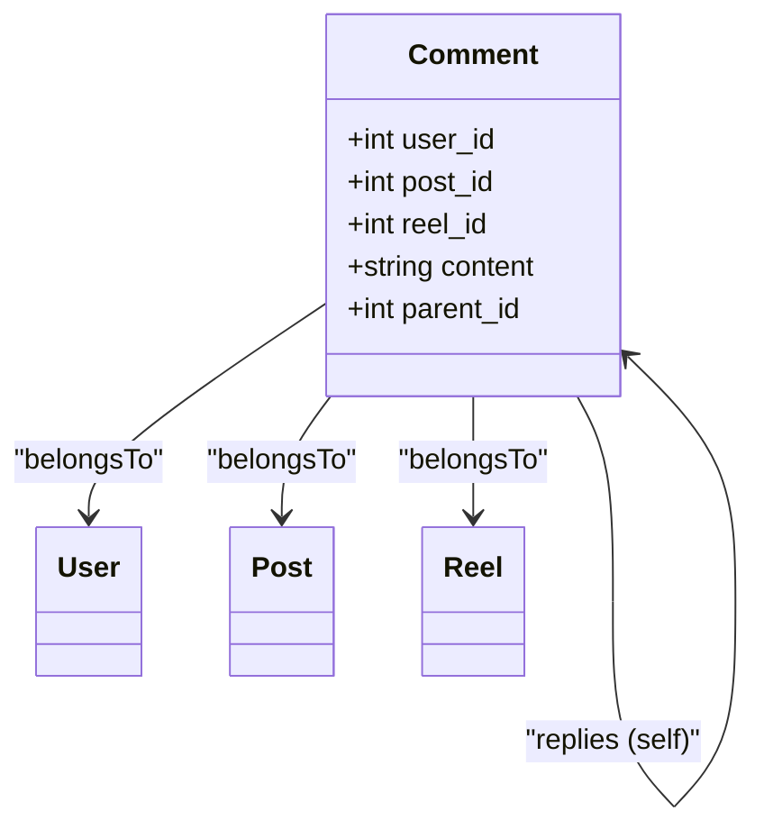

**Diagram sources**
- [Comment.php:10-16](file://app/Models/Comment.php#L10-L16)
- [Comment.php:18-41](file://app/Models/Comment.php#L18-L41)

**Section sources**
- [Comment.php:10-16](file://app/Models/Comment.php#L10-L16)
- [Comment.php:18-41](file://app/Models/Comment.php#L18-L41)

### Like Model
Responsibilities:
- Fillable fields include user, post, reel, story.
- Unique constraints per entity ensure one like per user per entity.
- Relationships: belongs to User, Post, Reel, Story.

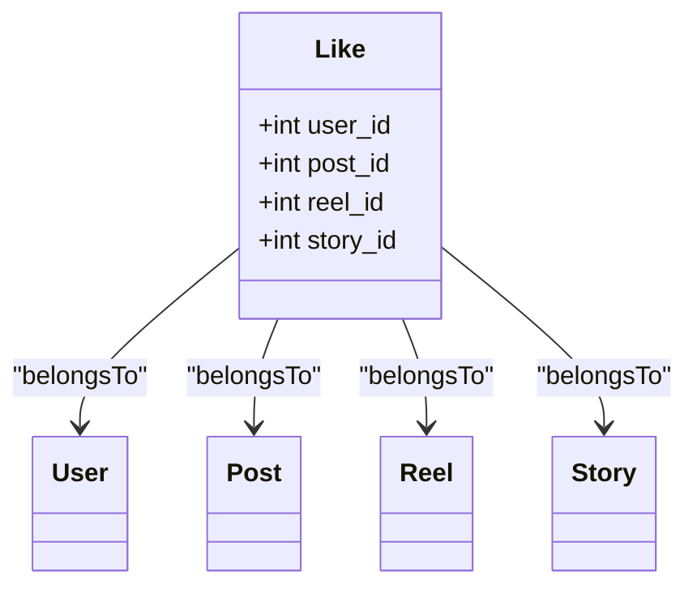

**Diagram sources**
- [Like.php:10-15](file://app/Models/Like.php#L10-L15)
- [Like.php:17-35](file://app/Models/Like.php#L17-L35)

**Section sources**
- [Like.php:10-15](file://app/Models/Like.php#L10-L15)
- [Like.php:17-35](file://app/Models/Like.php#L17-L35)

### User Model and Social Graph
Responsibilities:
- Has many posts, stories, reels, comments, likes.
- Follow relationships: followers and following via pivot table.
- Helpers for subscription and storage limits.

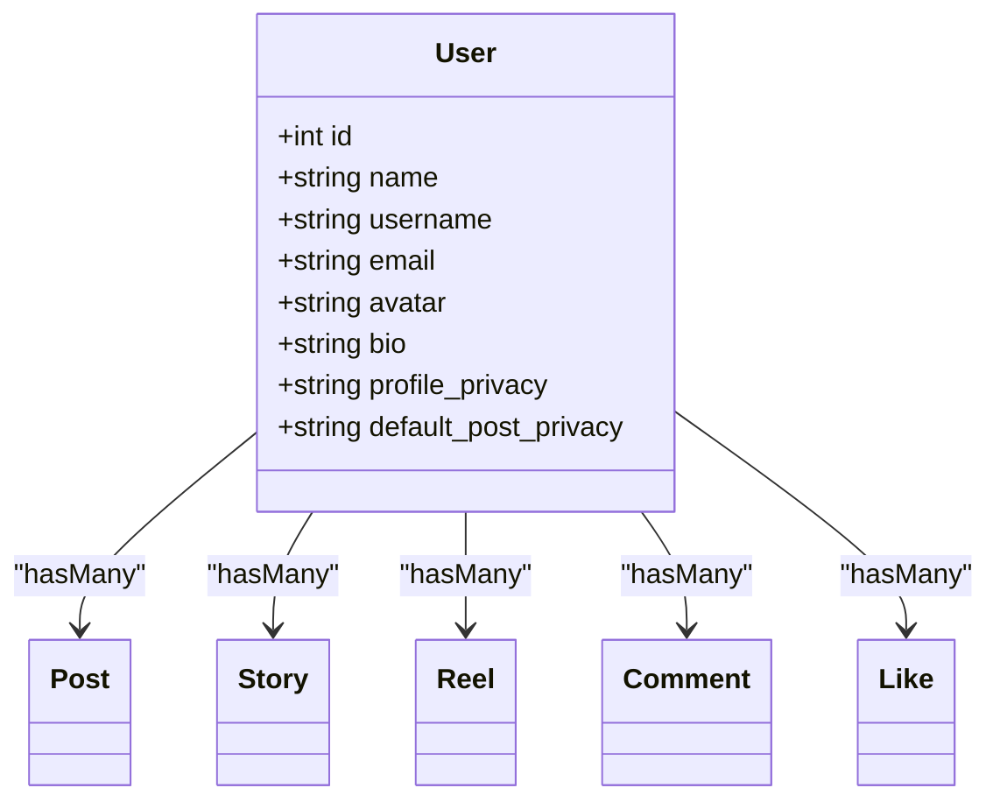

**Diagram sources**
- [User.php:21-36](file://app/Models/User.php#L21-L36)
- [User.php:85-113](file://app/Models/User.php#L85-L113)
- [User.php:130-149](file://app/Models/User.php#L130-L149)

**Section sources**
- [User.php:21-36](file://app/Models/User.php#L21-L36)
- [User.php:85-113](file://app/Models/User.php#L85-L113)
- [User.php:130-149](file://app/Models/User.php#L130-L149)

### Authorization Policies
- PostPolicy: only the author can update/delete posts.
- CommentPolicy: only the author can delete comments.
- LikePolicy: only the creator can delete likes.

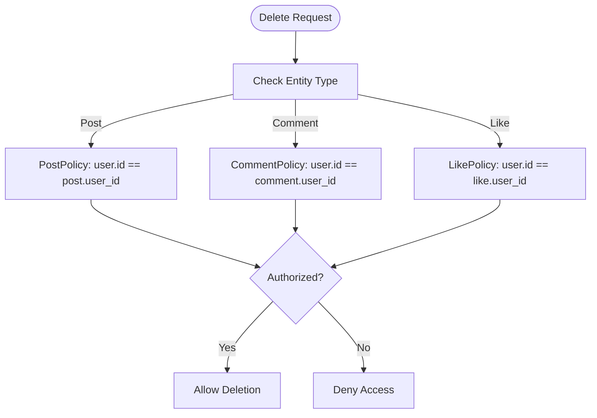

**Diagram sources**
- [PostPolicy.php:13-24](file://app/Policies/PostPolicy.php#L13-L24)
- [CommentPolicy.php:13-16](file://app/Policies/CommentPolicy.php#L13-L16)
- [LikePolicy.php:13-16](file://app/Policies/LikePolicy.php#L13-L16)

**Section sources**
- [PostPolicy.php:13-24](file://app/Policies/PostPolicy.php#L13-L24)
- [CommentPolicy.php:13-16](file://app/Policies/CommentPolicy.php#L13-L16)
- [LikePolicy.php:13-16](file://app/Policies/LikePolicy.php#L13-L16)

### Database Schema and Indexes
- Posts: user_id, content, media_urls, location, tags, privacy, counters, timestamps; indexes on user_id+created_at and privacy.
- Stories: user_id, media_url, media_type, caption, expires_at, views; indexes on user_id+expires_at.
- Reels: user_id, video_url, thumbnail_url, caption, tags, counters, duration, timestamps; indexes on user_id+created_at.
- Comments: user_id, post_id/reel_id, content, parent_id; indexes for performance.
- Likes: user_id, post_id/reel_id/story_id; unique constraints per entity.

```mermaid
erDiagram
USERS {
int id PK
string name
string username
string email
}
POSTS {
int id PK
int user_id FK
text content
json media_urls
string location
json tags
enum privacy
int likes_count
int comments_count
}
STORIES {
int id PK
int user_id FK
string media_url
enum media_type
text caption
timestamp expires_at
json views
}
REELS {
int id PK
int user_id FK
string video_url
string thumbnail_url
text caption
json tags
int likes_count
int comments_count
int views_count
int duration
}
COMMENTS {
int id PK
int user_id FK
int post_id FK
int reel_id FK
text content
int parent_id FK
}
LIKES {
int id PK
int user_id FK
int post_id FK
int reel_id FK
int story_id FK
}
USERS ||--o{ POSTS : "has many"
USERS ||--o{ STORIES : "has many"
USERS ||--o{ REELS : "has many"
USERS ||--o{ COMMENTS : "has many"
USERS ||--o{ LIKES : "has many"
POSTS ||--o{ COMMENTS : "has many"
REELS ||--o{ COMMENTS : "has many"
COMMENTS ||--o{ COMMENTS : "replies" : "parent_id"
```

**Diagram sources**
- [2026_04_21_132810_create_posts_table.php:14-28](file://database/migrations/2026_04_21_132810_create_posts_table.php#L14-L28)
- [2026_04_21_132811_create_stories_table.php:14-25](file://database/migrations/2026_04_21_132811_create_stories_table.php#L14-L25)
- [2026_04_21_132811_create_reels_table.php:14-28](file://database/migrations/2026_04_21_132811_create_reels_table.php#L14-L28)
- [2026_04_21_132820_create_comments_table.php:14-26](file://database/migrations/2026_04_21_132820_create_comments_table.php#L14-L26)
- [2026_04_21_132821_create_likes_table.php:14-25](file://database/migrations/2026_04_21_132821_create_likes_table.php#L14-L25)

**Section sources**
- [2026_04_21_132810_create_posts_table.php:14-28](file://database/migrations/2026_04_21_132810_create_posts_table.php#L14-L28)
- [2026_04_21_132811_create_stories_table.php:14-25](file://database/migrations/2026_04_21_132811_create_stories_table.php#L14-L25)
- [2026_04_21_132811_create_reels_table.php:14-28](file://database/migrations/2026_04_21_132811_create_reels_table.php#L14-L28)
- [2026_04_21_132820_create_comments_table.php:14-26](file://database/migrations/2026_04_21_132820_create_comments_table.php#L14-L26)
- [2026_04_21_132821_create_likes_table.php:14-25](file://database/migrations/2026_04_21_132821_create_likes_table.php#L14-L25)

### Community Wall UI and Interaction
The wall view provides:
- Stories bar with Instagram-style horizontal scrolling.
- Post creation box with media and location options.
- Feed rendering with action buttons, likes, comments preview, and timestamps.
- Placeholder visuals for media fallback.

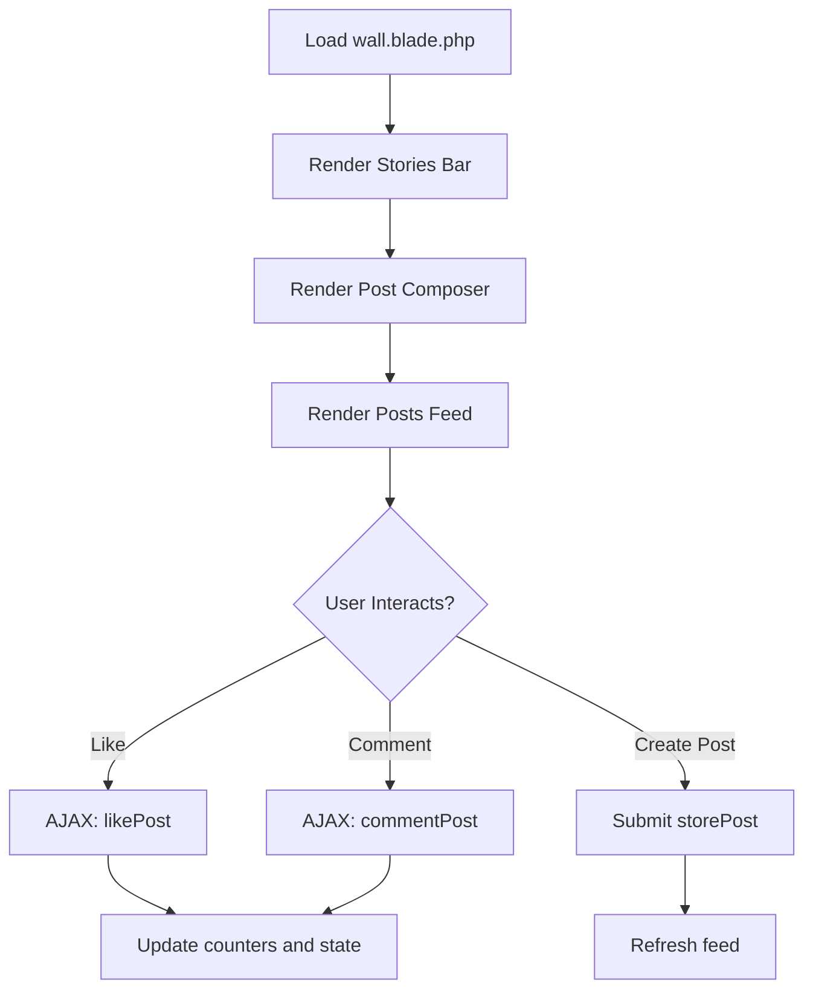

**Diagram sources**
- [wall.blade.php:1-204](file://resources/views/social/wall.blade.php#L1-L204)
- [SocialController.php:60-89](file://app/Http/Controllers/SocialController.php#L60-L89)
- [SocialController.php:94-118](file://app/Http/Controllers/SocialController.php#L94-L118)
- [SocialController.php:34-55](file://app/Http/Controllers/SocialController.php#L34-L55)

**Section sources**
- [wall.blade.php:1-204](file://resources/views/social/wall.blade.php#L1-L204)
- [SocialController.php:60-89](file://app/Http/Controllers/SocialController.php#L60-L89)
- [SocialController.php:94-118](file://app/Http/Controllers/SocialController.php#L94-L118)
- [SocialController.php:34-55](file://app/Http/Controllers/SocialController.php#L34-L55)

## Dependency Analysis
- Controller depends on models for data operations and on policies for authorization.
- Models depend on Eloquent relationships and casts.
- Migrations define foreign keys and unique constraints ensuring referential integrity.
- Views depend on controller-provided data and route helpers.

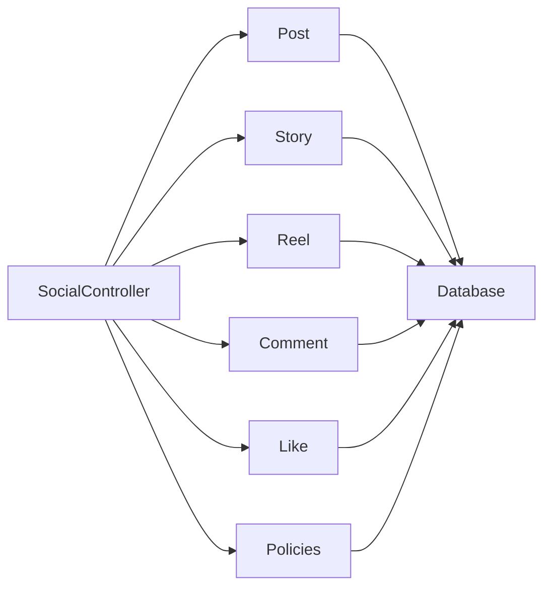

**Diagram sources**
- [SocialController.php:5-9](file://app/Http/Controllers/SocialController.php#L5-L9)
- [PostPolicy.php:5-6](file://app/Policies/PostPolicy.php#L5-L6)
- [CommentPolicy.php:5-6](file://app/Policies/CommentPolicy.php#L5-L6)
- [LikePolicy.php:5-6](file://app/Policies/LikePolicy.php#L5-L6)

**Section sources**
- [SocialController.php:5-9](file://app/Http/Controllers/SocialController.php#L5-L9)
- [PostPolicy.php:5-6](file://app/Policies/PostPolicy.php#L5-L6)
- [CommentPolicy.php:5-6](file://app/Policies/CommentPolicy.php#L5-L6)
- [LikePolicy.php:5-6](file://app/Policies/LikePolicy.php#L5-L6)

## Performance Considerations
- Pagination on posts reduces load on the community wall.
- Indexes on posts (user_id, created_at), stories (user_id, expires_at), reels (user_id, created_at), and comments (post_id, reel_id, parent_id) improve query performance.
- Casting arrays and counters minimizes ORM overhead.
- Unique constraints on likes prevent duplicates and support efficient toggling.

[No sources needed since this section provides general guidance]

## Troubleshooting Guide
- Post not visible on wall
  - Check privacy setting; wall filters by public posts.
  - Verify user_id association and timestamps.
- Like toggle not updating
  - Ensure AJAX request targets the correct endpoint and receives JSON response.
  - Confirm unique constraints and like existence logic.
- Comment not appearing
  - Validate nested comment parent_id and post/reel association.
  - Confirm comment_count increment on creation.
- Story not showing
  - Confirm expires_at is in the future and user association is present.
- Authorization errors
  - Verify policies allow the current user to delete posts/comments/likes.

**Section sources**
- [SocialController.php:18-21](file://app/Http/Controllers/SocialController.php#L18-L21)
- [SocialController.php:63-78](file://app/Http/Controllers/SocialController.php#L63-L78)
- [SocialController.php:101-108](file://app/Http/Controllers/SocialController.php#L101-L108)
- [SocialController.php:157-158](file://app/Http/Controllers/SocialController.php#L157-L158)
- [PostPolicy.php:13-24](file://app/Policies/PostPolicy.php#L13-L24)
- [CommentPolicy.php:13-16](file://app/Policies/CommentPolicy.php#L13-L16)
- [LikePolicy.php:13-16](file://app/Policies/LikePolicy.php#L13-L16)

## Conclusion
The social features system integrates community wall feeds, posts, stories, and reels with robust models, policies, and migrations. It supports privacy controls, media handling, real-time interactions, and scalable indexing. The architecture enables content discovery, engagement metrics, and social graph management while maintaining clear authorization boundaries.

[No sources needed since this section summarizes without analyzing specific files]

## Appendices

### Common Social Interaction Scenarios
- Publishing a post with images and location
  - Use the post creation endpoint with validated content and media URLs.
  - Privacy defaults to user preference if unspecified.
- Liking a post
  - Toggle like via the dedicated endpoint; counters update automatically.
- Commenting on a post
  - Submit comment content; optionally reply to another comment using parent_id.
- Posting a story
  - Provide media URL, type, and caption; expires after 24 hours.
- Discovering reels
  - Browse the reels feed to see latest videos with engagement metrics.

**Section sources**
- [SocialController.php:34-55](file://app/Http/Controllers/SocialController.php#L34-L55)
- [SocialController.php:60-89](file://app/Http/Controllers/SocialController.php#L60-L89)
- [SocialController.php:94-118](file://app/Http/Controllers/SocialController.php#L94-L118)
- [SocialController.php:149-164](file://app/Http/Controllers/SocialController.php#L149-L164)
- [SocialController.php:169-177](file://app/Http/Controllers/SocialController.php#L169-L177)

### Community Building Strategies
- Encourage storytelling with location tagging and hashtags.
- Promote engagement by highlighting posts with high likes/comments.
- Use stories to showcase daily travel moments with timely visibility.
- Feature reels to drive discovery and organic sharing.
- Respect privacy settings to maintain trust and safety.

[No sources needed since this section provides general guidance]