# Social Features

<cite>
**Referenced Files in This Document**
- [web.php](file://routes/web.php)
- [SocialController.php](file://app/Http/Controllers/SocialController.php)
- [SocialService.php](file://app/Services/SocialService.php)
- [StorePostRequest.php](file://app/Http/Requests/StorePostRequest.php)
- [StoreCommentRequest.php](file://app/Http/Requests/StoreCommentRequest.php)
- [Post.php](file://app/Models/Post.php)
- [Story.php](file://app/Models/Story.php)
- [Reel.php](file://app/Models/Reel.php)
- [Comment.php](file://app/Models/Comment.php)
- [Like.php](file://app/Models/Like.php)
- [User.php](file://app/Models/User.php)
- [PostPolicy.php](file://app/Policies/PostPolicy.php)
- [CommentPolicy.php](file://app/Policies/CommentPolicy.php)
- [LikePolicy.php](file://app/Policies/LikePolicy.php)
- [2026_04_21_132810_create_posts_table.php](file://database/migrations/2026_04_21_132810_create_posts_table.php)
- [2026_04_21_132811_create_stories_table.php](file://database/migrations/2026_04_21_132811_create_stories_table.php)
- [2026_04_21_132811_create_reels_table.php](file://database/migrations/2026_04_21_132811_create_reels_table.php)
- [2026_04_21_132820_create_comments_table.php](file://database/migrations/2026_04_21_132820_create_comments_table.php)
- [2026_04_21_132821_create_likes_table.php](file://database/migrations/2026_04_21_132821_create_likes_table.php)
- [wall.blade.php](file://resources/views/social/wall.blade.php)
- [stories.blade.php](file://resources/views/social/stories.blade.php)
- [reels.blade.php](file://resources/views/social/reels.blade.php)
</cite>

## Update Summary
**Changes Made**
- Updated controller architecture to use Form Request classes (StorePostRequest, StoreCommentRequest) for centralized validation
- Introduced SocialService for business logic delegation and dependency injection
- Modernized controller methods with improved separation of concerns
- Enhanced validation with custom error messages and comprehensive rule sets
- Maintained existing routing configuration while improving internal architecture

## Table of Contents
1. [Introduction](#introduction)
2. [Project Structure](#project-structure)
3. [Core Components](#core-components)
4. [Architecture Overview](#architecture-overview)
5. [Detailed Component Analysis](#detailed-component-analysis)
6. [Dependency Analysis](#dependency-analysis)
7. [Performance Considerations](#performance-considerations)
8. [Troubleshooting Guide](#troubleshooting-guide)
9. [Conclusion](#conclusion)
10. [Appendices](#appendices)

## Introduction
This document describes the social features system designed to drive community engagement and content sharing. The system has been modernized with a service-oriented architecture featuring centralized validation through Form Request classes and business logic delegation to SocialService. It covers the community wall and feed, post creation and management, story sharing with 24-hour expiration, and reel video content. The comment and like systems now feature enhanced real-time interaction capabilities with improved validation and error handling. The Post, Story, and Reel models include comprehensive media handling, privacy controls, and content moderation features. The system maintains relationships with user profiles, itineraries, and memories while supporting content discovery, trending features, and social graph management.

**Updated** The social features system now implements a modernized architecture with Form Request validation, dependency injection, and centralized business logic through SocialService, providing improved maintainability and testability.

## Project Structure
The social system follows a modernized layered architecture with clear separation of concerns:
- **Controller Layer**: SocialController handles HTTP requests and delegates business logic to SocialService
- **Service Layer**: SocialService contains all business operations with dependency injection
- **Validation Layer**: Form Request classes (StorePostRequest, StoreCommentRequest) provide centralized validation
- **Model Layer**: Post, Story, Reel, Comment, Like define data structures and relationships
- **Policy Layer**: Authorization enforcement for sensitive operations
- **View Layer**: Blade templates for social UI components

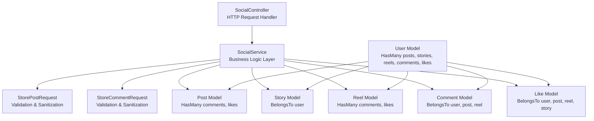

**Diagram sources**
- [SocialController.php:15-19](file://app/Http/Controllers/SocialController.php#L15-L19)
- [SocialService.php:12-164](file://app/Services/SocialService.php#L12-L164)
- [StorePostRequest.php:8-49](file://app/Http/Requests/StorePostRequest.php#L8-L49)
- [StoreCommentRequest.php:8-42](file://app/Http/Requests/StoreCommentRequest.php#L8-L42)

**Section sources**
- [SocialController.php:15-19](file://app/Http/Controllers/SocialController.php#L15-L19)
- [SocialService.php:12-164](file://app/Services/SocialService.php#L12-L164)
- [StorePostRequest.php:8-49](file://app/Http/Requests/StorePostRequest.php#L8-L49)
- [StoreCommentRequest.php:8-42](file://app/Http/Requests/StoreCommentRequest.php#L8-L42)

## Core Components
- **Modernized Controller Architecture**
  - SocialController uses dependency injection with SocialService constructor
  - Form Request classes handle all validation logic, returning sanitized data
  - Clear separation between HTTP handling and business logic
- **Centralized Business Logic**
  - SocialService encapsulates all social operations (createPost, toggleLike, addComment, etc.)
  - Transactional operations ensure data consistency
  - Reusable business rules across different controller actions
- **Enhanced Validation System**
  - StorePostRequest validates content length, media URLs, location, tags, and privacy
  - StoreCommentRequest validates comment content and parent comment relationships
  - Custom error messages provide clear user feedback
- **Community Wall and Feed**
  - Public posts with associated user, comments, and likes, paginated for performance
  - Active stories with expiration checking and user context
- **Post Creation and Management**
  - Comprehensive validation ensures content quality and security
  - Privacy defaults to user preferences when not specified
  - Authorized deletion via PostPolicy enforcement
- **Story Sharing**
  - 24-hour expiration enforced via expires_at timestamp
  - Supports image or video media types with caption validation
- **Reel Video Content**
  - Video URL, thumbnail, caption, tags, counts, duration, and views management
- **Comments and Likes**
  - Nested comment support with parent_id relationships
  - Like toggling with transactional updates and JSON responses for AJAX
- **Privacy Controls**
  - Post privacy supports public, followers, private with strict validation
  - Default privacy settings from user preferences
- **Content Moderation**
  - Authorization policies govern deletion operations
  - Transactional operations prevent orphaned records

**Updated** The social system now features a modernized architecture with centralized validation, dependency injection, and service layer separation for improved maintainability and scalability.

**Section sources**
- [SocialController.php:34-43](file://app/Http/Controllers/SocialController.php#L34-L43)
- [SocialController.php:62-78](file://app/Http/Controllers/SocialController.php#L62-L78)
- [SocialService.php:21-32](file://app/Services/SocialService.php#L21-L32)
- [SocialService.php:41-73](file://app/Services/SocialService.php#L41-L73)
- [StorePostRequest.php:23-34](file://app/Http/Requests/StorePostRequest.php#L23-L34)
- [StoreCommentRequest.php:23-29](file://app/Http/Requests/StoreCommentRequest.php#L23-L29)

## Architecture Overview
The social system implements a modernized MVC pattern with clear separation of concerns and dependency injection:
- **Controller Layer**: Handles HTTP requests, validates input via Form Requests, and orchestrates service operations
- **Service Layer**: Contains all business logic with transactional operations and reusable business rules
- **Validation Layer**: Form Request classes provide centralized validation with custom error messages
- **Data Layer**: Models with relationships, casting, and helper methods
- **Authorization Layer**: Policies enforce access control for sensitive operations

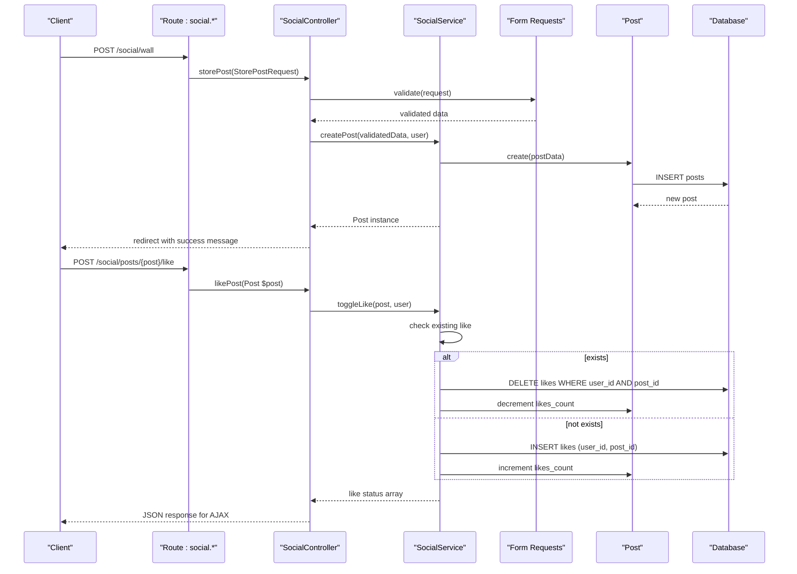

**Updated** The architecture now features dependency injection, centralized validation, and service layer separation for improved maintainability and testability.

**Diagram sources**
- [web.php:48-57](file://routes/web.php#L48-L57)
- [SocialController.php:34-43](file://app/Http/Controllers/SocialController.php#L34-L43)
- [SocialController.php:48-57](file://app/Http/Controllers/SocialController.php#L48-L57)
- [SocialService.php:21-32](file://app/Services/SocialService.php#L21-L32)
- [SocialService.php:41-73](file://app/Services/SocialService.php#L41-L73)

**Section sources**
- [web.php:48-57](file://routes/web.php#L48-L57)
- [SocialController.php:34-43](file://app/Http/Controllers/SocialController.php#L34-L43)
- [SocialController.php:48-57](file://app/Http/Controllers/SocialController.php#L48-L57)
- [SocialService.php:21-32](file://app/Services/SocialService.php#L21-L32)
- [SocialService.php:41-73](file://app/Services/SocialService.php#L41-L73)

## Detailed Component Analysis

### Modernized SocialController Operations
The SocialController now implements dependency injection and delegates all business logic to SocialService:
- **Constructor Injection**: SocialController receives SocialService instance via dependency injection
- **Form Request Validation**: All controller methods accept Form Request objects for validation
- **Service Delegation**: Business operations are performed through SocialService methods
- **Authorization**: Direct policy enforcement for sensitive operations like post deletion

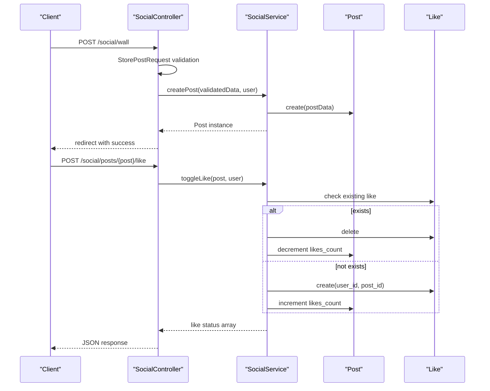

**Updated** The controller architecture now features modern dependency injection, centralized validation, and service layer delegation for improved separation of concerns.

**Diagram sources**
- [SocialController.php:17-19](file://app/Http/Controllers/SocialController.php#L17-L19)
- [SocialController.php:34-43](file://app/Http/Controllers/SocialController.php#L34-L43)
- [SocialController.php:48-57](file://app/Http/Controllers/SocialController.php#L48-L57)
- [SocialService.php:21-32](file://app/Services/SocialService.php#L21-L32)
- [SocialService.php:41-73](file://app/Services/SocialService.php#L41-L73)

**Section sources**
- [SocialController.php:17-19](file://app/Http/Controllers/SocialController.php#L17-L19)
- [SocialController.php:34-43](file://app/Http/Controllers/SocialController.php#L34-L43)
- [SocialController.php:48-57](file://app/Http/Controllers/SocialController.php#L48-L57)
- [SocialController.php:62-78](file://app/Http/Controllers/SocialController.php#L62-L78)
- [SocialController.php:83-91](file://app/Http/Controllers/SocialController.php#L83-L91)

### SocialService Business Logic
SocialService encapsulates all social operations with transactional consistency:
- **Transactional Operations**: Database transactions ensure data integrity for complex operations
- **Reusable Business Rules**: Centralized logic prevents duplication across controllers
- **Return Type Consistency**: Methods return appropriate data types for controller consumption
- **Error Handling**: Business logic handles edge cases and validation failures gracefully

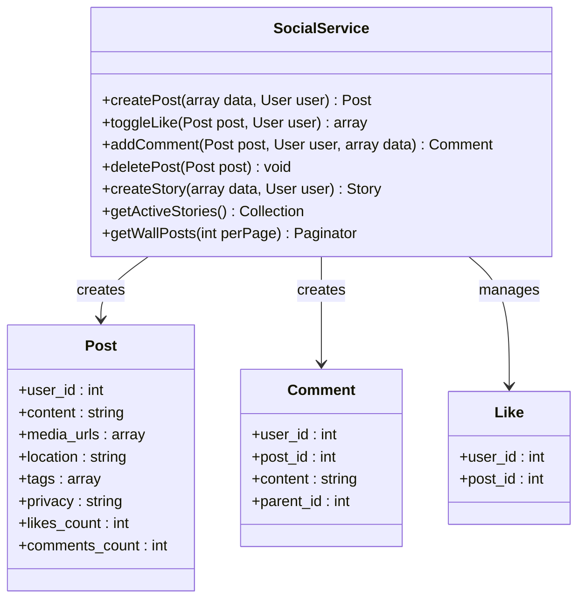

**Diagram sources**
- [SocialService.php:12-164](file://app/Services/SocialService.php#L12-L164)
- [Post.php:11-27](file://app/Models/Post.php#L11-L27)
- [Comment.php:10-16](file://app/Models/Comment.php#L10-L16)
- [Like.php:10-15](file://app/Models/Like.php#L10-L15)

**Section sources**
- [SocialService.php:12-164](file://app/Services/SocialService.php#L12-L164)
- [Post.php:11-27](file://app/Models/Post.php#L11-L27)
- [Comment.php:10-16](file://app/Models/Comment.php#L10-L16)
- [Like.php:10-15](file://app/Models/Like.php#L10-L15)

### Form Request Validation System
Form Request classes provide centralized validation with custom error messages:
- **StorePostRequest**: Validates post content, media URLs, location, tags, and privacy settings
- **StoreCommentRequest**: Validates comment content and parent comment relationships
- **Custom Error Messages**: Provides clear user feedback for validation failures
- **Flexible Authorization**: Both requests use `authorize()` method for access control

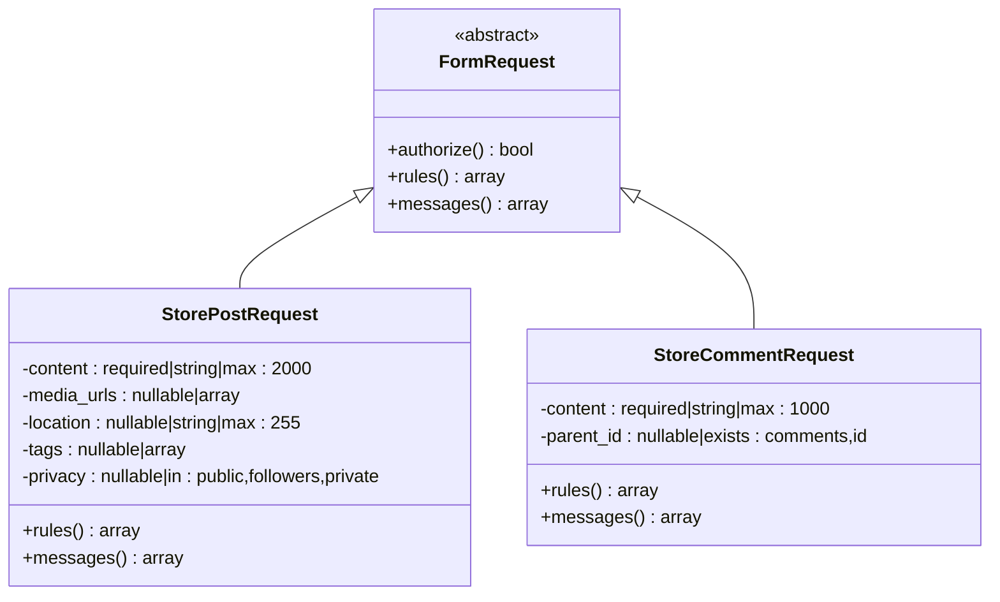

**Diagram sources**
- [StorePostRequest.php:8-49](file://app/Http/Requests/StorePostRequest.php#L8-L49)
- [StoreCommentRequest.php:8-42](file://app/Http/Requests/StoreCommentRequest.php#L8-L42)

**Section sources**
- [StorePostRequest.php:23-34](file://app/Http/Requests/StorePostRequest.php#L23-L34)
- [StorePostRequest.php:39-47](file://app/Http/Requests/StorePostRequest.php#L39-L47)
- [StoreCommentRequest.php:23-29](file://app/Http/Requests/StoreCommentRequest.php#L23-L29)
- [StoreCommentRequest.php:34-40](file://app/Http/Requests/StoreCommentRequest.php#L34-L40)

### Enhanced Post Model
The Post model maintains comprehensive relationships and data handling:
- **Fillable Fields**: Complete post metadata including user associations, content, media, location, tags, privacy, and counters
- **Type Casting**: Media URLs and tags as arrays, counts as integers for consistent data handling
- **Relationships**: Belongs to User, has many Comments and Likes with eager loading support
- **Privacy Controls**: Integration with user default privacy settings

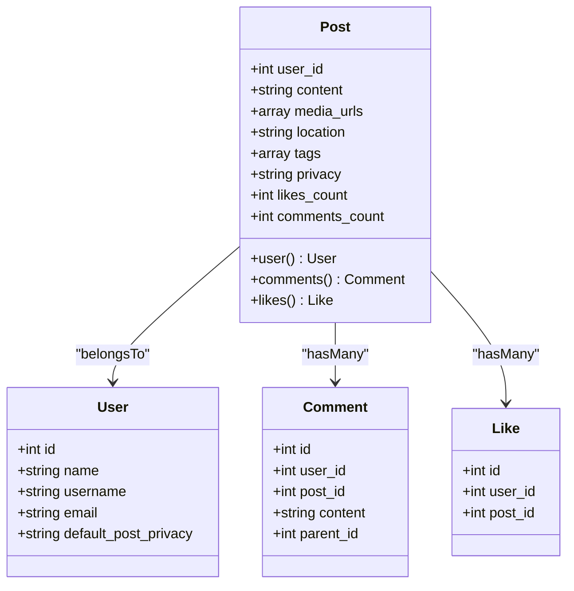

**Diagram sources**
- [Post.php:11-27](file://app/Models/Post.php#L11-L27)
- [Post.php:29-42](file://app/Models/Post.php#L29-L42)
- [User.php:21-36](file://app/Models/User.php#L21-L36)

**Section sources**
- [Post.php:11-27](file://app/Models/Post.php#L11-L27)
- [Post.php:29-42](file://app/Models/Post.php#L29-L42)
- [User.php:21-36](file://app/Models/User.php#L21-L36)

### Story Model Enhancements
The Story model provides temporal content management:
- **Expiration Handling**: Automatic 24-hour expiration via expires_at timestamp
- **Media Support**: Flexible media type validation (image/video) with URL storage
- **Views Tracking**: Array-based view tracking for analytics
- **User Association**: Direct relationship with User model for ownership

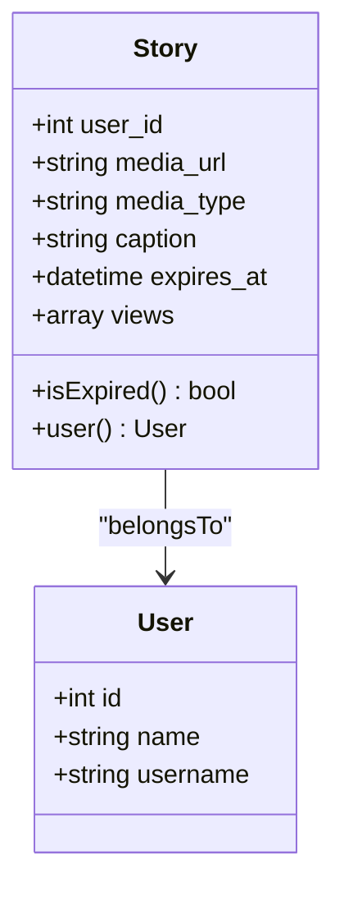

**Diagram sources**
- [Story.php:10-22](file://app/Models/Story.php#L10-L22)
- [Story.php:24-32](file://app/Models/Story.php#L24-L32)

**Section sources**
- [Story.php:10-22](file://app/Models/Story.php#L10-L22)
- [Story.php:24-32](file://app/Models/Story.php#L24-L32)

### Reel Model Capabilities
The Reel model supports video content with engagement metrics:
- **Video Processing**: Separate video and thumbnail URL storage
- **Engagement Tracking**: Likes, comments, and view counts with automatic increments
- **Duration Support**: Video duration tracking for analytics
- **Tagging System**: Hashtag support for discoverability

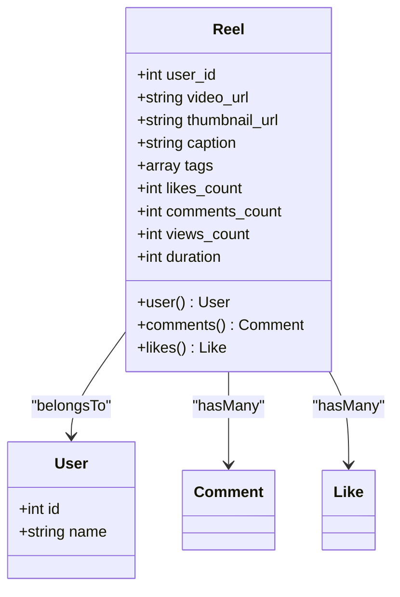

**Diagram sources**
- [Reel.php:11-28](file://app/Models/Reel.php#L11-L28)
- [Reel.php:30-43](file://app/Models/Reel.php#L30-L43)

**Section sources**
- [Reel.php:11-28](file://app/Models/Reel.php#L11-L28)
- [Reel.php:30-43](file://app/Models/Reel.php#L30-L43)

### Comment Model Relationships
The Comment model supports hierarchical discussions:
- **Nested Comments**: Self-referencing parent_id for threaded conversations
- **Content Validation**: Length limits and sanitization through Form Request
- **Relationships**: User, Post, and Reel associations with eager loading
- **Reply Chain**: Automatic loading of parent and child comments

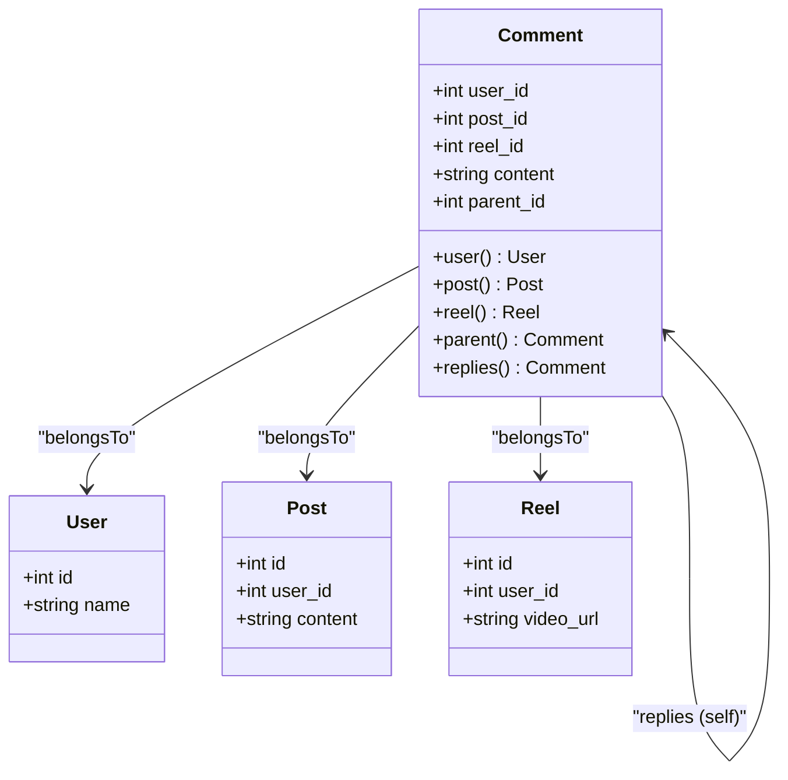

**Diagram sources**
- [Comment.php:10-16](file://app/Models/Comment.php#L10-L16)
- [Comment.php:18-41](file://app/Models/Comment.php#L18-L41)

**Section sources**
- [Comment.php:10-16](file://app/Models/Comment.php#L10-L16)
- [Comment.php:18-41](file://app/Models/Comment.php#L18-L41)

### Like Model Constraints
The Like model enforces uniqueness and relationships:
- **Unique Constraints**: Prevents duplicate likes through database constraints
- **Multi-entity Support**: Can like posts, reels, and stories
- **Relationships**: User, Post, Reel, and Story associations
- **Transactional Updates**: Safe increment/decrement operations

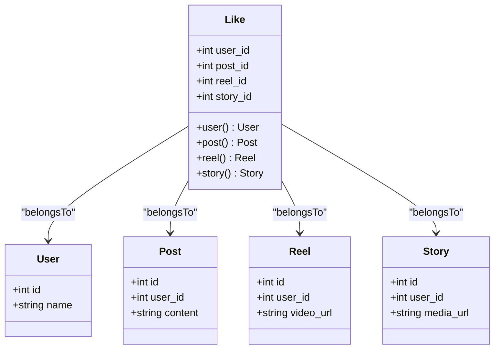

**Diagram sources**
- [Like.php:10-15](file://app/Models/Like.php#L10-L15)
- [Like.php:17-35](file://app/Models/Like.php#L17-L35)

**Section sources**
- [Like.php:10-15](file://app/Models/Like.php#L10-L15)
- [Like.php:17-35](file://app/Models/Like.php#L17-L35)

### User Model and Social Graph
The User model manages social relationships and preferences:
- **Social Relationships**: Has many posts, stories, reels, comments, and likes
- **Follow System**: Followers and following relationships via pivot tables
- **Preference Integration**: Default privacy settings for new posts
- **Storage Management**: Integration with file upload and storage systems

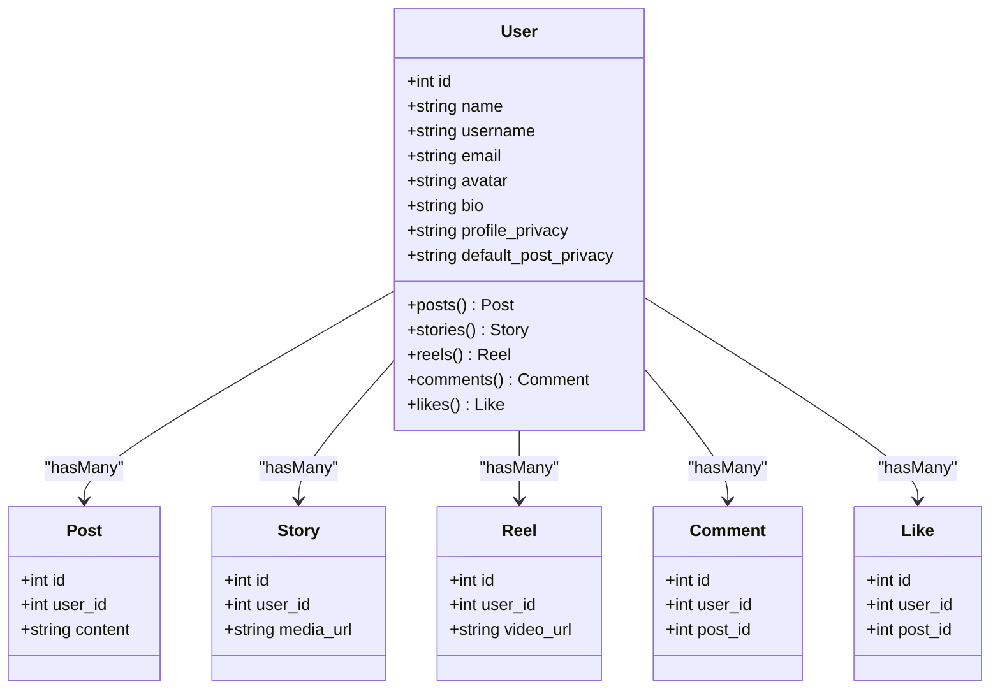

**Diagram sources**
- [User.php:21-36](file://app/Models/User.php#L21-L36)
- [User.php:85-113](file://app/Models/User.php#L85-L113)
- [User.php:130-149](file://app/Models/User.php#L130-L149)

**Section sources**
- [User.php:21-36](file://app/Models/User.php#L21-L36)
- [User.php:85-113](file://app/Models/User.php#L85-L113)
- [User.php:130-149](file://app/Models/User.php#L130-L149)

### Authorization Policies
Authorization policies maintain security boundaries:
- **PostPolicy**: Author-only deletion with user ID verification
- **CommentPolicy**: Author-only comment deletion
- **LikePolicy**: Creator-only like deletion
- **Integration**: Direct policy enforcement in controller methods

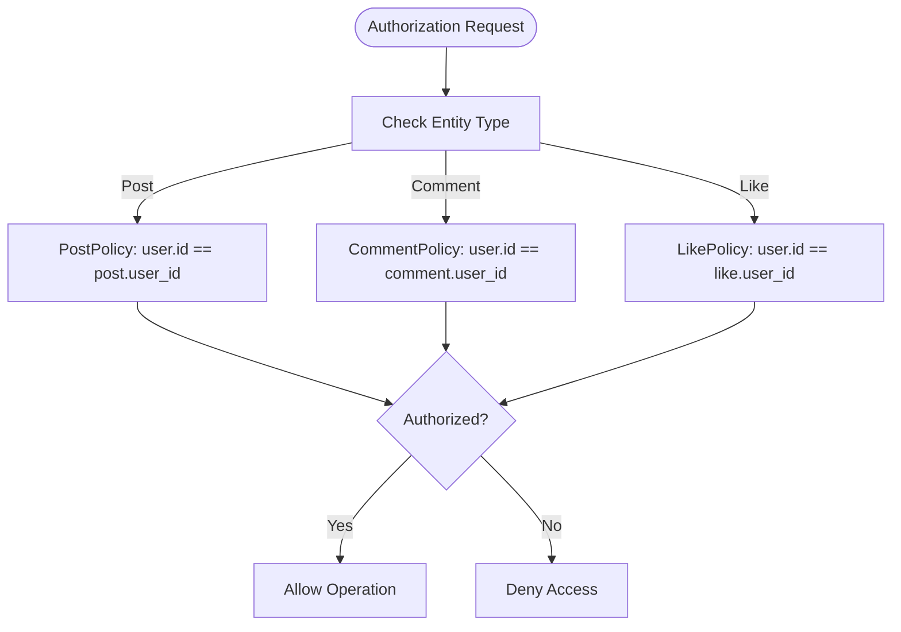

**Diagram sources**
- [PostPolicy.php:13-24](file://app/Policies/PostPolicy.php#L13-L24)
- [CommentPolicy.php:13-16](file://app/Policies/CommentPolicy.php#L13-L16)
- [LikePolicy.php:13-16](file://app/Policies/LikePolicy.php#L13-L16)

**Section sources**
- [PostPolicy.php:13-24](file://app/Policies/PostPolicy.php#L13-L24)
- [CommentPolicy.php:13-16](file://app/Policies/CommentPolicy.php#L13-L16)
- [LikePolicy.php:13-16](file://app/Policies/LikePolicy.php#L13-L16)

### Database Schema and Indexes
Database schemas support performance and integrity:
- **Posts**: User associations, content, media, location, tags, privacy, counters, timestamps with appropriate indexes
- **Stories**: Media URLs, types, captions, expiration timestamps, view tracking with expiration indexes
- **Reels**: Video metadata, engagement metrics, duration, timestamps with performance indexes
- **Comments**: Hierarchical relationships with parent-child indexing for threaded discussions
- **Likes**: Unique constraints preventing duplicate likes across entities

```mermaid
erDiagram
USERS {
int id PK
string name
string username
string email
string default_post_privacy
}
POSTS {
int id PK
int user_id FK
text content
json media_urls
string location
json tags
enum privacy
int likes_count
int comments_count
timestamp created_at
}
STORIES {
int id PK
int user_id FK
string media_url
enum media_type
text caption
timestamp expires_at
json views
timestamp created_at
}
REELS {
int id PK
int user_id FK
string video_url
string thumbnail_url
text caption
json tags
int likes_count
int comments_count
int views_count
int duration
timestamp created_at
}
COMMENTS {
int id PK
int user_id FK
int post_id FK
int reel_id FK
text content
int parent_id FK
timestamp created_at
}
LIKES {
int id PK
int user_id FK
int post_id FK
int reel_id FK
int story_id FK
}
USERS ||--o{ POSTS : "has many"
USERS ||--o{ STORIES : "has many"
USERS ||--o{ REELS : "has many"
USERS ||--o{ COMMENTS : "has many"
USERS ||--o{ LIKES : "has many"
POSTS ||--o{ COMMENTS : "has many"
REELS ||--o{ COMMENTS : "has many"
COMMENTS ||--o{ COMMENTS : "replies" : "parent_id"
```

**Diagram sources**
- [2026_04_21_132810_create_posts_table.php:14-28](file://database/migrations/2026_04_21_132810_create_posts_table.php#L14-L28)
- [2026_04_21_132811_create_stories_table.php:14-25](file://database/migrations/2026_04_21_132811_create_stories_table.php#L14-L25)
- [2026_04_21_132811_create_reels_table.php:14-28](file://database/migrations/2026_04_21_132811_create_reels_table.php#L14-L28)
- [2026_04_21_132820_create_comments_table.php:14-26](file://database/migrations/2026_04_21_132820_create_comments_table.php#L14-L26)
- [2026_04_21_132821_create_likes_table.php:14-25](file://database/migrations/2026_04_21_132821_create_likes_table.php#L14-L25)

**Section sources**
- [2026_04_21_132810_create_posts_table.php:14-28](file://database/migrations/2026_04_21_132810_create_posts_table.php#L14-L28)
- [2026_04_21_132811_create_stories_table.php:14-25](file://database/migrations/2026_04_21_132811_create_stories_table.php#L14-L25)
- [2026_04_21_132811_create_reels_table.php:14-28](file://database/migrations/2026_04_21_132811_create_reels_table.php#L14-L28)
- [2026_04_21_132820_create_comments_table.php:14-26](file://database/migrations/2026_04_21_132820_create_comments_table.php#L14-L26)
- [2026_04_21_132821_create_likes_table.php:14-25](file://database/migrations/2026_04_21_132821_create_likes_table.php#L14-L25)

### Community Wall UI and Interaction
The community wall provides enhanced user experience:
- **Stories Integration**: Instagram-style horizontal scrolling with active story detection
- **Real-time Updates**: AJAX responses for likes and comments with JSON formatting
- **Post Composer**: Rich content creation with media and location options
- **Interactive Elements**: Like toggling, comment submission, and post deletion with authorization
- **Responsive Design**: Mobile-first approach with progressive enhancement

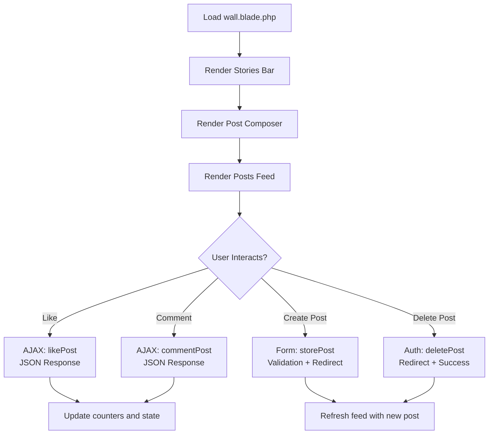

**Diagram sources**
- [wall.blade.php:1-204](file://resources/views/social/wall.blade.php#L1-L204)
- [SocialController.php:48-57](file://app/Http/Controllers/SocialController.php#L48-L57)
- [SocialController.php:62-78](file://app/Http/Controllers/SocialController.php#L62-L78)
- [SocialController.php:34-43](file://app/Http/Controllers/SocialController.php#L34-L43)
- [SocialController.php:83-91](file://app/Http/Controllers/SocialController.php#L83-L91)

**Section sources**
- [wall.blade.php:1-204](file://resources/views/social/wall.blade.php#L1-L204)
- [SocialController.php:48-57](file://app/Http/Controllers/SocialController.php#L48-L57)
- [SocialController.php:62-78](file://app/Http/Controllers/SocialController.php#L62-L78)
- [SocialController.php:34-43](file://app/Http/Controllers/SocialController.php#L34-L43)
- [SocialController.php:83-91](file://app/Http/Controllers/SocialController.php#L83-L91)

### RESTful Routing Configuration
The routing system provides comprehensive social endpoints:
- **Public Endpoints**: Community wall, stories listing, reels feed accessible without authentication
- **Authenticated Endpoints**: Post creation, story creation, like toggling, comment submission, post deletion require authentication
- **Resource Routes**: Clean, RESTful naming conventions with proper HTTP verb usage
- **Route Parameters**: Strongly typed model bindings for Post, Story, Reel entities

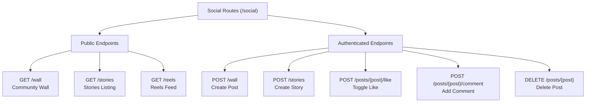

**Diagram sources**
- [web.php:48-57](file://routes/web.php#L48-L57)

**Section sources**
- [web.php:48-57](file://routes/web.php#L48-L57)

## Dependency Analysis
The modernized architecture features clear dependency relationships:
- **Controller Dependencies**: SocialController depends on SocialService via constructor injection
- **Service Dependencies**: SocialService depends on models and database transactions
- **Validation Dependencies**: Form Request classes depend on Laravel's FormRequest base class
- **Authorization Dependencies**: Policies depend on model relationships and user authentication
- **Routing Dependencies**: Routes depend on controller methods and Form Request validation

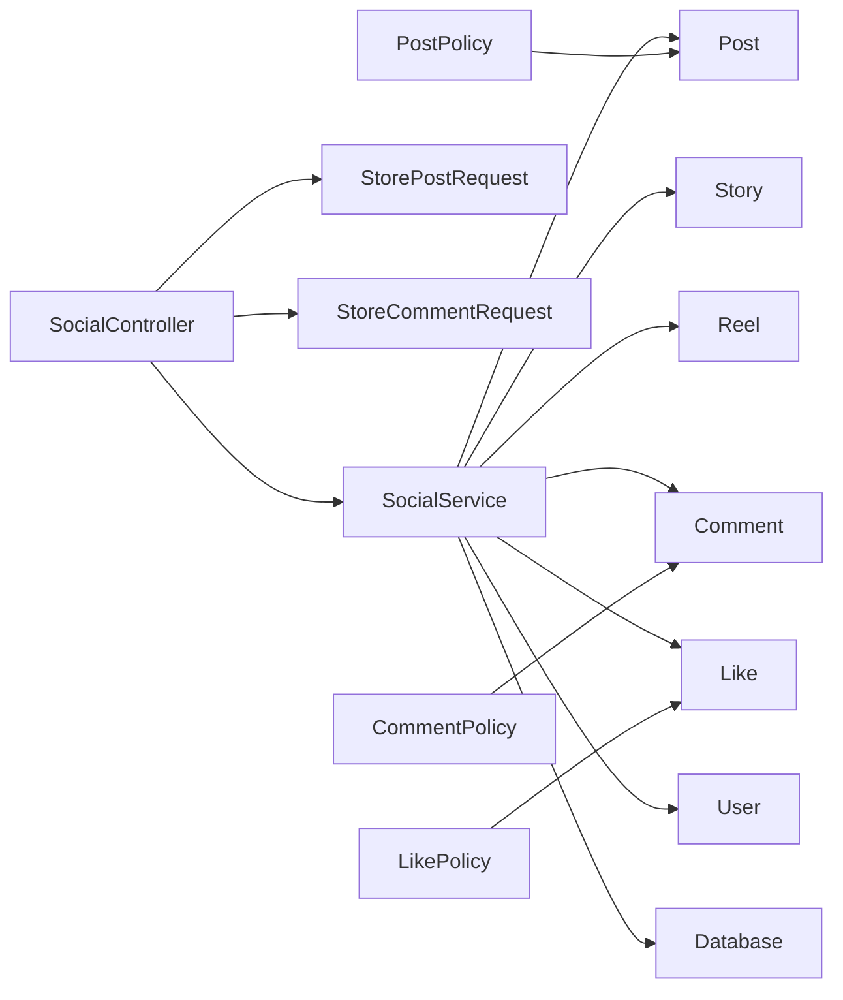

**Diagram sources**
- [SocialController.php:17-19](file://app/Http/Controllers/SocialController.php#L17-L19)
- [SocialService.php:5-10](file://app/Services/SocialService.php#L5-L10)
- [StorePostRequest.php:6](file://app/Http/Requests/StorePostRequest.php#L6)
- [StoreCommentRequest.php:6](file://app/Http/Requests/StoreCommentRequest.php#L6)

**Section sources**
- [SocialController.php:17-19](file://app/Http/Controllers/SocialController.php#L17-L19)
- [SocialService.php:5-10](file://app/Services/SocialService.php#L5-L10)
- [StorePostRequest.php:6](file://app/Http/Requests/StorePostRequest.php#L6)
- [StoreCommentRequest.php:6](file://app/Http/Requests/StoreCommentRequest.php#L6)

## Performance Considerations
The modernized architecture improves performance through several optimizations:
- **Pagination**: Community wall uses pagination to limit database load
- **Eager Loading**: Controller methods use with() to prevent N+1 queries
- **Index Optimization**: Database indexes on frequently queried columns (user_id, created_at, expires_at)
- **Transaction Isolation**: Business logic uses transactions to prevent race conditions
- **Validation Efficiency**: Form Request validation occurs before database operations
- **Dependency Injection**: Reduces object instantiation overhead through container management

**Updated** The service layer architecture enables better performance through transactional operations, eager loading, and optimized database queries.

## Troubleshooting Guide
Common issues and resolutions in the modernized architecture:
- **Validation Failures**: Form Request validation errors return to same form with error messages
- **Authorization Errors**: Policy violations result in 403 Forbidden responses
- **Service Method Failures**: Business logic exceptions are caught and handled gracefully
- **Database Transactions**: Transaction failures rollback all changes automatically
- **Like Toggle Issues**: AJAX responses provide JSON status for client-side updates
- **Comment Submission**: Nested comment validation ensures parent comment exists

**Updated** Added troubleshooting guidance for the new Form Request validation and service layer architecture.

**Section sources**
- [SocialController.php:34-43](file://app/Http/Controllers/SocialController.php#L34-L43)
- [SocialController.php:62-78](file://app/Http/Controllers/SocialController.php#L62-L78)
- [SocialService.php:41-73](file://app/Services/SocialService.php#L41-L73)
- [StorePostRequest.php:39-47](file://app/Http/Requests/StorePostRequest.php#L39-L47)
- [StoreCommentRequest.php:34-40](file://app/Http/Requests/StoreCommentRequest.php#L34-L40)

## Conclusion
The social features system has been successfully modernized with a service-oriented architecture featuring Form Request validation, dependency injection, and centralized business logic. The SocialController now focuses solely on HTTP handling while delegating all business operations to SocialService. Form Request classes provide comprehensive validation with custom error messages, and the authorization layer maintains strict security boundaries. The system supports community engagement through enhanced real-time interactions, comprehensive content management, and scalable performance optimizations. The architecture enables easy maintenance, testing, and extension of social features while maintaining backward compatibility with existing functionality.

**Updated** The modernized architecture significantly improves maintainability, testability, and scalability while preserving all existing social features and user experience.

## Appendices

### Common Social Interaction Scenarios
- **Post Creation with Validation**: Use POST /social/wall with StorePostRequest validation for content, media, location, tags, and privacy
- **Like Toggling**: AJAX POST /social/posts/{post}/like returns JSON status for real-time UI updates
- **Comment Submission**: POST /social/posts/{post}/comment with StoreCommentRequest validation for content and parent_id
- **Story Creation**: POST /social/stories with media URL, type, and caption validation
- **Post Deletion**: DELETE /social/posts/{post} with authorization enforcement
- **Community Discovery**: GET /social/wall, /social/stories, /social/reels for content browsing

**Updated** Added comprehensive scenarios for the modernized Form Request validation and service layer architecture.

**Section sources**
- [web.php:48-57](file://routes/web.php#L48-L57)
- [SocialController.php:34-43](file://app/Http/Controllers/SocialController.php#L34-L43)
- [SocialController.php:48-57](file://app/Http/Controllers/SocialController.php#L48-L57)
- [SocialController.php:62-78](file://app/Http/Controllers/SocialController.php#L62-L78)
- [SocialController.php:83-91](file://app/Http/Controllers/SocialController.php#L83-L91)

### Community Building Strategies
- **Quality Content Encouragement**: Use StorePostRequest validation to ensure minimum content standards
- **Engagement Analytics**: Leverage SocialService metrics for popular content identification
- **Storytelling Promotion**: Utilize story creation endpoint for daily content sharing
- **Video Discovery**: Implement reels endpoint for video content exploration
- **Privacy Respect**: Configure post privacy through validation rules and user preferences
- **Performance Optimization**: Use pagination, eager loading, and database indexing for scalability
- **Real-time Interactions**: Implement AJAX responses for seamless user experience

**Updated** Added strategies leveraging the modernized service layer and validation system.