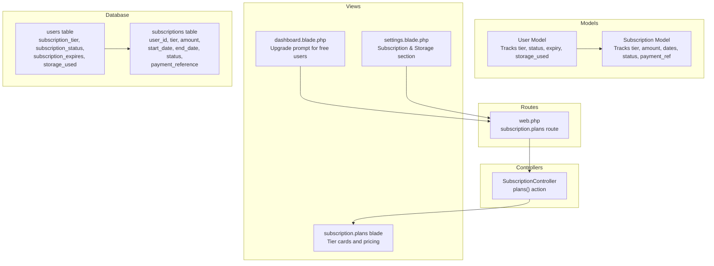
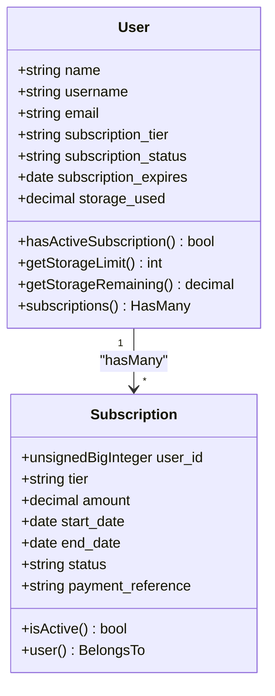
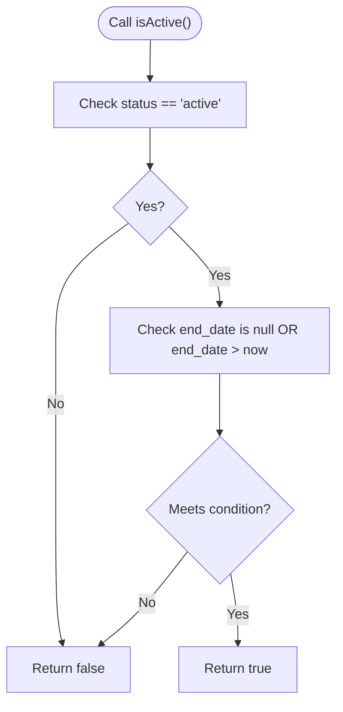
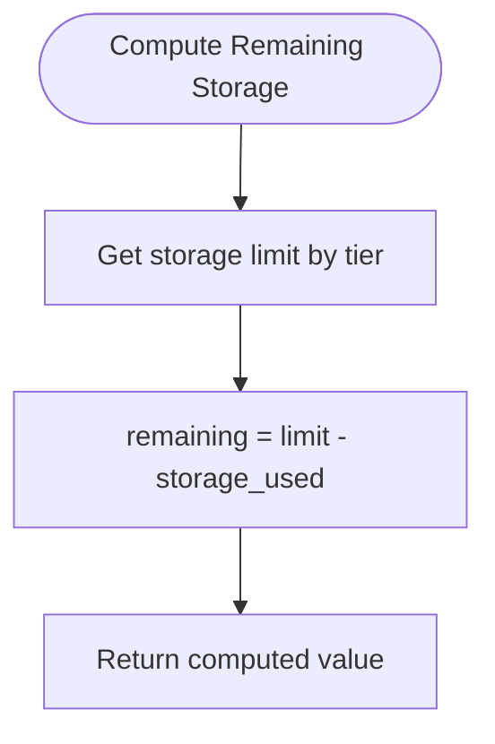
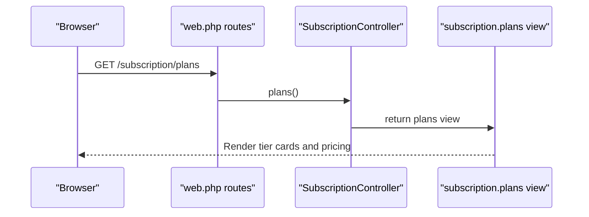
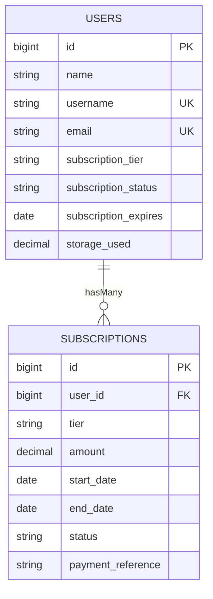
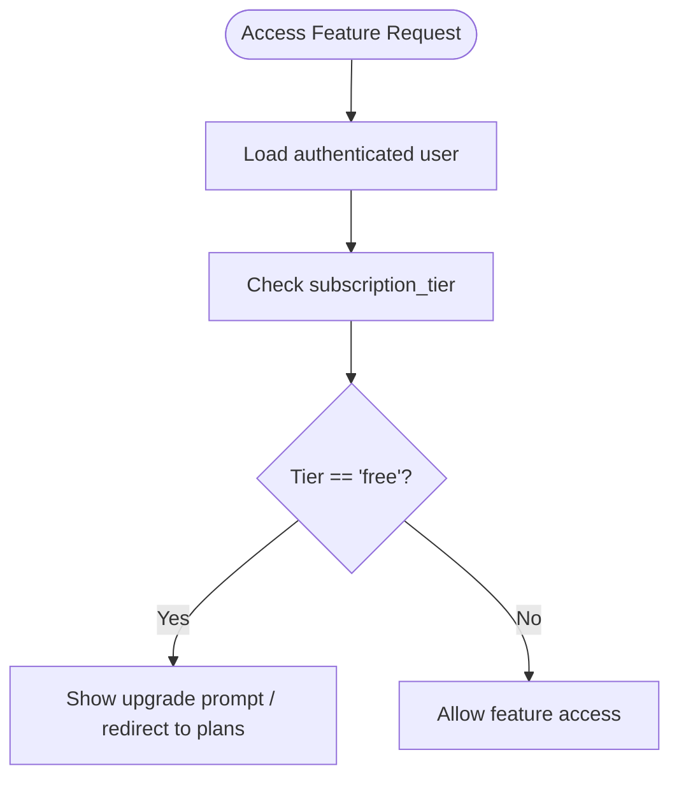
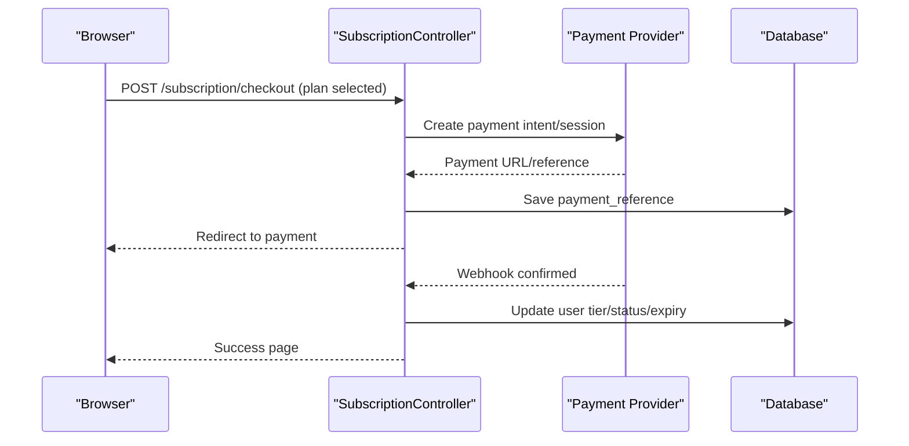
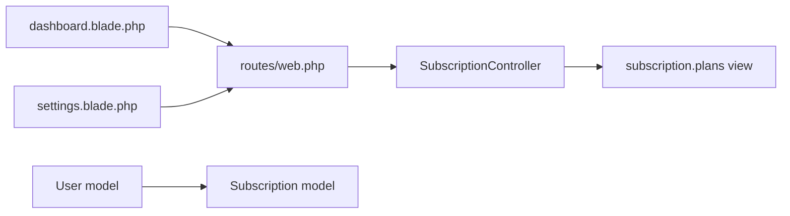

# Subscription System

<cite>
**Referenced Files in This Document**
- [Subscription.php](file://app/Models/Subscription.php)
- [User.php](file://app/Models/User.php)
- [SubscriptionController.php](file://app/Http/Controllers/SubscriptionController.php)
- [2026_04_21_132812_create_subscriptions_table.php](file://database/migrations/2026_04_21_132812_create_subscriptions_table.php)
- [0001_01_01_000000_create_users_table.php](file://database/migrations/0001_01_01_000000_create_users_table.php)
- [web.php](file://routes/web.php)
- [plans.blade.php](file://resources/views/subscription/plans.blade.php)
- [dashboard.blade.php](file://resources/views/dashboard.blade.php)
- [settings.blade.php](file://resources/views/settings.blade.php)
</cite>

## Table of Contents
1. [Introduction](#introduction)
2. [Project Structure](#project-structure)
3. [Core Components](#core-components)
4. [Architecture Overview](#architecture-overview)
5. [Detailed Component Analysis](#detailed-component-analysis)
6. [Dependency Analysis](#dependency-analysis)
7. [Performance Considerations](#performance-considerations)
8. [Troubleshooting Guide](#troubleshooting-guide)
9. [Conclusion](#conclusion)

## Introduction
This document describes the subscription system for tier-based pricing and premium features. It covers subscription plan management, payment processing integration points, and feature access control based on subscription levels. The system tracks billing cycles, enforces storage quotas, and gates premium features. It also documents the Subscription model, the relationship to user storage and content limits, and outlines workflows for subscription renewal, cancellation, and proration considerations.

## Project Structure
The subscription system spans models, controllers, routes, views, and database migrations. The following diagram shows how these pieces fit together:

**Diagram sources**
- [Subscription.php:1-37](file://app/Models/Subscription.php#L1-L37)
- [User.php:1-172](file://app/Models/User.php#L1-L172)
- [SubscriptionController.php:1-14](file://app/Http/Controllers/SubscriptionController.php#L1-L14)
- [web.php:57-60](file://routes/web.php#L57-L60)
- [2026_04_21_132812_create_subscriptions_table.php:1-37](file://database/migrations/2026_04_21_132812_create_subscriptions_table.php#L1-L37)
- [0001_01_01_000000_create_users_table.php:1-57](file://database/migrations/0001_01_01_000000_create_users_table.php#L1-L57)
- [plans.blade.php:1-115](file://resources/views/subscription/plans.blade.php#L1-L115)
- [dashboard.blade.php:104-117](file://resources/views/dashboard.blade.php#L104-L117)
- [settings.blade.php:166-189](file://resources/views/settings.blade.php#L166-L189)

**Section sources**
- [Subscription.php:1-37](file://app/Models/Subscription.php#L1-L37)
- [User.php:1-172](file://app/Models/User.php#L1-L172)
- [SubscriptionController.php:1-14](file://app/Http/Controllers/SubscriptionController.php#L1-L14)
- [web.php:57-60](file://routes/web.php#L57-L60)
- [2026_04_21_132812_create_subscriptions_table.php:1-37](file://database/migrations/2026_04_21_132812_create_subscriptions_table.php#L1-L37)
- [0001_01_01_000000_create_users_table.php:1-57](file://database/migrations/0001_01_01_000000_create_users_table.php#L1-L57)
- [plans.blade.php:1-115](file://resources/views/subscription/plans.blade.php#L1-L115)
- [dashboard.blade.php:104-117](file://resources/views/dashboard.blade.php#L104-L117)
- [settings.blade.php:166-189](file://resources/views/settings.blade.php#L166-L189)

## Core Components
- Subscription model: Stores billing cycle, tier, amount, status, and payment reference. Provides an active check based on status and end date.
- User model: Tracks current tier, status, expiry, and storage usage. Includes helpers for active subscription checks and storage quota computations.
- SubscriptionController: Exposes the subscription plans page.
- Routes: Defines the subscription plans endpoint.
- Views: Present tier comparisons, pricing, and upgrade prompts.

Key responsibilities:
- Track billing cycles and statuses per user
- Enforce storage quotas based on tier
- Gate premium features via tier checks
- Provide UI for plan selection and upgrades

**Section sources**
- [Subscription.php:10-36](file://app/Models/Subscription.php#L10-L36)
- [User.php:28-170](file://app/Models/User.php#L28-L170)
- [SubscriptionController.php:9-12](file://app/Http/Controllers/SubscriptionController.php#L9-L12)
- [web.php:58-59](file://routes/web.php#L58-L59)
- [plans.blade.php:14-111](file://resources/views/subscription/plans.blade.php#L14-L111)

## Architecture Overview
The subscription architecture centers around two models and their relationships:
- Users have many Subscriptions (historical records)
- Each Subscription belongs to a User
- Users also maintain current subscription state in user-level fields

**Diagram sources**
- [User.php:21-170](file://app/Models/User.php#L21-L170)
- [Subscription.php:10-29](file://app/Models/Subscription.php#L10-L29)

**Section sources**
- [User.php:115-170](file://app/Models/User.php#L115-L170)
- [Subscription.php:26-35](file://app/Models/Subscription.php#L26-L35)

## Detailed Component Analysis

### Subscription Model
Responsibilities:
- Persist subscription records with tier, amount, billing dates, status, and payment reference
- Provide an active-state check based on status and end date
- Define the belongs-to relationship to User

Implementation highlights:
- Fillable attributes include user association, tier, amount, start/end dates, status, and payment reference
- Casts ensure monetary and date fields are handled consistently
- isActive() evaluates whether a subscription is currently active

**Diagram sources**
- [Subscription.php:31-35](file://app/Models/Subscription.php#L31-L35)

**Section sources**
- [Subscription.php:10-36](file://app/Models/Subscription.php#L10-L36)

### User Model and Storage Quotas
Responsibilities:
- Track current subscription tier, status, and expiry
- Track storage usage and compute remaining capacity
- Determine if a user has an active subscription

Implementation highlights:
- hasActiveSubscription() validates current user-level fields
- getStorageLimit() maps tier to storage limit in GB
- getStorageRemaining() computes available storage

**Diagram sources**
- [User.php:158-170](file://app/Models/User.php#L158-L170)

**Section sources**
- [User.php:152-170](file://app/Models/User.php#L152-L170)

### Subscription Controller and Routes
Responsibilities:
- Serve the subscription plans page
- Route registration for the plans endpoint

**Diagram sources**
- [web.php:58-59](file://routes/web.php#L58-L59)
- [SubscriptionController.php:9-12](file://app/Http/Controllers/SubscriptionController.php#L9-L12)
- [plans.blade.php:1-115](file://resources/views/subscription/plans.blade.php#L1-L115)

**Section sources**
- [SubscriptionController.php:9-12](file://app/Http/Controllers/SubscriptionController.php#L9-L12)
- [web.php:58-59](file://routes/web.php#L58-L59)
- [plans.blade.php:1-115](file://resources/views/subscription/plans.blade.php#L1-L115)

### Database Schema
The schema supports both historical subscriptions and current user-level subscription state.

**Diagram sources**
- [0001_01_01_000000_create_users_table.php:14-28](file://database/migrations/0001_01_01_000000_create_users_table.php#L14-L28)
- [2026_04_21_132812_create_subscriptions_table.php:14-26](file://database/migrations/2026_04_21_132812_create_subscriptions_table.php#L14-L26)

**Section sources**
- [0001_01_01_000000_create_users_table.php:23-26](file://database/migrations/0001_01_01_000000_create_users_table.php#L23-L26)
- [2026_04_21_132812_create_subscriptions_table.php:17-21](file://database/migrations/2026_04_21_132812_create_subscriptions_table.php#L17-L21)

### Feature Access Control Based on Subscription Levels
Feature gating is implemented via user tier checks in views and potentially in controllers/policies. The dashboard and settings pages present upgrade prompts for free-tier users and display current plan information.

**Diagram sources**
- [dashboard.blade.php:105-116](file://resources/views/dashboard.blade.php#L105-L116)
- [settings.blade.php:172-186](file://resources/views/settings.blade.php#L172-L186)

**Section sources**
- [dashboard.blade.php:105-116](file://resources/views/dashboard.blade.php#L105-L116)
- [settings.blade.php:172-186](file://resources/views/settings.blade.php#L172-L186)

### Payment Processing Integration
Current state:
- The subscription plans view displays pricing tiers and upgrade buttons
- The subscriptions table includes a payment reference field
- No payment provider SDK or webhook handlers are present in the repository

Recommended integration points:
- Add a checkout endpoint in the controller to create a payment intent/session
- Store payment_reference upon successful payment
- Update user-level fields (tier, status, expiry) after payment confirmation
- Implement a webhook handler to reconcile payments and update records

Note: The following is a conceptual flow; actual implementation requires a payment provider SDK and webhook handling.

[No sources needed since this diagram shows conceptual workflow, not actual code structure]

## Dependency Analysis
- SubscriptionController depends on the routes definition for the plans endpoint
- Views depend on route names to link to the plans page
- User model encapsulates storage quota logic and active subscription checks
- Subscription model provides historical record linkage to User

**Diagram sources**
- [web.php:58-59](file://routes/web.php#L58-L59)
- [SubscriptionController.php:9-12](file://app/Http/Controllers/SubscriptionController.php#L9-L12)
- [plans.blade.php:1-115](file://resources/views/subscription/plans.blade.php#L1-L115)
- [dashboard.blade.php:105-116](file://resources/views/dashboard.blade.php#L105-L116)
- [settings.blade.php:172-186](file://resources/views/settings.blade.php#L172-L186)
- [User.php:115-118](file://app/Models/User.php#L115-L118)
- [Subscription.php:26-29](file://app/Models/Subscription.php#L26-L29)

**Section sources**
- [web.php:58-59](file://routes/web.php#L58-L59)
- [SubscriptionController.php:9-12](file://app/Http/Controllers/SubscriptionController.php#L9-L12)
- [plans.blade.php:1-115](file://resources/views/subscription/plans.blade.php#L1-L115)
- [dashboard.blade.php:105-116](file://resources/views/dashboard.blade.php#L105-L116)
- [settings.blade.php:172-186](file://resources/views/settings.blade.php#L172-L186)
- [User.php:115-118](file://app/Models/User.php#L115-L118)
- [Subscription.php:26-29](file://app/Models/Subscription.php#L26-L29)

## Performance Considerations
- Indexing: The subscriptions table includes a composite index on user_id and status, which helps efficiently fetch a user's active subscription(s).
- Storage calculations: User-level storage quota computations are O(1) and lightweight.
- Views: Rendering plan comparisons is client-side and does not require server-side computation.

Recommendations:
- Add indexes on user-level subscription fields if frequently queried for feature gating
- Cache tier and quota lookups for high-traffic pages
- Consider background jobs for payment reconciliation and subscription updates

**Section sources**
- [2026_04_21_132812_create_subscriptions_table.php:25-25](file://database/migrations/2026_04_21_132812_create_subscriptions_table.php#L25-L25)
- [User.php:158-170](file://app/Models/User.php#L158-L170)

## Troubleshooting Guide
Common issues and resolutions:
- Active subscription not recognized
  - Verify user-level subscription_status and subscription_expires fields
  - Ensure end_date is in the future when status is active
  - Check hasActiveSubscription() logic in the User model

- Storage quota exceeded
  - Confirm storage_used vs getStorageLimit() mapping
  - Ensure getStorageRemaining() is used to gate uploads

- Plans page not accessible
  - Confirm route registration for subscription.plans
  - Ensure middleware allows authenticated access

- Payment reference missing
  - Verify payment_reference is saved after payment creation
  - Implement webhook handling to reconcile payments

**Section sources**
- [User.php:152-170](file://app/Models/User.php#L152-L170)
- [Subscription.php:31-35](file://app/Models/Subscription.php#L31-L35)
- [web.php:58-59](file://routes/web.php#L58-L59)
- [2026_04_21_132812_create_subscriptions_table.php:21-22](file://database/migrations/2026_04_21_132812_create_subscriptions_table.php#L21-L22)

## Conclusion
The subscription system establishes a clear foundation for tier-based pricing and premium feature access. It tracks historical subscriptions and current user-level state, enforces storage quotas, and exposes a plans page for upgrades. Payment processing is not yet integrated in the repository and would require adding checkout endpoints, payment reference handling, and webhook reconciliation. With those additions, the system can fully support subscription lifecycle management including renewal, cancellation, and proration.