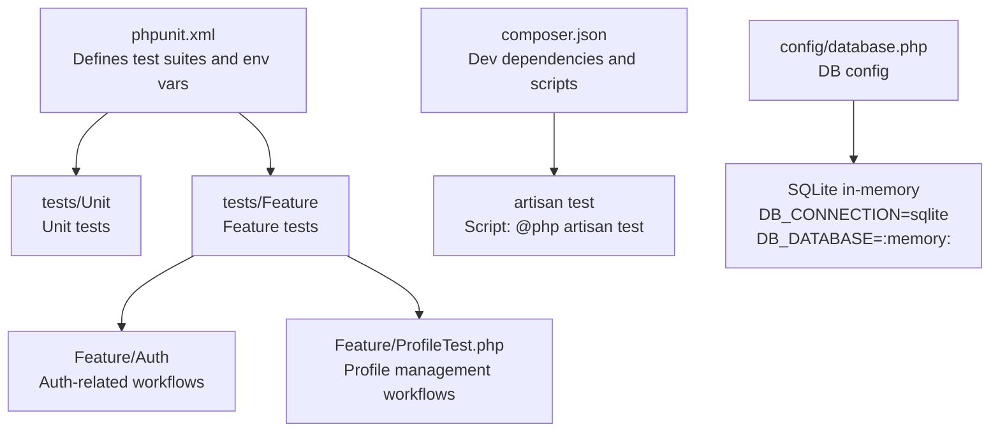
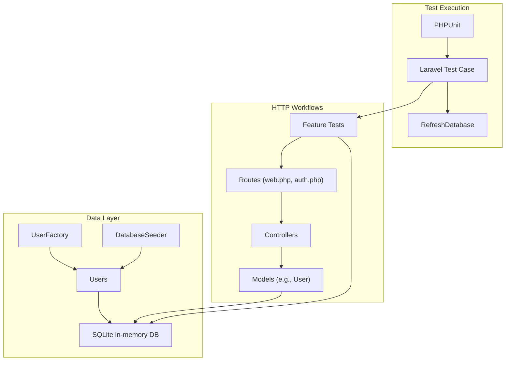
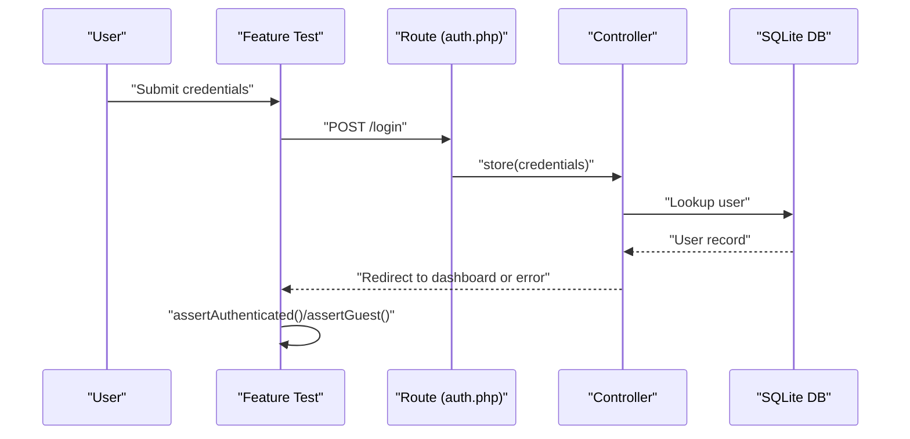
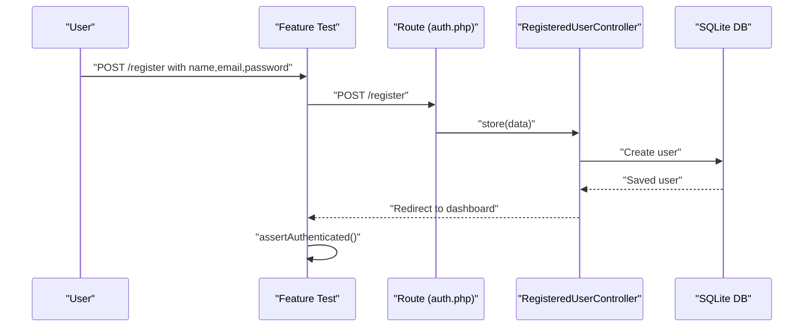
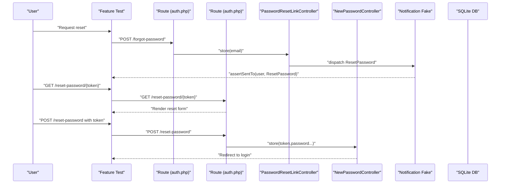
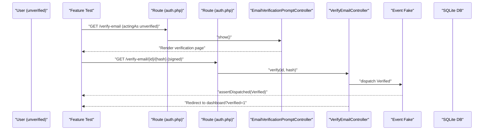
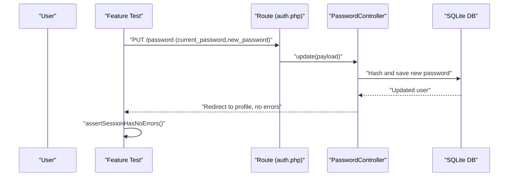
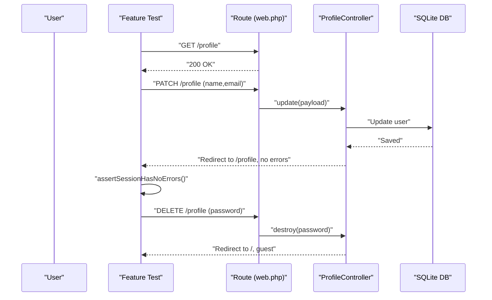
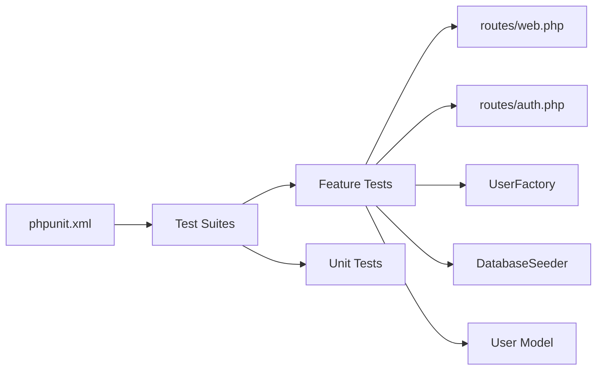

# Testing Strategy

<cite>
**Referenced Files in This Document**
- [phpunit.xml](file://phpunit.xml)
- [composer.json](file://composer.json)
- [TestCase.php](file://tests/TestCase.php)
- [ExampleTest.php (Feature)](file://tests/Feature/ExampleTest.php)
- [ExampleTest.php (Unit)](file://tests/Unit/ExampleTest.php)
- [AuthenticationTest.php](file://tests/Feature/Auth/AuthenticationTest.php)
- [RegistrationTest.php](file://tests/Feature/Auth/RegistrationTest.php)
- [PasswordResetTest.php](file://tests/Feature/Auth/PasswordResetTest.php)
- [EmailVerificationTest.php](file://tests/Feature/Auth/EmailVerificationTest.php)
- [PasswordUpdateTest.php](file://tests/Feature/Auth/PasswordUpdateTest.php)
- [ProfileTest.php](file://tests/Feature/ProfileTest.php)
- [database.php](file://config/database.php)
- [UserFactory.php](file://database/factories/UserFactory.php)
- [DatabaseSeeder.php](file://database/seeders/DatabaseSeeder.php)
- [web.php](file://routes/web.php)
- [auth.php](file://routes/auth.php)
- [User.php](file://app/Models/User.php)
</cite>

## Table of Contents
1. [Introduction](#introduction)
2. [Project Structure](#project-structure)
3. [Core Components](#core-components)
4. [Architecture Overview](#architecture-overview)
5. [Detailed Component Analysis](#detailed-component-analysis)
6. [Dependency Analysis](#dependency-analysis)
7. [Performance Considerations](#performance-considerations)
8. [Troubleshooting Guide](#troubleshooting-guide)
9. [Conclusion](#conclusion)
10. [Appendices](#appendices)

## Introduction
This document defines the testing strategy for the Travel_Project using PHPUnit with Laravel testing helpers. It covers unit testing, feature testing, and test data management. It explains how tests are organized, how database testing is configured, and how to leverage factories, seeders, and Laravel’s testing helpers. It also provides best practices for mocking, test data generation, continuous integration, coverage analysis, and debugging test failures.

## Project Structure
The testing setup is organized into two primary suites:
- Unit tests under tests/Unit
- Feature tests under tests/Feature

PHPUnit configuration defines the test suites and sets environment variables for a fast, isolated SQLite in-memory database during testing. Composer scripts expose a convenient test command.

**Diagram sources**
- [phpunit.xml:1-37](file://phpunit.xml#L1-L37)
- [composer.json:48-51](file://composer.json#L48-L51)
- [database.php:20-45](file://config/database.php#L20-L45)

**Section sources**
- [phpunit.xml:7-14](file://phpunit.xml#L7-L14)
- [composer.json:48-51](file://composer.json#L48-L51)

## Core Components
- Test base class: An abstract TestCase extends Laravel’s base test case and serves as the foundation for all tests.
- Feature tests: Use RefreshDatabase to reset the database per test and leverage Laravel’s HTTP test helpers (get, post, patch, put, delete) and assertions (assertStatus, assertRedirect, assertAuthenticated, assertGuest, assertSessionHasErrorsIn, etc.).
- Unit tests: Basic unit tests reside under tests/Unit and demonstrate foundational testing patterns.
- Factories: database/factories/UserFactory.php generates realistic test users with hashed passwords and optional unverified emails.
- Seeders: database/seeders/DatabaseSeeder.php seeds initial data for deterministic tests.
- Routes: routes/web.php and routes/auth.php define the endpoints exercised by feature tests.

Key testing helpers and patterns demonstrated:
- Acting as a user: actingAs($user)
- Redirect expectations: assertRedirect(route(...))
- Session error assertions: assertSessionHasErrorsIn
- Authentication assertions: assertAuthenticated(), assertGuest()
- Notification and event mocking: Notification::fake(), Event::fake()

**Section sources**
- [TestCase.php:7-10](file://tests/TestCase.php#L7-L10)
- [AuthenticationTest.php:11](file://tests/Feature/Auth/AuthenticationTest.php#L11)
- [ProfileTest.php:11](file://tests/Feature/ProfileTest.php#L11)
- [UserFactory.php:25-44](file://database/factories/UserFactory.php#L25-L44)
- [DatabaseSeeder.php:16-24](file://database/seeders/DatabaseSeeder.php#L16-L24)
- [web.php:14-86](file://routes/web.php#L14-L86)
- [auth.php:14-59](file://routes/auth.php#L14-L59)

## Architecture Overview
The testing architecture leverages Laravel’s testing stack:
- PHPUnit orchestrates test execution and suite configuration.
- Laravel’s Application Kernel boots the framework in testing mode with environment variables set via phpunit.xml.
- RefreshDatabase resets the SQLite in-memory database between tests for isolation.
- Factories and seeders supply deterministic, realistic test data.
- Feature tests exercise routes and controllers through HTTP requests, validating responses, redirects, and authentication states.

**Diagram sources**
- [phpunit.xml:20-35](file://phpunit.xml#L20-L35)
- [UserFactory.php:13-44](file://database/factories/UserFactory.php#L13-L44)
- [DatabaseSeeder.php:9-24](file://database/seeders/DatabaseSeeder.php#L9-L24)
- [web.php:14-86](file://routes/web.php#L14-L86)
- [auth.php:14-59](file://routes/auth.php#L14-L59)
- [User.php:11-172](file://app/Models/User.php#L11-L172)

## Detailed Component Analysis

### Authentication Feature Tests
These tests validate login, logout, invalid credentials, and session state transitions.

**Diagram sources**
- [AuthenticationTest.php:20-31](file://tests/Feature/Auth/AuthenticationTest.php#L20-L31)
- [auth.php:20-35](file://routes/auth.php#L20-L35)

**Section sources**
- [AuthenticationTest.php:13-53](file://tests/Feature/Auth/AuthenticationTest.php#L13-L53)
- [auth.php:14-36](file://routes/auth.php#L14-L36)

### Registration Feature Tests
Validates registration flow and post-registration authentication.

**Diagram sources**
- [RegistrationTest.php:19-30](file://tests/Feature/Auth/RegistrationTest.php#L19-L30)
- [auth.php:15-18](file://routes/auth.php#L15-L18)

**Section sources**
- [RegistrationTest.php:12-31](file://tests/Feature/Auth/RegistrationTest.php#L12-L31)
- [auth.php:14-18](file://routes/auth.php#L14-L18)

### Password Reset Feature Tests
Validates forgot-password, token-based reset, and redirect behavior.

**Diagram sources**
- [PasswordResetTest.php:22-72](file://tests/Feature/Auth/PasswordResetTest.php#L22-L72)
- [auth.php:25-35](file://routes/auth.php#L25-L35)

**Section sources**
- [PasswordResetTest.php:15-73](file://tests/Feature/Auth/PasswordResetTest.php#L15-L73)
- [auth.php:25-35](file://routes/auth.php#L25-L35)

### Email Verification Feature Tests
Validates verification prompt, signed route handling, and event dispatching.

**Diagram sources**
- [EmailVerificationTest.php:25-42](file://tests/Feature/Auth/EmailVerificationTest.php#L25-L42)
- [auth.php:39-48](file://routes/auth.php#L39-L48)

**Section sources**
- [EmailVerificationTest.php:16-58](file://tests/Feature/Auth/EmailVerificationTest.php#L16-L58)
- [auth.php:38-48](file://routes/auth.php#L38-L48)

### Password Update Feature Tests
Validates updating password with correct current password and error handling for incorrect password.

**Diagram sources**
- [PasswordUpdateTest.php:14-32](file://tests/Feature/Auth/PasswordUpdateTest.php#L14-L32)
- [auth.php:55](file://routes/auth.php#L55)

**Section sources**
- [PasswordUpdateTest.php:14-51](file://tests/Feature/Auth/PasswordUpdateTest.php#L14-L51)
- [auth.php:55](file://routes/auth.php#L55)

### Profile Management Feature Tests
Validates profile page rendering, updates, email verification behavior, account deletion, and password confirmation requirements.

**Diagram sources**
- [ProfileTest.php:13-80](file://tests/Feature/ProfileTest.php#L13-L80)
- [web.php:14-21](file://routes/web.php#L14-L21)

**Section sources**
- [ProfileTest.php:13-99](file://tests/Feature/ProfileTest.php#L13-L99)
- [web.php:14-21](file://routes/web.php#L14-L21)

### Unit Tests
Basic unit tests demonstrate fundamental assertions and are a starting point for unit-level validations.

**Section sources**
- [ExampleTest.php (Unit):12-15](file://tests/Unit/ExampleTest.php#L12-L15)

## Dependency Analysis
- Test configuration depends on phpunit.xml for suite definitions and environment variables.
- Feature tests depend on routes/web.php and routes/auth.php to target real endpoints.
- Factories and seeders supply deterministic data to feature tests.
- The User model encapsulates relationships and helper methods validated indirectly by tests.

**Diagram sources**
- [phpunit.xml:7-14](file://phpunit.xml#L7-L14)
- [web.php:14-86](file://routes/web.php#L14-L86)
- [auth.php:14-59](file://routes/auth.php#L14-L59)
- [UserFactory.php:13-44](file://database/factories/UserFactory.php#L13-L44)
- [DatabaseSeeder.php:9-24](file://database/seeders/DatabaseSeeder.php#L9-L24)
- [User.php:11-172](file://app/Models/User.php#L11-L172)

**Section sources**
- [phpunit.xml:7-14](file://phpunit.xml#L7-L14)
- [web.php:14-86](file://routes/web.php#L14-L86)
- [auth.php:14-59](file://routes/auth.php#L14-L59)
- [UserFactory.php:13-44](file://database/factories/UserFactory.php#L13-L44)
- [DatabaseSeeder.php:9-24](file://database/seeders/DatabaseSeeder.php#L9-L24)
- [User.php:11-172](file://app/Models/User.php#L11-L172)

## Performance Considerations
- SQLite in-memory database ensures fast test execution and automatic cleanup.
- RefreshDatabase resets the database per test, preventing cross-test contamination but adding overhead.
- Use minimal factories and targeted seeding to reduce fixture creation costs.
- Prefer lightweight assertions and avoid unnecessary controller logic in tests.

[No sources needed since this section provides general guidance]

## Troubleshooting Guide
Common issues and resolutions:
- Database state bleeding between tests: Ensure RefreshDatabase is used in feature tests.
- Authentication assertions failing: Verify middleware guards and route names; confirm actingAs usage.
- Redirect assertions failing: Match exact route names and absolute/relative redirect expectations.
- Session error assertions: Use assertSessionHasErrorsIn with the correct fieldset name.
- Notifications and events: Use Notification::fake() and Event::fake() to isolate external interactions.
- Debugging failed tests: Add dump and die statements in tests temporarily, or run a single test with verbose output.

**Section sources**
- [AuthenticationTest.php:11](file://tests/Feature/Auth/AuthenticationTest.php#L11)
- [ProfileTest.php:11](file://tests/Feature/ProfileTest.php#L11)
- [PasswordResetTest.php:24](file://tests/Feature/Auth/PasswordResetTest.php#L24)
- [EmailVerificationTest.php:29](file://tests/Feature/Auth/EmailVerificationTest.php#L29)

## Conclusion
The project employs a clear separation between unit and feature tests, backed by Laravel’s testing helpers and a robust SQLite in-memory configuration. Factories and seeders provide reliable test data, while route-driven feature tests validate end-to-end workflows. Following the outlined best practices and patterns will help maintain high-quality, fast, and reliable tests.

[No sources needed since this section summarizes without analyzing specific files]

## Appendices

### Test Data Management
- Factories: Use UserFactory to create realistic users with hashed passwords and optional unverified emails.
- Seeders: Use DatabaseSeeder to initialize known baseline data for deterministic tests.
- Environment: phpunit.xml configures SQLite in-memory database and disables caches/mailers/queues for speed.

**Section sources**
- [UserFactory.php:25-44](file://database/factories/UserFactory.php#L25-L44)
- [DatabaseSeeder.php:16-24](file://database/seeders/DatabaseSeeder.php#L16-L24)
- [phpunit.xml:26-31](file://phpunit.xml#L26-L31)

### Writing New Tests
- Choose Feature vs Unit: Feature tests for HTTP workflows and integrations; Unit tests for pure logic.
- Use RefreshDatabase in feature tests to keep state isolated.
- Leverage actingAs for authenticated scenarios.
- Assert redirects and session errors precisely using route names and fieldsets.
- Mock notifications and events when verifying external integrations.

**Section sources**
- [AuthenticationTest.php:11](file://tests/Feature/Auth/AuthenticationTest.php#L11)
- [ProfileTest.php:11](file://tests/Feature/ProfileTest.php#L11)
- [PasswordResetTest.php:24](file://tests/Feature/Auth/PasswordResetTest.php#L24)
- [EmailVerificationTest.php:29](file://tests/Feature/Auth/EmailVerificationTest.php#L29)

### Continuous Integration and Coverage
- CI Setup: Run the test script defined in composer.json to execute Laravel’s test command.
- Coverage: Configure PHPUnit coverage reporting in phpunit.xml to analyze code coverage across app/.
- Artifacts: Store coverage reports and test logs as CI artifacts for historical analysis.

**Section sources**
- [composer.json:48-51](file://composer.json#L48-L51)
- [phpunit.xml:15-19](file://phpunit.xml#L15-L19)