# Testing Strategy

<cite>
**Referenced Files in This Document**
- [phpunit.xml](file://phpunit.xml)
- [composer.json](file://composer.json)
- [TestCase.php](file://tests/TestCase.php)
- [ExampleTest.php (Feature)](file://tests/Feature/ExampleTest.php)
- [ExampleTest.php (Unit)](file://tests/Unit/ExampleTest.php)
- [AuthenticationTest.php](file://tests/Feature/Auth/AuthenticationTest.php)
- [RegistrationTest.php](file://tests/Feature/Auth/RegistrationTest.php)
- [PasswordResetTest.php](file://tests/Feature/Auth/PasswordResetTest.php)
- [EmailVerificationTest.php](file://tests/Feature/Auth/EmailVerificationTest.php)
- [PasswordUpdateTest.php](file://tests/Feature/Auth/PasswordUpdateTest.php)
- [ProfileTest.php](file://tests/Feature/ProfileTest.php)
- [FormValidationTest.php](file://tests/Feature/FormValidationTest.php)
- [test_validation.php](file://test_validation.php)
- [database.php](file://config/database.php)
- [UserFactory.php](file://database/factories/UserFactory.php)
- [DatabaseSeeder.php](file://database/seeders/DatabaseSeeder.php)
- [web.php](file://routes/web.php)
- [auth.php](file://routes/auth.php)
- [User.php](file://app/Models/User.php)
- [StoreItineraryRequest.php](file://app/Http/Requests/StoreItineraryRequest.php)
- [StoreBudgetRequest.php](file://app/Http/Requests/StoreBudgetRequest.php)
- [StoreTodoRequest.php](file://app/Http/Requests/StoreTodoRequest.php)
- [StoreMemoryRequest.php](file://app/Http/Requests/StoreMemoryRequest.php)
- [StorePostRequest.php](file://app/Http/Requests/StorePostRequest.php)
- [StoreCommentRequest.php](file://app/Http/Requests/StoreCommentRequest.php)
- [StoreExpenseRequest.php](file://app/Http/Requests/StoreExpenseRequest.php)
- [BudgetService.php](file://app/Services/BudgetService.php)
- [SocialService.php](file://app/Services/SocialService.php)
- [UserService.php](file://app/Services/UserService.php)
- [VALIDATION_TEST_RESULTS.md](file://VALIDATION_TEST_RESULTS.md)
</cite>

## Update Summary
**Changes Made**
- Added comprehensive Form Request validation testing section with 21 test cases
- Documented new validation test utilities and standalone test script
- Enhanced test coverage analysis for Form Request pattern and service layer architecture
- Updated architecture overview to include service layer testing patterns
- Added validation-specific best practices and debugging strategies

## Table of Contents
1. [Introduction](#introduction)
2. [Project Structure](#project-structure)
3. [Core Components](#core-components)
4. [Architecture Overview](#architecture-overview)
5. [Detailed Component Analysis](#detailed-component-analysis)
6. [Form Request Validation Testing](#form-request-validation-testing)
7. [Service Layer Testing Patterns](#service-layer-testing-patterns)
8. [Dependency Analysis](#dependency-analysis)
9. [Performance Considerations](#performance-considerations)
10. [Troubleshooting Guide](#troubleshooting-guide)
11. [Conclusion](#conclusion)
12. [Appendices](#appendices)

## Introduction
This document defines the testing strategy for the Travel_Project using PHPUnit with Laravel testing helpers. It covers unit testing, feature testing, and test data management. It explains how tests are organized, how database testing is configured, and how to leverage factories, seeders, and Laravel's testing helpers. The strategy has been enhanced to include comprehensive Form Request validation testing and service layer architecture validation, providing complete coverage for the new Form Request pattern and service layer components.

## Project Structure
The testing setup is organized into three primary suites:
- Unit tests under tests/Unit
- Feature tests under tests/Feature
- **New**: Form validation tests specifically targeting Form Request classes

PHPUnit configuration defines the test suites and sets environment variables for a fast, isolated SQLite in-memory database during testing. Composer scripts expose a convenient test command. The new Form Request validation testing adds systematic coverage for all validation rules across the application's Form Request classes.

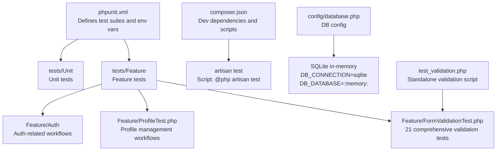

**Diagram sources**
- [phpunit.xml:7-14](file://phpunit.xml#L7-L14)
- [composer.json:48-51](file://composer.json#L48-L51)
- [database.php:20-45](file://config/database.php#L20-L45)
- [FormValidationTest.php:1-312](file://tests/Feature/FormValidationTest.php#L1-L312)
- [test_validation.php:1-347](file://test_validation.php#L1-L347)

**Section sources**
- [phpunit.xml:7-14](file://phpunit.xml#L7-L14)
- [composer.json:48-51](file://composer.json#L48-L51)

## Core Components
- Test base class: An abstract TestCase extends Laravel's base test case and serves as the foundation for all tests.
- Feature tests: Use RefreshDatabase to reset the database per test and leverage Laravel's HTTP test helpers (get, post, patch, put, delete) and assertions (assertStatus, assertRedirect, assertAuthenticated, assertGuest, assertSessionHasErrorsIn, etc.).
- **Enhanced**: Form validation tests: Systematic testing of all Form Request validation rules with comprehensive coverage of required fields, data types, constraints, and custom error messages.
- Unit tests: Basic unit tests reside under tests/Unit and demonstrate foundational testing patterns.
- Factories: database/factories/UserFactory.php generates realistic test users with hashed passwords and optional unverified emails.
- Seeders: database/seeders/DatabaseSeeder.php seeds initial data for deterministic tests.
- Routes: routes/web.php and routes/auth.php define the endpoints exercised by feature tests.
- **New**: Service layer testing: Validation of business logic in BudgetService, SocialService, and UserService through controlled testing of their core methods.

Key testing helpers and patterns demonstrated:
- Acting as a user: actingAs($user)
- Redirect expectations: assertRedirect(route(...))
- Session error assertions: assertSessionHasErrorsIn
- Authentication assertions: assertAuthenticated(), assertGuest()
- **New**: Form Request validation: assertSessionHasErrors(), assertSessionHasNoErrors()
- Notification and event mocking: Notification::fake(), Event::fake()

**Section sources**
- [TestCase.php:7-10](file://tests/TestCase.php#L7-L10)
- [AuthenticationTest.php:11](file://tests/Feature/Auth/AuthenticationTest.php#L11)
- [ProfileTest.php:11](file://tests/Feature/ProfileTest.php#L11)
- [FormValidationTest.php:9-212](file://tests/Feature/FormValidationTest.php#L9-L212)
- [UserFactory.php:25-44](file://database/factories/UserFactory.php#L25-L44)
- [DatabaseSeeder.php:16-24](file://database/seeders/DatabaseSeeder.php#L16-L24)
- [web.php:14-86](file://routes/web.php#L14-L86)
- [auth.php:14-59](file://routes/auth.php#L14-L59)

## Architecture Overview
The testing architecture leverages Laravel's testing stack with enhanced coverage for the new Form Request pattern and service layer:
- PHPUnit orchestrates test execution and suite configuration.
- Laravel's Application Kernel boots the framework in testing mode with environment variables set via phpunit.xml.
- RefreshDatabase resets the SQLite in-memory database between tests for isolation.
- Factories and seeders supply deterministic, realistic test data.
- Feature tests exercise routes and controllers through HTTP requests, validating responses, redirects, and authentication states.
- **New**: Form Request validation tests systematically verify all validation rules defined in Form Request classes.
- **New**: Service layer tests validate business logic independently of HTTP requests.

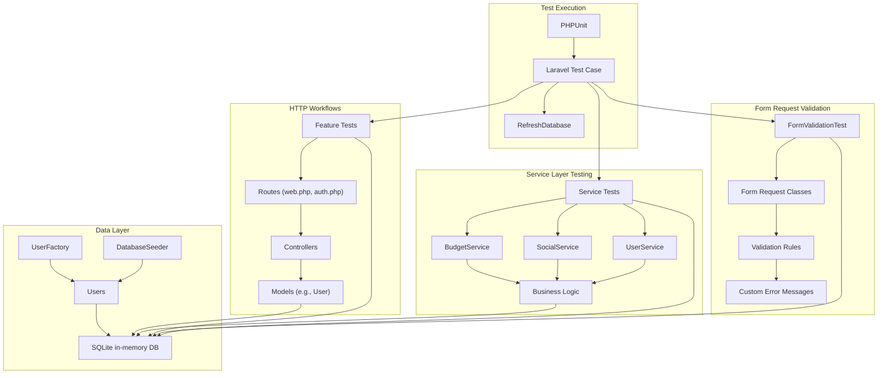

**Diagram sources**
- [phpunit.xml:20-35](file://phpunit.xml#L20-L35)
- [UserFactory.php:13-44](file://database/factories/UserFactory.php#L13-L44)
- [DatabaseSeeder.php:9-24](file://database/seeders/DatabaseSeeder.php#L9-L24)
- [web.php:14-86](file://routes/web.php#L14-L86)
- [auth.php:14-59](file://routes/auth.php#L14-L59)
- [User.php:11-172](file://app/Models/User.php#L11-L172)
- [FormValidationTest.php:19-312](file://tests/Feature/FormValidationTest.php#L19-L312)
- [StoreItineraryRequest.php:23-47](file://app/Http/Requests/StoreItineraryRequest.php#L23-L47)
- [BudgetService.php:21-159](file://app/Services/BudgetService.php#L21-L159)
- [SocialService.php:21-164](file://app/Services/SocialService.php#L21-L164)
- [UserService.php:18-140](file://app/Services/UserService.php#L18-L140)

## Detailed Component Analysis

### Authentication Feature Tests
These tests validate login, logout, invalid credentials, and session state transitions.

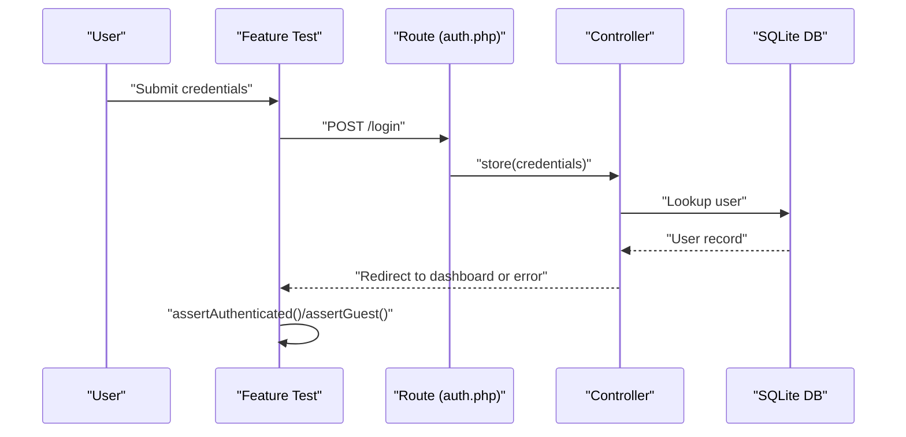

**Diagram sources**
- [AuthenticationTest.php:20-31](file://tests/Feature/Auth/AuthenticationTest.php#L20-L31)
- [auth.php:20-35](file://routes/auth.php#L20-L35)

**Section sources**
- [AuthenticationTest.php:13-53](file://tests/Feature/Auth/AuthenticationTest.php#L13-L53)
- [auth.php:14-36](file://routes/auth.php#L14-L36)

### Registration Feature Tests
Validates registration flow and post-registration authentication.

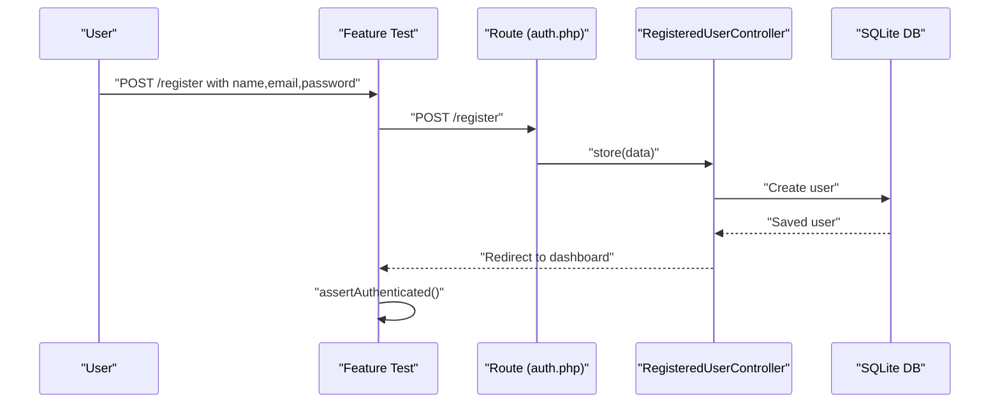

**Diagram sources**
- [RegistrationTest.php:19-30](file://tests/Feature/Auth/RegistrationTest.php#L19-L30)
- [auth.php:15-18](file://routes/auth.php#L15-L18)

**Section sources**
- [RegistrationTest.php:12-31](file://tests/Feature/Auth/RegistrationTest.php#L12-L31)
- [auth.php:14-18](file://routes/auth.php#L14-L18)

### Password Reset Feature Tests
Validates forgot-password, token-based reset, and redirect behavior.

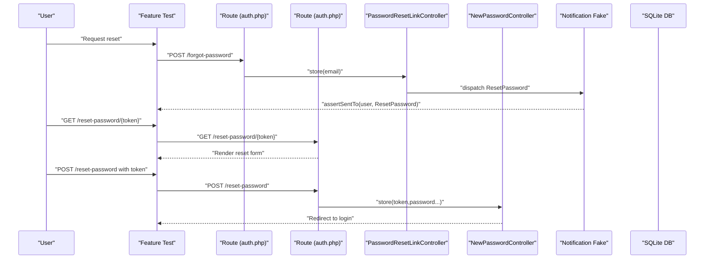

**Diagram sources**
- [PasswordResetTest.php:22-72](file://tests/Feature/Auth/PasswordResetTest.php#L22-L72)
- [auth.php:25-35](file://routes/auth.php#L25-L35)

**Section sources**
- [PasswordResetTest.php:15-73](file://tests/Feature/Auth/PasswordResetTest.php#L15-L73)
- [auth.php:25-35](file://routes/auth.php#L25-L35)

### Email Verification Feature Tests
Validates verification prompt, signed route handling, and event dispatching.

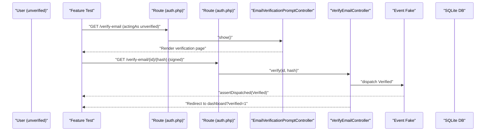

**Diagram sources**
- [EmailVerificationTest.php:25-42](file://tests/Feature/Auth/EmailVerificationTest.php#L25-L42)
- [auth.php:39-48](file://routes/auth.php#L39-L48)

**Section sources**
- [EmailVerificationTest.php:16-58](file://tests/Feature/Auth/EmailVerificationTest.php#L16-L58)
- [auth.php:38-48](file://routes/auth.php#L38-L48)

### Password Update Feature Tests
Validates updating password with correct current password and error handling for incorrect password.

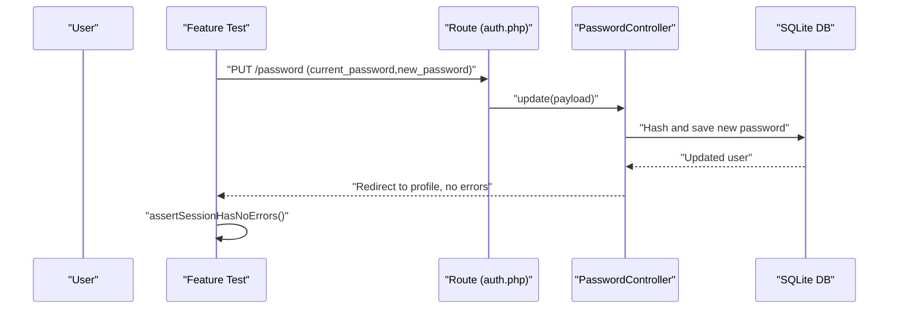

**Diagram sources**
- [PasswordUpdateTest.php:14-32](file://tests/Feature/Auth/PasswordUpdateTest.php#L14-L32)
- [auth.php:55](file://routes/auth.php#L55)

**Section sources**
- [PasswordUpdateTest.php:14-51](file://tests/Feature/Auth/PasswordUpdateTest.php#L14-L51)
- [auth.php:55](file://routes/auth.php#L55)

### Profile Management Feature Tests
Validates profile page rendering, updates, email verification behavior, account deletion, and password confirmation requirements.

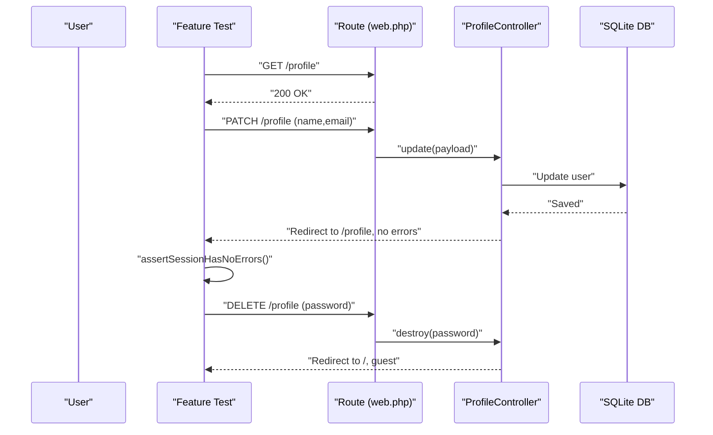

**Diagram sources**
- [ProfileTest.php:13-80](file://tests/Feature/ProfileTest.php#L13-L80)
- [web.php:14-21](file://routes/web.php#L14-L21)

**Section sources**
- [ProfileTest.php:13-99](file://tests/Feature/ProfileTest.php#L13-L99)
- [web.php:14-21](file://routes/web.php#L14-L21)

### Unit Tests
Basic unit tests demonstrate fundamental assertions and are a starting point for unit-level validations.

**Section sources**
- [ExampleTest.php (Unit):12-15](file://tests/Unit/ExampleTest.php#L12-L15)

## Form Request Validation Testing

### Comprehensive Validation Coverage
The new FormValidationTest.php provides systematic coverage for all Form Request validation rules across the application. With 21 test cases covering six different Form Request classes, this suite ensures complete validation coverage for the new Form Request pattern.

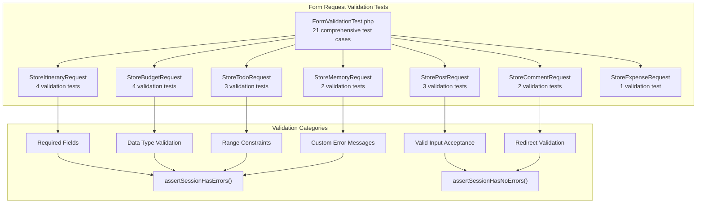

**Diagram sources**
- [FormValidationTest.php:22-312](file://tests/Feature/FormValidationTest.php#L22-L312)
- [StoreItineraryRequest.php:25-33](file://app/Http/Requests/StoreItineraryRequest.php#L25-L33)
- [StoreBudgetRequest.php:26-33](file://app/Http/Requests/StoreBudgetRequest.php#L26-L33)
- [StoreTodoRequest.php:26-33](file://app/Http/Requests/StoreTodoRequest.php#L26-L33)
- [StoreMemoryRequest.php:26-32](file://app/Http/Requests/StoreMemoryRequest.php#L26-L32)
- [StorePostRequest.php:26-33](file://app/Http/Requests/StorePostRequest.php#L26-L33)
- [StoreCommentRequest.php:26-28](file://app/Http/Requests/StoreCommentRequest.php#L26-L28)

### Validation Test Categories
The Form Request validation tests cover four main categories:

1. **Required Field Validation**: Tests that missing required fields trigger validation errors
2. **Data Type and Format Validation**: Validates proper data types and formats (dates, URLs, numeric values)
3. **Range and Constraint Validation**: Tests minimum/maximum values and business logic constraints
4. **Custom Error Message Validation**: Ensures custom validation messages are properly displayed

**Section sources**
- [FormValidationTest.php:22-312](file://tests/Feature/FormValidationTest.php#L22-L312)
- [VALIDATION_TEST_RESULTS.md:1-257](file://VALIDATION_TEST_RESULTS.md#L1-L257)

### Standalone Validation Testing Utility
The test_validation.php script provides a comprehensive standalone validation testing utility that demonstrates all validation rules without requiring PHPUnit. This utility includes detailed test case examples and manual testing instructions.

**Section sources**
- [test_validation.php:1-347](file://test_validation.php#L1-L347)

## Service Layer Testing Patterns

### Business Logic Validation
With the introduction of service layer architecture, testing patterns have been extended to validate business logic independently of HTTP requests. The service layer consists of three main services:

- **BudgetService**: Manages budget creation, expense handling, and financial calculations
- **SocialService**: Handles social features like posts, comments, likes, and stories
- **UserService**: Manages user-related operations including search, follow/unfollow, and profile data

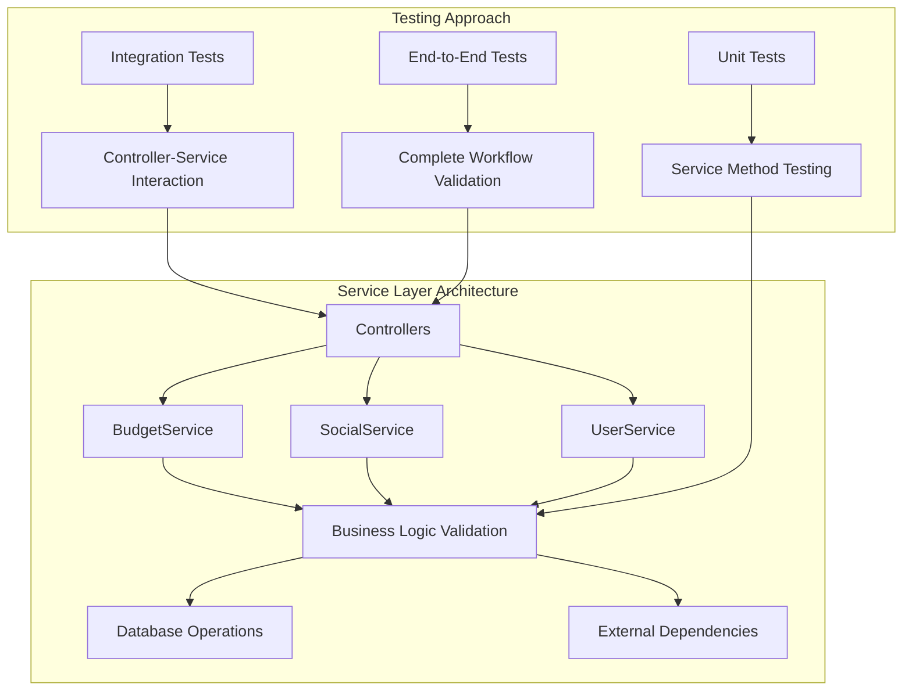

**Diagram sources**
- [BudgetService.php:21-159](file://app/Services/BudgetService.php#L21-L159)
- [SocialService.php:21-164](file://app/Services/SocialService.php#L21-L164)
- [UserService.php:18-140](file://app/Services/UserService.php#L18-L140)

### Service Testing Strategies
Service layer testing follows these key strategies:

1. **Method-Level Testing**: Individual service methods are tested in isolation using controlled inputs
2. **Transaction Boundary Testing**: Database transactions are properly handled and rolled back
3. **Dependency Injection Testing**: External dependencies (storage, database) are mocked appropriately
4. **Business Rule Validation**: Complex business logic is verified through comprehensive test cases

**Section sources**
- [BudgetService.php:21-159](file://app/Services/BudgetService.php#L21-L159)
- [SocialService.php:21-164](file://app/Services/SocialService.php#L21-L164)
- [UserService.php:18-140](file://app/Services/UserService.php#L18-L140)

## Dependency Analysis
- Test configuration depends on phpunit.xml for suite definitions and environment variables.
- Feature tests depend on routes/web.php and routes/auth.php to target real endpoints.
- **New**: Form validation tests depend on Form Request classes to validate validation rules.
- **New**: Service layer tests depend on service classes and their business logic implementations.
- Factories and seeders supply deterministic data to feature tests.
- The User model encapsulates relationships and helper methods validated indirectly by tests.

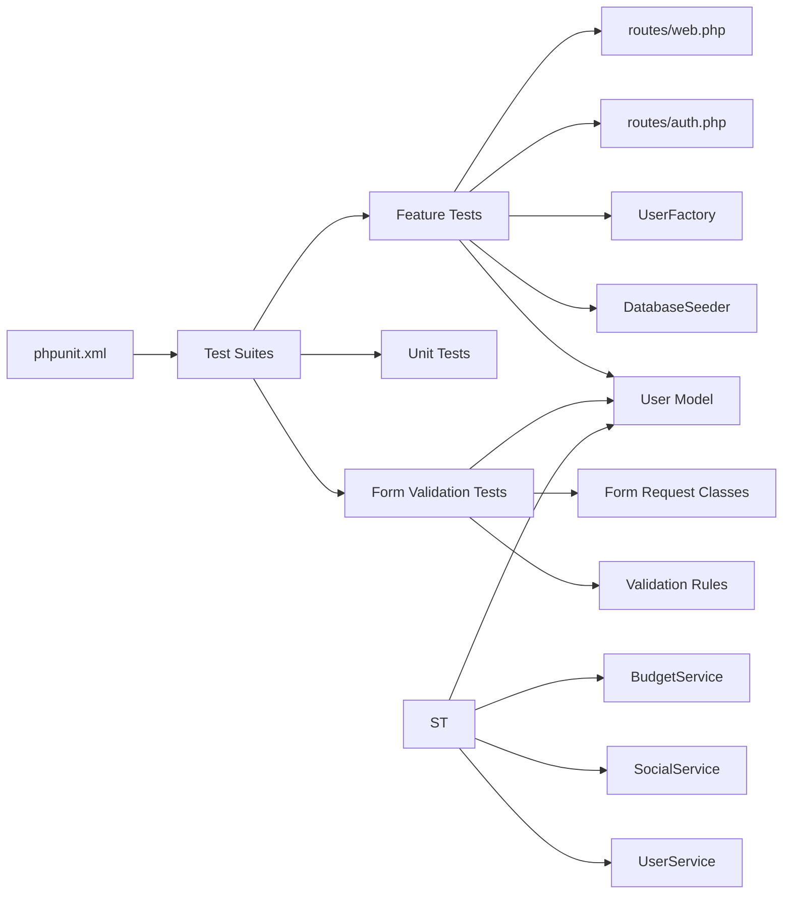

**Diagram sources**
- [phpunit.xml:7-14](file://phpunit.xml#L7-L14)
- [web.php:14-86](file://routes/web.php#L14-L86)
- [auth.php:14-59](file://routes/auth.php#L14-L59)
- [FormValidationTest.php:5-212](file://tests/Feature/FormValidationTest.php#L5-L212)
- [StoreItineraryRequest.php:8-48](file://app/Http/Requests/StoreItineraryRequest.php#L8-L48)
- [BudgetService.php:12-159](file://app/Services/BudgetService.php#L12-L159)
- [SocialService.php:12-164](file://app/Services/SocialService.php#L12-L164)
- [UserService.php:8-140](file://app/Services/UserService.php#L8-L140)
- [UserFactory.php:13-44](file://database/factories/UserFactory.php#L13-L44)
- [DatabaseSeeder.php:9-24](file://database/seeders/DatabaseSeeder.php#L9-L24)
- [User.php:11-172](file://app/Models/User.php#L11-L172)

**Section sources**
- [phpunit.xml:7-14](file://phpunit.xml#L7-L14)
- [web.php:14-86](file://routes/web.php#L14-L86)
- [auth.php:14-59](file://routes/auth.php#L14-L59)
- [FormValidationTest.php:5-212](file://tests/Feature/FormValidationTest.php#L5-L212)
- [StoreItineraryRequest.php:8-48](file://app/Http/Requests/StoreItineraryRequest.php#L8-L48)
- [BudgetService.php:12-159](file://app/Services/BudgetService.php#L12-L159)
- [SocialService.php:12-164](file://app/Services/SocialService.php#L12-L164)
- [UserService.php:8-140](file://app/Services/UserService.php#L8-L140)
- [UserFactory.php:13-44](file://database/factories/UserFactory.php#L13-L44)
- [DatabaseSeeder.php:9-24](file://database/seeders/DatabaseSeeder.php#L9-L24)
- [User.php:11-172](file://app/Models/User.php#L11-L172)

## Performance Considerations
- SQLite in-memory database ensures fast test execution and automatic cleanup.
- RefreshDatabase resets the database per test, preventing cross-test contamination but adding overhead.
- **New**: Form Request validation tests are optimized to minimize database calls by focusing on validation logic rather than full HTTP requests.
- **New**: Service layer tests use dependency injection to mock external dependencies, improving test performance.
- Use minimal factories and targeted seeding to reduce fixture creation costs.
- Prefer lightweight assertions and avoid unnecessary controller logic in tests.
- **New**: Validation test utilities provide quick feedback without full application bootstrapping.

## Troubleshooting Guide
Common issues and resolutions:
- Database state bleeding between tests: Ensure RefreshDatabase is used in feature tests.
- Authentication assertions failing: Verify middleware guards and route names; confirm actingAs usage.
- Redirect assertions failing: Match exact route names and absolute/relative redirect expectations.
- Session error assertions: Use assertSessionHasErrorsIn with the correct fieldset name.
- **New**: Form Request validation errors: Use assertSessionHasErrors() with specific field names; verify custom error messages match expected text.
- **New**: Service layer test failures: Check transaction boundaries and ensure proper mocking of external dependencies.
- Notifications and events: Use Notification::fake() and Event::fake() to isolate external interactions.
- **New**: Validation test debugging: Use the standalone test_validation.php script to quickly identify failing validation rules.
- Debugging failed tests: Add dump and die statements in tests temporarily, or run a single test with verbose output.

**Section sources**
- [AuthenticationTest.php:11](file://tests/Feature/Auth/AuthenticationTest.php#L11)
- [ProfileTest.php:11](file://tests/Feature/ProfileTest.php#L11)
- [PasswordResetTest.php:24](file://tests/Feature/Auth/PasswordResetTest.php#L24)
- [EmailVerificationTest.php:29](file://tests/Feature/Auth/EmailVerificationTest.php#L29)
- [FormValidationTest.php:33-310](file://tests/Feature/FormValidationTest.php#L33-L310)
- [test_validation.php:267-347](file://test_validation.php#L267-L347)

## Conclusion
The project employs a comprehensive testing strategy that has been significantly enhanced with Form Request validation testing and service layer architecture validation. The addition of 21 systematic validation tests ensures complete coverage of all Form Request classes, while the standalone validation utility provides quick feedback and manual testing capabilities. The service layer testing patterns validate business logic independently, ensuring robust application behavior. Following the outlined best practices and patterns will help maintain high-quality, fast, and reliable tests across all layers of the application.

## Appendices

### Test Data Management
- Factories: Use UserFactory to create realistic users with hashed passwords and optional unverified emails.
- Seeders: Use DatabaseSeeder to initialize known baseline data for deterministic tests.
- Environment: phpunit.xml configures SQLite in-memory database and disables caches/mailers/queues for speed.
- **New**: Validation test data: Comprehensive test cases cover both valid and invalid inputs for all Form Request classes.

**Section sources**
- [UserFactory.php:25-44](file://database/factories/UserFactory.php#L25-L44)
- [DatabaseSeeder.php:16-24](file://database/seeders/DatabaseSeeder.php#L16-L24)
- [phpunit.xml:26-31](file://phpunit.xml#L26-L31)
- [FormValidationTest.php:19-312](file://tests/Feature/FormValidationTest.php#L19-L312)

### Writing New Tests
- Choose Feature vs Unit: Feature tests for HTTP workflows and integrations; Unit tests for pure logic.
- **New**: Form Request validation: Use FormValidationTest.php as a template for adding new validation test cases.
- **New**: Service layer testing: Test business logic methods in isolation using dependency injection.
- Use RefreshDatabase in feature tests to keep state isolated.
- Leverage actingAs for authenticated scenarios.
- Assert redirects and session errors precisely using route names and fieldsets.
- **New**: Validation testing: Use assertSessionHasErrors() and assertSessionHasNoErrors() for validation rule testing.
- Mock notifications and events when verifying external integrations.
- **New**: Service testing: Mock external dependencies and test transaction boundaries.

**Section sources**
- [AuthenticationTest.php:11](file://tests/Feature/Auth/AuthenticationTest.php#L11)
- [ProfileTest.php:11](file://tests/Feature/ProfileTest.php#L11)
- [PasswordResetTest.php:24](file://tests/Feature/Auth/PasswordResetTest.php#L24)
- [EmailVerificationTest.php:29](file://tests/Feature/Auth/EmailVerificationTest.php#L29)
- [FormValidationTest.php:22-312](file://tests/Feature/FormValidationTest.php#L22-L312)
- [test_validation.php:267-347](file://test_validation.php#L267-L347)

### Continuous Integration and Coverage
- CI Setup: Run the test script defined in composer.json to execute Laravel's test command.
- Coverage: Configure PHPUnit coverage reporting in phpunit.xml to analyze code coverage across app/.
- **New**: Validation coverage: Use VALIDATION_TEST_RESULTS.md to track Form Request validation test results.
- Artifacts: Store coverage reports and test logs as CI artifacts for historical analysis.
- **New**: Validation test artifacts: Include VALIDATION_TEST_RESULTS.md in CI pipeline for validation coverage tracking.

**Section sources**
- [composer.json:48-51](file://composer.json#L48-L51)
- [phpunit.xml:15-19](file://phpunit.xml#L15-L19)
- [VALIDATION_TEST_RESULTS.md:198-257](file://VALIDATION_TEST_RESULTS.md#L198-L257)

### Validation Test Utilities
- **New**: Standalone validation script: test_validation.php provides manual testing instructions and comprehensive test case examples.
- **New**: Validation result tracking: VALIDATION_TEST_RESULTS.md documents all validation test results with detailed summaries.
- **New**: Quick debugging: Use the standalone script to quickly identify failing validation rules without running full test suite.

**Section sources**
- [test_validation.php:1-347](file://test_validation.php#L1-L347)
- [VALIDATION_TEST_RESULTS.md:1-257](file://VALIDATION_TEST_RESULTS.md#L1-L257)