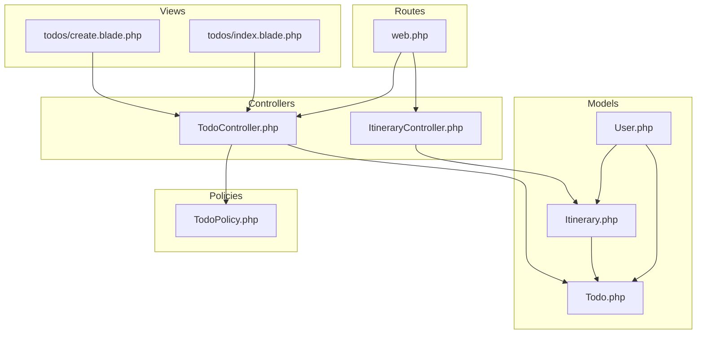
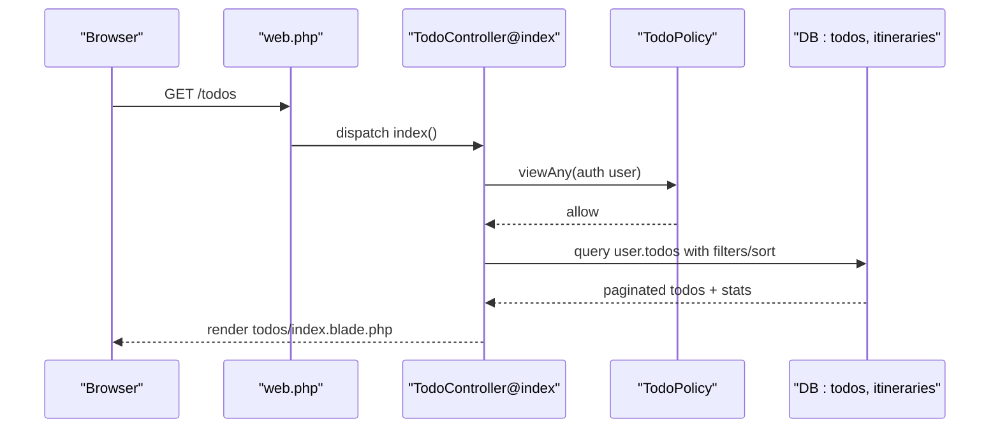
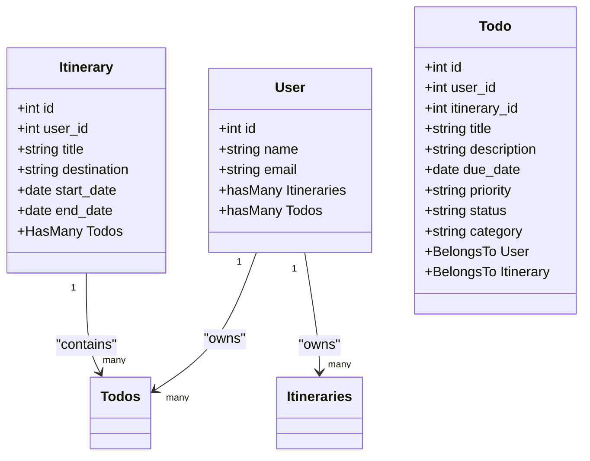
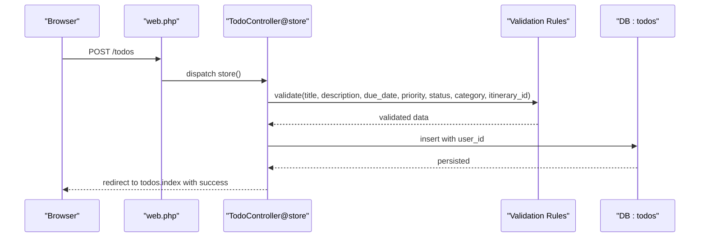
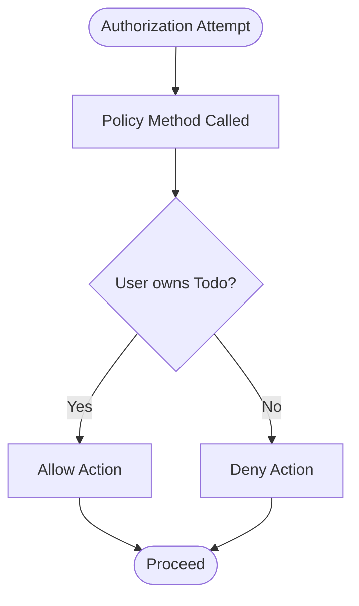
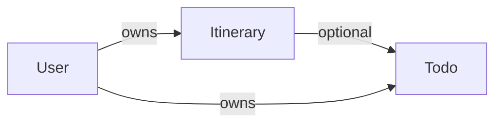
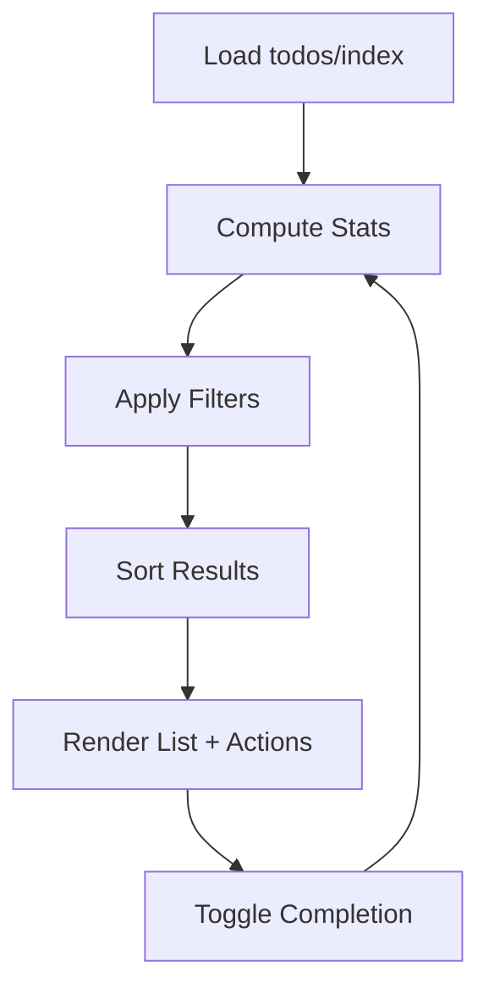
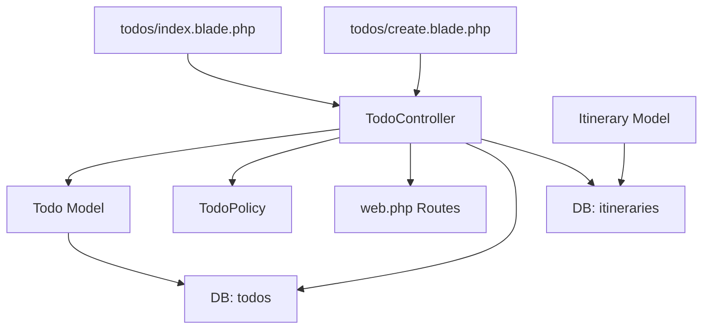

# To-Do List Management

<cite>
**Referenced Files in This Document**
- [Todo.php](file://app/Models/Todo.php)
- [Itinerary.php](file://app/Models/Itinerary.php)
- [TodoController.php](file://app/Http/Controllers/TodoController.php)
- [ItineraryController.php](file://app/Http/Controllers/ItineraryController.php)
- [TodoPolicy.php](file://app/Policies/TodoPolicy.php)
- [2026_04_21_132810_create_todos_table.php](file://database/migrations/2026_04_21_132810_create_todos_table.php)
- [2026_04_21_132801_create_itineraries_table.php](file://database/migrations/2026_04_21_132801_create_itineraries_table.php)
- [web.php](file://routes/web.php)
- [index.blade.php](file://resources/views/todos/index.blade.php)
- [create.blade.php](file://resources/views/todos/create.blade.php)
- [User.php](file://app/Models/User.php)
</cite>

## Table of Contents
1. [Introduction](#introduction)
2. [Project Structure](#project-structure)
3. [Core Components](#core-components)
4. [Architecture Overview](#architecture-overview)
5. [Detailed Component Analysis](#detailed-component-analysis)
6. [Dependency Analysis](#dependency-analysis)
7. [Performance Considerations](#performance-considerations)
8. [Troubleshooting Guide](#troubleshooting-guide)
9. [Conclusion](#conclusion)
10. [Appendices](#appendices)

## Introduction
This document explains the to-do list management system designed for organizing tasks and preparing trips. It covers how to create, assign, set priorities, track completion, and filter tasks. It also documents the integration with itineraries to provide context-aware suggestions and automatic task generation aligned with planned activities. The Todo model supports status tracking, due dates, categories, and optional linkage to itineraries. Authorization ensures users can only manage their own tasks. The UI provides filtering, sorting, and quick actions for productivity during travel planning.

## Project Structure
The to-do feature spans models, controllers, policies, migrations, routes, and Blade views:
- Models define Todo and Itinerary structures and relationships.
- Controllers handle HTTP requests for CRUD operations, authorization, validation, and status toggling.
- Policies enforce per-task ownership checks.
- Migrations define database schema and indexes.
- Routes expose resource endpoints and a dedicated toggle endpoint.
- Views render lists, forms, and statistics for task management.

**Diagram sources**
- [Todo.php:1-35](file://app/Models/Todo.php#L1-L35)
- [Itinerary.php:1-58](file://app/Models/Itinerary.php#L1-L58)
- [TodoController.php:1-132](file://app/Http/Controllers/TodoController.php#L1-L132)
- [ItineraryController.php:1-88](file://app/Http/Controllers/ItineraryController.php#L1-L88)
- [TodoPolicy.php:1-50](file://app/Policies/TodoPolicy.php#L1-L50)
- [web.php:40-42](file://routes/web.php#L40-L42)
- [index.blade.php:1-231](file://resources/views/todos/index.blade.php#L1-L231)
- [create.blade.php:1-154](file://resources/views/todos/create.blade.php#L1-L154)

**Section sources**
- [Todo.php:1-35](file://app/Models/Todo.php#L1-L35)
- [Itinerary.php:1-58](file://app/Models/Itinerary.php#L1-L58)
- [TodoController.php:1-132](file://app/Http/Controllers/TodoController.php#L1-L132)
- [ItineraryController.php:1-88](file://app/Http/Controllers/ItineraryController.php#L1-L88)
- [TodoPolicy.php:1-50](file://app/Policies/TodoPolicy.php#L1-L50)
- [web.php:40-42](file://routes/web.php#L40-L42)
- [index.blade.php:1-231](file://resources/views/todos/index.blade.php#L1-L231)
- [create.blade.php:1-154](file://resources/views/todos/create.blade.php#L1-L154)

## Core Components
- Todo model
  - Fillable fields include user_id, itinerary_id, title, description, due_date, priority, status, category.
  - Casts due_date to date type.
  - Relationships: belongs to User and belongs to Itinerary.
- Itinerary model
  - Fillable fields include user_id, title, destination, start_date, end_date, description, budget_total, status.
  - Casts start_date, end_date, budget_total.
  - Relationships: belongs to User, has many ItineraryDay, has many Budget, has many Todo, has many Memory, has many TravelGroup.
- TodoController
  - Index: fetches current user’s todos, applies filters (status, priority, category), sorts, paginates, computes stats, loads itineraries.
  - Create/Edit: load itineraries for selection.
  - Store/Update: validates inputs, assigns user_id, persists Todo.
  - Destroy: deletes Todo after authorization.
  - Toggle status: switches between pending and completed with authorization.
  - Authorization: uses TodoPolicy for view/update/delete.
- Routes
  - Resource routes for todos with a dedicated PATCH endpoint for toggling status.
- Views
  - Index: displays stats cards, filter form, task list with priority/status badges, overdue indicators, optional itinerary association, and actions.
  - Create: form with title, description, priority, status, due date, category, optional itinerary linking.

**Section sources**
- [Todo.php:10-33](file://app/Models/Todo.php#L10-L33)
- [Itinerary.php:11-56](file://app/Models/Itinerary.php#L11-L56)
- [TodoController.php:11-130](file://app/Http/Controllers/TodoController.php#L11-L130)
- [web.php:40-42](file://routes/web.php#L40-L42)
- [index.blade.php:19-231](file://resources/views/todos/index.blade.php#L19-L231)
- [create.blade.php:14-154](file://resources/views/todos/create.blade.php#L14-L154)

## Architecture Overview
The system follows MVC with explicit authorization and resource routing. Todos belong to users and optionally to itineraries. Controllers orchestrate validation, authorization, persistence, and presentation. Views render filtered and paginated lists with actionable UI elements.

**Diagram sources**
- [web.php:40-42](file://routes/web.php#L40-L42)
- [TodoController.php:11-48](file://app/Http/Controllers/TodoController.php#L11-L48)
- [TodoPolicy.php:13-16](file://app/Policies/TodoPolicy.php#L13-L16)

## Detailed Component Analysis

### Todo Model and Database Schema
- Model highlights
  - Fillable fields: user_id, itinerary_id, title, description, due_date, priority, status, category.
  - Casts: due_date as date.
  - Relationships: user(), itinerary().
- Database schema
  - Columns: id, user_id (FK), itinerary_id (nullable FK), title, description (nullable), due_date (nullable), priority (enum with default), status (enum with default), category (nullable), timestamps.
  - Indexes: (user_id, status), (due_date, priority).

**Diagram sources**
- [Todo.php:10-33](file://app/Models/Todo.php#L10-L33)
- [Itinerary.php:11-46](file://app/Models/Itinerary.php#L11-L46)
- [User.php:64-83](file://app/Models/User.php#L64-L83)
- [2026_04_21_132810_create_todos_table.php:14-28](file://database/migrations/2026_04_21_132810_create_todos_table.php#L14-L28)

**Section sources**
- [Todo.php:10-33](file://app/Models/Todo.php#L10-L33)
- [2026_04_21_132810_create_todos_table.php:14-28](file://database/migrations/2026_04_21_132810_create_todos_table.php#L14-L28)

### TodoController Operations, Validation, and Authorization
- Index
  - Fetches current user’s todos.
  - Applies filters: status, priority, category.
  - Sorts by due_date ascending by default; supports direction parameter.
  - Paginates results.
  - Computes stats: total, pending, in_progress, completed, urgent.
  - Loads itineraries for context-aware UI.
- Create/Edit
  - Loads itineraries for selection.
- Store/Update
  - Validates required fields and enums.
  - Assigns user_id from authenticated user.
  - Persists Todo.
- Destroy
  - Deletes Todo after authorization.
- Toggle Status
  - Switches between pending and completed with authorization.

**Diagram sources**
- [web.php:40-42](file://routes/web.php#L40-L42)
- [TodoController.php:56-74](file://app/Http/Controllers/TodoController.php#L56-L74)

**Section sources**
- [TodoController.php:11-130](file://app/Http/Controllers/TodoController.php#L11-L130)

### Authorization with TodoPolicy
- viewAny: always allowed.
- view: allowed if user_id equals todo.user_id.
- create: always allowed.
- update/delete: allowed if user_id equals todo.user_id.

**Diagram sources**
- [TodoPolicy.php:13-48](file://app/Policies/TodoPolicy.php#L13-L48)

**Section sources**
- [TodoPolicy.php:13-48](file://app/Policies/TodoPolicy.php#L13-L48)

### Itinerary Integration and Context-Aware Task Suggestions
- Relationship
  - Todos belong to a single user and optionally to an itinerary.
  - Itineraries belong to a user and contain many todos.
- UI integration
  - Create form allows linking a Todo to an Itinerary.
  - Index view shows itinerary title when associated.
- Automatic task generation
  - The current code does not implement automatic task generation from itinerary activities. To support this, you could:
    - Extend ItineraryDay to include suggested tasks derived from activities.
    - Add a “Generate tasks” action in the UI that creates Todos linked to the selected Itinerary.
    - Introduce templates or rules mapping activity types to task categories and priorities.

**Diagram sources**
- [Itinerary.php:43-46](file://app/Models/Itinerary.php#L43-L46)
- [Todo.php:25-33](file://app/Models/Todo.php#L25-L33)
- [create.blade.php:121-139](file://resources/views/todos/create.blade.php#L121-L139)

**Section sources**
- [Itinerary.php:43-46](file://app/Models/Itinerary.php#L43-L46)
- [Todo.php:25-33](file://app/Models/Todo.php#L25-L33)
- [create.blade.php:121-139](file://resources/views/todos/create.blade.php#L121-L139)

### UI and Filtering Capabilities
- Stats cards: total, pending, in_progress, completed, urgent.
- Filters: status, priority, category.
- Sorting: due_date with configurable direction.
- Task list: priority and status badges, due date with overdue highlighting, optional category and itinerary association, inline edit/delete actions, and a checkbox to toggle completion.

**Diagram sources**
- [index.blade.php:19-139](file://resources/views/todos/index.blade.php#L19-L139)

**Section sources**
- [index.blade.php:19-231](file://resources/views/todos/index.blade.php#L19-L231)

### Common Task Management Scenarios and Productivity Tips
- Scenario: Plan pre-trip tasks
  - Create Todos with “Pre-trip” category, due dates aligned with departure, and high/urgent priority.
  - Link to the relevant Itinerary for context.
- Scenario: Track daily tasks during the trip
  - Use “During trip” category, set due dates to each day, and adjust priorities based on activity schedules.
- Scenario: Batch completion
  - Use the inline toggle to mark tasks complete; overdue tasks are visually highlighted to maintain focus.
- Productivity tips
  - Use filters to isolate urgent or pending tasks.
  - Sort by due_date to focus on immediate obligations.
  - Assign categories to segment tasks by phase (pre-trip, during trip, post-trip).
  - Link tasks to itineraries to keep planning cohesive.

[No sources needed since this section provides general guidance]

## Dependency Analysis
- Controllers depend on models, policies, and routes.
- Views depend on controller-provided data and route helpers.
- Migrations define schema and indexes that support filtering and sorting.

**Diagram sources**
- [TodoController.php:5-10](file://app/Http/Controllers/TodoController.php#L5-L10)
- [Todo.php:8-34](file://app/Models/Todo.php#L8-L34)
- [Itinerary.php:9-57](file://app/Models/Itinerary.php#L9-L57)
- [web.php:40-42](file://routes/web.php#L40-L42)
- [index.blade.php:1-231](file://resources/views/todos/index.blade.php#L1-L231)
- [create.blade.php:1-154](file://resources/views/todos/create.blade.php#L1-L154)

**Section sources**
- [TodoController.php:5-10](file://app/Http/Controllers/TodoController.php#L5-L10)
- [Todo.php:8-34](file://app/Models/Todo.php#L8-L34)
- [Itinerary.php:9-57](file://app/Models/Itinerary.php#L9-L57)
- [web.php:40-42](file://routes/web.php#L40-L42)

## Performance Considerations
- Indexes
  - todos(user_id, status) supports efficient filtering by status per user.
  - todos(due_date, priority) supports efficient sorting and filtering by due date and priority.
- Pagination
  - Index.blade.php uses pagination to limit rendered rows.
- Recommendations
  - Consider adding an index on todos(category) if frequent category filtering is used.
  - For very large datasets, add composite indexes combining filters commonly used together.

[No sources needed since this section provides general guidance]

## Troubleshooting Guide
- Validation errors
  - Ensure title is present and within length limits; priority and status must match allowed enums; due_date must be a valid date; itinerary_id must exist if provided.
- Authorization failures
  - Only the task owner can view, update, or delete a Todo.
- Status toggle issues
  - Toggle endpoint switches between pending and completed; ensure the Todo exists and the user is authorized.

**Section sources**
- [TodoController.php:58-66](file://app/Http/Controllers/TodoController.php#L58-L66)
- [TodoController.php:89-101](file://app/Http/Controllers/TodoController.php#L89-L101)
- [TodoController.php:118-130](file://app/Http/Controllers/TodoController.php#L118-L130)
- [TodoPolicy.php:21-47](file://app/Policies/TodoPolicy.php#L21-L47)

## Conclusion
The to-do list management system provides a robust foundation for organizing travel-related tasks. Users can create, filter, sort, and toggle tasks while linking them to itineraries for contextual awareness. The model and controller design, combined with authorization and UI features, enable efficient trip preparation. Extending the system with automatic task generation from itinerary activities would further streamline planning.

[No sources needed since this section summarizes without analyzing specific files]

## Appendices

### API and Operation Summary
- Resource endpoints
  - GET/HEAD /todos — index
  - GET/HEAD /todos/create — create
  - POST /todos — store
  - GET/HEAD /todos/{todo} — show
  - GET/HEAD /todos/{todo}/edit — edit
  - PUT/PATCH /todos/{todo} — update
  - DELETE /todos/{todo} — destroy
  - PATCH /todos/{todo}/toggle — toggle status
- Filters and sorting
  - Query parameters: status, priority, category, sort, direction.

**Section sources**
- [web.php:40-42](file://routes/web.php#L40-L42)
- [TodoController.php:11-36](file://app/Http/Controllers/TodoController.php#L11-L36)