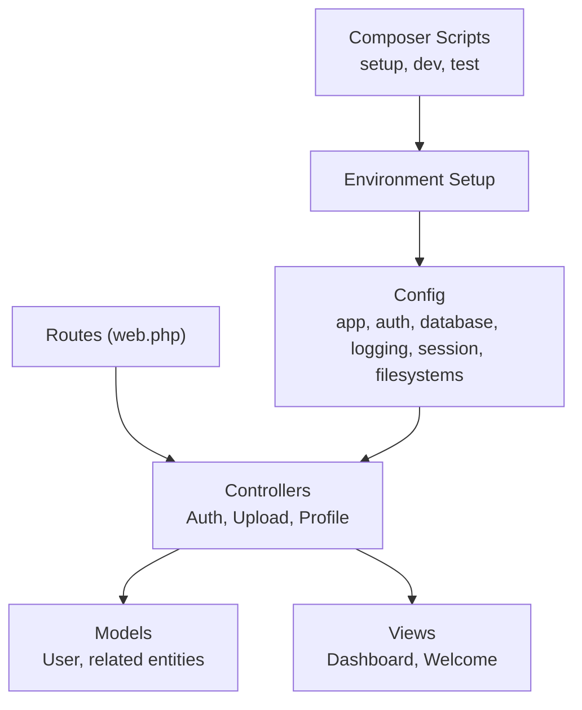
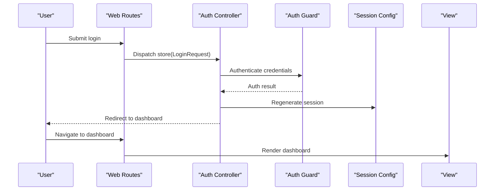
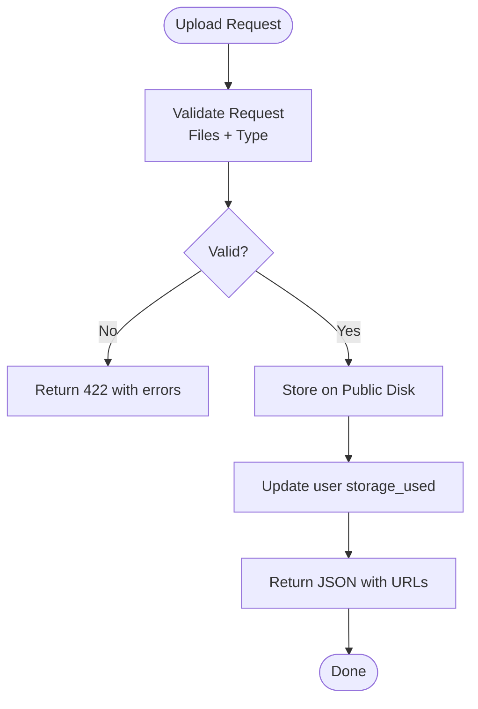
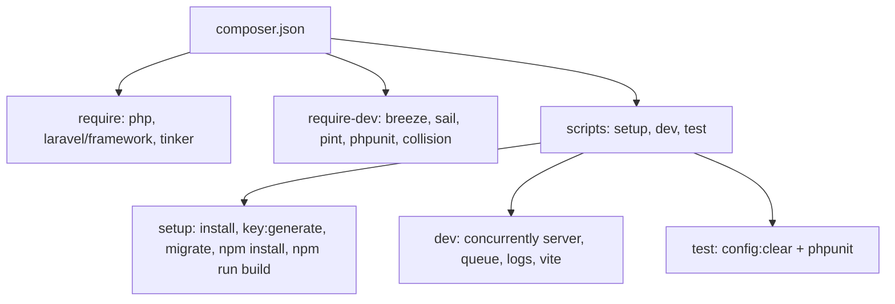

# Troubleshooting and FAQ

<cite>
**Referenced Files in This Document**
- [composer.json](file://composer.json)
- [config/app.php](file://config/app.php)
- [config/auth.php](file://config/auth.php)
- [config/database.php](file://config/database.php)
- [config/filesystems.php](file://config/filesystems.php)
- [config/logging.php](file://config/logging.php)
- [config/session.php](file://config/session.php)
- [bootstrap/app.php](file://bootstrap/app.php)
- [routes/web.php](file://routes/web.php)
- [app/Http/Controllers/Auth/AuthenticatedSessionController.php](file://app/Http/Controllers/Auth/AuthenticatedSessionController.php)
- [app/Http/Controllers/UploadController.php](file://app/Http/Controllers/UploadController.php)
- [app/Http/Controllers/ProfileController.php](file://app/Http/Controllers/ProfileController.php)
- [app/Models/User.php](file://app/Models/User.php)
- [database/migrations/0001_01_01_000000_create_users_table.php](file://database/migrations/0001_01_01_000000_create_users_table.php)
- [database/migrations/2026_04_21_140000_create_follows_table.php](file://database/migrations/2026_04_21_140000_create_follows_table.php)
- [resources/views/welcome.blade.php](file://resources/views/welcome.blade.php)
- [resources/views/dashboard.blade.php](file://resources/views/dashboard.blade.php)
- [README.md](file://README.md)
</cite>

## Table of Contents
1. [Introduction](#introduction)
2. [Project Structure](#project-structure)
3. [Core Components](#core-components)
4. [Architecture Overview](#architecture-overview)
5. [Detailed Component Analysis](#detailed-component-analysis)
6. [Dependency Analysis](#dependency-analysis)
7. [Performance Considerations](#performance-considerations)
8. [Troubleshooting Guide](#troubleshooting-guide)
9. [Conclusion](#conclusion)
10. [Appendices](#appendices)

## Introduction
This document provides a comprehensive troubleshooting and FAQ guide for the Travel_Project Laravel application. It focuses on diagnosing and resolving common issues such as installation problems, database connectivity, authentication failures, file upload errors, environment-specific pitfalls, dependency conflicts, configuration mistakes, performance bottlenecks, security concerns, and operational maintenance. It also outlines diagnostic procedures and escalation paths for complex issues.

## Project Structure
The application follows Laravel’s MVC pattern with modular controllers, models, policies, Blade views, and configuration-driven routing. Key areas relevant to troubleshooting include:
- Controllers handling authentication, uploads, profiles, and CRUD operations
- Configuration files for app behavior, database connections, logging, sessions, and filesystems
- Routes defining protected endpoints and upload handlers
- Models representing user data and storage limits
- Views rendering dashboards and landing pages

**Diagram sources**
- [routes/web.php:1-89](file://routes/web.php#L1-L89)
- [config/app.php:1-127](file://config/app.php#L1-L127)
- [config/auth.php:1-118](file://config/auth.php#L1-L118)
- [config/database.php:1-185](file://config/database.php#L1-L185)
- [config/logging.php:1-133](file://config/logging.php#L1-L133)
- [config/session.php:1-218](file://config/session.php#L1-L218)
- [config/filesystems.php:1-81](file://config/filesystems.php#L1-L81)
- [composer.json:1-88](file://composer.json#L1-L88)

**Section sources**
- [routes/web.php:1-89](file://routes/web.php#L1-L89)
- [composer.json:1-88](file://composer.json#L1-L88)

## Core Components
- Authentication controller orchestrates login/logout and redirects to the dashboard upon success.
- Upload controller handles multi-file and single-image uploads, tracks storage usage per user, and deletes files from storage.
- Profile controller manages profile updates, avatar uploads, password changes, and preference updates.
- User model encapsulates storage limits, subscription status, and relationships to related entities.
- Configuration files define environment behavior, database connections, logging levels, session drivers, and filesystem disks.

Key troubleshooting anchors:
- Authentication failures often stem from misconfigured guards/providers or session persistence.
- Upload issues commonly involve filesystem permissions, disk configuration, and validation rules.
- Database connectivity depends on correct credentials and selected driver/connection defaults.
- Logging and environment variables determine visibility of errors and stack traces.

**Section sources**
- [app/Http/Controllers/Auth/AuthenticatedSessionController.php:1-48](file://app/Http/Controllers/Auth/AuthenticatedSessionController.php#L1-L48)
- [app/Http/Controllers/UploadController.php:1-118](file://app/Http/Controllers/UploadController.php#L1-L118)
- [app/Http/Controllers/ProfileController.php:1-111](file://app/Http/Controllers/ProfileController.php#L1-L111)
- [app/Models/User.php:1-172](file://app/Models/User.php#L1-L172)
- [config/auth.php:1-118](file://config/auth.php#L1-L118)
- [config/database.php:1-185](file://config/database.php#L1-L185)
- [config/filesystems.php:1-81](file://config/filesystems.php#L1-L81)
- [config/session.php:1-218](file://config/session.php#L1-L218)
- [config/logging.php:1-133](file://config/logging.php#L1-L133)

## Architecture Overview
The runtime flow integrates routing, middleware, controllers, models, and storage systems. Authentication relies on session-based guards, while uploads leverage local filesystem disks and URL generation for public assets.

**Diagram sources**
- [routes/web.php:10-12](file://routes/web.php#L10-L12)
- [app/Http/Controllers/Auth/AuthenticatedSessionController.php:25-31](file://app/Http/Controllers/Auth/AuthenticatedSessionController.php#L25-L31)
- [config/auth.php:40-44](file://config/auth.php#L40-L44)
- [config/session.php:21](file://config/session.php#L21)

**Section sources**
- [routes/web.php:10-12](file://routes/web.php#L10-L12)
- [app/Http/Controllers/Auth/AuthenticatedSessionController.php:25-31](file://app/Http/Controllers/Auth/AuthenticatedSessionController.php#L25-L31)
- [config/auth.php:40-44](file://config/auth.php#L40-L44)
- [config/session.php:21](file://config/session.php#L21)

## Detailed Component Analysis

### Authentication Troubleshooting
Common symptoms:
- Login fails silently or redirects to login again
- “Unauthorized” after successful login
- CSRF or session cookie issues

Root causes and fixes:
- Verify APP_DEBUG and APP_ENV are set appropriately for development vs production.
- Ensure session driver is reachable and writable (database by default).
- Confirm AUTH_GUARD and provider configuration match the intended guard.
- Check that the session lifetime and cookie settings are compatible with your deployment.

Diagnostic steps:
- Temporarily enable debug mode locally to inspect stack traces.
- Inspect session table existence and records.
- Validate CSRF tokens and SameSite cookie settings.

**Section sources**
- [config/app.php:29](file://config/app.php#L29)
- [config/app.php:42](file://config/app.php#L42)
- [config/session.php:21](file://config/session.php#L21)
- [config/session.php:130-202](file://config/session.php#L130-L202)
- [config/auth.php:18-21](file://config/auth.php#L18-L21)
- [config/auth.php:40-44](file://config/auth.php#L40-L44)

### Upload and File Management Troubleshooting
Common symptoms:
- Uploads fail validation or return 422
- Files appear uploaded but not served via /storage URLs
- Deleting files does not reflect in storage_used

Root causes and fixes:
- Validation rules enforce file types and sizes; adjust if needed.
- Ensure storage symlink exists and public disk URL is correct.
- Confirm user storage_used increments/decrements match file sizes.

Diagnostic steps:
- Review upload controller validation rules and ensure client respects them.
- Verify filesystems disk configuration and public URL generation.
- Check storage permissions and disk availability.

**Diagram sources**
- [app/Http/Controllers/UploadController.php:13-41](file://app/Http/Controllers/UploadController.php#L13-L41)
- [app/Http/Controllers/UploadController.php:68-90](file://app/Http/Controllers/UploadController.php#L68-L90)
- [config/filesystems.php:41-48](file://config/filesystems.php#L41-L48)

**Section sources**
- [app/Http/Controllers/UploadController.php:13-41](file://app/Http/Controllers/UploadController.php#L13-L41)
- [app/Http/Controllers/UploadController.php:46-63](file://app/Http/Controllers/UploadController.php#L46-L63)
- [app/Http/Controllers/UploadController.php:68-116](file://app/Http/Controllers/UploadController.php#L68-L116)
- [config/filesystems.php:41-48](file://config/filesystems.php#L41-L48)

### Database Connectivity Troubleshooting
Common symptoms:
- Application throws connection errors during migrations or queries
- SQLite file missing or locked
- MySQL/MariaDB credentials invalid

Root causes and fixes:
- Confirm DB_CONNECTION matches your environment (sqlite/mysql/mariadb/pgsql/sqlsrv).
- For SQLite, ensure database file path exists and is writable.
- For MySQL/MariaDB, verify host, port, username, password, and charset/collation.
- For PostgreSQL/SQL Server, verify driver-specific settings.

Diagnostic steps:
- Check default connection in config/database.php.
- Validate environment variables for DB_* keys.
- Test connectivity externally using the same credentials.

**Section sources**
- [config/database.php:20](file://config/database.php#L20)
- [config/database.php:35-45](file://config/database.php#L35-L45)
- [config/database.php:47-85](file://config/database.php#L47-L85)
- [config/database.php:87-115](file://config/database.php#L87-L115)

### Logging and Error Visibility
Common symptoms:
- No visible errors in production
- Excessive logs overwhelming storage

Root causes and fixes:
- Adjust LOG_LEVEL and LOG_CHANNEL for desired verbosity.
- Use stack channels to combine multiple handlers.
- Configure daily rotation and retention.

Diagnostic steps:
- Review default channel and handler configuration.
- Tail logs in storage/logs or integrate external logging.

**Section sources**
- [config/logging.php:21](file://config/logging.php#L21)
- [config/logging.php:55-66](file://config/logging.php#L55-L66)
- [config/logging.php:68-74](file://config/logging.php#L68-L74)

### Environment and Setup Troubleshooting
Common symptoms:
- Composer install fails or autoload missing
- NPM build fails or assets not loading
- Dev server not starting

Root causes and fixes:
- Ensure PHP version meets requirements and extensions are enabled.
- Run setup script to generate key, run migrations, install JS deps, and build assets.
- Use dev script to run server, queue listener, logs, and Vite concurrently.

Diagnostic steps:
- Confirm PHP version and required extensions.
- Execute setup script and review Composer scripts.
- Verify NODE_ENV and asset pipeline readiness.

**Section sources**
- [composer.json:8-12](file://composer.json#L8-L12)
- [composer.json:36-47](file://composer.json#L36-L47)
- [composer.json:52-58](file://composer.json#L52-L58)

### Security and Access Control
Common symptoms:
- Unauthorized access to protected routes
- CSRF/XSRF failures
- Session fixation or hijacking

Root causes and fixes:
- Enforce auth middleware on protected routes.
- Configure session cookie security (secure, httpOnly, sameSite).
- Use CSRF protection and proper form submissions.

Diagnostic steps:
- Verify auth middleware presence on routes.
- Review session cookie settings and SameSite policy.
- Audit CSRF tokens and referer checks.

**Section sources**
- [routes/web.php:14-86](file://routes/web.php#L14-L86)
- [config/session.php:172](file://config/session.php#L172)
- [config/session.php:185](file://config/session.php#L185)
- [config/session.php:202](file://config/session.php#L202)

### Storage Limits and Quotas
Common symptoms:
- Users unable to upload despite having free tier
- Storage usage not reflected accurately

Root causes and fixes:
- Ensure storage_used increments on uploads and decrements on deletions.
- Implement storage limit checks before uploads.
- Provide user feedback when limits are exceeded.

Diagnostic steps:
- Inspect user storage_used and tier-based limits.
- Add pre-upload checks to prevent exceeding quotas.

**Section sources**
- [app/Models/User.php:158-170](file://app/Models/User.php#L158-L170)
- [app/Http/Controllers/UploadController.php:32-40](file://app/Http/Controllers/UploadController.php#L32-L40)
- [app/Http/Controllers/UploadController.php:55-62](file://app/Http/Controllers/UploadController.php#L55-L62)
- [app/Http/Controllers/UploadController.php:81-89](file://app/Http/Controllers/UploadController.php#L81-L89)
- [app/Http/Controllers/UploadController.php:108-115](file://app/Http/Controllers/UploadController.php#L108-L115)

## Dependency Analysis
The application relies on Laravel core, framework components, and optional developer tools. Composer scripts automate setup and development workflows.

**Diagram sources**
- [composer.json:8-12](file://composer.json#L8-L12)
- [composer.json:13-22](file://composer.json#L13-L22)
- [composer.json:36-68](file://composer.json#L36-L68)

**Section sources**
- [composer.json:8-12](file://composer.json#L8-L12)
- [composer.json:36-68](file://composer.json#L36-L68)

## Performance Considerations
- Database query optimization
  - Use eager loading for relationships in views and controllers.
  - Add indexes for frequent filters (e.g., follows table composite index).
  - Monitor slow queries via Laravel Telescope or database profiling.

- Memory usage analysis
  - Reduce payload sizes for uploads; enforce strict max sizes.
  - Stream large downloads instead of buffering.
  - Monitor PHP memory_limit and garbage collection.

- Asset loading issues
  - Ensure Vite build artifacts are generated and served.
  - Clear compiled assets and caches after changes.
  - Verify APP_URL and asset URLs in production.

[No sources needed since this section provides general guidance]

## Troubleshooting Guide

### Installation Issues
Symptoms:
- Composer install fails due to PHP version or missing extensions
- NPM install/build fails

Resolution:
- Confirm PHP version satisfies requirement and required extensions are enabled.
- Run setup script to initialize environment and assets.
- Reinstall dependencies if autoloader is missing.

**Section sources**
- [composer.json:8-12](file://composer.json#L8-L12)
- [composer.json:36-47](file://composer.json#L36-L47)

### Database Connection Errors
Symptoms:
- Migration/connectivity errors
- SQLite file not found or locked

Resolution:
- Verify DB_CONNECTION and credentials.
- Ensure SQLite database file path exists and is writable.
- For MySQL/MariaDB, confirm host/port and charset/collation.

**Section sources**
- [config/database.php:20](file://config/database.php#L20)
- [config/database.php:35-45](file://config/database.php#L35-L45)
- [config/database.php:47-85](file://config/database.php#L47-L85)

### Authentication Failures
Symptoms:
- Login redirects back to login
- Unauthorized after login

Resolution:
- Check session driver and database sessions table.
- Verify auth guard/provider configuration.
- Enable debug mode temporarily to capture errors.

**Section sources**
- [config/session.php:21](file://config/session.php#L21)
- [config/auth.php:18-21](file://config/auth.php#L18-L21)
- [config/auth.php:40-44](file://config/auth.php#L40-L44)
- [config/app.php:42](file://config/app.php#L42)

### File Upload Problems
Symptoms:
- 422 validation errors
- Files not served via /storage URLs

Resolution:
- Align client-side constraints with controller validation rules.
- Ensure storage symlink exists and public disk URL is correct.
- Verify filesystem disk permissions and availability.

**Section sources**
- [app/Http/Controllers/UploadController.php:13-41](file://app/Http/Controllers/UploadController.php#L13-L41)
- [app/Http/Controllers/UploadController.php:68-116](file://app/Http/Controllers/UploadController.php#L68-L116)
- [config/filesystems.php:41-48](file://config/filesystems.php#L41-L48)

### Environment-Specific Problems
Symptoms:
- Production errors not visible
- Assets not loading in production

Resolution:
- Set APP_ENV to production and APP_DEBUG to false.
- Configure LOG_LEVEL and channels for production.
- Build assets and verify APP_URL and storage symlink.

**Section sources**
- [config/app.php:29](file://config/app.php#L29)
- [config/app.php:42](file://config/app.php#L42)
- [config/logging.php:21](file://config/logging.php#L21)
- [config/filesystems.php:41-48](file://config/filesystems.php#L41-L48)

### Dependency Conflicts
Symptoms:
- Composer update/install errors
- Conflicting package versions

Resolution:
- Use Composer to resolve conflicts and update lock file.
- Prefer stable versions and align PHP version.

**Section sources**
- [composer.json:85-87](file://composer.json#L85-L87)

### Configuration Errors
Symptoms:
- Incorrect URLs, sessions, or logging behavior

Resolution:
- Validate environment variables for APP_URL, LOG_CHANNEL, SESSION_*.
- Confirm database and filesystem configurations match deployment.

**Section sources**
- [config/app.php:55](file://config/app.php#L55)
- [config/logging.php:21](file://config/logging.php#L21)
- [config/session.php:130-202](file://config/session.php#L130-L202)
- [config/filesystems.php:16](file://config/filesystems.php#L16)

### Security Considerations
Symptoms:
- CSRF/XSRF failures or unauthorized access

Resolution:
- Enforce auth middleware on protected routes.
- Secure session cookies and SameSite policy.
- Validate CSRF tokens on forms.

**Section sources**
- [routes/web.php:14-86](file://routes/web.php#L14-L86)
- [config/session.php:172](file://config/session.php#L172)
- [config/session.php:202](file://config/session.php#L202)

### Permission Problems
Symptoms:
- Cannot write to storage or sessions
- File deletion does not update usage

Resolution:
- Ensure storage/app/public and framework directories are writable.
- Verify filesystem disk permissions and public symlink.

**Section sources**
- [config/filesystems.php:41-48](file://config/filesystems.php#L41-L48)

### Diagnostic Procedures
- Authentication
  - Verify session driver and table existence.
  - Check guard/provider configuration.
- Uploads
  - Validate request constraints and disk URL.
  - Confirm storage_used updates.
- Database
  - Confirm connection defaults and credentials.
- Logging
  - Adjust channel and level for visibility.
- Environment
  - Run setup/test scripts and rebuild assets.

**Section sources**
- [config/session.php:21](file://config/session.php#L21)
- [config/auth.php:40-44](file://config/auth.php#L40-L44)
- [app/Http/Controllers/UploadController.php:13-41](file://app/Http/Controllers/UploadController.php#L13-L41)
- [config/database.php:20](file://config/database.php#L20)
- [config/logging.php:21](file://config/logging.php#L21)
- [composer.json:36-47](file://composer.json#L36-L47)

### Escalation Paths
- For unexplained runtime errors, enable debug mode locally and increase log level.
- For persistent environment issues, validate CI/CD steps and Docker/Sail configuration.
- For performance regressions, profile queries and assets, then optimize.

**Section sources**
- [config/app.php:42](file://config/app.php#L42)
- [config/logging.php:68-74](file://config/logging.php#L68-L74)
- [composer.json:44-47](file://composer.json#L44-L47)

### Maintenance and Health Monitoring
- Regularly rotate logs and monitor disk usage.
- Monitor session table growth and sweep odds.
- Keep dependencies updated and run tests before deployments.

**Section sources**
- [config/logging.php:68-74](file://config/logging.php#L68-L74)
- [config/session.php:117](file://config/session.php#L117)
- [composer.json:48-51](file://composer.json#L48-L51)

## Conclusion
This guide consolidates actionable troubleshooting steps for common issues across installation, environment setup, authentication, uploads, database connectivity, logging, and performance. By validating configuration, enforcing middleware, and leveraging Laravel’s logging and development scripts, most problems can be diagnosed and resolved efficiently. For complex issues, escalate with detailed logs, environment variables, and reproduction steps.

## Appendices

### Quick Reference: Common Commands
- Setup: [composer.json:36-47](file://composer.json#L36-L47)
- Development: [composer.json:44-47](file://composer.json#L44-L47)
- Testing: [composer.json:48-51](file://composer.json#L48-L51)

### Configuration Anchors
- App: [config/app.php:29](file://config/app.php#L29), [config/app.php:42](file://config/app.php#L42), [config/app.php:55](file://config/app.php#L55)
- Auth: [config/auth.php:18-21](file://config/auth.php#L18-L21), [config/auth.php:40-44](file://config/auth.php#L40-L44)
- Database: [config/database.php:20](file://config/database.php#L20), [config/database.php:35-45](file://config/database.php#L35-L45)
- Logging: [config/logging.php:21](file://config/logging.php#L21), [config/logging.php:55-66](file://config/logging.php#L55-L66)
- Session: [config/session.php:21](file://config/session.php#L21), [config/session.php:130-202](file://config/session.php#L130-L202)
- Filesystems: [config/filesystems.php:16](file://config/filesystems.php#L16), [config/filesystems.php:41-48](file://config/filesystems.php#L41-L48)