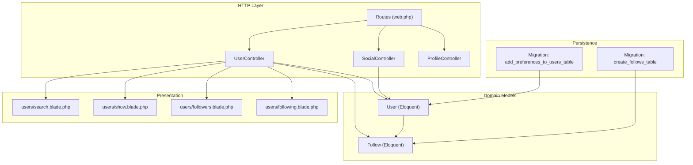
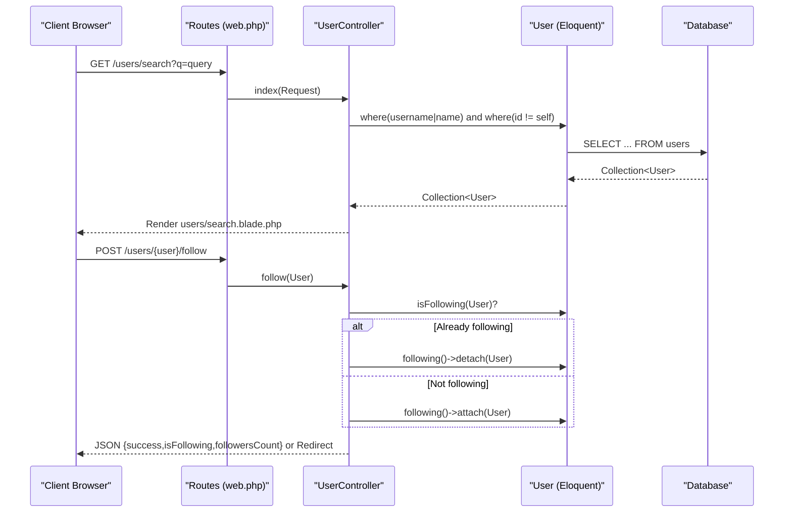
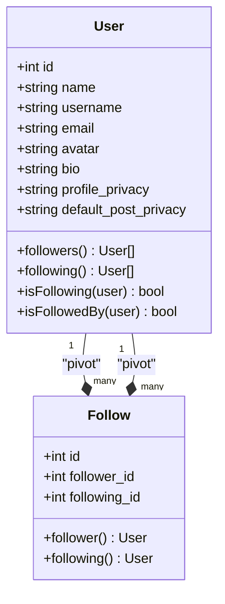
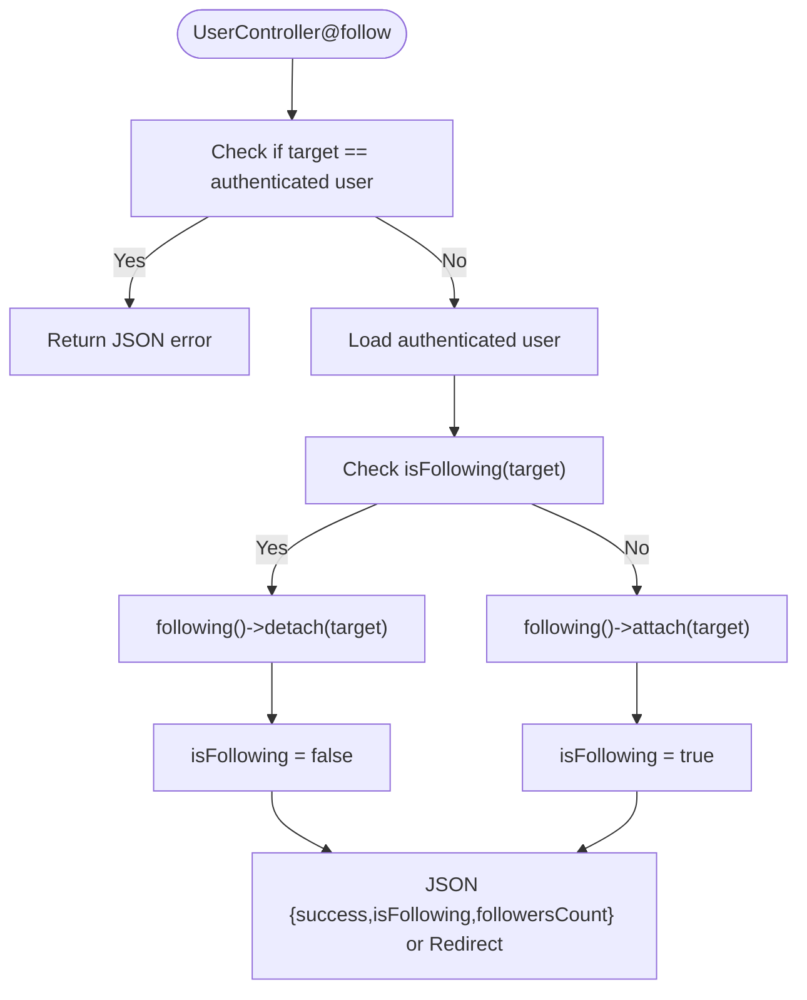
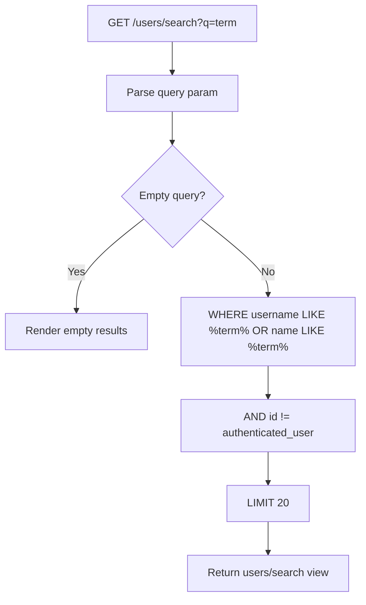
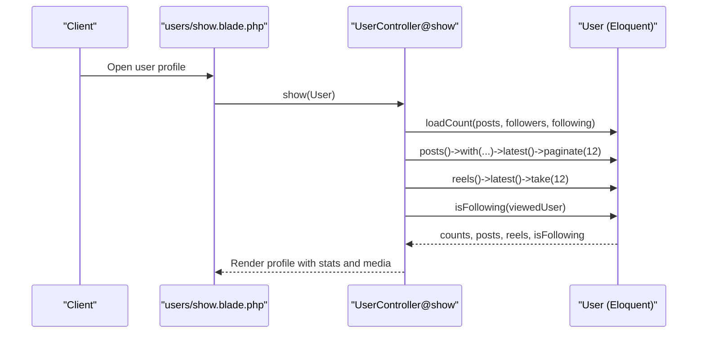
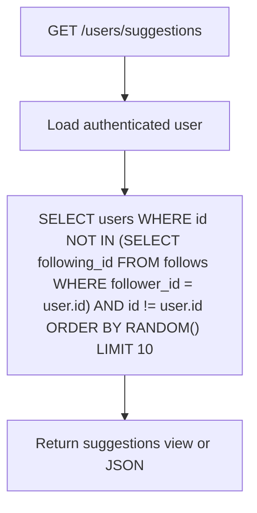
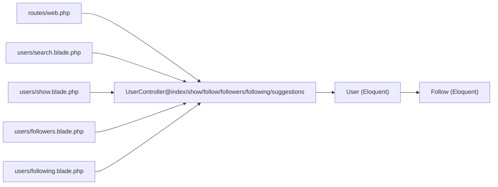

# User Discovery and Following

<cite>
**Referenced Files in This Document**
- [UserController.php](file://app/Http/Controllers/UserController.php)
- [User.php](file://app/Models/User.php)
- [Follow.php](file://app/Models/Follow.php)
- [2026_04_21_140000_create_follows_table.php](file://database/migrations/2026_04_21_140000_create_follows_table.php)
- [2026_04_21_140001_add_preferences_to_users_table.php](file://database/migrations/2026_04_21_140001_add_preferences_to_users_table.php)
- [web.php](file://routes/web.php)
- [search.blade.php](file://resources/views/users/search.blade.php)
- [followers.blade.php](file://resources/views/users/followers.blade.php)
- [following.blade.php](file://resources/views/users/following.blade.php)
- [show.blade.php](file://resources/views/users/show.blade.php)
- [SocialController.php](file://app/Http/Controllers/SocialController.php)
- [ProfileController.php](file://app/Http/Controllers/ProfileController.php)
</cite>

## Table of Contents
1. [Introduction](#introduction)
2. [Project Structure](#project-structure)
3. [Core Components](#core-components)
4. [Architecture Overview](#architecture-overview)
5. [Detailed Component Analysis](#detailed-component-analysis)
6. [Dependency Analysis](#dependency-analysis)
7. [Performance Considerations](#performance-considerations)
8. [Troubleshooting Guide](#troubleshooting-guide)
9. [Conclusion](#conclusion)
10. [Appendices](#appendices)

## Introduction
This document explains the user discovery and following system for building social connections. It covers:
- User search with privacy-aware filtering
- Follower/following management
- Relationship model and social graph construction
- Controller operations for search, follow/unfollow, and connection management
- Privacy controls and suggestion algorithms
- Examples of common discovery scenarios and social network building strategies

## Project Structure
The user discovery and following features span controllers, models, migrations, routes, and Blade templates:
- Controllers: UserController for discovery and follow actions; SocialController for social feeds; ProfileController for privacy settings
- Models: User with many-to-many follow relationships; Follow bridge model
- Routes: Named routes under users.* and social.*
- Views: Search, profile, followers, following lists

**Diagram sources**
- [web.php:22-30](file://routes/web.php#L22-L30)
- [UserController.php:1-120](file://app/Http/Controllers/UserController.php#L1-L120)
- [SocialController.php:1-179](file://app/Http/Controllers/SocialController.php#L1-L179)
- [ProfileController.php:1-111](file://app/Http/Controllers/ProfileController.php#L1-L111)
- [User.php:130-149](file://app/Models/User.php#L130-L149)
- [Follow.php:10-23](file://app/Models/Follow.php#L10-L23)
- [2026_04_21_140000_create_follows_table.php:14-21](file://database/migrations/2026_04_21_140000_create_follows_table.php#L14-L21)
- [2026_04_21_140001_add_preferences_to_users_table.php:14-19](file://database/migrations/2026_04_21_140001_add_preferences_to_users_table.php#L14-L19)
- [search.blade.php:1-46](file://resources/views/users/search.blade.php#L1-L46)
- [show.blade.php:1-112](file://resources/views/users/show.blade.php#L1-L112)
- [followers.blade.php:1-40](file://resources/views/users/followers.blade.php#L1-L40)
- [following.blade.php:1-40](file://resources/views/users/following.blade.php#L1-L40)

**Section sources**
- [web.php:22-30](file://routes/web.php#L22-L30)
- [UserController.php:13-118](file://app/Http/Controllers/UserController.php#L13-L118)
- [User.php:130-149](file://app/Models/User.php#L130-L149)
- [Follow.php:10-23](file://app/Models/Follow.php#L10-L23)
- [2026_04_21_140000_create_follows_table.php:14-21](file://database/migrations/2026_04_21_140000_create_follows_table.php#L14-L21)
- [2026_04_21_140001_add_preferences_to_users_table.php:14-19](file://database/migrations/2026_04_21_140001_add_preferences_to_users_table.php#L14-L19)
- [search.blade.php:7-34](file://resources/views/users/search.blade.php#L7-L34)
- [show.blade.php:26-34](file://resources/views/users/show.blade.php#L26-L34)
- [followers.blade.php:11-28](file://resources/views/users/followers.blade.php#L11-L28)
- [following.blade.php:11-28](file://resources/views/users/following.blade.php#L11-L28)

## Core Components
- UserController: Implements search, follow/unfollow toggle, followers/following lists, and suggestions
- User model: Defines follows relationship and helpers to check follow status
- Follow model: Bridge model for the follows table
- Routes: Named routes for users.*, including search, suggestions, show, follow, followers, following
- Views: Search results, profile page, followers list, following list

Key responsibilities:
- Search: Full-text-like matching on username and name, excluding self, limited results
- Follow: Toggle relationship via attach/detach; JSON responses for AJAX
- Suggestions: Random users excluding current user and existing follows
- Lists: Paginated followers and following ordered by follow creation time

**Section sources**
- [UserController.php:13-118](file://app/Http/Controllers/UserController.php#L13-L118)
- [User.php:130-149](file://app/Models/User.php#L130-L149)
- [Follow.php:10-23](file://app/Models/Follow.php#L10-L23)
- [web.php:22-30](file://routes/web.php#L22-L30)
- [search.blade.php:15-43](file://resources/views/users/search.blade.php#L15-L43)
- [show.blade.php:38-46](file://resources/views/users/show.blade.php#L38-L46)
- [followers.blade.php:10-35](file://resources/views/users/followers.blade.php#L10-L35)
- [following.blade.php:10-35](file://resources/views/users/following.blade.php#L10-L35)

## Architecture Overview
The system uses a classic MVC pattern with Eloquent models representing the social graph. Routes dispatch to UserController for discovery and follow actions, while views render lists and forms. Privacy settings influence default post visibility but do not restrict discovery APIs.

**Diagram sources**
- [web.php:24-29](file://routes/web.php#L24-L29)
- [UserController.php:13-73](file://app/Http/Controllers/UserController.php#L13-L73)
- [User.php:141-144](file://app/Models/User.php#L141-L144)

## Detailed Component Analysis

### Follow Model and Social Graph
The Follow model represents the bridge table for a many-to-many relationship. It defines belongsTo relations to User for both follower and following sides. The User model declares two belongsToMany relationships keyed by the pivot table, enabling:
- User->followers() via follows.follower_id
- User->following() via follows.following_id

**Diagram sources**
- [User.php:130-149](file://app/Models/User.php#L130-L149)
- [Follow.php:10-23](file://app/Models/Follow.php#L10-L23)

**Section sources**
- [Follow.php:10-23](file://app/Models/Follow.php#L10-L23)
- [User.php:130-149](file://app/Models/User.php#L130-L149)
- [2026_04_21_140000_create_follows_table.php:14-21](file://database/migrations/2026_04_21_140000_create_follows_table.php#L14-L21)

### User Controller Operations
- Search: Accepts query parameter q, matches username or name, excludes current user, limits results
- Show: Loads counts for posts, followers, following; paginates posts; retrieves recent reels; determines follow status
- Follow/Unfollow: Prevents self-follow; toggles relationship; returns JSON for AJAX requests
- Followers/Following: Paginates and renders lists ordered by follow creation time
- Suggestions: Excludes current user and existing follows; random selection limited to 10

**Diagram sources**
- [UserController.php:48-73](file://app/Http/Controllers/UserController.php#L48-L73)
- [User.php:141-144](file://app/Models/User.php#L141-L144)

**Section sources**
- [UserController.php:13-118](file://app/Http/Controllers/UserController.php#L13-L118)
- [User.php:141-144](file://app/Models/User.php#L141-L144)

### Privacy-Aware Filtering and Discovery
- User search does not apply profile privacy filters; it simply excludes the current user and applies a LIKE-based filter on username and name
- Profile privacy and default post privacy are stored on the User model and managed via ProfileController
- These privacy settings primarily affect post visibility in social feeds, not discovery endpoints

**Diagram sources**
- [UserController.php:13-28](file://app/Http/Controllers/UserController.php#L13-L28)

**Section sources**
- [UserController.php:13-28](file://app/Http/Controllers/UserController.php#L13-L28)
- [2026_04_21_140001_add_preferences_to_users_table.php:14-19](file://database/migrations/2026_04_21_140001_add_preferences_to_users_table.php#L14-L19)
- [ProfileController.php:97-109](file://app/Http/Controllers/ProfileController.php#L97-L109)

### Views and UI Flows
- Search view: Renders a list of users with follow buttons; button label reflects current follow status
- Profile view: Shows stats and tabs; follow button visible when viewing another user’s profile
- Followers/Following views: Paginated lists with follow buttons for non-self entries

**Diagram sources**
- [show.blade.php:26-34](file://resources/views/users/show.blade.php#L26-L34)
- [UserController.php:33-43](file://app/Http/Controllers/UserController.php#L33-L43)
- [User.php:141-144](file://app/Models/User.php#L141-L144)

**Section sources**
- [search.blade.php:17-34](file://resources/views/users/search.blade.php#L17-L34)
- [show.blade.php:38-46](file://resources/views/users/show.blade.php#L38-L46)
- [followers.blade.php:11-28](file://resources/views/users/followers.blade.php#L11-L28)
- [following.blade.php:11-28](file://resources/views/users/following.blade.php#L11-L28)

### Suggestion Algorithms
- Current implementation: Randomly selects users not currently followed by the authenticated user, excluding self
- Recommendation scope: No advanced algorithmic scoring (e.g., mutual connections, recency) is implemented in the current code

**Diagram sources**
- [UserController.php:98-118](file://app/Http/Controllers/UserController.php#L98-L118)

**Section sources**
- [UserController.php:98-118](file://app/Http/Controllers/UserController.php#L98-L118)

## Dependency Analysis
- UserController depends on User model for relationships and helpers
- User model depends on Follow bridge model via belongsToMany relationships
- Routes define named endpoints under users.* and map to UserController methods
- Views depend on controller-provided data and route helpers

**Diagram sources**
- [web.php:22-30](file://routes/web.php#L22-L30)
- [UserController.php:13-118](file://app/Http/Controllers/UserController.php#L13-L118)
- [User.php:130-149](file://app/Models/User.php#L130-L149)
- [Follow.php:10-23](file://app/Models/Follow.php#L10-L23)
- [search.blade.php:1-46](file://resources/views/users/search.blade.php#L1-L46)
- [show.blade.php:1-112](file://resources/views/users/show.blade.php#L1-L112)
- [followers.blade.php:1-40](file://resources/views/users/followers.blade.php#L1-L40)
- [following.blade.php:1-40](file://resources/views/users/following.blade.php#L1-L40)

**Section sources**
- [web.php:22-30](file://routes/web.php#L22-L30)
- [UserController.php:13-118](file://app/Http/Controllers/UserController.php#L13-L118)
- [User.php:130-149](file://app/Models/User.php#L130-L149)
- [Follow.php:10-23](file://app/Models/Follow.php#L10-L23)

## Performance Considerations
- Search: Uses LIKE with wildcards; consider indexing username and name for improved performance
- Pagination: Followers and following lists use paginate(20); keep per-page reasonable to avoid heavy queries
- Suggestions: inRandomOrder() can be expensive on large datasets; consider limiting scope or adding indexes
- Relationship checks: isFollowing() uses exists() on a join; ensure appropriate indexes on follows(follower_id, following_id)

## Troubleshooting Guide
- Cannot follow yourself: The controller returns a JSON error when attempting to follow the authenticated user
- AJAX follow failures: Ensure CSRF token is present in POST requests to /users/{user}/follow
- Empty search results: When query is empty, the controller returns an empty collection; ensure the frontend handles empty states
- Privacy settings not affecting discovery: Profile privacy settings apply to post visibility, not discovery endpoints

**Section sources**
- [UserController.php:50-52](file://app/Http/Controllers/UserController.php#L50-L52)
- [UserController.php:64-72](file://app/Http/Controllers/UserController.php#L64-L72)
- [UserController.php:17-19](file://app/Http/Controllers/UserController.php#L17-L19)
- [2026_04_21_140001_add_preferences_to_users_table.php:14-19](file://database/migrations/2026_04_21_140001_add_preferences_to_users_table.php#L14-L19)

## Conclusion
The user discovery and following system centers on a clean Eloquent model design with a dedicated pivot table for relationships. UserController orchestrates search, follow/unfollow, and connection management, while views provide intuitive UIs for browsing profiles and managing connections. Privacy settings are modeled at the user level and primarily impact post visibility rather than discovery. Suggestions are currently basic random picks; future enhancements could incorporate engagement signals or mutual connections.

## Appendices

### API and Operation Reference
- GET /users/search?q={term}
  - Purpose: Search users by username or name
  - Behavior: Excludes current user; returns up to 20 results
  - Response: HTML view with users and follow buttons
  - Section sources
    - [web.php:24](file://routes/web.php#L24)
    - [UserController.php:13-28](file://app/Http/Controllers/UserController.php#L13-L28)
    - [search.blade.php:15-43](file://resources/views/users/search.blade.php#L15-L43)

- POST /users/{user}/follow
  - Purpose: Toggle follow/unfollow
  - Behavior: Prevents self-follow; returns JSON for AJAX
  - Response: JSON {success,isFollowing,followersCount} or Redirect
  - Section sources
    - [web.php:27](file://routes/web.php#L27)
    - [UserController.php:48-73](file://app/Http/Controllers/UserController.php#L48-L73)

- GET /users/{user}/followers
  - Purpose: View followers
  - Behavior: Paginated list ordered by follow creation time
  - Response: HTML view with follow buttons
  - Section sources
    - [web.php:28](file://routes/web.php#L28)
    - [UserController.php:78-93](file://app/Http/Controllers/UserController.php#L78-L93)
    - [followers.blade.php:10-35](file://resources/views/users/followers.blade.php#L10-L35)

- GET /users/{user}/following
  - Purpose: View following
  - Behavior: Paginated list ordered by follow creation time
  - Response: HTML view with follow buttons
  - Section sources
    - [web.php:29](file://routes/web.php#L29)
    - [UserController.php:88-93](file://app/Http/Controllers/UserController.php#L88-L93)
    - [following.blade.php:10-35](file://resources/views/users/following.blade.php#L10-L35)

- GET /users/suggestions
  - Purpose: Discover potential connections
  - Behavior: Random users excluding current user and existing follows
  - Response: HTML view or JSON
  - Section sources
    - [web.php:25](file://routes/web.php#L25)
    - [UserController.php:98-118](file://app/Http/Controllers/UserController.php#L98-L118)

### Privacy Controls
- Profile privacy: Public/Private
- Default post privacy: Public/Followers/Private
- Managed via ProfileController@updatePreferences

**Section sources**
- [2026_04_21_140001_add_preferences_to_users_table.php:14-19](file://database/migrations/2026_04_21_140001_add_preferences_to_users_table.php#L14-L19)
- [ProfileController.php:97-109](file://app/Http/Controllers/ProfileController.php#L97-L109)

### Social Network Building Strategies
- Encourage following based on shared interests: Use suggestions endpoint to surface diverse connections
- Monitor engagement: Use profile stats (posts, followers, following) to assess network health
- Respect privacy: Default post privacy can be set to “Followers” to encourage organic growth

[No sources needed since this section provides general guidance]