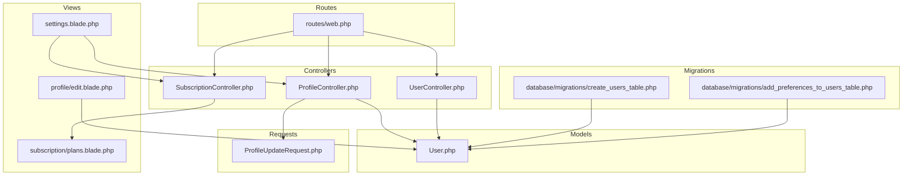
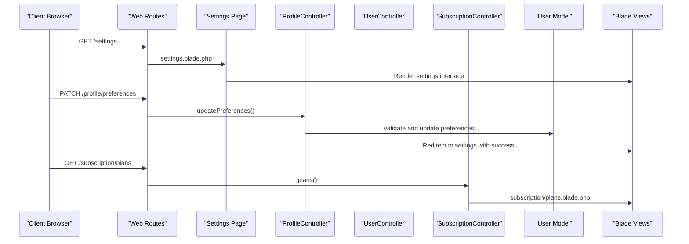
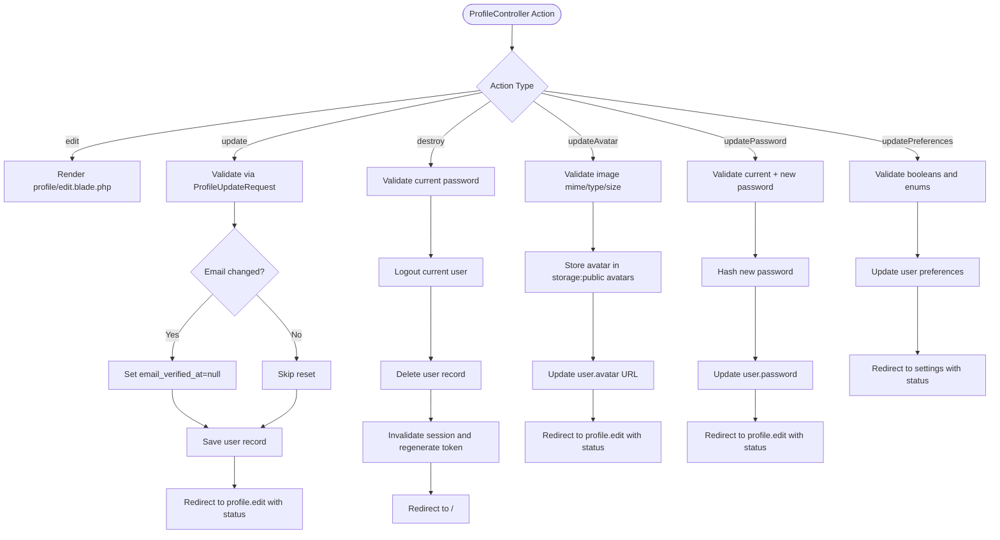
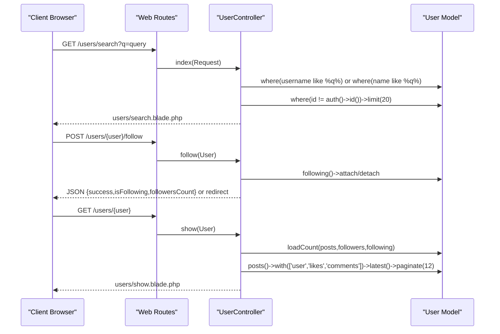
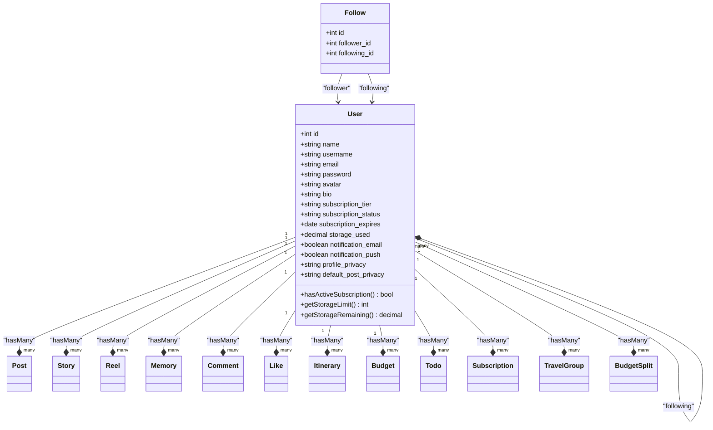
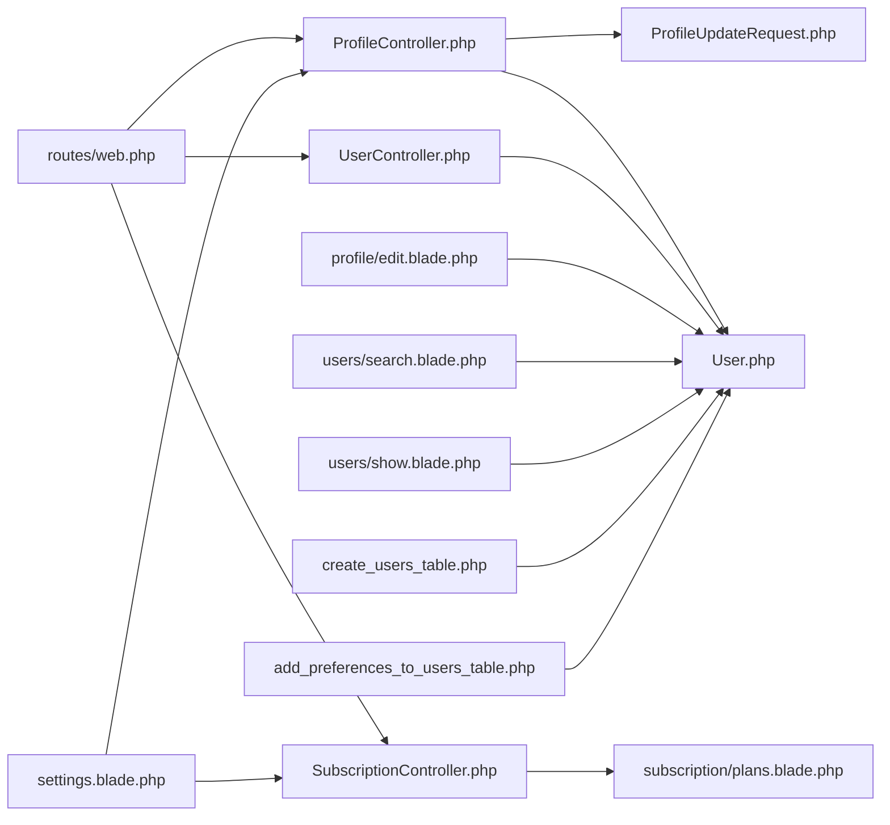

# User Management

<cite>
**Referenced Files in This Document**
- [ProfileController.php](file://app/Http/Controllers/ProfileController.php)
- [UserController.php](file://app/Http/Controllers/UserController.php)
- [SubscriptionController.php](file://app/Http/Controllers/SubscriptionController.php)
- [User.php](file://app/Models/User.php)
- [ProfileUpdateRequest.php](file://app/Http/Requests/ProfileUpdateRequest.php)
- [web.php](file://routes/web.php)
- [settings.blade.php](file://resources/views/settings.blade.php)
- [edit.blade.php](file://resources/views/profile/edit.blade.php)
- [create_users_table.php](file://database/migrations/0001_01_01_000000_create_users_table.php)
- [add_preferences_to_users_table.php](file://database/migrations/2026_04_21_140001_add_preferences_to_users_table.php)
- [plans.blade.php](file://resources/views/subscription/plans.blade.php)
</cite>

## Update Summary
**Changes Made**
- Added comprehensive settings management interface documentation with 6 distinct sections
- Updated ProfileController to include updatePreferences method for settings management
- Enhanced User model with new preference attributes and storage calculation methods
- Added settings page routing and form handling documentation
- Updated architecture diagrams to reflect new settings management workflow

## Table of Contents
1. [Introduction](#introduction)
2. [Project Structure](#project-structure)
3. [Core Components](#core-components)
4. [Architecture Overview](#architecture-overview)
5. [Detailed Component Analysis](#detailed-component-analysis)
6. [Settings Management Interface](#settings-management-interface)
7. [Dependency Analysis](#dependency-analysis)
8. [Performance Considerations](#performance-considerations)
9. [Privacy and Security Measures](#privacy-and-security-measures)
10. [Troubleshooting Guide](#troubleshooting-guide)
11. [Conclusion](#conclusion)

## Introduction
This document provides comprehensive documentation for the user management system, covering profile editing, user discovery, account administration, and the new comprehensive settings management interface. The system now features six distinct sections including Account Settings, Notification Preferences, Privacy Settings, Subscription & Storage, Travel Preferences, and Danger Zone. It explains avatar upload, personal information editing, preference settings, account deletion, user search and discovery functionality with privacy-aware filtering, and subscription management with storage usage visualization.

## Project Structure
The user management system spans controllers, models, requests, views, and routes. The new settings interface adds a comprehensive management layer with modern UI components, form handling, CSRF protection, and dynamic content rendering based on user subscription tiers and storage usage.

**Diagram sources**
- [ProfileController.php:1-111](file://app/Http/Controllers/ProfileController.php#L1-L111)
- [UserController.php:1-120](file://app/Http/Controllers/UserController.php#L1-L120)
- [SubscriptionController.php:1-14](file://app/Http/Controllers/SubscriptionController.php#L1-L14)
- [User.php:1-172](file://app/Models/User.php#L1-L172)
- [settings.blade.php:1-275](file://resources/views/settings.blade.php#L1-L275)
- [edit.blade.php:1-30](file://resources/views/profile/edit.blade.php#L1-L30)
- [plans.blade.php:1-115](file://resources/views/subscription/plans.blade.php#L1-L115)
- [web.php:1-82](file://routes/web.php#L1-L82)
- [create_users_table.php:1-57](file://database/migrations/0001_01_01_000000_create_users_table.php#L1-L57)
- [add_preferences_to_users_table.php:1-32](file://database/migrations/2026_04_21_140001_add_preferences_to_users_table.php#L1-L32)

**Section sources**
- [web.php:14-79](file://routes/web.php#L14-L79)
- [ProfileController.php:13-111](file://app/Http/Controllers/ProfileController.php#L13-L111)
- [UserController.php:8-120](file://app/Http/Controllers/UserController.php#L8-L120)
- [User.php:11-172](file://app/Models/User.php#L11-L172)

## Core Components
- **ProfileController**: Handles profile editing, avatar upload, password updates, comprehensive preference updates (including notification and privacy settings), and account deletion. Implements validation, authorization checks, and secure session termination during deletion.
- **UserController**: Manages user discovery, including search, suggestions, and follow/unfollow operations. Provides paginated follower/following lists and user profile display.
- **SubscriptionController**: Manages subscription plan viewing and upgrade processes.
- **User Model**: Defines fillable attributes, hidden fields, casts, and relationships including follows, posts, stories, reels, memories, comments, likes, subscriptions, itineraries, budgets, todos, and travel groups. Now includes comprehensive preference attributes and storage calculation methods.
- **ProfileUpdateRequest**: Encapsulates validation rules for profile updates, ensuring unique email per user.
- **Settings Interface**: New comprehensive settings management page with six distinct sections for user customization.

Key capabilities:
- Profile editing with email verification handling upon email change.
- Avatar upload with image validation and storage.
- Comprehensive preference settings for notifications, privacy, and travel preferences.
- Account deletion with confirmation and session cleanup.
- User search by username or name with pagination.
- Following system with toggle and suggestions.
- Subscription management with tier-based storage limits.
- Dynamic storage usage visualization and remaining space calculation.
- Modern UI components with form handling and CSRF protection.

**Section sources**
- [ProfileController.php:18-111](file://app/Http/Controllers/ProfileController.php#L18-L111)
- [UserController.php:13-118](file://app/Http/Controllers/UserController.php#L13-L118)
- [SubscriptionController.php:9-12](file://app/Http/Controllers/SubscriptionController.php#L9-L12)
- [User.php:21-62](file://app/Models/User.php#L21-L62)
- [settings.blade.php:10-275](file://resources/views/settings.blade.php#L10-L275)

## Architecture Overview
The system follows MVC architecture with explicit separation of concerns and the new comprehensive settings management interface:
- Controllers receive requests and delegate to models and views.
- Models encapsulate business logic and relationships including new preference attributes.
- Requests enforce validation rules.
- Views render HTML with Blade templating, including the new settings interface.
- Routes define URL-to-action mappings with dedicated settings route.

**Diagram sources**
- [web.php:75-79](file://routes/web.php#L75-L79)
- [settings.blade.php:56-94](file://resources/views/settings.blade.php#L56-L94)
- [ProfileController.php:97-109](file://app/Http/Controllers/ProfileController.php#L97-L109)
- [SubscriptionController.php:9-12](file://app/Http/Controllers/SubscriptionController.php#L9-L12)

## Detailed Component Analysis

### ProfileController Analysis
Responsibilities:
- Edit profile page rendering.
- Update profile information with validation and email verification reset.
- Delete account with password confirmation, logout, and session invalidation.
- Update avatar with image validation and storage.
- Update password with confirmation and hashing.
- **NEW**: Update comprehensive notification, privacy, and travel preferences.

Processing logic highlights:
- Email change triggers email verification reset.
- Account deletion enforces current password, logs out, deletes user, invalidates session, and regenerates CSRF token.
- Avatar upload validates image type and size, stores under public avatars, and saves URL.
- **NEW**: Preferences update validates boolean values and enum options, then persists to user record with comprehensive preference handling.

**Diagram sources**
- [ProfileController.php:18-111](file://app/Http/Controllers/ProfileController.php#L18-L111)
- [ProfileUpdateRequest.php:17-30](file://app/Http/Requests/ProfileUpdateRequest.php#L17-L30)

**Section sources**
- [ProfileController.php:28-111](file://app/Http/Controllers/ProfileController.php#L28-L111)
- [ProfileUpdateRequest.php:17-30](file://app/Http/Requests/ProfileUpdateRequest.php#L17-L30)

### UserController Analysis
Responsibilities:
- Search users by username or name, excluding self, with limit and pagination support.
- Show user profile with counts and media.
- Toggle follow/unfollow relationship with JSON support.
- List followers and following with pagination.
- Provide user suggestions based on non-following users.

Discovery and recommendation logic:
- Search filters by username and name using LIKE queries, excludes current user, limits results.
- Suggestions exclude current user and existing followings, selects randomly limited set.

**Diagram sources**
- [UserController.php:13-118](file://app/Http/Controllers/UserController.php#L13-L118)

**Section sources**
- [UserController.php:13-118](file://app/Http/Controllers/UserController.php#L13-L118)

### User Model Analysis
**Updated** Enhanced with comprehensive preference attributes and storage calculation methods.

Attributes and casts:
- Fillable includes personal info, credentials, avatar, bio, subscription fields, and new preference flags.
- Hidden fields protect sensitive data.
- Casts normalize booleans and dates, including new preference boolean casts.

Relationships:
- Self-referencing many-to-many follows with pivot timestamps.
- One-to-many relationships to posts, stories, reels, memories, comments, likes, itineraries, budgets, todos, subscriptions, travel groups, and budget splits.
- **NEW**: Helper methods for subscription status, storage limits, and remaining storage calculation.

**Diagram sources**
- [User.php:21-62](file://app/Models/User.php#L21-L62)
- [User.php:151-171](file://app/Models/User.php#L151-L171)
- [Follow.php:10-23](file://app/Models/Follow.php#L10-L23)

**Section sources**
- [User.php:21-62](file://app/Models/User.php#L21-L62)
- [User.php:151-171](file://app/Models/User.php#L151-L171)
- [add_preferences_to_users_table.php:14-19](file://database/migrations/2026_04_21_140001_add_preferences_to_users_table.php#L14-L19)

### Profile Forms and Authorization
**Updated** Enhanced with comprehensive settings management interface.

- Profile edit page aggregates three partials: update profile information, update password, and delete account.
- **NEW**: Settings page provides six distinct sections with modern UI components and form handling.
- Update profile information form posts to the profile update route with CSRF and method override.
- Update password form posts to the password update route.
- **NEW**: Settings forms use PATCH method for preference updates with CSRF protection.
- Delete account form requires password confirmation and uses DELETE method.
- All profile routes are protected by the auth middleware.

Authorization and validation:
- Profile updates validated by ProfileUpdateRequest ensuring unique email per user.
- **NEW**: Settings preference updates validated with boolean and enum constraints.
- Account deletion requires current password via validation bag.
- Password updates validated with current password check and confirmation.

**Section sources**
- [edit.blade.php:10-26](file://resources/views/profile/edit.blade.php#L10-L26)
- [settings.blade.php:56-94](file://resources/views/settings.blade.php#L56-L94)
- [settings.blade.php:105-160](file://resources/views/settings.blade.php#L105-L160)

## Settings Management Interface

### Overview
The new settings management interface provides comprehensive user customization capabilities across six distinct sections with modern UI components, form handling, CSRF protection, and dynamic content rendering based on user subscription tiers and storage usage.

### Settings Sections

#### Account Settings
- **Profile Information**: Links to profile editing page for name, username, and bio updates
- **Password**: Direct link to password change functionality
- **Avatar**: Direct link to avatar update functionality

#### Notification Preferences
- **Email Notifications**: Toggle switch for email-based updates
- **Push Notifications**: Toggle switch for browser push notifications
- Form submission uses PATCH method with CSRF protection

#### Privacy Settings
- **Profile Privacy**: Radio button selection between public and private visibility
- **Default Post Privacy**: Radio button selection among public, followers-only, and private
- Form submission uses PATCH method with CSRF protection

#### Subscription & Storage
- **Current Plan**: Displays active subscription tier with color-coded badges
- **Storage Usage**: Interactive progress bar showing used vs. total storage capacity
- **Upgrade Plan**: Link to subscription plans page for plan upgrades

#### Travel Preferences
- **Default Currency**: Placeholder for currency preference (future implementation)
- **Date Format**: Placeholder for date format preference (future implementation)
- **Distance Units**: Placeholder for measurement units (future implementation)
- **Time Zone**: Placeholder for time zone preference (future implementation)
- **Note**: Informative message indicating future availability

#### Danger Zone
- **Delete All Data**: Disabled button with safety message (future implementation)
- **Delete Account**: Direct link to account deletion process

### Technical Implementation
- **Form Handling**: Each settings section contains its own form with appropriate HTTP methods (GET for navigation, PATCH for updates)
- **CSRF Protection**: All forms include proper CSRF tokens and method field overrides
- **Dynamic Rendering**: Settings adapt based on user subscription tier and storage usage
- **Visual Feedback**: Progress bars, color-coded badges, and interactive elements
- **Accessibility**: Proper labeling, keyboard navigation, and screen reader support

**Section sources**
- [settings.blade.php:10-275](file://resources/views/settings.blade.php#L10-L275)
- [web.php:75-79](file://routes/web.php#L75-L79)
- [ProfileController.php:97-109](file://app/Http/Controllers/ProfileController.php#L97-L109)

## Dependency Analysis
**Updated** Enhanced with settings management dependencies.

- Controllers depend on models and requests for validation.
- Views depend on controllers for data and routes for links.
- Routes bind controllers to URLs, including new settings route.
- Migrations define database schema and new preferences columns.
- **NEW**: Settings interface depends on ProfileController for preference updates and SubscriptionController for plan management.

**Diagram sources**
- [web.php:14-79](file://routes/web.php#L14-L79)
- [settings.blade.php:56-94](file://resources/views/settings.blade.php#L56-L94)
- [ProfileController.php:5-11](file://app/Http/Controllers/ProfileController.php#L5-L11)
- [SubscriptionController.php:7-13](file://app/Http/Controllers/SubscriptionController.php#L7-L13)

**Section sources**
- [web.php:14-79](file://routes/web.php#L14-L79)

## Performance Considerations
**Updated** Enhanced with settings interface performance considerations.

- Pagination: UserController uses paginate for followers/following and posts to avoid large result sets.
- Limits: Search limits results to reduce database load.
- Eager loading: UserController eager loads counts and relations for profile display.
- **NEW**: Settings interface uses client-side rendering with server-provided data, reducing server load.
- **NEW**: Storage calculations performed server-side to prevent manipulation.
- Indexes: Unique indexes on username and email improve lookup performance.
- Storage: Avatar uploads are validated and stored efficiently; consider CDN for scalability.

Recommendations:
- Add database indexes for frequently queried columns.
- Implement caching for user stats and suggestions.
- Optimize LIKE queries with full-text search for larger datasets.
- Use chunked processing for bulk operations.
- **NEW**: Consider client-side caching for settings data to reduce server requests.

**Section sources**
- [UserController.php:35-42](file://app/Http/Controllers/UserController.php#L35-L42)
- [UserController.php:78-93](file://app/Http/Controllers/UserController.php#L78-L93)
- [User.php:158-170](file://app/Models/User.php#L158-L170)

## Privacy and Security Measures
**Updated** Enhanced with comprehensive security measures for settings interface.

Data protection and compliance:
- Hidden fields prevent sensitive data exposure in serialization.
- Passwords are hashed via framework mechanisms.
- Email verification reset on email change ensures compliance with verification policies.
- Account deletion includes logout, session invalidation, and token regeneration.
- **NEW**: Settings preferences validated with strict boolean and enum constraints.
- **NEW**: CSRF protection implemented across all settings forms.

Security controls:
- Auth middleware protects all user management routes.
- Current password validation for destructive actions (password change, account deletion).
- **NEW**: Input validation for all preference settings with whitelist enforcement.
- Strict validation for profile updates and preferences.
- CSRF protection via forms and route model binding.
- **NEW**: Subscription tier validation prevents unauthorized plan upgrades.

Best practices:
- Enforce strong password policies.
- Implement rate limiting for authentication attempts.
- Regularly audit permissions and roles.
- Monitor failed deletion attempts and suspicious activity.
- **NEW**: Log preference change attempts for security auditing.

**Section sources**
- [User.php:43-46](file://app/Models/User.php#L43-L46)
- [User.php:55-61](file://app/Models/User.php#L55-L61)
- [ProfileController.php:97-109](file://app/Http/Controllers/ProfileController.php#L97-L109)

## Troubleshooting Guide
**Updated** Enhanced with settings interface troubleshooting.

Common issues and resolutions:
- Profile update fails due to duplicate email:
  - Ensure unique email validation passes; check ProfileUpdateRequest rules.
  - Reference: [ProfileUpdateRequest.php:21-29](file://app/Http/Requests/ProfileUpdateRequest.php#L21-L29)
- Avatar upload errors:
  - Verify image MIME type and size constraints; confirm storage permissions.
  - Reference: [ProfileController.php:67-76](file://app/Http/Controllers/ProfileController.php#L67-L76)
- Password change not applied:
  - Confirm current password matches and new password meets confirmation rules.
  - Reference: [PasswordController.php:18-27](file://app/Http/Controllers/Auth/PasswordController.php#L18-L27)
- Account deletion does not terminate session:
  - Ensure current password validation passes and session invalidation occurs.
  - Reference: [ProfileController.php:46-58](file://app/Http/Controllers/ProfileController.php#L46-L58)
- User search returns empty:
  - Check query parameter presence and ensure non-empty input.
  - Reference: [UserController.php:15-19](file://app/Http/Controllers/UserController.php#L15-L19)
- Follow toggle not working:
  - Verify authentication and that self-follow is prevented.
  - Reference: [UserController.php:50-52](file://app/Http/Controllers/UserController.php#L50-L52)
- **NEW**: Settings preferences not saving:
  - Verify CSRF token is present and form method is correct (PATCH).
  - Check browser console for JavaScript errors.
  - Ensure user has proper authentication.
- **NEW**: Storage usage shows incorrect values:
  - Verify subscription tier is properly set in database.
  - Check storage_used field format and decimal precision.
- **NEW**: Settings page displays incorrectly:
  - Clear browser cache and cookies.
  - Verify all required JavaScript libraries are loaded.
  - Check for CSS conflicts with custom styling.

Operational tips:
- Use browser developer tools to inspect network requests and responses.
- Enable logging for failed validations and authorization failures.
- Test edge cases: self-follow, duplicate follow/unfollow, and boundary conditions for preferences.
- **NEW**: Use browser developer tools to debug settings form submissions and preference updates.
- **NEW**: Monitor network tab for failed preference update requests and error responses.

**Section sources**
- [ProfileUpdateRequest.php:17-30](file://app/Http/Requests/ProfileUpdateRequest.php#L17-L30)
- [ProfileController.php:67-109](file://app/Http/Controllers/ProfileController.php#L67-L109)
- [UserController.php:15-19](file://app/Http/Controllers/UserController.php#L15-L19)
- [UserController.php:50-52](file://app/Http/Controllers/UserController.php#L50-L52)

## Conclusion
The user management system provides robust profile editing, secure account administration, effective user discovery, and comprehensive settings management. The new settings interface adds six distinct sections including Account Settings, Notification Preferences, Privacy Settings, Subscription & Storage, Travel Preferences, and Danger Zone, providing extensive user customization capabilities with modern UI components, form handling, CSRF protection, and dynamic content rendering based on user subscription tiers and storage usage.

ProfileController, UserController, and SubscriptionController implement comprehensive CRUD operations with validation, authorization, and privacy-aware logic. The enhanced User model encapsulates relationships, helper methods, and new preference attributes essential for the comprehensive settings interface. Security measures include middleware protection, password hashing, email verification handling, safe deletion procedures, and strict input validation for settings preferences.

Performance considerations such as pagination, limits, eager loading, and efficient settings rendering ensure responsiveness. The new settings interface leverages client-side rendering with server-provided data to minimize server load while providing rich user interaction capabilities.

Adhering to the outlined best practices and troubleshooting steps will maintain a reliable, secure, and compliant user management experience with the comprehensive settings management interface.