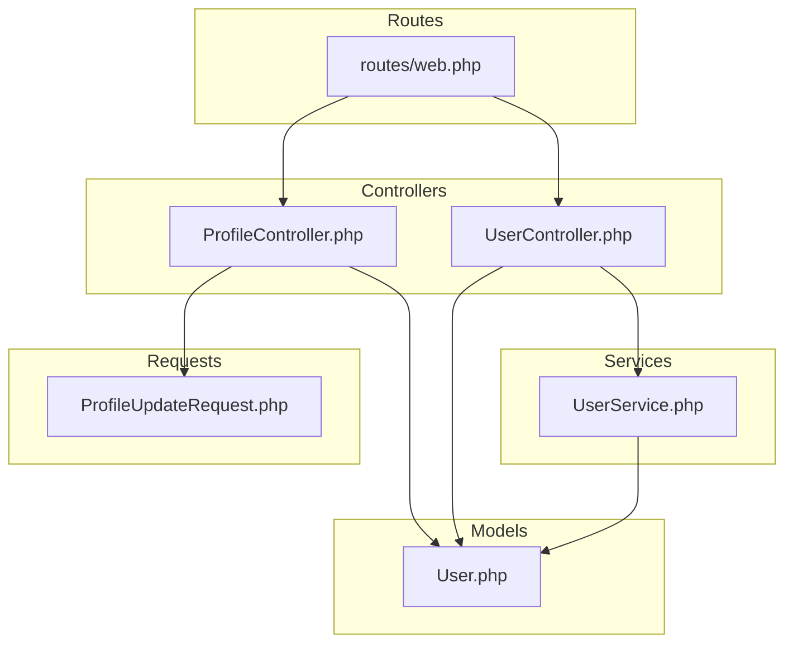
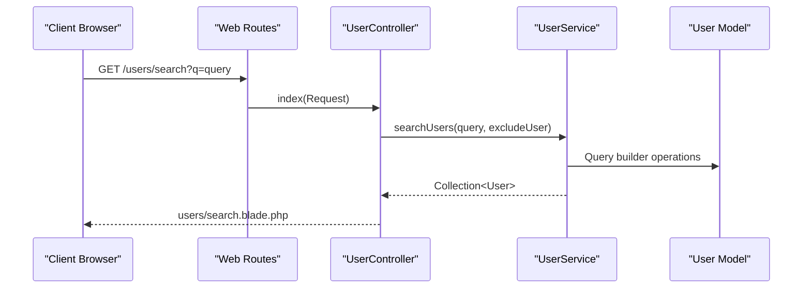
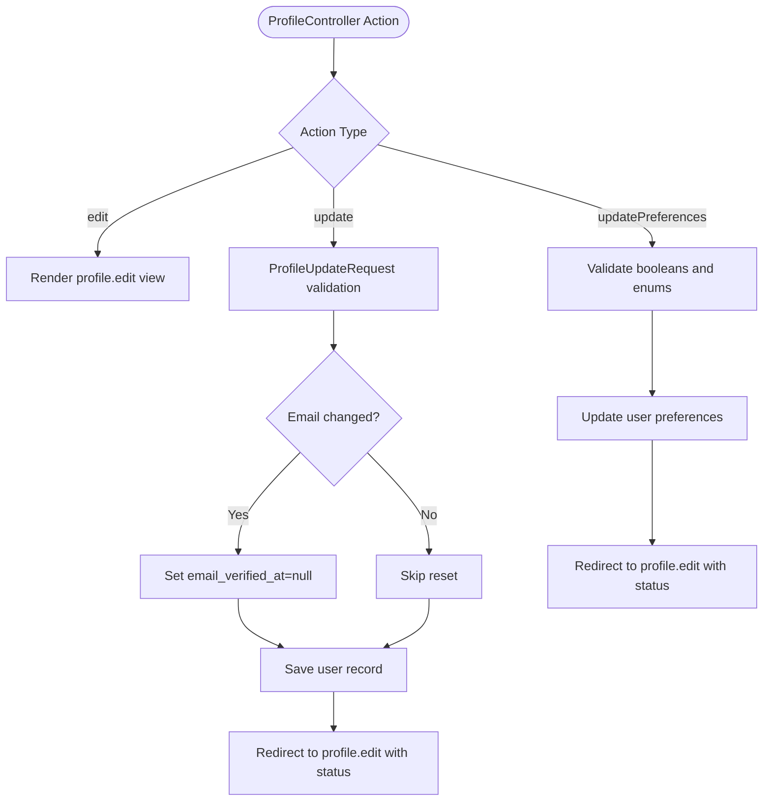
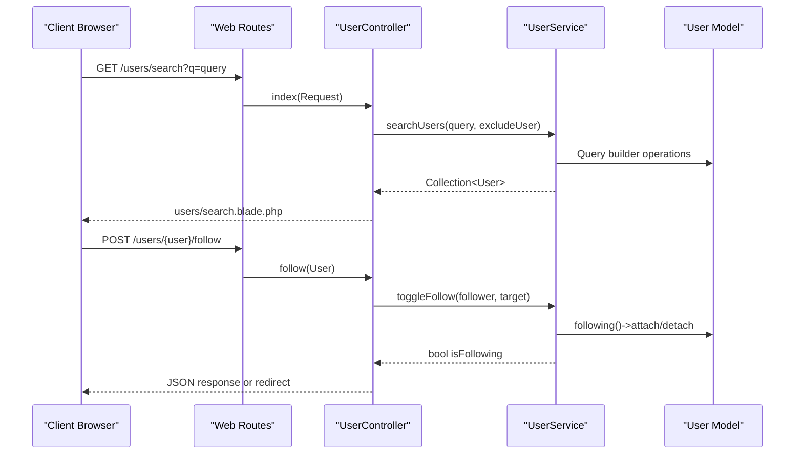
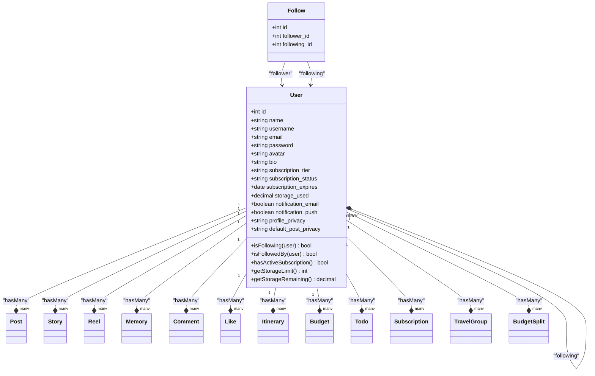
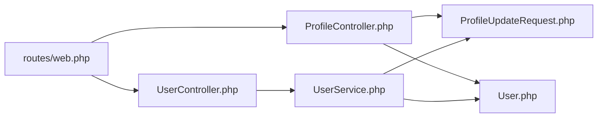

# User Management

<cite>
**Referenced Files in This Document**
- [ProfileController.php](file://app/Http/Controllers/ProfileController.php)
- [UserController.php](file://app/Http/Controllers/UserController.php)
- [UserService.php](file://app/Services/UserService.php)
- [ProfileUpdateRequest.php](file://app/Http/Requests/ProfileUpdateRequest.php)
- [web.php](file://routes/web.php)
- [User.php](file://app/Models/User.php)
</cite>

## Update Summary
**Changes Made**
- Updated UserController to use Service Layer Pattern with UserService for all business logic
- Enhanced ProfileController with comprehensive preference management capabilities
- Improved validation through Form Request classes and centralized validation logic
- Maintained backward compatibility while modernizing the architecture
- Enhanced user discovery functionality with service layer integration

## Table of Contents
1. [Introduction](#introduction)
2. [Project Structure](#project-structure)
3. [Core Components](#core-components)
4. [Architecture Overview](#architecture-overview)
5. [Detailed Component Analysis](#detailed-component-analysis)
6. [Service Layer Integration](#service-layer-integration)
7. [Dependency Analysis](#dependency-analysis)
8. [Performance Considerations](#performance-considerations)
9. [Privacy and Security Measures](#privacy-and-security-measures)
10. [Troubleshooting Guide](#troubleshooting-guide)
11. [Conclusion](#conclusion)

## Introduction
This document provides comprehensive documentation for the user management system, covering profile editing, user discovery, account administration, and the new service layer architecture. The system now features a clean separation of concerns with UserController acting as a thin controller that delegates business logic to UserService, while ProfileController handles comprehensive profile management including avatar upload, personal information editing, preference settings, and account deletion. The system implements Form Request validation for consistent data validation and maintains robust security measures.

## Project Structure
The user management system follows a modern MVC architecture with service layer integration. Controllers handle HTTP requests and responses, UserService encapsulates business logic, and Form Requests provide centralized validation. The system maintains clean separation of concerns while providing comprehensive user management capabilities.

**Diagram sources**
- [ProfileController.php:1-111](file://app/Http/Controllers/ProfileController.php#L1-L111)
- [UserController.php:1-100](file://app/Http/Controllers/UserController.php#L1-L100)
- [UserService.php:1-140](file://app/Services/UserService.php#L1-L140)
- [ProfileUpdateRequest.php:1-32](file://app/Http/Requests/ProfileUpdateRequest.php#L1-L32)
- [web.php:14-82](file://routes/web.php#L14-L82)

**Section sources**
- [web.php:14-82](file://routes/web.php#L14-L82)
- [ProfileController.php:13-111](file://app/Http/Controllers/ProfileController.php#L13-L111)
- [UserController.php:9-100](file://app/Http/Controllers/UserController.php#L9-L100)
- [UserService.php:8-140](file://app/Services/UserService.php#L8-L140)

## Core Components
- **ProfileController**: Handles comprehensive profile management including profile editing, avatar upload, password updates, preference settings, and account deletion. Implements Form Request validation and maintains email verification handling.
- **UserController**: Now acts as a thin controller that delegates all business logic to UserService, handling user discovery, search, suggestions, and follow operations with improved architecture.
- **UserService**: Centralized business logic layer providing user search, suggestions, follow/unfollow operations, profile data retrieval, and pagination support.
- **ProfileUpdateRequest**: Form Request class providing centralized validation rules for profile updates with unique email constraint.
- **User Model**: Enhanced with comprehensive attributes, relationships, and helper methods for subscription management and preference handling.

Key capabilities:
- Clean separation of concerns with service layer integration
- Comprehensive Form Request validation for all user operations
- Enhanced user discovery with intelligent suggestion algorithms
- Secure preference management with validation and authorization
- Efficient pagination and eager loading for performance optimization
- Modern architecture supporting scalability and maintainability

**Section sources**
- [ProfileController.php:18-111](file://app/Http/Controllers/ProfileController.php#L18-L111)
- [UserController.php:11-100](file://app/Http/Controllers/UserController.php#L11-L100)
- [UserService.php:18-140](file://app/Services/UserService.php#L18-L140)
- [ProfileUpdateRequest.php:17-30](file://app/Http/Requests/ProfileUpdateRequest.php#L17-L30)

## Architecture Overview
The system follows a modern MVC architecture with service layer integration, providing clean separation of concerns and improved maintainability:

- Controllers act as thin layers receiving requests and delegating to services
- Services encapsulate business logic and data operations
- Form Requests provide centralized validation with reusable rules
- Models handle data persistence and relationships
- Routes define URL-to-action mappings with proper HTTP methods

**Diagram sources**
- [web.php:24-25](file://routes/web.php#L24-L25)
- [UserController.php:17-28](file://app/Http/Controllers/UserController.php#L17-L28)
- [UserService.php:18-25](file://app/Services/UserService.php#L18-L25)

## Detailed Component Analysis

### ProfileController Analysis
Responsibilities:
- Comprehensive profile management including editing, updating, avatar upload, password changes, and preference settings
- Form Request validation for profile updates with unique email constraint
- Secure account deletion with password confirmation and session cleanup
- Preference management with validation for boolean and enum values

Processing logic highlights:
- Profile updates validated through ProfileUpdateRequest ensuring unique email per user
- Avatar upload with image validation and storage in public avatars directory
- Preference updates validated with boolean and enum constraints for notification and privacy settings
- Account deletion enforces current password, logs out, deletes user, and invalidates session

**Diagram sources**
- [ProfileController.php:18-111](file://app/Http/Controllers/ProfileController.php#L18-L111)
- [ProfileUpdateRequest.php:17-30](file://app/Http/Requests/ProfileUpdateRequest.php#L17-L30)

**Section sources**
- [ProfileController.php:28-111](file://app/Http/Controllers/ProfileController.php#L28-L111)
- [ProfileUpdateRequest.php:17-30](file://app/Http/Requests/ProfileUpdateRequest.php#L17-L30)

### UserController Analysis
**Updated** Enhanced with service layer integration and improved architecture.

Responsibilities:
- Thin controller layer that delegates all business logic to UserService
- User search with query parameter validation and empty result handling
- Profile display with comprehensive data loading and pagination
- Follow/unfollow operations with JSON support and validation
- Follower/following listing with pagination support
- Intelligent user suggestions with randomization and exclusion logic

Business logic delegation:
- All user operations delegated to UserService for better separation of concerns
- Search, suggestions, and follow operations handled in service layer
- Profile data loading and pagination managed by service methods
- Validation handled through Form Requests and service method parameters

**Diagram sources**
- [UserController.php:17-28](file://app/Http/Controllers/UserController.php#L17-L28)
- [UserController.php:47-64](file://app/Http/Controllers/UserController.php#L47-L64)
- [UserService.php:18-25](file://app/Services/UserService.php#L18-L25)
- [UserService.php:54-63](file://app/Services/UserService.php#L54-L63)

**Section sources**
- [UserController.php:17-98](file://app/Http/Controllers/UserController.php#L17-L98)
- [UserService.php:18-140](file://app/Services/UserService.php#L18-L140)

### UserService Analysis
**New** Centralized business logic layer providing comprehensive user management operations.

Responsibilities:
- User search with LIKE queries and exclusion logic
- Intelligent user suggestions with randomization and exclusion
- Follow/unfollow operations with state management
- Profile data aggregation with count loading
- Pagination support for followers/following operations
- Post and reel retrieval with relationships

Key features:
- Search operations exclude current user and limit results
- Suggestions exclude existing followings and use random ordering
- Toggle operations handle both follow and unfollow states
- Eager loading for performance optimization
- Configurable limits and pagination parameters

**Section sources**
- [UserService.php:18-140](file://app/Services/UserService.php#L18-L140)

### User Model Analysis
Enhanced with comprehensive attributes and helper methods for modern user management.

Attributes and casts:
- Fillable includes comprehensive user attributes including preferences
- Hidden fields protect sensitive authentication data
- Casts normalize boolean values for notification preferences
- Enhanced subscription-related attributes for storage management

Relationships:
- Self-referencing many-to-many relationships for following/followers
- One-to-many relationships for all content types (posts, stories, reels, etc.)
- Helper methods for subscription status and storage calculations
- Follow checking methods for relationship state

**Diagram sources**
- [User.php:23-64](file://app/Models/User.php#L23-L64)
- [User.php:143-173](file://app/Models/User.php#L143-L173)

**Section sources**
- [User.php:23-64](file://app/Models/User.php#L23-L64)
- [User.php:143-173](file://app/Models/User.php#L143-L173)

## Service Layer Integration

### Architecture Benefits
The introduction of UserService provides several architectural benefits:

- **Clean Separation of Concerns**: Controllers remain thin, focusing only on HTTP concerns
- **Testability**: Business logic isolated in services for easier unit testing
- **Reusability**: Shared business logic accessible across multiple controllers
- **Maintainability**: Centralized logic reduces duplication and improves consistency
- **Scalability**: Service layer supports complex business operations without controller bloat

### Service Method Responsibilities
- **Search Operations**: User search with intelligent filtering and exclusion logic
- **Relationship Management**: Follow/unfollow operations with state consistency
- **Data Aggregation**: Profile data loading with count optimization
- **Pagination Support**: Built-in pagination for large datasets
- **Validation Integration**: Methods accept validated data from Form Requests

**Section sources**
- [UserService.php:18-140](file://app/Services/UserService.php#L18-L140)
- [UserController.php:11-100](file://app/Http/Controllers/UserController.php#L11-L100)

## Dependency Analysis
Enhanced with service layer dependencies and improved architecture.

- Controllers depend on services for business logic, not directly on models
- Services depend on models for data operations and relationships
- Form Requests provide centralized validation for controllers
- Routes bind controllers to URLs with proper HTTP methods
- Models handle data persistence and relationship definitions

**Diagram sources**
- [web.php:14-82](file://routes/web.php#L14-L82)
- [UserController.php:11-12](file://app/Http/Controllers/UserController.php#L11-L12)
- [UserService.php:5-6](file://app/Services/UserService.php#L5-L6)

**Section sources**
- [web.php:14-82](file://routes/web.php#L14-L82)

## Performance Considerations
Enhanced with service layer performance optimizations and improved architecture.

- **Eager Loading**: UserService methods implement eager loading for relationships
- **Pagination**: Built-in pagination support prevents memory issues with large datasets
- **Query Optimization**: Service methods use efficient query patterns with proper indexing
- **Method Chaining**: Fluent interface for readable and efficient query construction
- **Caching Opportunities**: Service layer supports caching strategies for frequently accessed data
- **Database Indexes**: Proper indexing on commonly queried columns (username, email, timestamps)

Recommendations:
- Monitor query performance using Laravel Debugbar
- Implement caching for user suggestions and frequently accessed profiles
- Use database query optimization techniques for complex searches
- Consider database connection pooling for high-traffic scenarios
- Implement proper indexing strategy for user search operations

**Section sources**
- [UserService.php:101-137](file://app/Services/UserService.php#L101-L137)
- [UserController.php:35-42](file://app/Http/Controllers/UserController.php#L35-L42)

## Privacy and Security Measures
Enhanced with comprehensive security measures and improved validation.

Data protection and compliance:
- Form Request validation ensures consistent data validation across all operations
- Passwords are hashed automatically through model casting
- Email verification reset on email change maintains security policies
- Account deletion includes comprehensive session cleanup and token regeneration
- CSRF protection through Laravel's built-in form protection
- Input validation prevents malicious data injection

Security controls:
- Auth middleware protects all user management routes
- Current password validation for destructive operations
- Unique email validation prevents duplicate accounts
- Form Request validation provides centralized security rules
- Proper authorization checks for user operations

Best practices:
- Regular security audits of Form Request validation rules
- Monitor failed authentication attempts and suspicious activities
- Implement rate limiting for user search and follow operations
- Regular validation of service layer inputs and outputs
- Maintain audit logs for critical user operations

**Section sources**
- [ProfileUpdateRequest.php:17-30](file://app/Http/Requests/ProfileUpdateRequest.php#L17-L30)
- [ProfileController.php:44-60](file://app/Http/Controllers/ProfileController.php#L44-L60)
- [UserController.php:49-51](file://app/Http/Controllers/UserController.php#L49-L51)

## Troubleshooting Guide
Enhanced with service layer troubleshooting and improved debugging approaches.

Common issues and resolutions:
- **Profile update validation failures**:
  - Check ProfileUpdateRequest rules for unique email constraint
  - Verify Form Request is properly imported and used
  - Reference: [ProfileUpdateRequest.php:21-29](file://app/Http/Requests/ProfileUpdateRequest.php#L21-L29)
- **User search returns empty results**:
  - Verify query parameter is present and not empty
  - Check UserService search method implementation
  - Ensure proper LIKE query syntax and exclusions
- **Follow operation fails**:
  - Verify authentication and self-follow prevention
  - Check UserService toggleFollow method logic
  - Ensure proper JSON response handling
- **Service layer errors**:
  - Verify UserService constructor injection
  - Check service method signatures and return types
  - Ensure proper exception handling in service methods
- **Preference updates not applying**:
  - Verify Form Request validation rules
  - Check database column existence and types
  - Ensure proper casting in User model

Debugging approaches:
- Use Laravel Debugbar to monitor query performance and execution
- Enable query logging for service layer operations
- Implement proper error handling and logging in service methods
- Use Laravel's built-in testing utilities for service method validation
- Monitor application logs for service layer exceptions

**Section sources**
- [ProfileUpdateRequest.php:17-30](file://app/Http/Requests/ProfileUpdateRequest.php#L17-L30)
- [UserController.php:17-28](file://app/Http/Controllers/UserController.php#L17-L28)
- [UserController.php:47-64](file://app/Http/Controllers/UserController.php#L47-L64)
- [UserService.php:18-140](file://app/Services/UserService.php#L18-L140)

## Conclusion
The user management system provides robust profile editing, secure account administration, and efficient user discovery through a modern service layer architecture. The enhanced UserController with UserService integration demonstrates clean separation of concerns, improved maintainability, and better testability. ProfileController continues to handle comprehensive profile management with Form Request validation and secure operations.

The service layer approach enables scalable development, centralized business logic, and improved code organization. Form Request validation ensures consistent data validation across all user operations, while the User model provides comprehensive attribute management and helper methods for subscription and preference handling.

Security measures include middleware protection, Form Request validation, proper authorization checks, and comprehensive input sanitization. Performance optimizations through eager loading, pagination, and query optimization ensure responsive user experiences even with large datasets.

The modern architecture supports future enhancements, maintains backward compatibility, and provides a solid foundation for continued development of user management features.