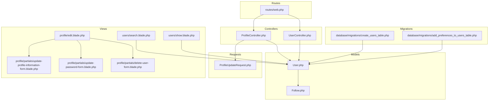
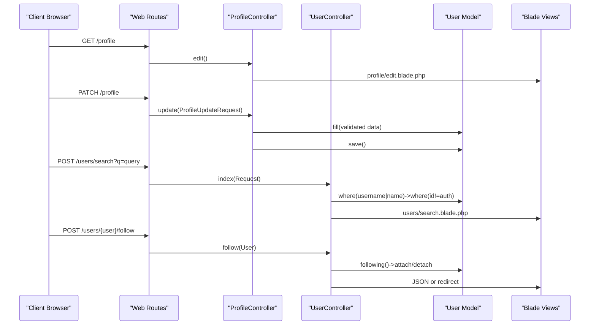
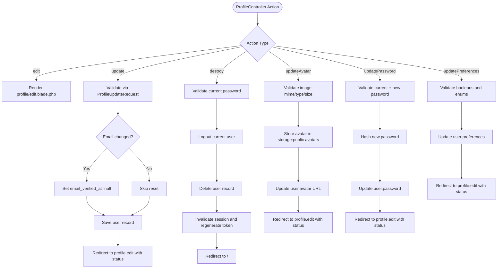
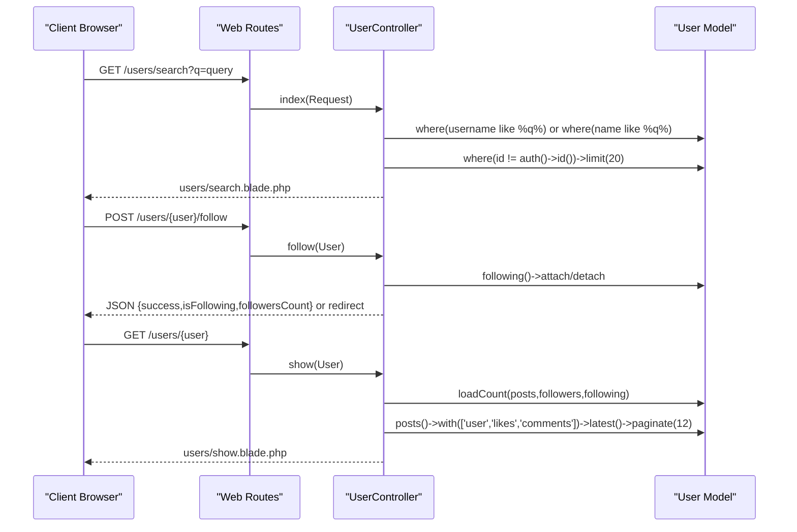
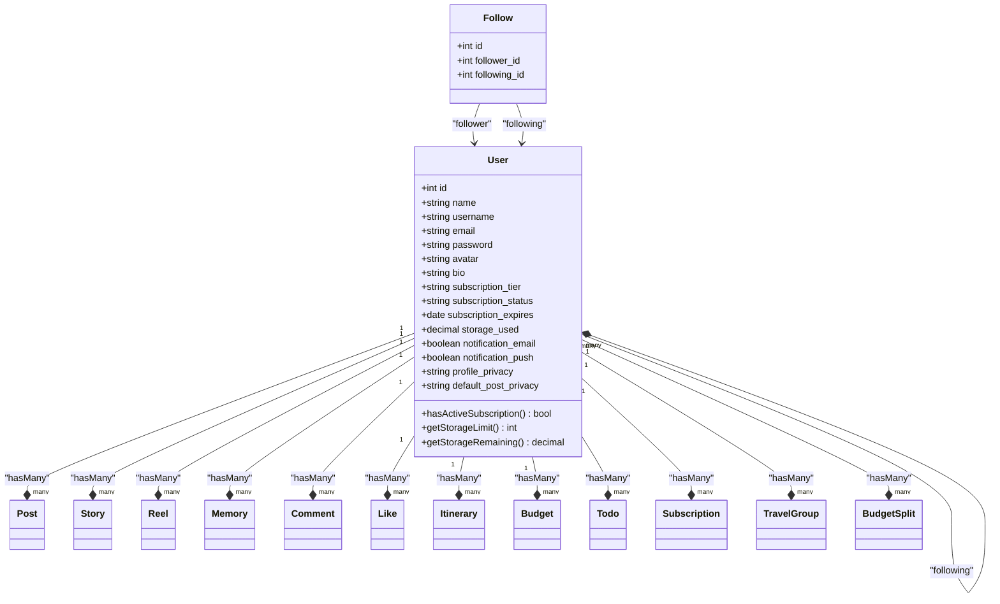
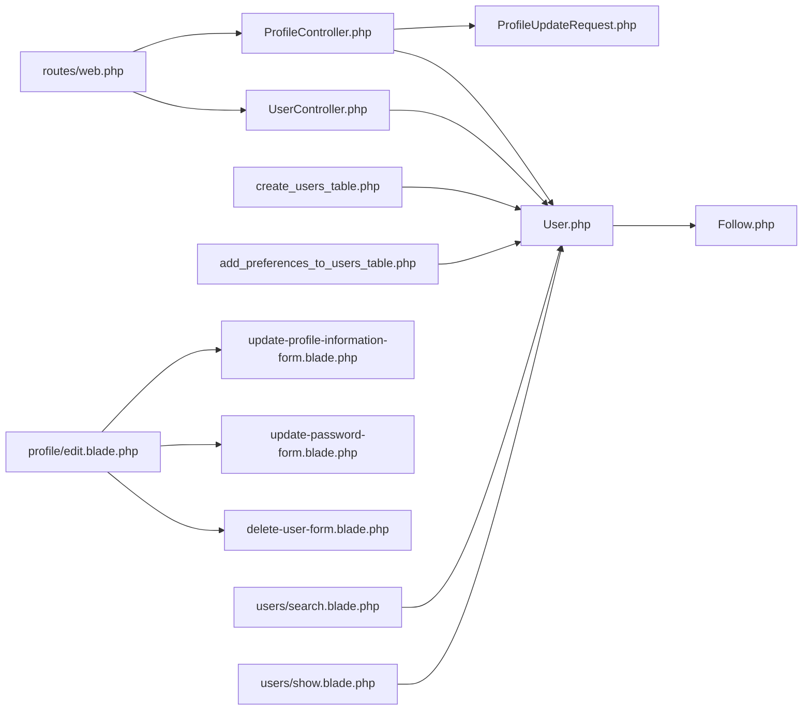

# User Management

<cite>
**Referenced Files in This Document**
- [ProfileController.php](file://app/Http/Controllers/ProfileController.php)
- [UserController.php](file://app/Http/Controllers/UserController.php)
- [User.php](file://app/Models/User.php)
- [ProfileUpdateRequest.php](file://app/Http/Requests/ProfileUpdateRequest.php)
- [create_users_table.php](file://database/migrations/0001_01_01_000000_create_users_table.php)
- [add_preferences_to_users_table.php](file://database/migrations/2026_04_21_140001_add_preferences_to_users_table.php)
- [edit_profile_view.php](file://resources/views/profile/edit.blade.php)
- [update_profile_information_form.php](file://resources/views/profile/partials/update-profile-information-form.blade.php)
- [update_password_form.php](file://resources/views/profile/partials/update-password-form.blade.php)
- [delete_user_form.php](file://resources/views/profile/partials/delete-user-form.blade.php)
- [users_search_view.php](file://resources/views/users/search.blade.php)
- [users_show_view.php](file://resources/views/users/show.blade.php)
- [web_routes.php](file://routes/web.php)
- [RegisteredUserController.php](file://app/Http/Controllers/Auth/RegisteredUserController.php)
- [PasswordController.php](file://app/Http/Controllers/Auth/PasswordController.php)
- [Follow.php](file://app/Models/Follow.php)
</cite>

## Table of Contents
1. [Introduction](#introduction)
2. [Project Structure](#project-structure)
3. [Core Components](#core-components)
4. [Architecture Overview](#architecture-overview)
5. [Detailed Component Analysis](#detailed-component-analysis)
6. [Dependency Analysis](#dependency-analysis)
7. [Performance Considerations](#performance-considerations)
8. [Privacy and Security Measures](#privacy-and-security-measures)
9. [Troubleshooting Guide](#troubleshooting-guide)
10. [Conclusion](#conclusion)

## Introduction
This document provides comprehensive documentation for the user management system, covering profile editing, user discovery, and account administration. It explains avatar upload, personal information editing, preference settings, and account deletion. It also details user search and discovery functionality, including privacy-aware filtering and recommendation algorithms. Implementation of user preferences, notification settings, and privacy controls is documented alongside the User model relationships and attributes. Privacy compliance, data protection, and account security measures are addressed, along with practical scenarios and troubleshooting guidance.

## Project Structure
The user management system spans controllers, models, requests, views, and routes. Controllers handle HTTP requests and orchestrate business logic. Models define data structures and relationships. Requests encapsulate validation rules. Views render user-facing forms and pages. Routes bind URLs to controller actions.

**Diagram sources**
- [ProfileController.php:1-111](file://app/Http/Controllers/ProfileController.php#L1-L111)
- [UserController.php:1-120](file://app/Http/Controllers/UserController.php#L1-L120)
- [User.php:1-172](file://app/Models/User.php#L1-L172)
- [Follow.php:1-25](file://app/Models/Follow.php#L1-L25)
- [ProfileUpdateRequest.php:1-32](file://app/Http/Requests/ProfileUpdateRequest.php#L1-L32)
- [edit_profile_view.php:1-30](file://resources/views/profile/edit.blade.php#L1-L30)
- [update_profile_information_form.php:1-65](file://resources/views/profile/partials/update-profile-information-form.blade.php#L1-L65)
- [update_password_form.php:1-49](file://resources/views/profile/partials/update-password-form.blade.php#L1-L49)
- [delete_user_form.php:1-56](file://resources/views/profile/partials/delete-user-form.blade.php#L1-L56)
- [users_search_view.php:1-46](file://resources/views/users/search.blade.php#L1-L46)
- [users_show_view.php:1-112](file://resources/views/users/show.blade.php#L1-L112)
- [web_routes.php:1-89](file://routes/web.php#L1-L89)
- [create_users_table.php:1-57](file://database/migrations/0001_01_01_000000_create_users_table.php#L1-L57)
- [add_preferences_to_users_table.php:1-32](file://database/migrations/2026_04_21_140001_add_preferences_to_users_table.php#L1-L32)

**Section sources**
- [web_routes.php:14-31](file://routes/web.php#L14-L31)
- [ProfileController.php:13-111](file://app/Http/Controllers/ProfileController.php#L13-L111)
- [UserController.php:8-120](file://app/Http/Controllers/UserController.php#L8-L120)
- [User.php:11-172](file://app/Models/User.php#L11-L172)

## Core Components
- ProfileController: Handles profile editing, avatar upload, password updates, preference updates, and account deletion. Implements validation, authorization checks, and secure session termination during deletion.
- UserController: Manages user discovery, including search, suggestions, and follow/unfollow operations. Provides paginated follower/following lists and user profile display.
- User Model: Defines fillable attributes, hidden fields, casts, and relationships including follows, posts, stories, reels, memories, comments, likes, subscriptions, itineraries, budgets, todos, and travel groups.
- ProfileUpdateRequest: Encapsulates validation rules for profile updates, ensuring unique email per user.
- Views: Render forms for profile updates, password changes, account deletion, user search, and user profiles.

Key capabilities:
- Profile editing with email verification handling upon email change.
- Avatar upload with image validation and storage.
- Preference settings for notifications and privacy.
- Account deletion with confirmation and session cleanup.
- User search by username or name with pagination.
- Following system with toggle and suggestions.
- Comprehensive user statistics and media display.

**Section sources**
- [ProfileController.php:18-111](file://app/Http/Controllers/ProfileController.php#L18-L111)
- [UserController.php:13-118](file://app/Http/Controllers/UserController.php#L13-L118)
- [User.php:21-62](file://app/Models/User.php#L21-L62)
- [ProfileUpdateRequest.php:17-30](file://app/Http/Requests/ProfileUpdateRequest.php#L17-L30)
- [users_search_view.php:7-43](file://resources/views/users/search.blade.php#L7-L43)
- [users_show_view.php:3-112](file://resources/views/users/show.blade.php#L3-L112)

## Architecture Overview
The system follows MVC architecture with explicit separation of concerns:
- Controllers receive requests and delegate to models and views.
- Models encapsulate business logic and relationships.
- Requests enforce validation rules.
- Views render HTML with Blade templating.
- Routes define URL-to-action mappings.

**Diagram sources**
- [web_routes.php:14-31](file://routes/web.php#L14-L31)
- [ProfileController.php:18-39](file://app/Http/Controllers/ProfileController.php#L18-L39)
- [UserController.php:13-73](file://app/Http/Controllers/UserController.php#L13-L73)
- [User.php:131-149](file://app/Models/User.php#L131-L149)
- [users_search_view.php:7-43](file://resources/views/users/search.blade.php#L7-L43)

## Detailed Component Analysis

### ProfileController Analysis
Responsibilities:
- Edit profile page rendering.
- Update profile information with validation and email verification reset.
- Delete account with password confirmation, logout, and session invalidation.
- Update avatar with image validation and storage.
- Update password with confirmation and hashing.
- Update notification and privacy preferences.

Processing logic highlights:
- Email change triggers email verification reset.
- Account deletion enforces current password, logs out, deletes user, invalidates session, and regenerates CSRF token.
- Avatar upload validates image type and size, stores under public avatars, and saves URL.
- Preferences update validates booleans and enums, then persists to user record.

**Diagram sources**
- [ProfileController.php:18-111](file://app/Http/Controllers/ProfileController.php#L18-L111)
- [ProfileUpdateRequest.php:17-30](file://app/Http/Requests/ProfileUpdateRequest.php#L17-L30)

**Section sources**
- [ProfileController.php:28-111](file://app/Http/Controllers/ProfileController.php#L28-L111)
- [ProfileUpdateRequest.php:17-30](file://app/Http/Requests/ProfileUpdateRequest.php#L17-L30)
- [edit_profile_view.php:10-26](file://resources/views/profile/edit.blade.php#L10-L26)
- [update_profile_information_form.php:16-63](file://resources/views/profile/partials/update-profile-information-form.blade.php#L16-L63)
- [update_password_form.php:12-47](file://resources/views/profile/partials/update-password-form.blade.php#L12-L47)
- [delete_user_form.php:17-54](file://resources/views/profile/partials/delete-user-form.blade.php#L17-L54)

### UserController Analysis
Responsibilities:
- Search users by username or name, excluding self, with limit and pagination support.
- Show user profile with counts and media.
- Toggle follow/unfollow relationship with JSON support.
- List followers and following with pagination.
- Provide user suggestions based on non-following users.

Discovery and recommendation logic:
- Search filters by username and name using LIKE queries, excludes current user, limits results.
- Suggestions exclude current user and existing followings, selects randomly limited set.

**Diagram sources**
- [UserController.php:13-118](file://app/Http/Controllers/UserController.php#L13-L118)
- [User.php:131-149](file://app/Models/User.php#L131-L149)
- [users_search_view.php:15-43](file://resources/views/users/search.blade.php#L15-L43)
- [users_show_view.php:33-42](file://resources/views/users/show.blade.php#L33-L42)

**Section sources**
- [UserController.php:13-118](file://app/Http/Controllers/UserController.php#L13-L118)
- [users_search_view.php:7-43](file://resources/views/users/search.blade.php#L7-L43)
- [users_show_view.php:33-42](file://resources/views/users/show.blade.php#L33-L42)

### User Model Analysis
Attributes and casts:
- Fillable includes personal info, credentials, avatar, bio, subscription fields, and preference flags.
- Hidden fields protect sensitive data.
- Casts normalize booleans and dates.

Relationships:
- Self-referencing many-to-many follows with pivot timestamps.
- One-to-many relationships to posts, stories, reels, memories, comments, likes, itineraries, budgets, todos, subscriptions, travel groups, and budget splits.
- Helper methods for subscription status and storage calculations.

**Diagram sources**
- [User.php:21-62](file://app/Models/User.php#L21-L62)
- [User.php:64-172](file://app/Models/User.php#L64-L172)
- [Follow.php:10-23](file://app/Models/Follow.php#L10-L23)

**Section sources**
- [User.php:21-62](file://app/Models/User.php#L21-L62)
- [User.php:131-172](file://app/Models/User.php#L131-L172)
- [create_users_table.php:14-29](file://database/migrations/0001_01_01_000000_create_users_table.php#L14-L29)
- [add_preferences_to_users_table.php:14-19](file://database/migrations/2026_04_21_140001_add_preferences_to_users_table.php#L14-L19)

### Profile Forms and Authorization
- Profile edit page aggregates three partials: update profile information, update password, and delete account.
- Update profile information form posts to the profile update route with CSRF and method override.
- Update password form posts to the password update route.
- Delete account form requires password confirmation and uses DELETE method.
- All profile routes are protected by the auth middleware.

Authorization and validation:
- Profile updates validated by ProfileUpdateRequest ensuring unique email per user.
- Account deletion requires current password via validation bag.
- Password updates validated with current password check and confirmation.

**Section sources**
- [edit_profile_view.php:10-26](file://resources/views/profile/edit.blade.php#L10-L26)
- [update_profile_information_form.php:16-63](file://resources/views/profile/partials/update-profile-information-form.blade.php#L16-L63)
- [update_password_form.php:12-47](file://resources/views/profile/partials/update-password-form.blade.php#L12-L47)
- [delete_user_form.php:17-54](file://resources/views/profile/partials/delete-user-form.blade.php#L17-L54)
- [web_routes.php:14-21](file://routes/web.php#L14-L21)

## Dependency Analysis
- Controllers depend on models and requests for validation.
- Views depend on controllers for data and routes for links.
- Routes bind controllers to URLs.
- Migrations define database schema and preferences columns.

**Diagram sources**
- [web_routes.php:14-31](file://routes/web.php#L14-L31)
- [ProfileController.php:5-11](file://app/Http/Controllers/ProfileController.php#L5-L11)
- [UserController.php:5-6](file://app/Http/Controllers/UserController.php#L5-L6)
- [User.php:11-14](file://app/Models/User.php#L11-L14)
- [Follow.php:8-24](file://app/Models/Follow.php#L8-L24)
- [create_users_table.php:14-29](file://database/migrations/0001_01_01_000000_create_users_table.php#L14-L29)
- [add_preferences_to_users_table.php:14-19](file://database/migrations/2026_04_21_140001_add_preferences_to_users_table.php#L14-L19)
- [edit_profile_view.php:10-26](file://resources/views/profile/edit.blade.php#L10-L26)
- [users_search_view.php:15-43](file://resources/views/users/search.blade.php#L15-L43)
- [users_show_view.php:33-42](file://resources/views/users/show.blade.php#L33-L42)

**Section sources**
- [web_routes.php:14-31](file://routes/web.php#L14-L31)
- [ProfileController.php:5-11](file://app/Http/Controllers/ProfileController.php#L5-L11)
- [UserController.php:5-6](file://app/Http/Controllers/UserController.php#L5-L6)
- [User.php:11-14](file://app/Models/User.php#L11-L14)

## Performance Considerations
- Pagination: UserController uses paginate for followers/following and posts to avoid large result sets.
- Limits: Search limits results to reduce database load.
- Eager loading: UserController eager loads counts and relations for profile display.
- Indexes: Unique indexes on username and email improve lookup performance.
- Storage: Avatar uploads are validated and stored efficiently; consider CDN for scalability.

Recommendations:
- Add database indexes for frequently queried columns.
- Implement caching for user stats and suggestions.
- Optimize LIKE queries with full-text search for larger datasets.
- Use chunked processing for bulk operations.

**Section sources**
- [UserController.php:35-42](file://app/Http/Controllers/UserController.php#L35-L42)
- [UserController.php:78-93](file://app/Http/Controllers/UserController.php#L78-L93)
- [UserController.php:21-25](file://app/Http/Controllers/UserController.php#L21-L25)
- [create_users_table.php:17-18](file://database/migrations/0001_01_01_000000_create_users_table.php#L17-L18)

## Privacy and Security Measures
Data protection and compliance:
- Hidden fields prevent sensitive data exposure in serialization.
- Passwords are hashed via framework mechanisms.
- Email verification reset on email change ensures compliance with verification policies.
- Account deletion includes logout, session invalidation, and token regeneration.

Security controls:
- Auth middleware protects all user management routes.
- Current password validation for destructive actions (password change, account deletion).
- Strict validation for profile updates and preferences.
- CSRF protection via forms and route model binding.

Best practices:
- Enforce strong password policies.
- Implement rate limiting for authentication attempts.
- Regularly audit permissions and roles.
- Monitor failed deletion attempts and suspicious activity.

**Section sources**
- [User.php:43-46](file://app/Models/User.php#L43-L46)
- [User.php:55-61](file://app/Models/User.php#L55-L61)
- [ProfileController.php:32-36](file://app/Http/Controllers/ProfileController.php#L32-L36)
- [ProfileController.php:46-58](file://app/Http/Controllers/ProfileController.php#L46-L58)
- [web_routes.php:14-21](file://routes/web.php#L14-L21)

## Troubleshooting Guide
Common issues and resolutions:
- Profile update fails due to duplicate email:
  - Ensure unique email validation passes; check ProfileUpdateRequest rules.
  - Reference: [ProfileUpdateRequest.php:21-29](file://app/Http/Requests/ProfileUpdateRequest.php#L21-L29)
- Avatar upload errors:
  - Verify image MIME type and size constraints; confirm storage permissions.
  - Reference: [ProfileController.php:67-76](file://app/Http/Controllers/ProfileController.php#L67-L76)
- Password change not applied:
  - Confirm current password matches and new password meets confirmation rules.
  - Reference: [PasswordController.php:18-27](file://app/Http/Controllers/Auth/PasswordController.php#L18-L27)
- Account deletion does not terminate session:
  - Ensure current password validation passes and session invalidation occurs.
  - Reference: [ProfileController.php:46-58](file://app/Http/Controllers/ProfileController.php#L46-L58)
- User search returns empty:
  - Check query parameter presence and ensure non-empty input.
  - Reference: [UserController.php:15-19](file://app/Http/Controllers/UserController.php#L15-L19)
- Follow toggle not working:
  - Verify authentication and that self-follow is prevented.
  - Reference: [UserController.php:50-52](file://app/Http/Controllers/UserController.php#L50-L52)

Operational tips:
- Use browser developer tools to inspect network requests and responses.
- Enable logging for failed validations and authorization failures.
- Test edge cases: self-follow, duplicate follow/unfollow, and boundary conditions for preferences.

**Section sources**
- [ProfileUpdateRequest.php:17-30](file://app/Http/Requests/ProfileUpdateRequest.php#L17-L30)
- [ProfileController.php:67-92](file://app/Http/Controllers/ProfileController.php#L67-L92)
- [PasswordController.php:16-28](file://app/Http/Controllers/Auth/PasswordController.php#L16-L28)
- [UserController.php:15-19](file://app/Http/Controllers/UserController.php#L15-L19)
- [UserController.php:50-52](file://app/Http/Controllers/UserController.php#L50-L52)

## Conclusion
The user management system provides robust profile editing, secure account administration, and effective user discovery. ProfileController and UserController implement comprehensive CRUD operations with validation, authorization, and privacy-aware logic. The User model encapsulates relationships and helper methods essential for social features. Security measures include middleware protection, password hashing, email verification handling, and safe deletion procedures. Performance considerations such as pagination, limits, and eager loading ensure responsiveness. Adhering to the outlined best practices and troubleshooting steps will maintain a reliable and compliant user management experience.